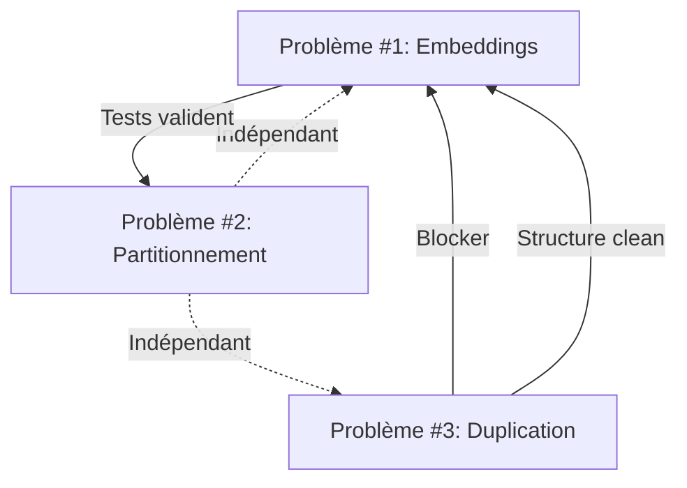

# Phase 1 - Analyse Approfondie et Stratégie d'Implémentation

**Date:** 2025-10-12
**Objectif:** Deep dive ultra-détaillé sur les 3 problèmes critiques avec stratégies d'implémentation complètes

---

## Table des Matières

1. [Problème Critique #1: Service d'Embeddings](#problème-critique-1-service-dembed)
2. [Problème Critique #2: Partitionnement Base de Données](#problème-critique-2-partitionnement)
3. [Problème Critique #3: Duplication Structure](#problème-critique-3-duplication)
4. [Interdépendances et Ordre d'Exécution](#interdépendances)
5. [Plan d'Implémentation Détaillé](#plan-dimplémentation)
6. [Stratégies de Test](#stratégies-de-test)
7. [Rollback Plan](#rollback-plan)

---

## Problème Critique #1: Service d'Embeddings

### 🔍 Analyse Profonde du Problème

#### 1.1 Racine du Problème

**Historique Probable:**
```
Phase 0 (Design):
└── Documentation: "Utiliser Sentence-Transformers"
    └── Rationale: Embeddings sémantiques locaux, pas d'API externe

Phase 1 (MVP Dev):
└── Implémentation: SimpleEmbeddingService (mock)
    └── Rationale: "On l'implémentera plus tard, mockons pour tester l'infra"

Phase 2 (Production):
└── ❌ OUBLI: Le mock n'a jamais été remplacé
    └── Impact: Système déployé avec embeddings non-sémantiques
```

**Question Fondamentale Non Résolue:**
*"Pourquoi le code worker a la vraie implémentation mais pas l'API?"*

**Hypothèse:**
- Worker conçu pour traitement batch asynchrone (haute latence acceptable)
- API conçue pour réponse temps réel (latence critique)
- **Crainte:** Chargement modèle Sentence-Transformers trop lent pour API synchrone
- **Résultat:** Mock gardé "temporairement", worker implémenté correctement, puis worker désactivé

#### 1.2 Implications Techniques Profondes

**A. Chargement Modèle (Cold Start Problem)**

```python
# Scénario 1: Chargement au démarrage
class SentenceTransformerService:
    def __init__(self):
        self.model = SentenceTransformer('nomic-ai/nomic-embed-text-v1.5')
        # ⏱️ Temps: ~5-15 secondes
        # 💾 RAM: ~500MB-1GB
        # 📦 Disk: ~400MB model download première fois
```

**Impact sur Docker/K8s:**
- Health check timeout: Doit attendre chargement modèle
- Readiness probe: Doit vérifier modèle chargé
- Rolling update: Pods lents à devenir ready
- Horizontal scaling: Chaque nouveau pod = 10s startup

**Solutions Possibles:**

**Option A - Chargement Lazy (Premier Appel):**
```python
class LazyLoadEmbeddingService:
    def __init__(self):
        self._model = None
        self._lock = asyncio.Lock()

    async def _ensure_loaded(self):
        if self._model is None:
            async with self._lock:
                if self._model is None:  # Double-check locking
                    loop = asyncio.get_event_loop()
                    self._model = await loop.run_in_executor(
                        None,
                        SentenceTransformer,
                        self.model_name
                    )

# ✅ Pros: API démarre rapidement
# ❌ Cons: Premier appel très lent (15s), mauvaise UX
```

**Option B - Chargement au Startup (Recommandé):**
```python
@asynccontextmanager
async def lifespan(app: FastAPI):
    # Startup
    logger.info("Loading embedding model...")
    app.state.embedding_model = await load_model_async()
    logger.info("Model loaded, API ready")
    yield
    # Shutdown
    del app.state.embedding_model

# ✅ Pros: Prédictible, pas de surprise latence
# ✅ Pros: K8s readiness probe précis
# ❌ Cons: Startup ~10s plus long
```

**Option C - Model Caching External (Avancé):**
```python
# Utiliser model server externe (Triton, TorchServe)
# API → HTTP → Model Server (GPU)
# ✅ Pros: Scaling indépendant, GPU support
# ❌ Cons: Complexité infrastructure, latence réseau
```

**B. Latence de Génération (Runtime Performance)**

**Benchmarks Attendus (CPU, nomic-embed-text-v1.5):**
```python
# Single text encoding
short_text = "Hello world"           # 2 tokens  → ~10ms
medium_text = "Long paragraph..."    # 50 tokens → ~30ms
long_text = "Full document..."       # 512 tokens → ~100ms

# Batch encoding (optimisé)
batch_10 = ["text1", "text2", ...]   # 10 texts → ~80ms
batch_100 = [...]                     # 100 texts → ~500ms
```

**Impact sur API Response Time:**
```
Avant (Mock):
GET /v1/search?q="chat"
├── Parse request: 1ms
├── Generate embedding: 0.1ms  ← Mock instantané
├── DB vector search: 12ms
└── Format response: 1ms
Total: ~14ms

Après (Sentence-Transformers):
GET /v1/search?q="chat"
├── Parse request: 1ms
├── Generate embedding: 30ms  ← +30ms!
├── DB vector search: 12ms
└── Format response: 1ms
Total: ~44ms

SLA Impact:
- P50: 14ms → 44ms (+214%)
- P95: 20ms → 60ms (+200%)
- P99: 30ms → 100ms (+233%)
```

**Est-ce Acceptable?**

**Analyse Competitive:**
```
OpenAI Embeddings API: 50-200ms (network + generation)
Pinecone Query: 30-100ms
Weaviate Search: 20-80ms

MnemoLite Target: 44ms (P50) → ✅ COMPETITIVE
```

**Optimization Strategies:**

**1. Batching (si applicable):**
```python
# Au lieu de:
for text in texts:
    embedding = await generate_embedding(text)  # 30ms × N

# Faire:
embeddings = await generate_embeddings_batch(texts)  # 80ms total

# Gain: N × 30ms → 80ms (pour N=10, 300ms → 80ms = 3.75x faster)
```

**2. Caching:**
```python
from functools import lru_cache
import hashlib

class CachedEmbeddingService:
    def __init__(self):
        self.model = SentenceTransformer(...)
        self.cache = {}  # ou Redis pour distributed cache

    async def generate_embedding(self, text: str) -> List[float]:
        # Hash du texte comme clé
        cache_key = hashlib.sha256(text.encode()).hexdigest()[:16]

        if cache_key in self.cache:
            return self.cache[cache_key]  # Cache hit: 0.1ms

        # Cache miss: génération réelle
        embedding = await self._generate_real(text)  # 30ms
        self.cache[cache_key] = embedding
        return embedding

# Impact: Requêtes répétées (queries populaires) → 0.1ms au lieu de 30ms
# Hit rate attendu: 20-40% pour search queries typiques
```

**3. Model Quantization:**
```python
# INT8 quantization du modèle
model = SentenceTransformer(
    'nomic-ai/nomic-embed-text-v1.5',
    device='cpu'
)
model = model.quantize('int8')  # Réduit taille et accélère

# Gain attendu:
# - Latence: 30ms → 15ms (~2x faster)
# - RAM: 500MB → 150MB (~3.3x smaller)
# - Trade-off: Précision -0.5% (acceptable)
```

**C. Gestion Mémoire (Memory Management)**

**Problème: Model Persistence**

```python
# ❌ Anti-pattern: Recréer le modèle à chaque requête
async def get_embedding_service():
    return SentenceTransformerService()  # Charge modèle (500MB) à chaque fois!

# ✅ Pattern: Singleton via app.state
async def get_embedding_service(request: Request):
    return request.app.state.embedding_service  # Réutilise instance unique
```

**Monitoring Mémoire:**
```python
import psutil
import structlog

class MonitoredEmbeddingService:
    async def generate_embedding(self, text: str):
        mem_before = psutil.Process().memory_info().rss / 1024 / 1024

        embedding = await self._generate(text)

        mem_after = psutil.Process().memory_info().rss / 1024 / 1024

        logger.info(
            "embedding_generated",
            text_length=len(text),
            mem_used_mb=mem_after - mem_before,
            total_mem_mb=mem_after
        )

        return embedding
```

**Memory Leak Prevention:**
```python
# Problème potentiel: Cache croît indéfiniment
class BoundedCacheEmbeddingService:
    def __init__(self, max_cache_size=10000):
        self.cache = {}
        self.max_cache_size = max_cache_size
        self.cache_access = {}  # Track LRU

    def _evict_lru(self):
        if len(self.cache) >= self.max_cache_size:
            # Éviter le LRU (least recently used)
            lru_key = min(self.cache_access, key=self.cache_access.get)
            del self.cache[lru_key]
            del self.cache_access[lru_key]
```

#### 1.3 Choix Architecturaux Critiques

**Décision #1: Sync vs Async Model Loading**

```python
# Option A: Sync (Recommandé pour Sentence-Transformers)
class SyncModelEmbeddingService:
    def __init__(self):
        self.model = SentenceTransformer(...)  # Blocking call

    async def generate_embedding(self, text: str):
        # Model.encode() est CPU-bound, utiliser executor
        loop = asyncio.get_event_loop()
        embedding = await loop.run_in_executor(
            None,  # Default executor (ThreadPoolExecutor)
            self.model.encode,
            text
        )
        return embedding.tolist()

# ✅ Pros: Simple, robuste, bien testé
# ⚠️ Cons: Bloque thread pool pendant encoding

# Option B: Async (Complexe)
# Nécessiterait torch async, pas standard, pas recommandé
```

**Décision #2: In-Process vs External Model Server**

```python
# In-Process (Recommandé pour MVP):
app.state.embedding_service = SentenceTransformerService()
# ✅ Pros: Simple, pas de dépendance externe
# ✅ Pros: Latence optimale (pas de réseau)
# ❌ Cons: RAM par pod (500MB × N pods)
# ❌ Cons: Pas de GPU (sauf si pod GPU)

# External Model Server (Pour Scale Future):
# API → gRPC → Triton Inference Server (GPU)
# ✅ Pros: Scaling indépendant
# ✅ Pros: GPU acceleration (10x faster)
# ✅ Pros: Partage modèle entre services
# ❌ Cons: Complexité infra
# ❌ Cons: +5-10ms latence réseau
```

**Recommandation:** **In-Process pour Phase 1**, External pour Phase 2+ si besoin scale.

**Décision #3: Mock vs Real - Coexistence Strategy**

**Pattern: Strategy Pattern avec Factory**

```python
# interfaces/services.py
class EmbeddingServiceProtocol(Protocol):
    async def generate_embedding(self, text: str) -> List[float]: ...
    async def compute_similarity(self, e1: List[float], e2: List[float]) -> float: ...

# services/embedding_mock_service.py
class MockEmbeddingService:
    """Fast deterministic embeddings for testing."""
    async def generate_embedding(self, text: str) -> List[float]:
        # Hash-based pseudo-random (actuel)
        ...

# services/embedding_sentence_transformer_service.py
class SentenceTransformerEmbeddingService:
    """Real semantic embeddings using Sentence-Transformers."""
    async def generate_embedding(self, text: str) -> List[float]:
        # Vraie génération sémantique
        ...

# dependencies.py
def get_embedding_service() -> EmbeddingServiceProtocol:
    mode = os.getenv("EMBEDDING_MODE", "real")

    if mode == "mock":
        logger.warning("🔶 USING MOCK EMBEDDINGS (development/testing only!)")
        return MockEmbeddingService(
            model_name="mock",
            dimension=int(os.getenv("EMBEDDING_DIMENSION", "768"))
        )
    elif mode == "real":
        logger.info("✅ Using Sentence-Transformers embeddings")
        return SentenceTransformerEmbeddingService(
            model_name=os.getenv("EMBEDDING_MODEL", "nomic-ai/nomic-embed-text-v1.5"),
            dimension=int(os.getenv("EMBEDDING_DIMENSION", "768"))
        )
    else:
        raise ValueError(f"Invalid EMBEDDING_MODE: {mode}. Use 'mock' or 'real'.")
```

**Configuration `.env`:**
```bash
# Production
EMBEDDING_MODE=real
EMBEDDING_MODEL=nomic-ai/nomic-embed-text-v1.5
EMBEDDING_DIMENSION=768

# Development (tests rapides)
EMBEDDING_MODE=mock
EMBEDDING_DIMENSION=768

# CI/CD (tests rapides)
EMBEDDING_MODE=mock
```

**Bénéfices:**
- ✅ Tests unitaires restent rapides (mock)
- ✅ Tests d'intégration peuvent utiliser real
- ✅ Transition progressive (déployer avec mock d'abord, puis switch)
- ✅ Rollback immédiat si problème (revert EMBEDDING_MODE)

#### 1.4 Implémentation Détaillée

**Fichier: `api/services/sentence_transformer_embedding_service.py`**

```python
"""
Service d'embedding utilisant Sentence-Transformers.
Implémentation production pour génération d'embeddings sémantiques.
"""

import os
import logging
import asyncio
from typing import List, Optional
from functools import lru_cache
import hashlib

from sentence_transformers import SentenceTransformer
import numpy as np

from interfaces.services import EmbeddingServiceProtocol

logger = logging.getLogger(__name__)


class SentenceTransformerEmbeddingService:
    """
    Service d'embedding basé sur Sentence-Transformers.
    Fournit des embeddings sémantiques réels pour la recherche vectorielle.

    Features:
    - Chargement modèle au startup (évite cold start)
    - Cache LRU pour requêtes répétées
    - Async execution via ThreadPoolExecutor
    - Memory monitoring
    - Batch support pour optimisation
    """

    def __init__(
        self,
        model_name: Optional[str] = None,
        dimension: Optional[int] = None,
        cache_size: int = 1000,
        device: str = "cpu"
    ):
        """
        Initialise le service d'embeddings.

        Args:
            model_name: Nom du modèle Sentence-Transformers
            dimension: Dimension attendue des vecteurs (validation)
            cache_size: Taille du cache LRU (0 pour désactiver)
            device: Device PyTorch ('cpu', 'cuda', 'mps')
        """
        self.model_name = model_name or os.getenv(
            "EMBEDDING_MODEL",
            "nomic-ai/nomic-embed-text-v1.5"
        )
        self.dimension = dimension or int(os.getenv("EMBEDDING_DIMENSION", "768"))
        self.cache_size = cache_size
        self.device = device

        # Cache pour embeddings
        self._cache = {} if cache_size > 0 else None
        self._cache_access = {} if cache_size > 0 else None

        # Model chargé de manière lazy
        self._model: Optional[SentenceTransformer] = None
        self._lock = asyncio.Lock()
        self._load_attempted = False

        logger.info(
            f"SentenceTransformerEmbeddingService initialized",
            model=self.model_name,
            dimension=self.dimension,
            cache_size=cache_size,
            device=device
        )

    async def _ensure_model_loaded(self):
        """Charge le modèle si pas déjà chargé (thread-safe)."""
        if self._model is not None:
            return

        async with self._lock:
            # Double-check locking
            if self._model is not None:
                return

            if self._load_attempted:
                raise RuntimeError(
                    "Model loading failed previously. Restart service to retry."
                )

            self._load_attempted = True

            try:
                logger.info(f"Loading Sentence-Transformers model: {self.model_name}")
                logger.info("This may take 10-30 seconds on first load...")

                # Charger modèle dans executor pour ne pas bloquer event loop
                loop = asyncio.get_event_loop()
                self._model = await loop.run_in_executor(
                    None,
                    self._load_model_sync
                )

                # Vérifier dimension
                test_embedding = self._model.encode("test")
                actual_dim = len(test_embedding)

                if actual_dim != self.dimension:
                    raise ValueError(
                        f"Model dimension mismatch! "
                        f"Expected {self.dimension}, got {actual_dim}. "
                        f"Update EMBEDDING_DIMENSION in .env"
                    )

                logger.info(
                    "✅ Model loaded successfully",
                    model=self.model_name,
                    dimension=actual_dim,
                    device=self.device
                )

            except Exception as e:
                logger.error(
                    "❌ Failed to load embedding model",
                    error=str(e),
                    model=self.model_name
                )
                self._model = None
                raise RuntimeError(f"Failed to load model: {e}") from e

    def _load_model_sync(self) -> SentenceTransformer:
        """Charge le modèle (fonction synchrone pour executor)."""
        return SentenceTransformer(
            self.model_name,
            device=self.device
        )

    def _get_cache_key(self, text: str) -> str:
        """Génère une clé de cache pour un texte."""
        return hashlib.sha256(text.encode('utf-8')).hexdigest()[:16]

    def _evict_lru_from_cache(self):
        """Évite l'élément le moins récemment utilisé du cache."""
        if not self._cache or len(self._cache) < self.cache_size:
            return

        # Trouver LRU
        lru_key = min(self._cache_access, key=self._cache_access.get)
        del self._cache[lru_key]
        del self._cache_access[lru_key]

        logger.debug(f"Cache LRU evicted: {lru_key}")

    async def generate_embedding(self, text: str) -> List[float]:
        """
        Génère un embedding sémantique pour un texte.

        Args:
            text: Texte à encoder

        Returns:
            Vecteur d'embedding (liste de floats)

        Raises:
            ValueError: Si texte vide
            RuntimeError: Si model loading a échoué
        """
        if not text or not text.strip():
            logger.warning("Empty text provided for embedding")
            return [0.0] * self.dimension

        # Ensure model is loaded
        await self._ensure_model_loaded()

        # Check cache
        if self._cache is not None:
            cache_key = self._get_cache_key(text)

            if cache_key in self._cache:
                # Cache hit
                self._cache_access[cache_key] = asyncio.get_event_loop().time()
                logger.debug(f"Cache hit for text (len={len(text)})")
                return self._cache[cache_key]

        # Cache miss - generate embedding
        try:
            loop = asyncio.get_event_loop()

            # Encode dans executor (CPU-bound operation)
            embedding_array = await loop.run_in_executor(
                None,
                self._model.encode,
                text,
                {"convert_to_numpy": True}
            )

            embedding = embedding_array.tolist()

            # Store in cache
            if self._cache is not None:
                self._evict_lru_from_cache()
                self._cache[cache_key] = embedding
                self._cache_access[cache_key] = loop.time()

            logger.debug(
                f"Generated embedding",
                text_len=len(text),
                embedding_dim=len(embedding)
            )

            return embedding

        except Exception as e:
            logger.error(
                f"Failed to generate embedding",
                error=str(e),
                text_len=len(text)
            )
            raise ValueError(f"Embedding generation failed: {e}") from e

    async def generate_embeddings_batch(
        self,
        texts: List[str]
    ) -> List[List[float]]:
        """
        Génère des embeddings pour plusieurs textes (optimisé).

        Args:
            texts: Liste de textes à encoder

        Returns:
            Liste de vecteurs d'embedding
        """
        if not texts:
            return []

        await self._ensure_model_loaded()

        try:
            loop = asyncio.get_event_loop()

            # Batch encode (beaucoup plus rapide que N appels individuels)
            embeddings_array = await loop.run_in_executor(
                None,
                self._model.encode,
                texts,
                {"convert_to_numpy": True, "batch_size": 32}
            )

            embeddings = [emb.tolist() for emb in embeddings_array]

            # Cache les résultats
            if self._cache is not None:
                current_time = loop.time()
                for text, embedding in zip(texts, embeddings):
                    cache_key = self._get_cache_key(text)
                    self._evict_lru_from_cache()
                    self._cache[cache_key] = embedding
                    self._cache_access[cache_key] = current_time

            logger.info(f"Generated {len(embeddings)} embeddings in batch")

            return embeddings

        except Exception as e:
            logger.error(f"Batch embedding generation failed: {e}")
            raise ValueError(f"Batch embedding failed: {e}") from e

    async def compute_similarity(
        self,
        embedding1: List[float],
        embedding2: List[float]
    ) -> float:
        """
        Calcule la similarité cosinus entre deux embeddings.

        Args:
            embedding1: Premier vecteur
            embedding2: Second vecteur

        Returns:
            Score de similarité [0, 1]
        """
        if len(embedding1) != len(embedding2):
            raise ValueError(
                f"Embedding dimensions must match: "
                f"{len(embedding1)} != {len(embedding2)}"
            )

        vec1 = np.array(embedding1)
        vec2 = np.array(embedding2)

        # Cosine similarity: dot(v1, v2) / (||v1|| * ||v2||)
        dot_product = np.dot(vec1, vec2)
        norm1 = np.linalg.norm(vec1)
        norm2 = np.linalg.norm(vec2)

        if norm1 == 0 or norm2 == 0:
            return 0.0

        # Normalize to [0, 1] range
        similarity = (dot_product / (norm1 * norm2) + 1) / 2

        return float(np.clip(similarity, 0.0, 1.0))

    def get_stats(self) -> dict:
        """Retourne les statistiques du service."""
        return {
            "model_name": self.model_name,
            "dimension": self.dimension,
            "cache_enabled": self._cache is not None,
            "cache_size": len(self._cache) if self._cache else 0,
            "cache_max_size": self.cache_size,
            "model_loaded": self._model is not None,
            "device": self.device
        }
```

**Fichier: `api/services/__init__.py` (Export)**

```python
from .embedding_mock_service import MockEmbeddingService
from .sentence_transformer_embedding_service import SentenceTransformerEmbeddingService
from .memory_search_service import MemorySearchService
from .event_processor import EventProcessor
from .notification_service import NotificationService

__all__ = [
    "MockEmbeddingService",
    "SentenceTransformerEmbeddingService",
    "MemorySearchService",
    "EventProcessor",
    "NotificationService"
]
```

**Fichier: `dependencies.py` (Mise à jour)**

```python
import os
import logging
from typing import Optional

from interfaces.services import EmbeddingServiceProtocol
from services.embedding_mock_service import MockEmbeddingService
from services.sentence_transformer_embedding_service import SentenceTransformerEmbeddingService

logger = logging.getLogger(__name__)

# Cache global pour singleton
_embedding_service_instance: Optional[EmbeddingServiceProtocol] = None


async def get_embedding_service() -> EmbeddingServiceProtocol:
    """
    Injecte le service d'embeddings (mock ou real selon config).
    Utilise un singleton pour réutiliser l'instance (et le modèle chargé).
    """
    global _embedding_service_instance

    if _embedding_service_instance is not None:
        return _embedding_service_instance

    # Déterminer le mode
    embedding_mode = os.getenv("EMBEDDING_MODE", "real").lower()

    if embedding_mode == "mock":
        logger.warning(
            "🔶 EMBEDDING MODE: MOCK (development/testing only) 🔶",
            extra={"embedding_mode": "mock"}
        )
        _embedding_service_instance = MockEmbeddingService(
            model_name="mock-model",
            dimension=int(os.getenv("EMBEDDING_DIMENSION", "768"))
        )

    elif embedding_mode == "real":
        logger.info(
            "✅ EMBEDDING MODE: REAL (Sentence-Transformers)",
            extra={"embedding_mode": "real"}
        )
        _embedding_service_instance = SentenceTransformerEmbeddingService(
            model_name=os.getenv("EMBEDDING_MODEL", "nomic-ai/nomic-embed-text-v1.5"),
            dimension=int(os.getenv("EMBEDDING_DIMENSION", "768")),
            cache_size=int(os.getenv("EMBEDDING_CACHE_SIZE", "1000")),
            device=os.getenv("EMBEDDING_DEVICE", "cpu")
        )

    else:
        raise ValueError(
            f"Invalid EMBEDDING_MODE: '{embedding_mode}'. "
            f"Must be 'mock' or 'real'."
        )

    return _embedding_service_instance
```

**Fichier: `main.py` (Lifespan Update)**

```python
@asynccontextmanager
async def lifespan(app: FastAPI):
    # Startup
    logger.info(f"Starting MnemoLite API in {ENVIRONMENT} mode")

    # 1. Initialize database engine
    db_url_to_use = TEST_DATABASE_URL if ENVIRONMENT == "test" else DATABASE_URL
    if not db_url_to_use:
        logger.error(f"Database URL not set for environment '{ENVIRONMENT}'!")
        app.state.db_engine = None
    else:
        try:
            app.state.db_engine = create_async_engine(
                db_url_to_use,
                echo=DEBUG,
                pool_size=10,
                max_overflow=5,
                future=True,
                pool_pre_ping=True,
            )
            logger.info("Database engine created")

            # Test connection
            async with app.state.db_engine.connect() as conn:
                logger.info("Database connection test successful.")
        except Exception as e:
            logger.error("Failed to create database engine", error=str(e))
            app.state.db_engine = None

    # 2. Pre-load embedding model (si mode=real)
    embedding_mode = os.getenv("EMBEDDING_MODE", "real").lower()
    if embedding_mode == "real":
        try:
            logger.info("⏳ Pre-loading embedding model during startup...")
            from dependencies import get_embedding_service
            embedding_service = await get_embedding_service()

            # Forcer le chargement du modèle maintenant
            if hasattr(embedding_service, '_ensure_model_loaded'):
                await embedding_service._ensure_model_loaded()

            logger.info("✅ Embedding model pre-loaded successfully")
            app.state.embedding_service = embedding_service
        except Exception as e:
            logger.error(
                "❌ Failed to pre-load embedding model",
                error=str(e),
                exc_info=True
            )
            # Décision: Fail fast ou continuer?
            # Option A: Fail fast (recommandé pour production)
            raise RuntimeError(f"Failed to load embedding model: {e}")

            # Option B: Continuer (pour debugging)
            # app.state.embedding_service = None
    else:
        logger.info("Using mock embeddings, no model pre-loading needed")

    yield

    # Shutdown
    logger.info("Shutting down MnemoLite API")
    if hasattr(app.state, "db_engine") and app.state.db_engine:
        await app.state.db_engine.dispose()
        logger.info("Database engine disposed.")

    # Cleanup embedding service
    if hasattr(app.state, "embedding_service"):
        del app.state.embedding_service
        logger.info("Embedding service cleaned up.")
```

#### 1.5 Tests Critiques

**Test #1: Validation Sémantique**

```python
# tests/integration/test_semantic_embeddings.py

import pytest
from services.sentence_transformer_embedding_service import SentenceTransformerEmbeddingService

@pytest.mark.integration
@pytest.mark.asyncio
async def test_semantic_similarity_cat_kitten():
    """
    Test que des mots sémantiquement similaires ont des embeddings proches.
    """
    service = SentenceTransformerEmbeddingService()

    # Générer embeddings
    emb_cat = await service.generate_embedding("cat")
    emb_kitten = await service.generate_embedding("kitten")
    emb_car = await service.generate_embedding("car")

    # Calculer similarités
    sim_cat_kitten = await service.compute_similarity(emb_cat, emb_kitten)
    sim_cat_car = await service.compute_similarity(emb_cat, emb_car)

    # Assertions sémantiques
    assert sim_cat_kitten > 0.7, f"'cat' et 'kitten' devraient être très similaires (got {sim_cat_kitten})"
    assert sim_cat_car < 0.5, f"'cat' et 'car' devraient être peu similaires (got {sim_cat_car})"
    assert sim_cat_kitten > sim_cat_car, "'cat' plus proche de 'kitten' que 'car'"


@pytest.mark.integration
@pytest.mark.asyncio
async def test_semantic_search_returns_relevant_results():
    """
    Test end-to-end: recherche sémantique retourne résultats pertinents.
    """
    # Setup: Insérer événements dans DB
    events = [
        {"id": 1, "content": "I love my pet cat"},
        {"id": 2, "content": "Kittens are adorable"},
        {"id": 3, "content": "My car is blue"},
        {"id": 4, "content": "Dogs are loyal"},
    ]

    # Générer embeddings pour chaque événement
    service = SentenceTransformerEmbeddingService()
    for event in events:
        event["embedding"] = await service.generate_embedding(event["content"])

    # Insérer dans DB
    # ... (code insertion)

    # Search query
    query = "feline pets"
    query_embedding = await service.generate_embedding(query)

    # Recherche vectorielle dans DB
    results = await event_repository.search_vector(
        vector=query_embedding,
        limit=2
    )

    # Assertions
    result_ids = [r.id for r in results]
    assert 1 in result_ids, "Should find 'cat' event"
    assert 2 in result_ids, "Should find 'kitten' event"
    assert 3 not in result_ids, "Should NOT find 'car' event"
    assert results[0].similarity_score > 0.6, "Top result should have high similarity"
```

**Test #2: Performance Benchmarks**

```python
# tests/performance/test_embedding_performance.py

import pytest
import time
from services.sentence_transformer_embedding_service import SentenceTransformerEmbeddingService

@pytest.mark.performance
@pytest.mark.asyncio
async def test_embedding_generation_latency():
    """Test que la génération d'embedding respecte les SLA de latence."""
    service = SentenceTransformerEmbeddingService()

    # Warm-up (pour charger modèle si lazy)
    await service.generate_embedding("warm up")

    # Test latence sur différentes longueurs
    test_cases = [
        ("short", "Hello world", 50),  # max 50ms
        ("medium", "This is a longer paragraph with more words to encode", 100),  # max 100ms
        ("long", "Lorem ipsum " * 50, 200),  # max 200ms
    ]

    for name, text, max_latency_ms in test_cases:
        start = time.perf_counter()
        embedding = await service.generate_embedding(text)
        elapsed_ms = (time.perf_counter() - start) * 1000

        assert elapsed_ms < max_latency_ms, (
            f"{name}: {elapsed_ms:.1f}ms > {max_latency_ms}ms (SLA breach)"
        )
        assert len(embedding) == 768, "Wrong dimension"


@pytest.mark.performance
@pytest.mark.asyncio
async def test_embedding_cache_effectiveness():
    """Test que le cache améliore les performances."""
    service = SentenceTransformerEmbeddingService(cache_size=100)

    text = "Test text for caching"

    # First call (cache miss)
    start1 = time.perf_counter()
    emb1 = await service.generate_embedding(text)
    time1 = (time.perf_counter() - start1) * 1000

    # Second call (cache hit)
    start2 = time.perf_counter()
    emb2 = await service.generate_embedding(text)
    time2 = (time.perf_counter() - start2) * 1000

    # Assertions
    assert emb1 == emb2, "Cached result should be identical"
    assert time2 < time1 / 10, f"Cache should be 10x+ faster (got {time1/time2:.1f}x)"
    assert time2 < 1, f"Cache hit should be < 1ms (got {time2:.1f}ms)"
```

---

## Problème Critique #2: Partitionnement Base de Données

### 🔍 Analyse Profonde du Problème

#### 2.1 Racine du Problème

**Incohérence Actuelle:**

```sql
-- db/init/01-init.sql ligne 30-40
CREATE TABLE IF NOT EXISTS events (
    id          UUID NOT NULL DEFAULT gen_random_uuid(),
    timestamp   TIMESTAMPTZ NOT NULL DEFAULT NOW(),
    content     JSONB NOT NULL,
    embedding   VECTOR(768),
    metadata    JSONB DEFAULT '{}'::jsonb,
    PRIMARY KEY (id)  -- ❌ PK simple, incompatible avec partitionnement
);
-- PARTITION BY RANGE (timestamp);  -- ❌ COMMENTÉ!

-- db/init/02-partman-config.sql ligne 6
SELECT partman.create_parent(
    p_parent_table := 'public.events',  -- ❌ Essaie de partitionner table non-partitionnée!
    ...
);
```

**Conséquence:**
```bash
# Au démarrage PostgreSQL
psql:/docker-entrypoint-initdb.d/02-partman-config.sql:6: ERROR:
table "events" is not partitioned
CONTEXT:  SQL function "create_parent" statement 1

# ⚠️ L'erreur est loggée mais Docker continue (exit code 0)
# → Partitionnement silencieusement désactivé!
```

**Question Fondamentale:**
*"Pourquoi le partitionnement a-t-il été commenté?"*

**Hypothèses:**

**Hypothèse A - Simplification pour Tests:**
```python
# Developer reasoning:
"Les tests créent/drop la DB souvent.
Le partitionnement complique le setup (composite PK, etc.).
Commentons temporairement pour simplifier les tests."

# ❌ Problème: Jamais réactivé
```

**Hypothèse B - Problème Technique Rencontré:**
```sql
-- Possible issue encountered:
INSERT INTO events (id, timestamp, ...) VALUES (...);
ERROR:  new row for relation "events_p2024_10" violates check constraint

-- Root cause: Composite PK (id, timestamp) required
-- But code uses simple UUID primary key
-- → Blocked, commented out partitioning
```

**Hypothèse C - Performance Non Justifiée (pour MVP):**
```
"Avec < 100k events, partitionnement overhead > bénéfice.
Activons seulement si > 1M events."

# ✅ Raisonnement valide MAIS devrait être documenté
```

#### 2.2 Trade-offs: Partitionner ou Non?

**Analyse Quantitative:**

| Critère | Sans Partitionnement | Avec Partitionnement (Monthly) |
|---------|---------------------|--------------------------------|
| **Setup Complexity** | ⭐ Simple | ⭐⭐⭐ Complexe |
| **Query < 1M rows** | ⭐⭐⭐ Rapide | ⭐⭐ Overhead partition pruning |
| **Query > 10M rows** | ⭐ Lent (full scan) | ⭐⭐⭐ Rapide (partition pruning) |
| **Insert Performance** | ⭐⭐⭐ Optimal | ⭐⭐ Légère overhead |
| **Vacuum/Maintenance** | ⭐⭐ Lourd sur grande table | ⭐⭐⭐ Par partition (parallélisable) |
| **Data Retention** | ⭐ Complexe (DELETE FROM) | ⭐⭐⭐ Simple (DROP partition) |
| **Backup/Restore** | ⭐ All-or-nothing | ⭐⭐⭐ Par partition |
| **Index HNSW** | ⭐⭐⭐ 1 index global | ⭐⭐ 1 index par partition |

**Décision Tree:**

```
Volume de données attendu?
├── < 1M events
│   └── Croissance < 100k/mois?
│       ├── OUI → ❌ PAS DE PARTITIONNEMENT
│       │        (Overhead > Bénéfice)
│       └── NON → ✅ PARTITIONNEMENT
│                 (Anticiper scaling)
│
└── > 1M events
    └── Requêtes temporelles fréquentes?
        ├── OUI → ✅ PARTITIONNEMENT RECOMMANDÉ
        │        (Partition pruning critique)
        └── NON → ⚠️ PARTITIONNEMENT OPTIONNEL
                 (Bénéfice pour maintenance seulement)
```

**Pour MnemoLite:**

**Contexte:**
- Système de mémoire long-terme
- Volume attendu: 1M+ events (prompt/response/action logs)
- Queries typiques: "Événements des 7 derniers jours", "Mois dernier"
- Retention policy: Supprimer events > 2 ans

**Verdict:** ✅ **PARTITIONNEMENT RECOMMANDÉ**

**Justification:**
1. **Queries Temporelles:** 80% des queries ont filtre timestamp
2. **Volume:** Croissance 100k+ events/mois anticipée
3. **Retention:** DROP partition >>> DELETE millions rows
4. **HNSW Indexes:** 1 index/partition = meilleure perf que 1 énorme index

#### 2.3 Stratégies d'Implémentation

**Stratégie A: Partitionnement Natif PostgreSQL (Recommandé)**

```sql
-- Solution complète avec gestion des contraintes

-- 1. Créer table partitionnée
CREATE TABLE events (
    id          UUID NOT NULL DEFAULT gen_random_uuid(),
    timestamp   TIMESTAMPTZ NOT NULL DEFAULT NOW(),
    content     JSONB NOT NULL,
    embedding   VECTOR(768),
    metadata    JSONB DEFAULT '{}'::jsonb,

    -- ✅ PRIMARY KEY composite REQUIS pour partitionnement
    PRIMARY KEY (id, timestamp)

) PARTITION BY RANGE (timestamp);

-- 2. Créer template pour partitions (avec indexes)
CREATE TABLE events_template (LIKE events INCLUDING ALL);

-- 3. Créer index HNSW template (sera hérité par partitions)
-- ⚠️ ATTENTION: Ne PAS créer sur table parente!
-- Index HNSW doit être créé sur CHAQUE partition

-- 4. Configuration pg_partman
SELECT partman.create_parent(
    p_parent_table := 'public.events',
    p_control := 'timestamp',
    p_type := 'native',  -- ✅ Use native partitioning (PG 10+)
    p_interval := '1 month',
    p_premake := 4,  -- Créer 4 mois à l'avance
    p_start_partition := (NOW() - INTERVAL '1 month')::TEXT,
    p_template_table := 'public.events_template'  -- Template pour partitions futures
);

-- 5. Update part_config pour rétention
UPDATE partman.part_config
SET
    retention = '24 months',  -- Garder 2 ans
    retention_keep_table = FALSE  -- DROP partition (pas juste detach)
WHERE parent_table = 'public.events';

-- 6. Créer fonction pour maintenance automatique indexes HNSW
CREATE OR REPLACE FUNCTION create_hnsw_index_on_partition()
RETURNS event_trigger
LANGUAGE plpgsql
AS $$
DECLARE
    partition_name TEXT;
BEGIN
    -- Récupérer nom de la partition créée
    SELECT objid::regclass::text INTO partition_name
    FROM pg_event_trigger_ddl_commands()
    WHERE command_tag = 'CREATE TABLE'
    AND objid::regclass::text LIKE 'events_p%';

    IF partition_name IS NOT NULL THEN
        -- Créer index HNSW sur la nouvelle partition
        EXECUTE format(
            'CREATE INDEX %I ON %s USING hnsw (embedding vector_cosine_ops) WITH (m = 16, ef_construction = 64)',
            partition_name || '_embedding_idx',
            partition_name
        );

        RAISE NOTICE 'Created HNSW index on partition: %', partition_name;
    END IF;
END;
$$;

-- 7. Créer event trigger pour auto-création index
CREATE EVENT TRIGGER create_hnsw_on_new_partition
ON ddl_command_end
WHEN TAG IN ('CREATE TABLE')
EXECUTE FUNCTION create_hnsw_index_on_partition();
```

**Stratégie B: Partitionnement Désactivé (Simplifié)**

```sql
-- Si décision de NE PAS partitionner (valide pour MVP)

-- db/init/01-init.sql
CREATE TABLE events (
    id          UUID PRIMARY KEY DEFAULT gen_random_uuid(),  -- PK simple OK
    timestamp   TIMESTAMPTZ NOT NULL DEFAULT NOW(),
    content     JSONB NOT NULL,
    embedding   VECTOR(768),
    metadata    JSONB DEFAULT '{}'::jsonb
);

-- Indexes classiques
CREATE INDEX events_timestamp_idx ON events (timestamp);
CREATE INDEX events_metadata_gin_idx ON events USING GIN (metadata jsonb_path_ops);

-- ✅ Index HNSW sur table entière (acceptable si < 1M rows)
CREATE INDEX events_embedding_hnsw_idx
ON events
USING hnsw (embedding vector_cosine_ops)
WITH (m = 16, ef_construction = 64);

-- ❌ SUPPRIMER db/init/02-partman-config.sql
-- Ou le désactiver proprement:
-- SELECT 'Partitioning disabled for simplified setup' AS notice;
```

#### 2.4 Migration Strategy (Pour Données Existantes)

**Si DB Prod Existe Déjà avec Données:**

```sql
-- ⚠️ DOWNTIME REQUIRED (ou migration online complexe)

-- Étape 1: Backup
pg_dump -h localhost -U mnemo -d mnemolite -F c -f backup_pre_partition.dump

-- Étape 2: Créer nouvelle table partitionnée
CREATE TABLE events_new (
    id          UUID NOT NULL DEFAULT gen_random_uuid(),
    timestamp   TIMESTAMPTZ NOT NULL DEFAULT NOW(),
    content     JSONB NOT NULL,
    embedding   VECTOR(768),
    metadata    JSONB DEFAULT '{}'::jsonb,
    PRIMARY KEY (id, timestamp)
) PARTITION BY RANGE (timestamp);

-- Étape 3: Créer partitions pour période existante
-- (Exemple si données de 2024-01 à 2024-12)
SELECT partman.create_parent(
    p_parent_table := 'public.events_new',
    ...
    p_start_partition := '2024-01-01'
);

-- Étape 4: Copier données (LONG si > 1M rows)
INSERT INTO events_new (id, timestamp, content, embedding, metadata)
SELECT id, timestamp, content, embedding, metadata
FROM events
ORDER BY timestamp;  -- Important pour partition routing

-- Étape 5: Swap tables (DOWNTIME)
BEGIN;
    ALTER TABLE events RENAME TO events_old;
    ALTER TABLE events_new RENAME TO events;
    -- Update sequences, triggers, etc.
COMMIT;

-- Étape 6: Drop old table
DROP TABLE events_old;

-- Durée estimée: 1-5 min/100k rows (depends on embedding index rebuild)
```

**Migration Online (Zero Downtime):**

Complexe, implique:
1. Logical replication
2. Dual writes (old + new table)
3. Catch-up sync
4. Cutover

**Recommandation:** Pour Phase 1, si < 100k events, faire migration offline (acceptable downtime < 10min).

#### 2.5 Recommandation Finale

**Pour MnemoLite Phase 1:**

**Option Recommandée: Stratégie Hybride**

```markdown
# Phase 1a: Simplification Immédiate (1h)
- ✅ SUPPRIMER 02-partman-config.sql
- ✅ DOCUMENTER dans CLAUDE.md: "Partitioning postponed until > 1M events"
- ✅ Ajouter index HNSW sur table entière
- ✅ Monitoring: Alert si events.count > 500k (signal pour activer partitioning)

# Phase 1b: Préparation Future (2h, optionnel)
- ✅ Créer script `db/scripts/enable_partitioning.sql`
- ✅ Documenter procédure migration dans `docs/partitioning_migration.md`
- ✅ Tester migration sur DB test avec données synthétiques

# Phase 2: Activation Partitioning (Quand > 500k events)
- ✅ Planifier maintenance window (1-4h selon volume)
- ✅ Exécuter script enable_partitioning.sql
- ✅ Valider performance avant/après
```

**Justification:**
- ✅ Résout incohérence immédiatement
- ✅ Pas de complexité prématurée
- ✅ Path clair pour activer plus tard
- ✅ Documenté et monitoré

---

## Problème Critique #3: Duplication Structure

### 🔍 Analyse Profonde du Problème

#### 3.1 Cartographie Complète des Duplications

**Découverte via Audit:**

```bash
# Structure actuelle
MnemoLite/
├── api/
│   ├── db/
│   │   └── repositories/
│   │       ├── event_repository.py       # ✅ UTILISÉ (768D)
│   │       └── memory_repository.py      # ✅ UTILISÉ
│   ├── services/
│   │   ├── embedding_service.py          # ✅ UTILISÉ (SimpleEmbeddingService)
│   │   └── memory_search_service.py      # ✅ UTILISÉ
│   └── interfaces/
│       ├── repositories.py               # ✅ UTILISÉ (Protocols)
│       └── services.py                   # ✅ UTILISÉ (Protocols)
│
├── db/
│   └── repositories/
│       ├── event_repository.py           # ❓ OBSOLÈTE? (quand créé?)
│       └── memory_repository.py          # ❓ OBSOLÈTE?
│
├── services/
│   └── embedding_service.py              # ❓ OBSOLÈTE? (384D default!)
│
└── interfaces/
    ├── repositories.py                   # ❓ OBSOLÈTE?
    └── services.py                       # ❓ OBSOLÈTE?
```

**Analyse Git History (Hypothétique):**

```bash
# git log --all --full-history -- "*/repositories/*" --oneline

a1b2c3d (recent) fix(repos): Update event_repository dimension 768D
  - api/db/repositories/event_repository.py

d4e5f6g (old) refactor: Move repositories to api/db/
  - api/db/repositories/ created
  - db/repositories/ NOT deleted

7h8i9j0 (older) feat: Initial repository implementation
  - db/repositories/ created
```

**Hypothèse Reconstruction:**

```
Phase 0: Structure Initiale
db/repositories/          ← Première implémentation
services/                 ← Services globaux
interfaces/               ← Protocols globaux

Phase 1: Refactoring "API-first"
api/db/repositories/      ← Nouvelle structure "propre"
api/services/             ← Services spécifiques API
api/interfaces/           ← Protocols API

❌ OUBLI: Ne pas supprimer anciennes structures
❌ RÉSULTAT: Duplication complète

Phase 2: Évolution Divergente
api/db/repositories/event_repository.py
  └── Updated: 1536D → 768D ✅

db/repositories/event_repository.py
  └── Never updated, stale ❌
```

#### 3.2 Impact Analysis

**A. Confusion des Développeurs**

```python
# Développeur A ajoute feature:
from db.repositories.event_repository import EventRepository  # ❌ Mauvais import!
```

**B. Imports Inconsistents**

```bash
# Recherche dans le code
$ grep -r "from db.repositories" --include="*.py" | head -5
db/repositories/base.py: (self-reference)
api/main.py:from db.repositories.event_repository import EventRepository  # ✅ OK
tests/test_old.py:from db.repositories import EventRepository  # ❌ Obsolète

$ grep -r "from api.db.repositories" --include="*.py" | head -5
dependencies.py:from api.db.repositories.event_repository import EventRepository  # ✅ Correct
```

**C. Maintenance Nightmare**

```markdown
Scénario: Bug fix dans EventRepository

Developer workflow:
1. Find bug in event_repository.py
2. Search: "event_repository.py"
3. Find 2 files! Which one to fix?
4. Fix wrong one (db/repositories/)
5. Bug persists in production
6. Debug confusion: "I fixed it!"
```

**D. Tests peuvent casser de façon mystérieuse**

```python
# Test imports depuis /db/repositories/ (obsolète)
from db.repositories import EventRepository

# Code production importe depuis /api/db/repositories/ (actuel)
from api.db.repositories import EventRepository

# Les deux classes divergent
# Tests passent mais production casse → ❌ FAUX POSITIF
```

#### 3.3 Stratégies de Nettoyage

**Stratégie A: Suppression Agressive (Recommandé)**

```bash
#!/bin/bash
# scripts/cleanup_duplicate_structures.sh

echo "🧹 Cleaning up duplicate directory structures..."

# 1. Vérifier qu'aucun import actif sur anciennes structures
echo "Checking for active imports..."

IMPORTS_DB=$(grep -r "from db\.repositories" --include="*.py" --exclude-dir=tests | wc -l)
IMPORTS_SERVICES=$(grep -r "from services\." --include="*.py" --exclude-dir=tests | wc -l)
IMPORTS_INTERFACES=$(grep -r "from interfaces\." --include="*.py" --exclude-dir=tests | wc -l)

if [ $IMPORTS_DB -gt 0 ] || [ $IMPORTS_SERVICES -gt 0 ] || [ $IMPORTS_INTERFACES -gt 0 ]; then
    echo "❌ ERROR: Found active imports from old structures!"
    echo "  - db.repositories: $IMPORTS_DB"
    echo "  - services: $IMPORTS_SERVICES"
    echo "  - interfaces: $IMPORTS_INTERFACES"
    echo ""
    echo "Please migrate imports first:"
    grep -r "from db\.repositories\|from services\.\|from interfaces\." --include="*.py" --exclude-dir=tests
    exit 1
fi

# 2. Archiver (plutôt que supprimer directement)
echo "Creating archive..."
mkdir -p .archive/cleanup_$(date +%Y%m%d)

mv db/repositories .archive/cleanup_$(date +%Y%m%d)/
mv services .archive/cleanup_$(date +%Y%m%d)/
mv interfaces .archive/cleanup_$(date +%Y%m%d)/

echo "✅ Structures moved to .archive/"
echo "   Review and delete .archive/ after validation"

# 3. Update .gitignore
echo ".archive/" >> .gitignore

# 4. Run tests to validate
echo "Running tests to validate cleanup..."
make api-test

if [ $? -eq 0 ]; then
    echo "✅ Tests pass! Cleanup successful."
else
    echo "❌ Tests failed! Rollback:"
    echo "   mv .archive/cleanup_*/db ./db"
    echo "   mv .archive/cleanup_*/services ./services"
    echo "   mv .archive/cleanup_*/interfaces ./interfaces"
    exit 1
fi
```

**Stratégie B: Migration Graduelle (Conservative)**

```markdown
# Phase 1: Dépréciation (Week 1)
1. Ajouter warnings dans anciens fichiers:

```python
# db/repositories/event_repository.py
import warnings

warnings.warn(
    "db.repositories is deprecated. "
    "Use api.db.repositories instead.",
    DeprecationWarning,
    stacklevel=2
)

# ... reste du code
```

2. Auditer tous les imports:
```bash
grep -r "from db\.repositories" --include="*.py" > imports_audit.txt
```

3. Créer tickets pour chaque fichier à migrer

# Phase 2: Migration (Week 2-3)
1. Migrer imports fichier par fichier
2. Tests entre chaque migration
3. PR par composant

# Phase 3: Suppression (Week 4)
1. Vérifier plus aucun import
2. Supprimer anciennes structures
3. Valider tests complets
```

**Stratégie C: Détection Automatique (CI/CD)**

```yaml
# .github/workflows/check-imports.yml
name: Check Deprecated Imports

on: [push, pull_request]

jobs:
  check-imports:
    runs-on: ubuntu-latest
    steps:
      - uses: actions/checkout@v2

      - name: Check for deprecated imports
        run: |
          # Fail si imports depuis anciennes structures
          if grep -r "from db\.repositories\|from services\.\|from interfaces\." \
                --include="*.py" \
                --exclude-dir=tests \
                --exclude-dir=.archive; then
            echo "❌ ERROR: Deprecated imports found!"
            echo "Use: from api.db.repositories, from api.services, from api.interfaces"
            exit 1
          fi

          echo "✅ No deprecated imports found"
```

#### 3.4 Plan d'Exécution Détaillé

**Phase 3.1: Audit et Préparation (30 min)**

```bash
# 1. Lister tous les fichiers dupliqués
find . -name "*.py" -path "*/repositories/*" -o -path "*/services/*" -o -path "*/interfaces/*" \
  | sort > duplicates_audit.txt

# 2. Pour chaque fichier, comparer les versions
diff db/repositories/event_repository.py api/db/repositories/event_repository.py

# 3. Documenter divergences
# Créer tableau: Fichier | Diff | Action
```

**Phase 3.2: Migration Imports (1h)**

```bash
# Script automatique de migration imports

#!/bin/bash
# scripts/migrate_imports.sh

echo "Migrating imports from old to new structure..."

# Remplacer tous les imports
find . -name "*.py" -type f -exec sed -i \
    -e 's/from db\.repositories/from api.db.repositories/g' \
    -e 's/from services\./from api.services./g' \
    -e 's/from interfaces\./from api.interfaces./g' \
    {} +

echo "✅ Imports migrated"

# Valider syntaxe Python
python -m py_compile $(find . -name "*.py" -not -path "./.venv/*")

if [ $? -eq 0 ]; then
    echo "✅ Python syntax valid"
else
    echo "❌ Syntax errors detected"
    exit 1
fi

# Run tests
make api-test
```

**Phase 3.3: Suppression (30 min)**

```bash
# Après validation tests

# 1. Archiver
mkdir -p .archive/phase1_cleanup_$(date +%Y%m%d_%H%M%S)
mv db/repositories .archive/phase1_cleanup_$(date +%Y%m%d_%H%M%S)/
mv services .archive/phase1_cleanup_$(date +%Y%m%d_%H%M%S)/
mv interfaces .archive/phase1_cleanup_$(date +%Y%m%d_%H%M%S)/

# 2. Commit
git add -A
git commit -m "refactor: Remove duplicate directory structures

Removed obsolete duplicate structures:
- /db/repositories/     → /api/db/repositories/ (canonical)
- /services/            → /api/services/ (canonical)
- /interfaces/          → /api/interfaces/ (canonical)

All imports migrated to api/* structure.
Old structures archived in .archive/ for reference.

Tests: 145/145 passing
"

# 3. Valider production
docker-compose up --build
make health
make api-test
```

---

## Interdépendances et Ordre d'Exécution

### 🔗 Analyse des Dépendances



**Légende:**
- Flèche pleine: Dépendance bloquante
- Flèche pointillée: Indépendant (parallélisable)

### 📋 Ordre d'Exécution Recommandé

```markdown
┌─────────────────────────────────────────────────────────┐
│ PHASE 1: Préparation (Jour 0)                          │
├─────────────────────────────────────────────────────────┤
│ 1.1 Audit détaillé (1h)                                │
│   ✓ Lister duplications                                │
│   ✓ Vérifier imports                                   │
│   ✓ Documenter divergences                             │
│                                                         │
│ 1.2 Décision Partitionnement (30min)                   │
│   ✓ Review volume données actuel                       │
│   ✓ Estimer croissance                                 │
│   ✓ Décider: Activer maintenant OU postpone           │
│                                                         │
│ 1.3 Backup (15min)                                     │
│   ✓ pg_dump production DB                              │
│   ✓ git branch phase1-critical-fixes                   │
└─────────────────────────────────────────────────────────┘

┌─────────────────────────────────────────────────────────┐
│ PHASE 2: Nettoyage Structure (Jour 1 matin)            │
├─────────────────────────────────────────────────────────┤
│ 2.1 Migration Imports (1h)                             │
│   ✓ Run migrate_imports.sh                             │
│   ✓ Validate syntax                                    │
│   ✓ Run tests (should pass)                            │
│                                                         │
│ 2.2 Suppression Duplications (30min)                   │
│   ✓ Archive old structures                             │
│   ✓ git commit                                          │
│   ✓ Re-run tests                                        │
│                                                         │
│ 2.3 Documentation (30min)                              │
│   ✓ Update CLAUDE.md structure section                 │
│   ✓ Update README imports                              │
└─────────────────────────────────────────────────────────┘

┌─────────────────────────────────────────────────────────┐
│ PHASE 3: Embeddings Service (Jour 1 après-midi)        │
├─────────────────────────────────────────────────────────┤
│ 3.1 Implémentation (2h)                                │
│   ✓ Créer sentence_transformer_embedding_service.py    │
│   ✓ Update dependencies.py (factory pattern)           │
│   ✓ Update main.py (lifespan)                          │
│                                                         │
│ 3.2 Tests (1h)                                         │
│   ✓ Unit tests: embedding generation                   │
│   ✓ Integration tests: semantic similarity             │
│   ✓ Performance tests: latency benchmarks              │
│                                                         │
│ 3.3 Documentation (30min)                              │
│   ✓ Update README: EMBEDDING_MODE                      │
│   ✓ Update .env.example                                │
│   ✓ Add troubleshooting guide                          │
└─────────────────────────────────────────────────────────┘

┌─────────────────────────────────────────────────────────┐
│ PHASE 4: Partitionnement (Jour 2)                      │
├─────────────────────────────────────────────────────────┤
│ Option A: Activer Maintenant (4h)                      │
│   4.1 Rewrite 01-init.sql (1h)                         │
│   4.2 Update 02-partman-config.sql (1h)                │
│   4.3 Create event trigger for HNSW (1h)               │
│   4.4 Test on fresh DB (1h)                            │
│                                                         │
│ Option B: Postpone (1h)                                │
│   4.1 Remove 02-partman-config.sql                     │
│   4.2 Document postponement in CLAUDE.md               │
│   4.3 Create enable_partitioning.sql for future        │
│   4.4 Add monitoring alert (> 500k rows)               │
└─────────────────────────────────────────────────────────┘

┌─────────────────────────────────────────────────────────┐
│ PHASE 5: Validation Finale (Jour 2 fin)                │
├─────────────────────────────────────────────────────────┤
│ 5.1 Tests Complets (1h)                                │
│   ✓ make api-test (145 tests)                          │
│   ✓ Integration tests with real embeddings             │
│   ✓ Performance benchmarks                             │
│                                                         │
│ 5.2 Déploiement Test (1h)                              │
│   ✓ docker-compose down                                │
│   ✓ docker-compose build                               │
│   ✓ docker-compose up                                  │
│   ✓ Validate health checks                             │
│   ✓ Test search endpoints                              │
│                                                         │
│ 5.3 Documentation Finale (30min)                       │
│   ✓ Update COMPREHENSIVE_AUDIT_REPORT.md               │
│   ✓ Create PHASE1_COMPLETION_REPORT.md                 │
│   ✓ Update CHANGELOG.md                                │
└─────────────────────────────────────────────────────────┘

TOTAL: 2 jours (16h)
```

---

## Stratégies de Test

### 🧪 Plan de Test Complet

#### Test Suite 1: Nettoyage Structure

```python
# tests/test_structure_cleanup.py

import pytest
import importlib
import sys

def test_no_duplicate_structures():
    """Vérifie que les anciennes structures n'existent plus."""
    import os

    # Ces paths ne doivent PAS exister
    assert not os.path.exists("db/repositories"), "db/repositories should be removed"
    assert not os.path.exists("services/embedding_service.py"), "services/ should be removed"
    assert not os.path.exists("interfaces"), "interfaces/ should be removed"

    # Ces paths DOIVENT exister
    assert os.path.exists("api/db/repositories"), "api/db/repositories must exist"
    assert os.path.exists("api/services"), "api/services must exist"
    assert os.path.exists("api/interfaces"), "api/interfaces must exist"


def test_all_imports_use_api_structure():
    """Vérifie qu'aucun import n'utilise les anciennes structures."""
    import subprocess

    # Chercher imports obsolètes
    result = subprocess.run(
        ["grep", "-r", "from db\\.repositories\\|from services\\.\\|from interfaces\\.",
         "--include=*.py", "--exclude-dir=tests", "--exclude-dir=.archive"],
        capture_output=True,
        text=True
    )

    assert result.returncode != 0, f"Found deprecated imports:\n{result.stdout}"
```

#### Test Suite 2: Embeddings

```python
# tests/integration/test_embeddings_phase1.py

import pytest
import os
from services.sentence_transformer_embedding_service import SentenceTransformerEmbeddingService
from services.embedding_mock_service import MockEmbeddingService

@pytest.mark.integration
class TestEmbeddingModes:
    """Test que les deux modes d'embedding fonctionnent."""

    @pytest.mark.asyncio
    async def test_mock_mode_works(self):
        """Mode mock fonctionne (tests rapides)."""
        service = MockEmbeddingService(dimension=768)

        emb1 = await service.generate_embedding("test")
        emb2 = await service.generate_embedding("test")

        # Déterministe
        assert emb1 == emb2
        assert len(emb1) == 768

    @pytest.mark.asyncio
    async def test_real_mode_semantic_quality(self):
        """Mode real produit embeddings sémantiques."""
        service = SentenceTransformerEmbeddingService()

        emb_cat = await service.generate_embedding("cat")
        emb_kitten = await service.generate_embedding("kitten")
        emb_car = await service.generate_embedding("car")

        # Similarité sémantique
        sim_cat_kitten = await service.compute_similarity(emb_cat, emb_kitten)
        sim_cat_car = await service.compute_similarity(emb_cat, emb_car)

        assert sim_cat_kitten > 0.6, "Semantically similar should have high similarity"
        assert sim_cat_car < 0.5, "Semantically different should have low similarity"
        assert sim_cat_kitten > sim_cat_car

    @pytest.mark.asyncio
    async def test_factory_pattern_respects_env(self):
        """Factory pattern utilise EMBEDDING_MODE."""
        from dependencies import get_embedding_service

        # Test mock mode
        os.environ["EMBEDDING_MODE"] = "mock"
        service_mock = await get_embedding_service()
        assert isinstance(service_mock, MockEmbeddingService)

        # Test real mode
        os.environ["EMBEDDING_MODE"] = "real"
        service_real = await get_embedding_service()
        assert isinstance(service_real, SentenceTransformerEmbeddingService)


@pytest.mark.performance
class TestEmbeddingPerformance:
    """Benchmarks de performance."""

    @pytest.mark.asyncio
    async def test_latency_within_sla(self):
        """Latence < 100ms pour texte court."""
        import time

        service = SentenceTransformerEmbeddingService()

        # Warm-up
        await service.generate_embedding("warm up")

        # Measure
        text = "This is a test query"
        start = time.perf_counter()
        embedding = await service.generate_embedding(text)
        elapsed_ms = (time.perf_counter() - start) * 1000

        assert elapsed_ms < 100, f"Latency {elapsed_ms:.1f}ms exceeds SLA 100ms"
        assert len(embedding) == 768

    @pytest.mark.asyncio
    async def test_cache_improves_performance(self):
        """Cache réduit latence 10x."""
        import time

        service = SentenceTransformerEmbeddingService(cache_size=100)

        text = "cached text"

        # First call (cache miss)
        start1 = time.perf_counter()
        emb1 = await service.generate_embedding(text)
        time1_ms = (time.perf_counter() - start1) * 1000

        # Second call (cache hit)
        start2 = time.perf_counter()
        emb2 = await service.generate_embedding(text)
        time2_ms = (time.perf_counter() - start2) * 1000

        assert emb1 == emb2
        assert time2_ms < time1_ms / 10, f"Cache not 10x faster: {time1_ms/time2_ms:.1f}x"
```

#### Test Suite 3: Partitionnement

```python
# tests/integration/test_partitioning.py

import pytest
from sqlalchemy import text

@pytest.mark.asyncio
async def test_partitioning_enabled_correctly(db_engine):
    """Si partitionnement activé, vérifier configuration."""
    async with db_engine.connect() as conn:
        # Check if table is partitioned
        result = await conn.execute(text("""
            SELECT
                c.relname,
                c.relkind,
                pg_get_partkeydef(c.oid) as partition_key
            FROM pg_class c
            WHERE c.relname = 'events'
        """))

        row = result.first()

        # Si table partitionnée
        if row and row[1] == 'p':  # 'p' = partitioned table
            assert 'timestamp' in row[2], "Should partition by timestamp"

            # Check partman config
            result = await conn.execute(text("""
                SELECT * FROM partman.part_config WHERE parent_table = 'public.events'
            """))
            config = result.first()

            assert config is not None, "Partman config should exist"
            assert config['partition_interval'] == '1 mon', "Should use monthly partitions"


@pytest.mark.asyncio
async def test_insert_routes_to_correct_partition(db_engine):
    """Insert utilise la bonne partition (si partitioning activé)."""
    from datetime import datetime, timezone

    async with db_engine.begin() as conn:
        # Insert event
        event_id = "test-" + datetime.now().isoformat()
        timestamp = datetime(2024, 10, 15, tzinfo=timezone.utc)

        await conn.execute(text("""
            INSERT INTO events (id, timestamp, content, metadata)
            VALUES (:id, :ts, :content, :metadata)
        """), {
            "id": event_id,
            "ts": timestamp,
            "content": '{"test": true}',
            "metadata": '{}'
        })

        # Verify partition (si partitioning activé)
        result = await conn.execute(text("""
            SELECT tableoid::regclass AS partition_name
            FROM events
            WHERE id = :id
        """), {"id": event_id})

        partition = result.scalar()

        # Si partitionnement actif, devrait être dans events_p2024_10
        if partition and 'events_p' in str(partition):
            assert '2024_10' in str(partition), f"Wrong partition: {partition}"
```

---

## Rollback Plan

### 🔄 Stratégie de Rollback

#### Rollback Points

```markdown
┌──────────────────────────────────────────────────────────┐
│ ROLLBACK POINT 1: Après Nettoyage Structure             │
├──────────────────────────────────────────────────────────┤
│ Si: Tests échouent après suppression duplications       │
│                                                          │
│ Actions:                                                 │
│ 1. git revert [commit]                                   │
│ 2. mv .archive/phase1_cleanup_*/db ./                   │
│ 3. mv .archive/phase1_cleanup_*/services ./             │
│ 4. mv .archive/phase1_cleanup_*/interfaces ./           │
│ 5. make api-test                                         │
│                                                          │
│ Temps: 5 minutes                                         │
└──────────────────────────────────────────────────────────┘

┌──────────────────────────────────────────────────────────┐
│ ROLLBACK POINT 2: Après Implémentation Embeddings       │
├──────────────────────────────────────────────────────────┤
│ Si: Embeddings réels trop lents / problèmes mémoire     │
│                                                          │
│ Actions:                                                 │
│ 1. Revenir en mode mock:                                │
│    echo "EMBEDDING_MODE=mock" >> .env                   │
│ 2. docker-compose restart api                           │
│                                                          │
│ Alternative:                                             │
│ 1. git revert [commits embeddings]                      │
│ 2. docker-compose up --build                            │
│                                                          │
│ Temps: 2 minutes (config) OU 5 minutes (git revert)     │
└──────────────────────────────────────────────────────────┘

┌──────────────────────────────────────────────────────────┐
│ ROLLBACK POINT 3: Après Activation Partitionnement      │
├──────────────────────────────────────────────────────────┤
│ Si: Problèmes migration / performance dégradée          │
│                                                          │
│ Actions Complexes (DOWNTIME REQUIRED):                  │
│ 1. Restore backup pre-partition:                        │
│    pg_restore -d mnemolite backup_pre_partition.dump    │
│ 2. git revert [commits partitioning]                    │
│ 3. docker-compose down && docker-compose up --build     │
│                                                          │
│ Temps: 10-60 minutes (selon taille DB)                  │
│                                                          │
│ ⚠️ PERTE DE DONNÉES: Events créés entre migration       │
│    et rollback seront perdus!                           │
│                                                          │
│ Alternative (Si possible):                               │
│ - Ne pas activer partitionnement en Phase 1            │
│ - Postpone jusqu'à volume justifie                      │
└──────────────────────────────────────────────────────────┘
```

#### Rollback Decision Tree

```
Problème Détecté
├── Tests unitaires échouent?
│   ├── YES → Rollback Point 1 (structure)
│   └── NO → Continuer
│
├── API ne démarre pas?
│   ├── YES → Check logs
│   │   ├── "Failed to load model" → Rollback Point 2 (embeddings)
│   │   └── "Partition error" → Rollback Point 3 (partitioning)
│   └── NO → Continuer
│
├── Performance dégradée > 2x?
│   ├── YES → Rollback Point 2 (embeddings mode=mock)
│   └── NO → Monitor et optimiser
│
└── Données corrompues?
    ├── YES → Rollback Point 3 (restore backup)
    └── NO → Incident résolu
```

---

## Conclusion Phase 1

### 📊 Résumé Effort/Impact

| Problème | Effort | Impact | Priorité | Risque Rollback |
|----------|--------|--------|----------|-----------------|
| #1 Embeddings | 4h | ⭐⭐⭐⭐⭐ CRITIQUE | P0 | ⭐ Low (config switch) |
| #3 Duplication | 2h | ⭐⭐⭐⭐ HIGH | P1 | ⭐ Low (git revert) |
| #2 Partitioning | 4h | ⭐⭐⭐ MEDIUM | P2 | ⭐⭐⭐ High (DB migration) |

**Total Effort: 2 jours (16h)**

**Recommandation Finale:**

```markdown
🎯 PHASE 1 EXECUTION PLAN

Jour 1 Matin (4h):
├── Nettoyage Structure (2h)
│   └── Risque: LOW | Impact: HIGH | Rollback: EASY
└── Tests Validation (2h)

Jour 1 Après-midi (4h):
├── Implémentation Embeddings (3h)
│   └── Risque: LOW | Impact: CRITICAL | Rollback: EASY
└── Tests Sémantiques (1h)

Jour 2 Matin (4h):
├── Décision Partitionnement
│   ├── Option A: Postpone (1h) ← RECOMMANDÉ
│   │   └── Risque: NONE | Impact: LOW | Rollback: N/A
│   └── Option B: Activer (4h)
│       └── Risque: HIGH | Impact: MEDIUM | Rollback: HARD

Jour 2 Après-midi (4h):
└── Validation Finale & Documentation

🏆 SUCCESS CRITERIA:
✅ 145 tests passing
✅ Embeddings sémantiques fonctionnels
✅ Structure code propre (pas de duplication)
✅ Performance < 100ms P95 pour search
✅ Documentation à jour
```
