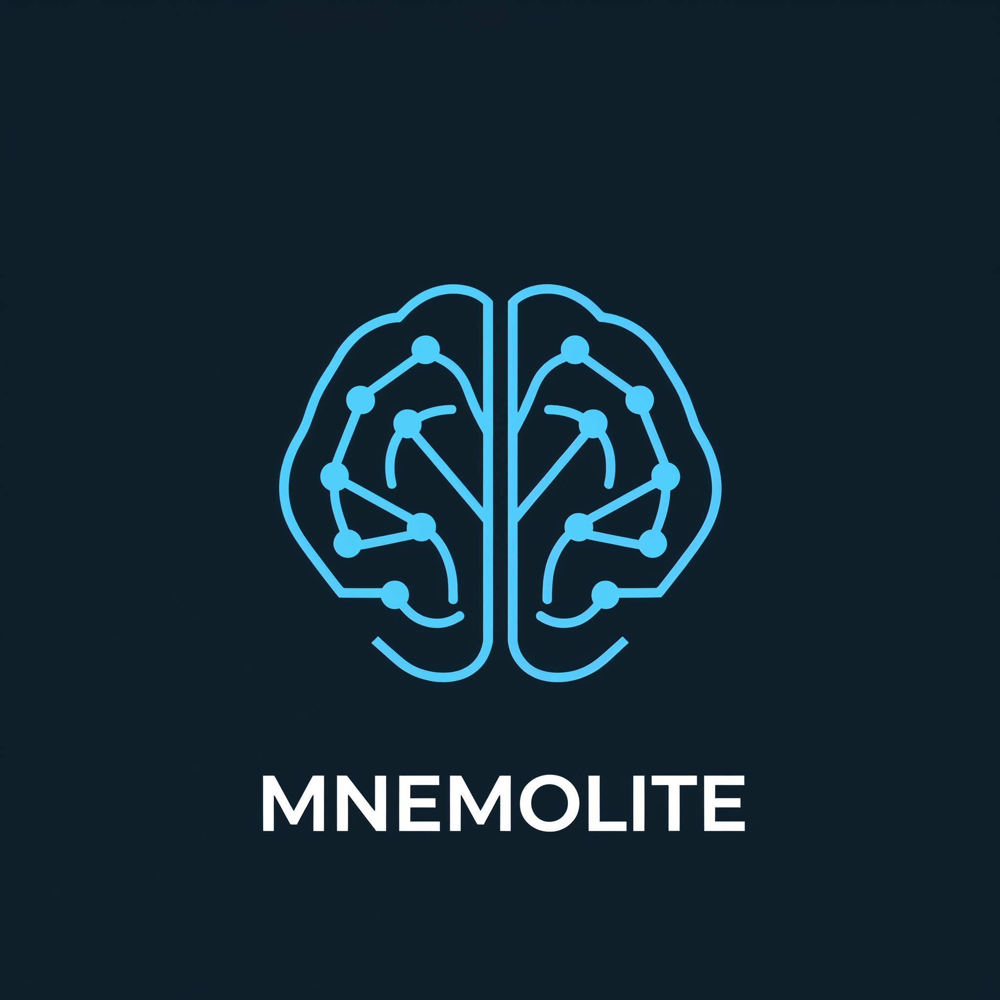

<p align="center">
  
</p>

# MnemoLite: PostgreSQL-Native Cognitive Memory

[](https://github.com/giak/MnemoLite)
[](https://opensource.org/licenses/MIT)
[](https://www.python.org/downloads/)
[](https://www.postgresql.org/)
[](https://github.com/pgvector/pgvector)
[](https://github.com/giak/MnemoLite)

**MnemoLite** is a high-performance, locally deployable cognitive memory system built *exclusively* on PostgreSQL 18. It empowers AI agents with robust, searchable, and time-aware memory capabilities, advanced Code Intelligence features, and full [Model Context Protocol (MCP)](https://modelcontextprotocol.io/) support for LLM integration.

Zero external vector databases. Zero API dependencies. Zero cost. Complete privacy.

## ✨ Key Features

### 🧠 Cognitive Memory
* **PostgreSQL Native:** Uses `pgvector` (HNSW), `pg_trgm`, and `pg_partman` — no external databases needed
* **100% Local Embeddings:** Sentence-Transformers (nomic-embed-text-v1.5), zero API calls
* **Hybrid Search:** Lexical (trigram) + Vector (HNSW) + BM25 reranking + RRF fusion
* **Time-Aware Storage:** Monthly partitioning via `pg_partman`
* **Triple-Layer Cache:** L1 (in-memory) → L2 (Redis) → L3 (PostgreSQL)

### 💻 Code Intelligence
* **Semantic Code Search:** Dual embeddings (TEXT + CODE, 768D each)
* **AST-based Chunking:** Tree-sitter for 15+ languages
* **Dependency Graph:** Function/class call graphs with recursive CTE traversal
* **7-Step Indexing Pipeline:** Language detection → AST parsing → chunking → metadata → dual embedding → graph → storage

### 🔌 MCP Integration (28 tools)
* **Code Search:** `search_code` — hybrid search with 6 filter types
* **Memory CRUD:** `write_memory`, `read_memory`, `update_memory`, `delete_memory`
* **Memory Search:** `search_memory` — vector + lexical + tag-only optimization
* **Indexing:** `index_project`, `reindex_file`, `index_incremental`, `index_markdown_workspace`
* **Analytics:** `get_indexing_stats`, `get_memory_health`, `get_cache_stats`, `clear_cache`
* **Graph:** `get_graph_stats`, `traverse_graph`, `find_path`, `get_module_data`
* **Indexing Observability:** `get_indexing_status`, `get_indexing_errors`, `retry_indexing`
* **Configuration:** `switch_project`, `list_projects`

### 🖥️ User Interface (Vue 3 SPA)
* **13 Pages:** Dashboard, Search, Memories, Projects, Expanse, Expanse Memory, Monitoring, Alerts, Brain, Graph, Orgchart, Logs, Search Analytics
* **SCADA Design:** Industrial-style dark theme with LED indicators
* **Interactive Graphs:** v-network-graph + @antv/g6 for code visualization
* **Real-time Charts:** Chart.js for latency, alerts, and system metrics

## 🚀 Quick Start

**Prerequisites:**
* Docker & Docker Compose v2+
* 8 GB RAM minimum (16 GB recommended)
* 3 GB disk space

```bash
# Clone and start
git clone https://github.com/giak/MnemoLite.git
cd MnemoLite
docker compose --profile dev up -d --build
```

**Access:**
| Service | URL |
|---------|-----|
| Web UI | http://localhost:3000 |
| API | http://localhost:8001 |
| API Docs | http://localhost:8001/docs |
| MCP | http://localhost:8002 |
| OpenObserve | http://localhost:5080 |

**Verify:**
```bash
docker compose ps
curl http://localhost:8001/health
```

## 🏛️ Architecture

```
┌─────────────┐    ┌─────────────┐    ┌─────────────┐
│   Vue 3 SPA │───▶│  FastAPI    │───▶│ PostgreSQL  │
│  (port 3000)│    │  (port 8001)│    │   (port 5432)│
└─────────────┘    └──────┬──────┘    └─────────────┘
                          │
                    ┌─────┴─────┐    ┌─────────────┐
                    │    MCP    │    │   Redis 7   │
                    │(port 8002)│    │  (port 6379) │
                    └───────────┘    └─────────────┘
```

**Core Principles:**
- Repository Pattern with protocol-based dependency inversion
- CQRS-inspired logical separation
- 100% async (asyncio + asyncpg)
- BM25 reranking (pure Python, no ML dependencies)

## 📚 Documentation

| Topic | Location |
|-------|----------|
| Quick Start | [docs/02_GUIDES/QUICKSTART.md](docs/02_GUIDES/QUICKSTART.md) |
| Setup Guide | [docs/02_GUIDES/SETUP.md](docs/02_GUIDES/SETUP.md) |
| MCP Guide | [docs/02_GUIDES/MCP-GUIDE.md](docs/02_GUIDES/MCP-GUIDE.md) |
| Docker Setup | [docs/deployment/README.md](docs/deployment/README.md) |
| Architecture | [CLAUDE.md](CLAUDE.md) |
| CI/CD | [.github/workflows/ci.yml](.github/workflows/ci.yml) |
| All Docs | [docs/README.md](docs/README.md) |

## 🛠️ Development

```bash
make up          # Start all services
make down        # Stop all services
make api-test    # Run tests (356/358 passing)
make api-shell   # Shell in API container
make db-shell    # psql shell
make health      # Check API health
```

**Docker Profiles:**
```bash
docker compose --profile dev up -d   # Dev (Vite HMR)
docker compose --profile prod up -d  # Prod (Nginx)
```

## 📊 Project Status

**Version:** 5.0.0-dev | **Tests:** 1570 functions (356/358 MCP passing) | **MCP Tools:** 28

**Completed EPICs:** 28–36 (Frontend Hardening, Test Infrastructure, Observability, MCP Integration, Search Performance, Design Polish, Backend API, Search UX, Production Readiness)

## 📜 License

MIT License

---

**Made with ❤️ for AI agents and cognitive memory systems**
