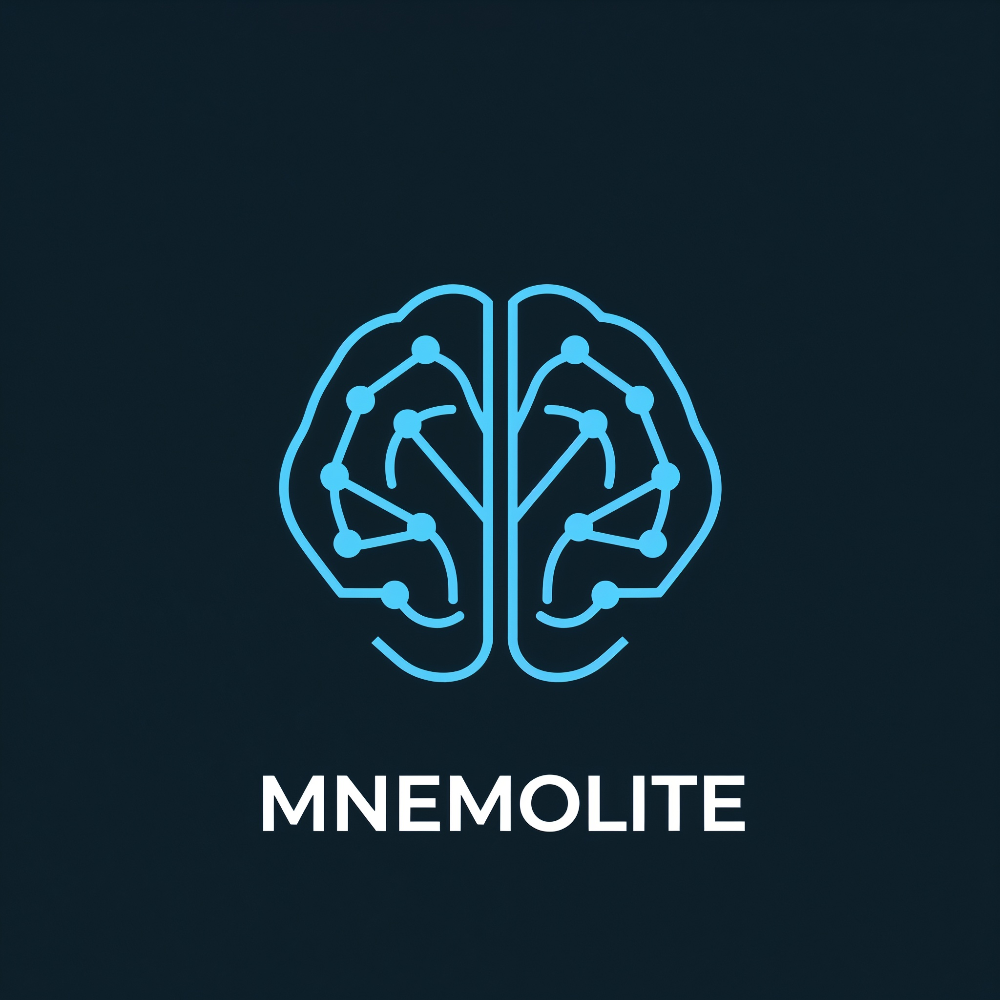

<p align="center">
  
</p>

# MnemoLite: PostgreSQL-Native Cognitive Memory

[](https://github.com/giak/MnemoLite)
[](https://opensource.org/licenses/MIT)
[](https://www.python.org/downloads/)
[](https://www.postgresql.org/)
[](https://github.com/pgvector/pgvector)
[](https://github.com/giak/MnemoLite)

**MnemoLite** is a high-performance, locally deployable cognitive memory system built *exclusively* on PostgreSQL 18. It empowers AI agents with robust, searchable, and time-aware memory capabilities, advanced Code Intelligence features, and full [Model Context Protocol (MCP)](https://modelcontextprotocol.io/) support for LLM integration.

Zero external vector databases. Zero API dependencies. Zero cost. Complete privacy.

## ✨ Key Features

### 🧠 Cognitive Memory
* **PostgreSQL Native:** Uses `pgvector` (HNSW), `pg_trgm`, and `pg_partman` — no external databases needed
* **100% Local Embeddings:** Sentence-Transformers (nomic-embed-text-v1.5), zero API calls
* **Hybrid Search:** Lexical (trigram) + Vector (HNSW) + BM25 reranking + RRF fusion
* **Time-Aware Storage:** Monthly partitioning via `pg_partman`
* **Triple-Layer Cache:** L1 (in-memory) → L2 (Redis) → PostgreSQL
* **~37 000 Memories** indexées (investigations, articles, notes, quintessences)

### 💻 Code Intelligence
* **Semantic Code Search:** Dual embeddings (TEXT + CODE, 768D each)
* **AST-based Chunking:** Tree-sitter for 15+ languages
* **Dependency Graph:** Function/class call graphs with recursive CTE traversal
* **7-Step Indexing Pipeline:** Language detection → AST parsing → chunking → metadata → dual embedding → graph → storage

### 🛡️ Privacy & Security
* **Secret Stripping:** 11 regex patterns (AWS, OpenAI, Anthropic, GitHub, GitLab, Slack, JWT, Bearer, etc.)
* **Automatic Redaction:** Secrets replaced with `[REDACTED: TYPE]` before storage
* **`<private>` Tags:** Wrap sensitive text in `<private>...</private>` for explicit redaction
* **Zero Dependencies:** stdlib `re` module, no external packages
* **Toggle:** `MCP_PRIVACY_ENABLED` env var (default: `true`)

### 🔌 MCP Integration (29 tools)

| Catégorie | Outils |
|-----------|--------|
| **Test** | `ping` |
| **Code Search** | `search_code` — hybride lexical + vectoriel avec 6 types de filtres |
| **Memory CRUD** | `write_memory` *(sanitized)*, `read_memory`, `update_memory` *(sanitized)*, `delete_memory` |
| **Memory Search** | `search_memory` — vector + lexical + tag-only optimization |
| **Memory Advanced** | `consolidate_memory`, `mark_consumed`, `rate_memory`, `export_memories`, `configure_decay` |
| **System** | `get_system_snapshot` — état holistique pour boot d'agent |
| **Graph** | `get_graph_stats`, `traverse_graph`, `find_path`, `get_module_data` |
| **Indexing** | `index_project`, `reindex_file`, `index_incremental`, `index_markdown_workspace` |
| **Indexing Ops** | `get_indexing_status`, `get_indexing_errors`, `retry_indexing`, `clear_cache`, `get_indexing_stats` |
| **Analytics** | `get_memory_health`, `get_cache_stats`, `switch_project` |

### 🖥️ User Interface (Vue 3 SPA)
* **13 Pages:** Dashboard, Search, Memories, Projects, Expanse, Expanse Memory, Monitoring, Alerts, Brain, Graph, Orgchart, Logs, Search Analytics
* **SCADA Design:** Industrial-style dark theme with LED indicators
* **Interactive Graphs:** v-network-graph + @antv/g6 for code visualization
* **Real-time Charts:** Chart.js for latency, alerts, and system metrics

### 🖥️ CLI (`mnemo`)
```bash
mnemo health        # Vérifier l'état du serveur
mnemo status        # Statistiques détaillées (nb mémoires, DB, Redis)
mnemo search <query> # Recherche textuelle hybride
mnemo write         # Créer une mémoire (--title, --content, --tags, --type)
mnemo memories      # Lister les mémoires récentes (--limit)
```

## 🚀 Quick Start

**Prerequisites:**
* Docker & Docker Compose v2+
* 8 GB RAM minimum (16 GB recommended)
* 3 GB disk space

```bash
# Clone and start
git clone https://github.com/giak/MnemoLite.git
cd MnemoLite
docker compose --profile dev up -d --build
```

**Access:**
| Service | URL | Usage |
|---------|-----|-------|
| Web UI | http://localhost:3000 | Interface utilisateur Vue 3 |
| REST API | http://localhost:8001 | API HTTP (documentation Swagger: /docs) |
| MCP Server | http://localhost:8002 | Protocole MCP (SSE) pour agents LLM |
| OpenObserve | http://localhost:5080 | Observabilité et logs |

**Verify:**
```bash
docker compose ps
curl http://localhost:8001/health
# → {"status":"healthy","database":true,"services":{"postgres":"UP","redis":"UP"}}
```

## 🏛️ Architecture

```
┌─────────────┐    ┌─────────────┐    ┌─────────────┐
│   Vue 3 SPA │───▶│  FastAPI    │───▶│ PostgreSQL  │
│  (port 3000)│    │  (port 8001)│    │   (port 5432)│
└─────────────┘    └──────┬──────┘    └─────────────┘
                          │
                    ┌─────┴─────┐    ┌─────────────┐
                    │    MCP    │    │   Redis 7   │
                    │(port 8002)│    │  (port 6379) │
                    └───────────┘    └─────────────┘
```

**Core Principles:**
- Repository Pattern with protocol-based dependency inversion
- CQRS-inspired logical separation
- 100% async (asyncio + asyncpg)
- BM25 reranking (pure Python, no ML dependencies)

## 📚 Documentation

| Topic | File |
|-------|------|
| Quick Start | `docs/02_GUIDES/QUICKSTART.md` |
| Setup Guide | `docs/02_GUIDES/SETUP.md` |
| **LLM Guide (MCP + API)** | **`MCP_SETUP.md`** — comment utiliser Mnemolite depuis un agent LLM |
| MCP Guide | `docs/02_GUIDES/MCP-GUIDE.md` |
| Docker Setup | `docs/deployment/README.md` |
| All Docs | `docs/README.md` |

## 🛠️ Development

```bash
make up          # Start all services
make down        # Stop all services
make api-test    # Run tests (356/358 passing)
make api-shell   # Shell in API container
make health      # Check API health
```

**Docker Profiles:**
```bash
docker compose --profile dev up -d   # Dev (Vite HMR)
docker compose --profile prod up -d  # Prod (Nginx)
```

## 📊 Project Status

**Version:** 5.0.0-dev | **Tests:** 1570+ functions | **MCP Tools:** 29 | **Memories:** ~37 000

**Completed EPICs:** 28–36, 42 (Frontend Hardening, Test Infrastructure, Observability, MCP Integration, Search Performance, Design Polish, Backend API, Search UX, Production Readiness, Secret Stripping)

## 📜 License

MIT License

---

**Made with ❤ for AI agents and cognitive memory systems**
