# Architecture MnemoLite

> **Statut :** DECISION | **Mis à jour :** 2026-04-05

## 1. Topologie du système

MnemoLite est un **système à double visage** : il sert à la fois d'API REST pour une interface web et de serveur MCP (Model Context Protocol) pour les agents IA. Les deux partagent la même couche de données mais tournent dans des processus séparés avec des cycles de vie indépendants.

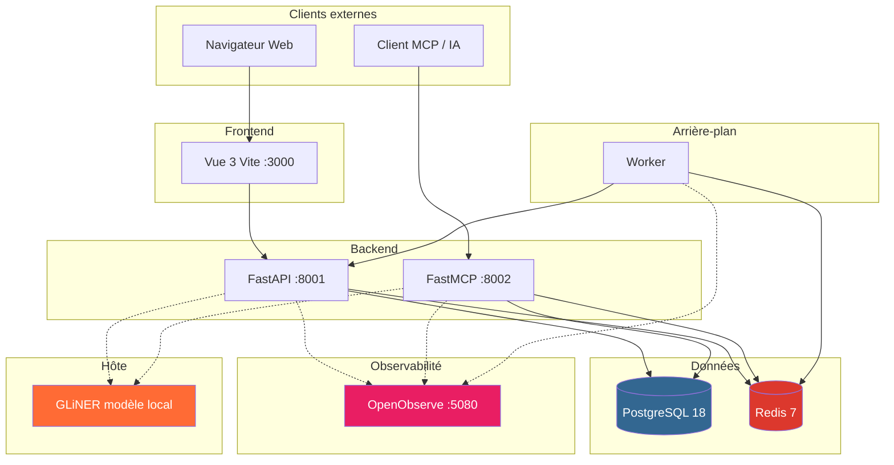

**Pourquoi deux processus séparés ?** L'API REST parle HTTP aux navigateurs (CORS, sessions). Le serveur MCP parle JSON-RPC en stdio ou Streamable HTTP — un protocole fondamentalement différent. Les exécuter séparément signifie que le serveur MCP peut être utilisé par Claude Desktop sans avoir besoin de l'API REST, et inversement. Ils ne partagent **aucun code à l'exécution** — chacun initialise ses propres pools de connexion, services et caches.

**Isolation réseau :** Deux réseaux Docker isolent le trafic. `backend` connecte API, MCP, Worker, PostgreSQL, Redis et OpenObserve. `frontend` connecte Frontend, API, MCP et OpenObserve. PostgreSQL et Redis ne sont **jamais** exposés au réseau frontend. OpenObserve est sur les **deux** réseaux pour recevoir les logs de tous les services.

## 2. Le pattern Lifespan — Comment les services s'initialisent

L'API et le serveur MCP utilisent le **pattern lifespan asynchrone** — pas de singletons au niveau module, pas d'initialisation paresseuse à la première requête. Chaque service est soit entièrement prêt avant la première requête, soit le démarrage échoue rapidement (services critiques) ou se dégrade gracieusement (services optionnels).

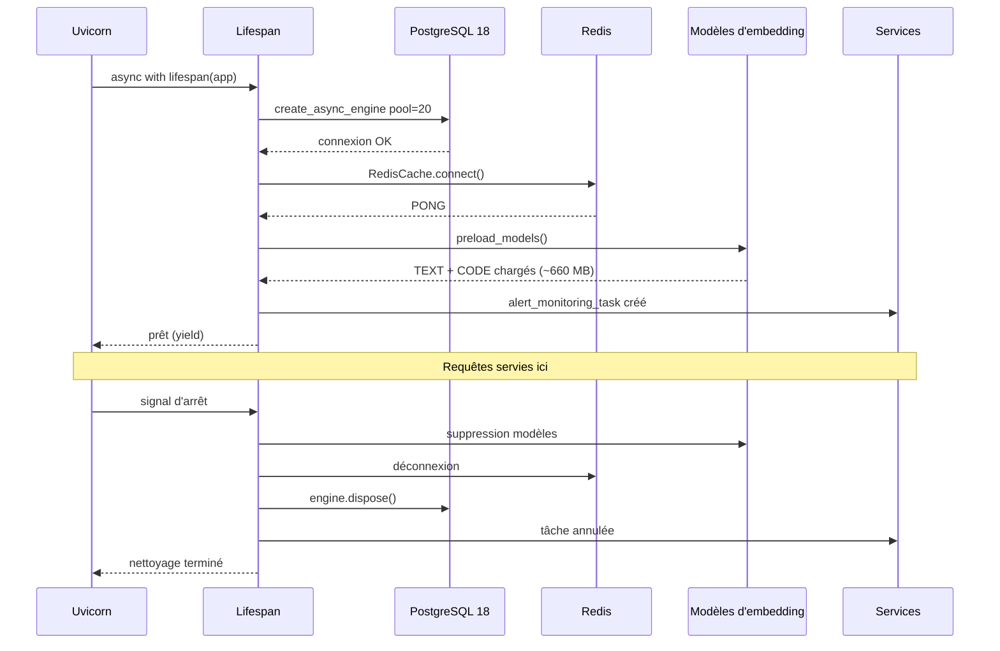

**Note :** Ce diagramme décrit le lifespan de l'**API REST** (`main.py`). Le serveur MCP (`server.py`) a un lifespan différent : il crée un pool asyncpg + un moteur SQLAlchemy async, mais **ne précharge pas** les modèles d'embedding (chargement paresseux à la première utilisation) et **ne crée pas** de tâche de monitoring d'alertes.

**Décision critique :** `app.state` est le localisateur de services. Chaque service initialisé pendant le lifespan est stocké sur `app.state` et récupéré par les fonctions `Depends()` de FastAPI. Le serveur MCP fait la même chose avec un dictionnaire `services` injecté via `inject_services()`.

**Modes de défaillance au démarrage :**

| Service | Comportement en cas d'échec | Raison |
|---------|---------------------------|--------|
| PostgreSQL | Engine = `None`, requêtes → 503 | Impossible de fonctionner sans DB |
| Redis | Warning loggé, `redis_cache = None` | Optionnel — le cache se rabat sur la DB |
| Modèles d'embedding | Prod : `RuntimeError`. Dev : warning | Correction prod vs vélocité dev |
| Serveurs LSP | Warning loggé, `None` | Optionnel — l'indexation fonctionne sans |
| Service d'alertes | Warning, tâche non démarrée | L'observabilité n'est pas critique |
| GLiNER | Skip silencieux, fallback sans entités | L'extraction est optionnelle, la recherche fonctionne sans |

## 3. Le pipeline de recherche hybride

C'est la partie la plus significative architecturalement. Le pipeline de recherche n'est **pas** une simple requête — c'est une orchestration multi-étapes avec exécution parallèle, cache et chemins de repli.

### 3.1 Recherche de code

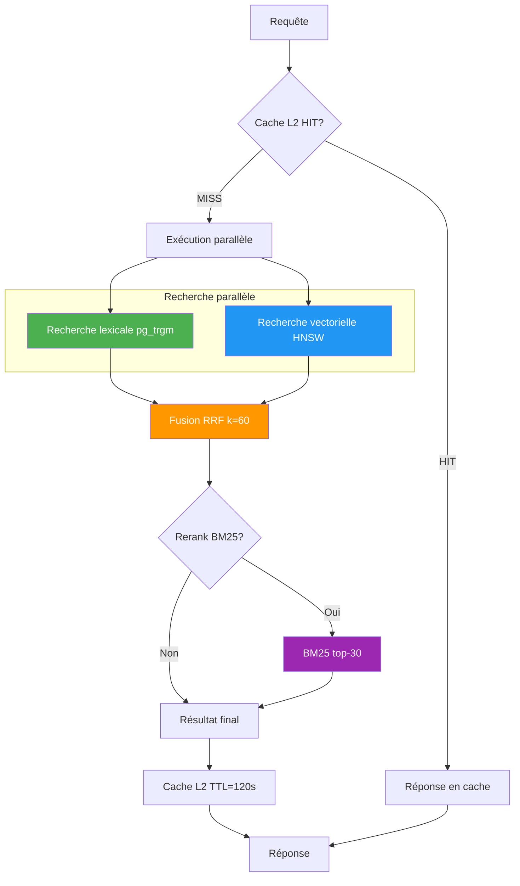

**Exécution parallèle :** Les recherches lexicale et vectorielle démarrent simultanément via `asyncio.gather()`. Aucune n'attend l'autre.

**Pourquoi RRF plutôt que la normalisation des scores ?** Les scores lexicaux (similarité trigramme 0.0–1.0) et vectoriels (distance cosinus 0.0–2.0) vivent sur des **échelles incomparables**. Les normaliser nécessiterait de connaître la distribution des scores de tout le corpus. RRF contourne le problème : il ne regarde que la **position dans le classement**, pas les scores absolus. La formule `1 / (k + rang)` avec `k=60` est le standard industriel.

**Le compromis BM25 :** Après la fusion RRF, les 30 meilleurs candidats sont rerankés avec BM25 — une implémentation pure Python sans dépendances ML. Choisi plutôt qu'un cross-encoder car :
- Le cross-encoder nécessiterait ~500 MB de modèle supplémentaire
- Le cold start serait de 10-15 secondes
- BM25 est ~100× plus rapide pour 20 documents
- La différence de qualité est marginale pour la recherche de code

### 3.2 Recherche de mémoires

Même architecture RRF, mais avec des sources de données différentes :

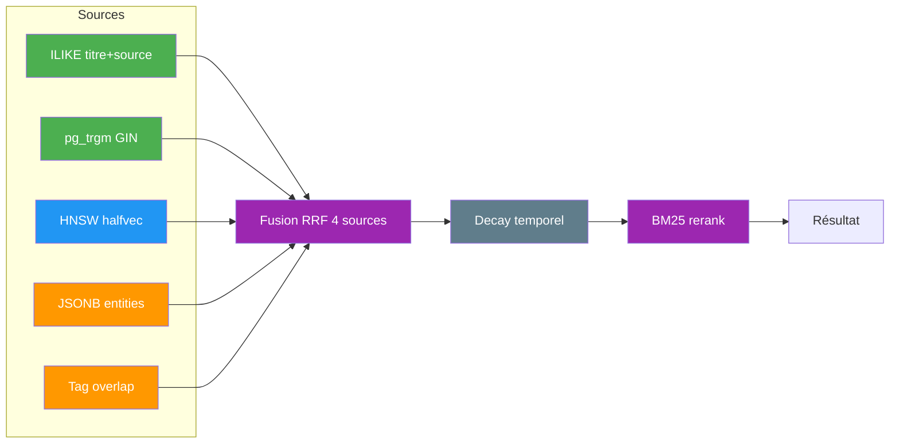

**Différence clé :** La recherche mémoire applique un **decay temporel** après le reranking. Le `MemoryDecayService` applique un decay exponentiel basé sur `created_at` — les anciennes mémoires obtiennent progressivement des scores plus bas. Configurable par tag via `configure_decay()`, permettant aux mémoires `sys:core` d'être permanentes (decay=0.0) tandis que `sys:history` decay avec une demi-vie de ~14 jours.

**Recherche intentionnelle (EPIC-28) :** Avant la recherche, le `QueryUnderstandingService` (déterministe, basé sur des heuristiques regex — pas de LLM) décompose la requête en **HL keywords** (concepts abstraits) et **LL keywords** (entités concrètes). Les HL keywords orientent la recherche vectorielle, les LL keywords alimentent deux recherches supplémentaires — containment JSONB sur les entités et overlap sur les tags (manuels + auto-générés). La fusion RRF passe de 2 à 4 sources avec des poids normalisés dynamiquement. Si le service n'est pas disponible, le système se rabat silencieusement sur la recherche brute (comportement antérieur).

**Filtres avancés (EPIC-32) :** Le pipeline hybrid search applique les filtres `consumed` (colonnes `consumed_at IS NULL/NOT NULL`) et `lifecycle_state` (conditions SQL sur les tags) dans les 4 sous-requêtes parallèles avant la fusion RRF. Le paramètre `query` est optionnel si `tags` est fourni, permettant le mode listing pur utilisé par Expanse.

## 4. Architecture du cache à trois couches

Le cache n'est pas une couche unique — c'est une **cascade** avec promotion automatique :

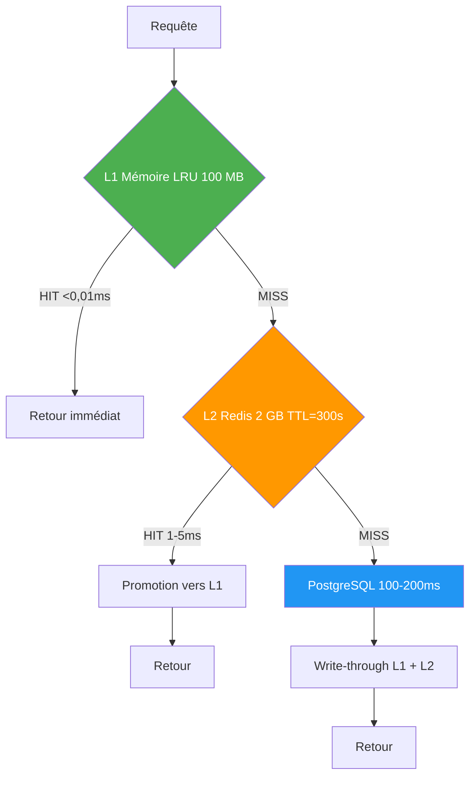

**Stratégie de clé de cache :** `chunks:{chemin_fichier}:{md5(code_source)}`. Le hash MD5 du code source est inclus pour que **tout changement de code invalide le cache automatiquement** — pas d'invalidation manuelle nécessaire pour les changements de contenu.

**Taux de hit combiné :** `L1 + (1 - L1) × L2`. Si L1 a 70 % de hit rate et L2 a 80 % sur les 30 % restants, le taux effectif est `70 % + (30 % × 80 %) = 94 %`.

## 5. Architecture duale d'embedding — Pourquoi deux modèles

Le système utilise **deux modèles d'embedding simultanément**, chacun optimisé pour un domaine différent :

| Modèle | Domaine | Paramètres | Dimensions | RAM |
|--------|---------|-----------|------------|-----|
| nomic-ai/nomic-embed-text-v1.5 | Texte (docs, conversations) | 137M | 768 | ~260 MB |
| jinaai/jina-embeddings-v2-base-code | Code (fonctions, classes) | 161M | 768 | ~400 MB |

**Pourquoi pas un seul modèle ?** Les modèles texte généraux performent mal sur le code car ils ne comprennent pas la sémantique des langages de programmation. Les modèles code ne comprennent pas bien les requêtes en langage naturel. En maintenant les deux, le système peut :
- Rechercher du code avec des embeddings code (capture la structure sémantique)
- Rechercher du code avec des embeddings texte (capture les docstrings, commentaires)
- Fusionner les deux résultats via RRF pour une couverture complète

**L'optimisation halfvec :** Les embeddings sont stockés en `vector(768)` (float32, 3 KB par embedding) mais **recherchés** via des colonnes `halfvec(768)` (float16, 1,5 KB). Un trigger PostgreSQL (`sync_halfvec_embeddings`) convertit automatiquement float32 → halfvec à l'INSERT/UPDATE. Cela donne :
- 50 % de réduction de stockage par ligne
- 50 % de réduction de taille d'index HNSW
- 99,2 % de rappel conservé
- 2× d'amélioration du QPS des requêtes

**Circuit breakers indépendants :** Chaque modèle a son propre circuit breaker (seuil=5 échecs, récupération=60s). Si le modèle CODE échoue, le modèle TEXT continue de fonctionner.

**Mode mock :** Quand `EMBEDDING_MODE=mock`, le service génère des vecteurs aléatoires déterministes à partir du hash du texte. Cela permet de tester sans télécharger 660 MB de modèles.

## 6. Inversion de dépendance — La couche Protocol

Le système utilise des classes `Protocol` Python pour définir des interfaces, puis des implémentations concrètes sont injectées via `Depends()` de FastAPI :

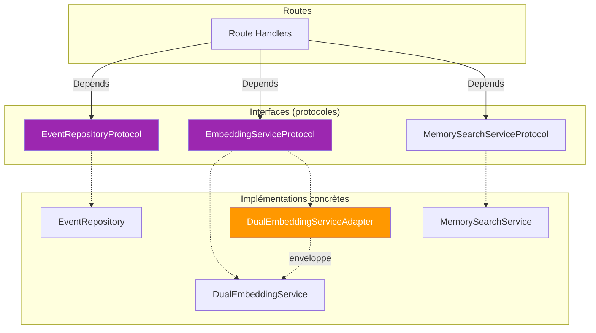

**Le pattern Adapter pour DualEmbeddingService :** Le `DualEmbeddingService` a une API différente (`generate_embedding(text, domain)` retournant `Dict[str, List[float]]`) que le `EmbeddingServiceProtocol` legacy (`generate_embedding(text)` retournant `List[float]`). Le `DualEmbeddingServiceAdapter` enveloppe le service dual et traduit les appels — le code existant fonctionne sans changement.

**Le serveur MCP n'utilise pas `Depends()` de FastAPI :** Il construit un dictionnaire `services` pendant le lifespan et l'injecte dans chaque outil/ressource via `tool.inject_services(services)`. C'est parce que les outils FastMCP ne participent pas au système d'injection de dépendances de FastAPI.

## 7. Schéma de base de données

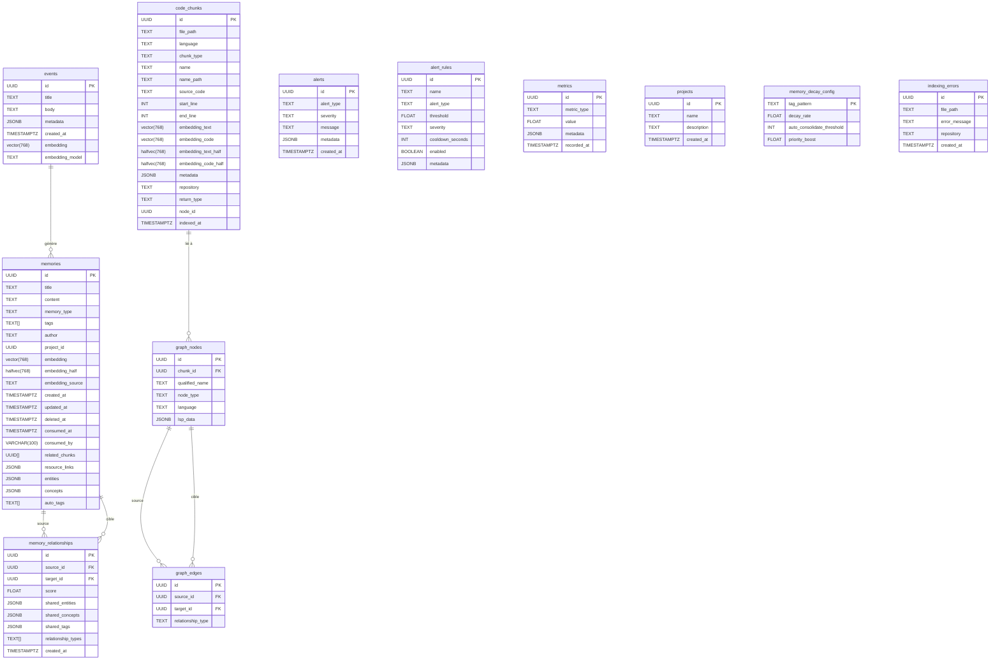

**Décisions clés du schéma :**

- **Table `events`** est le store original — c'était la première table. Les mémoires ont été dérivées plus tard via l'`EventProcessor`. Le `MemoryRepository` utilise SQLAlchemy Core (pas d'ORM) pour le contrôle SQL brut, surtout pour les opérations pgvector.

- **Table `memories`** a à la fois `embedding` (float32 vector) et `embedding_half` (float16 halfvec). Le trigger les garde synchronisés. Le champ `embedding_source` est un résumé textuel focalisé utilisé pour calculer les embeddings — séparé du `content` complet — permettant une meilleure qualité d'embedding. Trois colonnes supplémentaires enrichissent les mémoires avec des métadonnées structurées : `entities` (JSONB, entités nommées), `concepts` (JSONB, concepts abstraits), et `auto_tags` (TEXT[], tags auto-générés). La colonne `consumed_by` (VARCHAR) trace quel agent a consommé la mémoire. Les types de mémoire valides sont : `note`, `decision`, `task`, `reference`, `conversation`, `investigation`. Les colonnes JSONB ont des index GIN `jsonb_path_ops` pour des requêtes de containment efficaces (`@>`).

- **Table `code_chunks`** a **quatre** colonnes d'embedding : `embedding_text`, `embedding_code` (float32, pour l'écriture) et `embedding_text_half`, `embedding_code_half` (float16, pour la lecture/recherche). Les colonnes `repository` et `return_type` sont peuplées par le service d'indexage — `repository` depuis le contexte d'indexation, `return_type` depuis les serveurs LSP.

- **Tables `graph_nodes` et `graph_edges`** forment le graphe de dépendance de code. Les nœuds sont extraits par tree-sitter (parsing) et les serveurs LSP (informations de type). Les arêtes représentent les relations `calls`, `imports`, `inherits`. Le graphe est parcouru via BFS pour la recherche de chemin et DFS pour la découverte d'appelants/appelés.

- **Table `memory_relationships`** forme le graphe sémantique entre mémoires. Les relations sont calculées automatiquement après l'extraction d'entités (EPIC-28) via scoring TF-IDF — les entités rares (ADR-001) contribuent plus que les communes (Redis). Le worker consomme le Redis Stream `memory:relationships` et calcule les relations par batch. Une seule row par paire de mémoires avec score composite (0.0-1.0), les entités/concepts/tags partagés, et les types de relation. Utilisé pour la navigation multi-hop, la recherche contextuelle et la visualisation UI.

## 8. Le serveur MCP — Un second point d'entrée

Le serveur MCP n'est **pas** un wrapper autour de l'API REST. C'est un processus complètement séparé avec son propre :
- Pool de connexions DB (asyncpg pool_size=10 + SQLAlchemy async engine)
- Client Redis
- Instances de services
- Gestion du cycle de vie

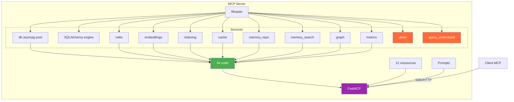

**Pourquoi asyncpg + SQLAlchemy ?** Le serveur MCP crée les deux : un pool asyncpg brut (`services["db"]`, pool_size=10) pour les requêtes directes, et un moteur SQLAlchemy async (`services["engine"]`) pour tous les services (MemoryRepository, HybridMemorySearchService, GraphConstructionService, etc.). SQLAlchemy Core est utilisé pour le contrôle SQL brut (pgvector, requêtes complexes) tout en bénéficiant du pool de connexions et de la gestion transactionnelle.

## 9. Communication Frontend vers API

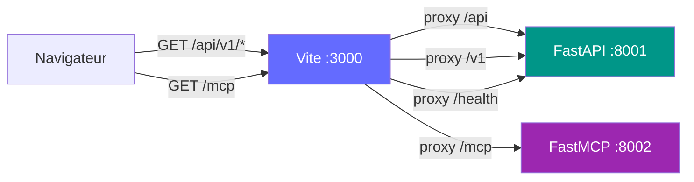

**Stratégie de proxy :** En développement, le serveur Vite proxy toutes les requêtes API pour éviter les problèmes CORS. Le code frontend utilise des **chemins relatifs** (`/api/v1/...`) — le proxy Vite les réécrit vers `http://localhost:8001/api/v1/...`. En production, le container Nginx sert les fichiers statiques construits et proxy les requêtes API directement.

**Deux profils frontend :** `docker compose --profile dev` lance le serveur Vite avec HMR. `docker compose --profile prod` lance un container Nginx pré-construit. Ils sont mutuellement exclusifs.

## 10. Modes de défaillance et dégradation gracieuse

Le système est conçu pour **se dégrader gracieusement** à chaque couche :

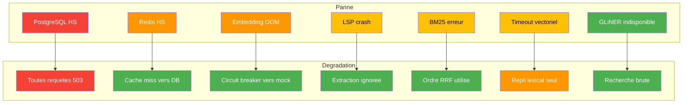

**Le chemin de dégradation le plus important :** Si la recherche vectorielle est activée mais aucun embedding n'est disponible (modèle non chargé, circuit breaker ouvert, mode mock), le système **se rabat silencieusement sur la recherche lexicale seule** avec un warning dans les logs. L'utilisateur obtient des résultats — juste pas les sémantiques. C'est mieux que de retourner une erreur.

**L'échec Redis est invisible :** Si Redis est HS au démarrage, le warning est loggé et `app.state.redis_cache = None`. Tous les checks de cache deviennent des no-ops — le système interroge PostgreSQL directement. Aucune erreur n'est lancée à l'utilisateur.

## 11. Caractéristiques de scaling

| Couche | Actuel | Limite de scaling | Goulot d'étranglement |
|--------|--------|-------------------|----------------------|
| API (uvicorn) | 1 worker, 2 CPU, 24 GB RAM | Horizontal (workers multiples) | CPU pour génération d'embeddings |
| Serveur MCP | 1 instance, 1 CPU, 8 GB RAM | Horizontal (stateless) | Taille du pool de connexions (10) |
| PostgreSQL 18 | 1 CPU, 2 GB RAM, pool=20 | Read replicas, pool de connexions | Scan d'index HNSW sur gros datasets |
| Redis | 1 instance | Redis Cluster | Mémoire (config 2 GB) |
| Modèles d'embedding | CPU-only, chargés à la demande | Accélération GPU | RAM (660 MB par instance) |
| Serveurs LSP | 2 processus (Python + TS) | Isolation par workspace | Mémoire processus (~200 MB chacun) |

**Le goulot d'étranglement de la génération d'embeddings :** Générer un seul embedding prend 50-200 ms sur CPU. Pour un projet de 1000 fichiers avec 50 000 chunks, l'indexation complète prend des heures. Le système mitige cela avec :
- Encodage par batch (10-50× plus rapide que les appels individuels)
- Indexation incrémentale (seulement les fichiers modifiés)
- Redis Streams pour l'indexation en arrière-plan (EPIC-27)
- `torch.no_grad()` pour empêcher l'accumulation de mémoire

**Scaling de l'index HNSW :** L'index HNSW sur les colonnes halfvec avec `m=16, ef_construction=128` gère ~100k chunks efficacement. Au-delà, `ef_search` doit être augmenté (actuellement 100) pour un meilleur rappel, ce qui augmente la latence linéairement.

## 12. Graphe de relations entre mémoires (EPIC-29)

Le système construit automatiquement un **graphe sémantique** entre les mémoires basé sur les entités, concepts et tags partagés.

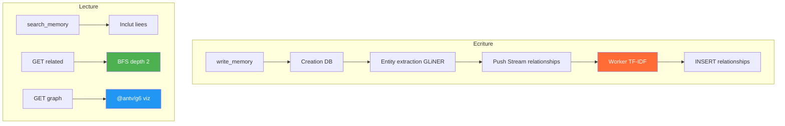

**Scoring TF-IDF :** Les entités rares (ADR-001) contribuent plus au score que les communes (Redis). Score composite : 50% entités + 30% concepts + 20% tags. Seuil minimum configurable (défaut 0.1).

**Trois usages :**
1. **Navigation multi-hop** — `GET /memories/{id}/related?max_depth=2` — BFS sur le graphe, cache Redis 5 min
2. **Recherche contextuelle** — Après recherche normale, si résultats < limit, le système inclut les mémoires liées
3. **Visualisation UI** — `GET /memories/graph?min_score=0.3` — nodes + edges JSON pour @antv/g6, cache Redis 10 min

**Outils MCP ajoutés :** `get_related_memories(memory_id, max_depth)` pour la navigation contextuelle, `get_memory_graph(min_score, limit)` pour la visualisation.

## 13. Extraction d'entités déterministe avec GLiNER (EPIC-32)

Le système utilise **GLiNER** pour l'extraction d'entités nommées déterministe — sans LLM, sans appel réseau externe.

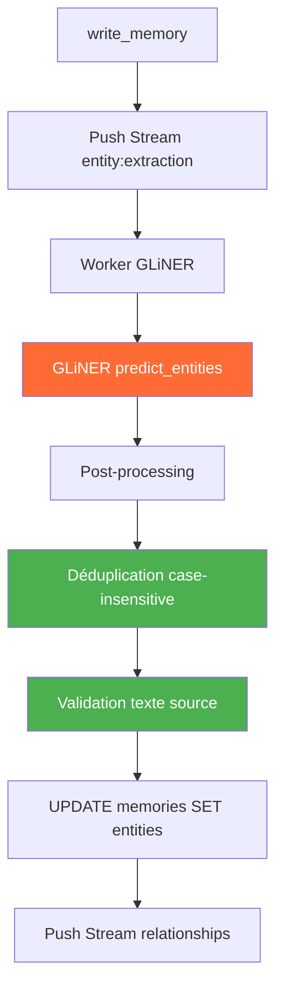

**Pourquoi GLiNER ?** L'ancienne extraction (EPIC-28) utilisait un LLM local via l'API REST legacy — remplacée par GLiNER pour les raisons suivantes :
- Latence 1-2s par requête LLM → ~50ms avec GLiNER
- Dépendance à un service externe (hôte) → modèle local embarqué
- Résultats non déterministes → 100% déterministes
- Prompt engineering complexe → configuration simple des types d'entités

GLiNER résout tout cela : modèle local, ~50ms par extraction, résultats 100% déterministes, zéro dépendance réseau.

**Types d'entités extraits :** `technology`, `product`, `file`, `person`, `organization`, `concept`, `location`. Le post-processing mappe les labels courts de GLiNER (`org` → `organization`, `per` → `person`) et déduplique par nom (case-insensitive).

**Validation croisée :** Chaque entité extraite est validée contre le texte source — si le texte n'apparaît pas dans le contenu, elle est rejetée. Cela élimine les hallucinations du modèle.

**Fallback gracieux :** Si le modèle GLiNER n'est pas disponible (fichier manquant, OOM), le worker logge un warning et retourne un résultat vide — la mémoire est créée normalement sans entités.

**Modèle par défaut :** `gliner_multi-v2.1` dans `/app/models/`. Configurable via `GLINER_MODEL_PATH`.

## 14. Filtres avancés de recherche mémoire

La recherche mémoire supporte des filtres critiques pour l'intégration avec **Expanse** :

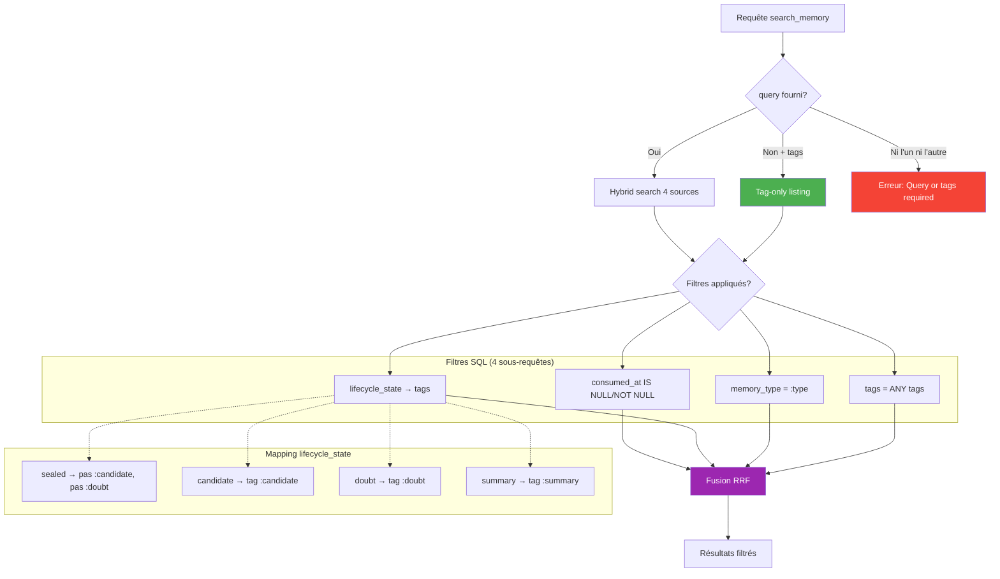

| Filtre | Type | Usage |
|--------|------|-------|
| `consumed` | `bool \| None` | `False` = traces fraîches (non consommées), `True` = déjà traitées |
| `lifecycle_state` | `str \| None` | `sealed`, `candidate`, `doubt`, `summary` — mappé sur les tags |
| `tag_mode` | `str` | `"and"` (défaut, tous les tags requis) ou `"or"` (au moins un) |

**Mapping lifecycle_state → tags SQL :**

| État | Condition SQL |
|------|--------------|
| `sealed` | Pas de tag `:candidate` ET pas de tag `:doubt` |
| `candidate` | Tag `:candidate` présent |
| `doubt` | Tag `:doubt` présent |
| `summary` | Tag `:summary` présent |

**Query optionnel :** Depuis EPIC-32, `query` est optionnel si `tags` est fourni. Cela permet le mode **listing pur par tags** — utilisé par Expanse pour la Triangulation L3 (`search_memory(tags=["sys:anchor"], lifecycle_state="sealed")`).

**Application dans le pipeline hybrid search :** Les filtres `consumed` et `lifecycle_state` sont appliqués dans les 4 sous-requêtes parallèles (`_lexical_search`, `_vector_search`, `_entity_search`, `_tag_search`) avant la fusion RRF — garantissant que seuls les résultats filtrés participent au scoring.

## 15. Résumé des compromis

| Décision | Sacrifié | Gagné |
|----------|----------|-------|
| SQLAlchemy Core plutôt qu'ORM | Ergonomie développeur, sécurité des types | Contrôle SQL brut pour pgvector, requêtes plus rapides |
| Localisateur `app.state` plutôt que container DI | Testabilité, explicitation | Simplicité, pas de dépendance supplémentaire |
| Deux processus séparés (API + MCP) | Efficacité des ressources | Cycles de vie indépendants, isolation des protocoles |
| RRF plutôt que normalisation des scores | Optimalité théorique | Pas besoin de distribution des scores du corpus |
| BM25 plutôt que cross-encoder | Qualité de reranking | Zéro dépendance ML, démarrage instant, 100× plus rapide |
| halfvec pour la recherche, vector pour l'écriture | CPU à la conversion | 50 % de stockage, 2× de QPS |
| Hash MD5 dans les clés de cache | Surcoût de calcul | Invalidation automatique basée sur le contenu |
| Chargement paresseux des modèles | Cold start à la première requête | Démarrage plus rapide, modèles chargés si nécessaire |
| Mode mock d'embedding | Réalisme des tests | Pas de téléchargement de modèles pour CI/CD |
| Triggers PostgreSQL pour sync halfvec | Calcul côté DB | Zéro changement de code app pour halfvec |
| Colonnes `repository`/`return_type` dédiées | Surcoût de stockage (données redondantes) | Recherches O(log n) au lieu de O(n) |
| Circuit breakers indépendants par modèle | Gestion d'état légèrement plus complexe | Les échecs ne se propagent pas entre domaines |
| GLiNER au lieu de LLM pour l'extraction | Modèle ~200 MB supplémentaire | Déterministe, ~50ms, zéro dépendance réseau |
| Extraction async non-bloquante | Délai entre création et extraction | Zéro impact sur la latence de création de mémoire |
| RRF 4 sources au lieu de 2 | Complexité accrue du pipeline | Meilleur rappel via entités et tags auto-générés |
| Graphe de relations entre mémoires | Stockage supplémentaire, calcul TF-IDF | Navigation multi-hop, recherche contextuelle, visualisation |
| Détection Python au lieu de SQL GIN | O(n) au lieu de O(log n) | Évite les problèmes de type casting asyncpg |
| Query optionnel si tags fournis | Validation plus complexe | Mode listing pur pour Expanse Triangulation L3 |
| lifecycle_state mappé sur tags SQL | Pas de colonne dédiée | Zéro migration, compatible avec le système de tags existant |
