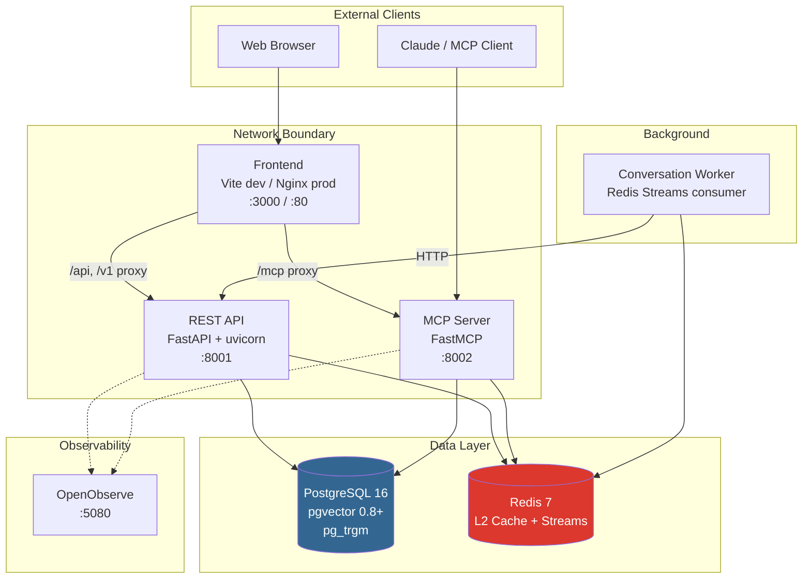
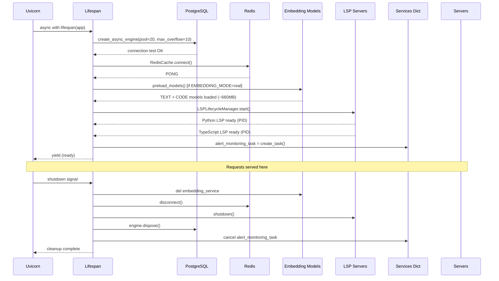
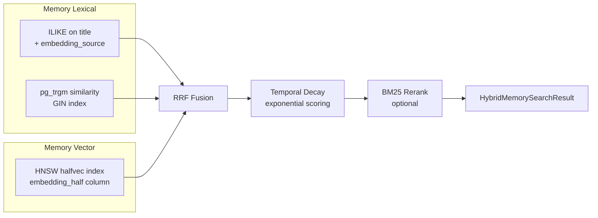
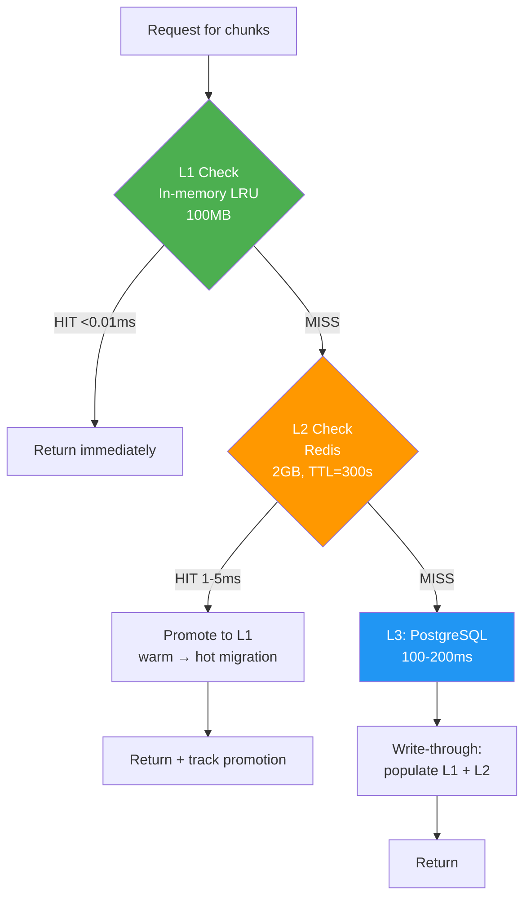
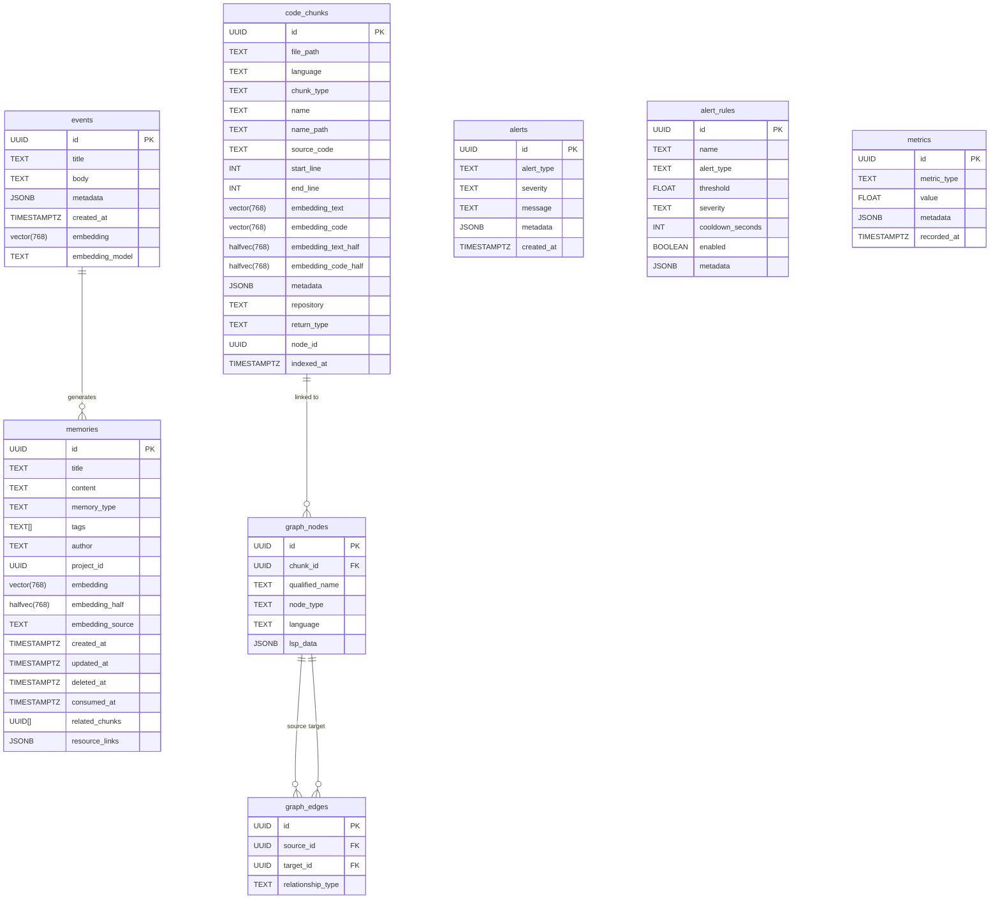
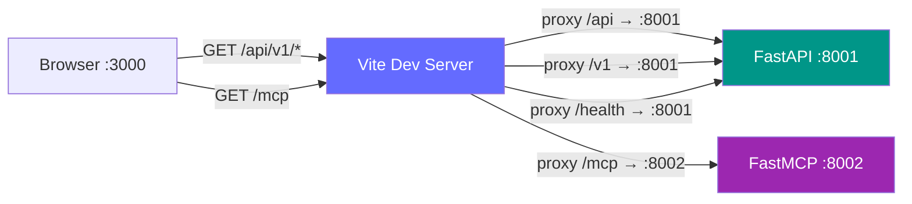
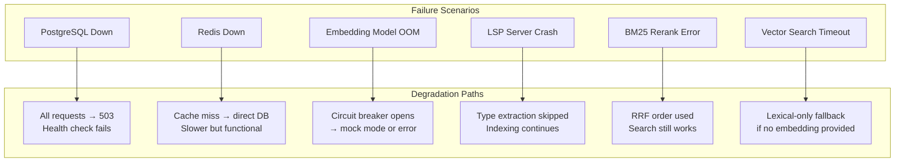

# MnemoLite Architecture

> **Status:** DECISION | **Updated:** 2026-04-03

## 1. System Topology

MnemoLite is a **dual-persona system**: it serves both as a REST API for a web UI and as an MCP (Model Context Protocol) server for AI agents. Both personas share the same data layer but run as separate processes with independent lifecycles.



**Why two separate processes?** The REST API needs to serve HTTP to browsers (CORS, sessions, templates). The MCP server speaks JSON-RPC over stdio or Streamable HTTP — a fundamentally different protocol. Running them separately means the MCP server can be used via stdio by Claude Desktop without needing the REST API at all, and the REST API can be deployed without MCP. They share **no code at runtime** — each initializes its own connection pools, services, and caches.

**Network topology:** Two Docker networks isolate traffic. `backend` connects API, MCP, Worker, PostgreSQL, and Redis. `frontend` connects Frontend, API, MCP, and OpenObserve. PostgreSQL and Redis are **never** exposed to the frontend network — only the API and MCP can reach them.

## 2. The Lifespan Pattern — How Services Actually Initialize

Both the REST API and MCP server use the **async lifespan pattern** — not module-level singletons, not lazy init on first request. This is a deliberate choice: it means every service is either fully ready before the first request arrives, or the startup fails fast (for critical services) or degrades gracefully (for optional ones).



**The critical design decision:** `app.state` is the service locator. Every service initialized during lifespan is stored on `app.state` and retrieved by FastAPI's `Depends()` functions. This is **not** a proper DI container — it's a pragmatic compromise. The MCP server does the same thing but with a plain `services` dict injected into tool objects via `inject_services()`.

**Failure modes during startup:**

| Service | Failure Behavior | Rationale |
|---------|-----------------|-----------|
| PostgreSQL | Engine set to `None`, requests get 503 | Can't function without DB |
| Redis | Warning logged, `app.state.redis_cache = None` | Optional — cache degrades to DB-only |
| Embedding models | In production: `RuntimeError` (fail fast). In dev: warning, continue | Production correctness vs dev velocity |
| LSP servers | Warning logged, `None` | Optional — code indexing works without type info |
| Alert service | Warning logged, background task not started | Observability is non-critical |

## 3. The Hybrid Search Pipeline — How It Actually Works

This is the most architecturally significant part of the system. The search pipeline is **not** a simple query — it's a multi-stage orchestration with parallel execution, caching, and fallback paths.

### 3.1 Code Search Data Flow

```mermaid
flowchart TD
    Query[Search Query] --> CacheCheck{L2 Cache<br/>Redis HIT?}

    CacheCheck -->|HIT| ReturnCached[Return cached<br/>response]
    CacheCheck -->|MISS| Parallel[Parallel Execution]

    subgraph "Parallel Search (asyncio.gather)"
        Lexical[Lexical Search<br/>pg_trgm ILIKE<br/>+ similarity()]
        Vector[Vector Search<br/>HNSW halfvec<br/>cosine distance]
    end

    Parallel --> Lexical
    Parallel --> Vector

    Lexical --> Fuse[RRF Fusion<br/>k=60, weighted]
    Vector --> Fuse

    Fuse --> Rerank{BM25<br/>Rerank?}
    Rerank -->|Yes| BM25[BM25 reranking<br/>top-30 candidates]
    Rerank -->|No| Final
    BM25 --> Final[Build HybridSearchResult<br/>with score breakdown]

    Final --> CachePopulate[Populate L2 cache<br/>TTL=120s]
    CachePopulate --> Response[HybridSearchResponse]
    ReturnCached --> Response

    style Lexical fill:#4CAF50,color:#fff
    style Vector fill:#2196F3,color:#fff
    style Fuse fill:#FF9800,color:#fff
    style BM25 fill:#9C27B0,color:#fff
```

**How parallel execution actually works:**

```python
# Both searches start simultaneously — no waiting for one to finish
tasks = []
if enable_lexical:
    tasks.append(_timed_lexical_search(query, filters, limit=100))
if enable_vector:
    tasks.append(_timed_vector_search(embedding, filters, limit=100))

results = await asyncio.gather(*tasks)  # Both run concurrently
```

The `candidate_pool_size` (default 100) is **not** the number of results returned — it's the number of candidates each search method fetches before fusion. RRF then fuses these 200 candidates (up to 100 from each method) down to the `top_k` (default 10) final results.

**Why RRF (Reciprocal Rank Fusion) instead of score normalization?** Lexical scores (trigram similarity 0.0–1.0) and vector scores (cosine distance 0.0–2.0, converted to similarity) live on **incomparable scales**. Normalizing them would require knowing the score distribution of the entire corpus. RRF sidesteps this entirely: it only cares about **rank position**, not absolute scores. The formula `1 / (k + rank)` with `k=60` is the industry standard — it gives diminishing returns for lower ranks while preventing any single method from dominating.

**The BM25 reranking trade-off:** After RRF fusion, the top-30 candidates are reranked using BM25 — a pure-Python implementation with zero ML dependencies. This was chosen over a cross-encoder reranker because:
- Cross-encoder would need another ~500MB model download
- Cold start would be 10-15 seconds
- BM25 is ~100x faster for top-20 documents
- Quality difference is marginal for code search use cases

### 3.2 Memory Search — Same Pipeline, Different Data

Memory search uses the **identical RRF fusion architecture** but with different data sources:



**Key difference from code search:** Memory search applies **temporal decay** after reranking. The `MemoryDecayService` applies exponential decay based on `created_at` — older memories get progressively lower scores. This is configurable per tag pattern via `configure_decay()`, allowing `sys:core` memories to be permanent (decay_rate=0.0) while `sys:history` memories decay with a ~7-day half-life.

**The vector similarity threshold filter:** Memory search filters out vector results below `0.1` similarity **before** fusion. This prevents semantic noise from polluting the RRF results — a crucial safeguard because low-similarity vector matches can rank higher than high-quality lexical matches in the fusion step.

## 4. The Three-Layer Cache Architecture

The cache is not a single layer — it's a **cascade** with automatic promotion:



**Cache key strategy:** The key is `chunks:{file_path}:{md5(source_code)}`. The MD5 hash of the source code is included so that **any code change invalidates the cache automatically** — no manual invalidation needed for content changes. Manual invalidation (via `invalidate()`) is only needed when the file path changes or for administrative flushes.

**The combined hit rate formula:** `L1 + (1 - L1) × L2`. If L1 has 70% hit rate and L2 has 80% hit rate on the remaining 30%, the effective combined rate is `70% + (30% × 80%) = 94%`. This is tracked and exposed via the `/v1/cache/stats` endpoint.

**Search result caching (separate from chunk caching):** Search results are cached in Redis with a separate key format and TTL of 120 seconds. This is much shorter than chunk caching (300s) because search results are more likely to become stale as the index changes.

## 5. Dual Embedding Architecture — Why Two Models

The system uses **two embedding models simultaneously**, each optimized for a different domain:

| Model | Domain | Parameters | Dimensions | RAM |
|-------|--------|-----------|------------|-----|
| nomic-ai/nomic-embed-text-v1.5 | Text (docs, conversations) | 137M | 768 | ~260MB |
| jinaai/jina-embeddings-v2-base-code | Code (functions, classes) | 161M | 768 | ~400MB |

**Why not a single model?** General-purpose text models perform poorly on code because they don't understand programming language semantics (variable names, API patterns, control flow). Code-specific models don't understand natural language queries well. By maintaining both, the system can:
- Search code with code embeddings (captures semantic structure)
- Search code with text embeddings (captures docstrings, comments)
- Fuse both results via RRF for comprehensive coverage

**The halfvec optimization:** Embeddings are stored in PostgreSQL as `vector(768)` (float32, 3KB per embedding) but **searched** via `halfvec(768)` columns (float16, 1.5KB). A database trigger (`sync_halfvec_embeddings`) auto-converts float32 to halfvec on INSERT/UPDATE. This gives:
- 50% storage reduction per row
- 50% HNSW index size reduction
- 99.2% recall retained
- 2x query QPS improvement

The application layer **doesn't know about halfvec** — it writes float32, PostgreSQL handles the conversion. This is a zero-code-change optimization.

**Circuit breakers per model:** Each model has an independent circuit breaker (threshold=5 failures, recovery=60s). If the CODE model fails repeatedly, the TEXT model continues working. Before this was a single circuit breaker — one model's failure would block both.

**Mock mode:** When `EMBEDDING_MODE=mock`, the service generates deterministic random vectors from the input text hash. This enables testing without downloading 660MB of models. The vectors are normalized to unit length so similarity calculations still produce valid cosine scores.

## 6. Dependency Inversion — The Protocol Layer

The system uses Python `Protocol` classes to define interfaces, then concrete implementations are injected via FastAPI's `Depends()`:

```mermaid
flowchart TD
    subgraph "Interfaces (protocols)"
        EP[EventRepositoryProtocol]
        ESP[EmbeddingServiceProtocol]
        MSSP[MemorySearchServiceProtocol]
        EPP[EventProcessorProtocol]
    end

    subgraph "Concrete Implementations"
        ER[EventRepository]
        DES[DualEmbeddingService]
        DEA[DualEmbeddingServiceAdapter]
        MSS[MemorySearchService]
        EProc[EventProcessor]
    end

    subgraph "Routes"
        Routes[Route Handlers]
    end

    EP -.-> ER
    ESP -.-> DES
    ESP -.-> DEA
    MSSP -.-> MSS
    EPP -.-> EProc

    Routes -->|Depends| EP
    Routes -->|Depends| ESP
    Routes -->|Depends| MSSP
    Routes -->|Depends| EPP

    DEA -.->|wraps| DES

    style EP fill:#9C27B0,color:#fff
    style ESP fill:#9C27B0,color:#fff
    style DEA fill:#FF9800,color:#fff
```

**The Adapter pattern for DualEmbeddingService:** The `DualEmbeddingService` has a different API (`generate_embedding(text, domain)` returning `Dict[str, List[float]]`) than the legacy `EmbeddingServiceProtocol` (`generate_embedding(text)` returning `List[float]`). The `DualEmbeddingServiceAdapter` wraps the dual service and translates calls — existing code (EventService, MemorySearchService) works without changes.

**The MCP server doesn't use FastAPI Depends:** Instead, it builds a `services` dict during lifespan and injects it into each tool/resource via `tool.inject_services(services)`. This is because FastMCP tools don't participate in FastAPI's dependency injection system.

## 7. The Database Schema — What's Actually Stored



**Key schema decisions:**

- **`events` table** is the original data store — it was the first table. Memories were later derived from events via the `EventProcessor`. The `MemoryRepository` now uses SQLAlchemy Core (not ORM) for raw SQL control, especially for pgvector operations.

- **`memories` table** has both `embedding` (float32 vector) and `embedding_half` (float16 halfvec). The trigger keeps them in sync. The `embedding_source` field is a focused text summary used for computing embeddings — separate from the full `content` — enabling better embedding quality.

- **`code_chunks`** has **four** embedding columns: `embedding_text`, `embedding_code` (float32, for writing) and `embedding_text_half`, `embedding_code_half` (float16, for reading/searching). The `repository` and `return_type` columns are **generated always as** from JSONB metadata — this turns O(n) JSONB extraction into O(log n) B-tree index lookups.

- **`graph_nodes` and `graph_edges`** form the code dependency graph. Nodes are extracted by tree-sitter (parsing) and LSP servers (type information). Edges represent `calls`, `imports`, `inherits` relationships. The graph is traversed via BFS for path-finding and DFS for caller/callee discovery.

## 8. The MCP Server — A Second Entry Point

The MCP server is **not** a wrapper around the REST API. It's a completely separate process with its own:
- Database connection pool (asyncpg, not SQLAlchemy)
- Redis client
- Service instances
- Lifecycle management

```mermaid
flowchart TD
    subgraph "MCP Server Process"
        FastMCP[FastMCP Server]
        Lifespan[server_lifespan()]
        Tools[Tools]
        Resources[Resources]
        Prompts[Prompts]

        subgraph "Service Dict"
            SDB[db: asyncpg pool]
            SRedis[redis: aioredis client]
            SEmbed[embedding_service: DualEmbeddingService]
            SCodeIdx[code_indexing_service]
            SChunkCache[chunk_cache: CascadeCache]
            SMemRepo[memory_repository]
            SMemSearch[hybrid_memory_search_service]
            SGraph[graph_traversal_service]
            SMetrics[metrics_collector]
        end

        Lifespan --> SDB
        Lifespan --> SRedis
        Lifespan --> SEmbed
        Lifespan --> SCodeIdx
        Lifespan --> SChunkCache
        Lifespan --> SMemRepo
        Lifespan --> SMemSearch
        Lifespan --> SGraph
        Lifespan --> SMetrics

        SDB --> Tools
        SRedis --> Tools
        SEmbed --> Tools
        SCodeIdx --> Tools
        SChunkCache --> Tools
        SMemRepo --> Tools
        SMemSearch --> Tools
        SGraph --> Tools
        SMetrics --> Tools

        Tools --> FastMCP
        Resources --> FastMCP
        Prompts --> FastMCP
    end

    ClaudeClient[Claude Desktop / Agent] -->|stdio or HTTP| FastMCP
```

**Why asyncpg directly instead of SQLAlchemy?** The MCP server uses raw asyncpg for its database pool because it doesn't need SQLAlchemy's ORM features — it only needs connection pooling and raw SQL execution. This reduces memory footprint (important for the 8GB container limit) and avoids the SQLAlchemy initialization overhead.

**Service injection pattern:** Each MCP tool/resource is a singleton with an `inject_services(services)` method and an `execute(...)` method. The lifespan builds the services dict, then calls `inject_services` on every registered component. This is essentially **manual constructor injection** — the tools receive their dependencies at startup, not at call time.

## 9. Frontend-to-API Communication



**The proxy strategy:** In development, the Vite dev server proxies all API requests to avoid CORS issues. The frontend code uses **relative paths** (`/api/v1/...`) — the Vite proxy rewrites these to `http://localhost:8001/api/v1/...`. In production, the Nginx container serves the built static files and proxies API requests directly.

**Two frontend profiles:** `docker-compose --profile dev` runs the Vite dev server with HMR (Hot Module Replacement). `docker-compose --profile prod` runs a pre-built Nginx container. They're mutually exclusive — you never run both.

## 10. Failure Modes and Graceful Degradation

The system is designed to **degrade gracefully** at every layer:



**The most important degradation path:** If vector search is enabled but no embedding is available (model not loaded, circuit breaker open, mock mode), the system **silently falls back to lexical-only search** with a warning log. The user gets results — just not the semantic ones. This is better than returning an error.

**Redis failure is invisible:** If Redis is down at startup, the warning is logged and `app.state.redis_cache = None`. All cache checks become no-ops — the system queries PostgreSQL directly. No errors are thrown to the user.

**The circuit breaker recovery:** When an embedding model fails 5 times, its circuit breaker opens. Subsequent requests get a clear error message: "TEXT embedding circuit breaker is OPEN. Model loading temporarily unavailable (will retry after 60s)." After 60 seconds, the breaker enters half-open state and allows one test request. If it succeeds, the breaker closes. If it fails, the breaker reopens.

## 11. Scaling Characteristics

| Layer | Current | Scaling Limit | Bottleneck |
|-------|---------|--------------|------------|
| API (uvicorn) | Single worker, 2 CPU, 24GB RAM | Horizontal (multiple workers) | CPU for embedding generation |
| MCP Server | Single instance, 1 CPU, 8GB RAM | Horizontal (stateless) | Connection pool size (10) |
| PostgreSQL | 1 CPU, 2GB RAM, pool=20 | Read replicas, connection pooling | HNSW index scan on large datasets |
| Redis | Single instance | Redis Cluster | Memory (2GB config) |
| Embedding Models | CPU-only, lazy-loaded | GPU offload | RAM (660MB per instance) |
| LSP Servers | 2 processes (Python + TS) | Workspace isolation | Process memory (~200MB each) |

**The embedding generation bottleneck:** Generating a single embedding takes 50-200ms on CPU. For a 1000-file project with 50,000 chunks, full indexing takes hours. The system mitigates this with:
- Batch encoding (10-50x faster than individual calls)
- Incremental indexing (only re-index changed files)
- Redis Streams for background indexing (EPIC-27)
- `torch.no_grad()` to prevent memory accumulation

**The HNSW index scaling:** The HNSW index on halfvec columns with `m=16, ef_construction=128` handles ~100k chunks efficiently. Beyond that, `ef_search` should be increased (currently 100) for better recall, which increases query latency linearly.

## 12. Trade-offs Summary

| Decision | Sacrificed | Gained |
|----------|-----------|--------|
| SQLAlchemy Core over ORM | Developer ergonomics, type safety | Raw SQL control for pgvector, faster queries |
| `app.state` service locator over DI container | Testability, explicitness | Simplicity, no extra dependency |
| Two separate processes (API + MCP) | Resource efficiency | Independent lifecycles, protocol isolation |
| RRF over score normalization | Theoretical optimality | No corpus-wide score distribution needed |
| BM25 over cross-encoder reranker | Reranking quality | Zero ML deps, instant startup, 100x faster |
| halfvec for search, vector for writes | Write-time CPU for conversion | 50% storage, 2x query QPS |
| MD5 hash in cache keys | Hash computation overhead | Automatic content-based invalidation |
| Lazy model loading over eager | Cold start on first request | Faster startup, models only loaded if needed |
| Mock embedding mode | Test realism | No model download for CI/CD |
| PostgreSQL triggers for halfvec sync | DB-side computation | Zero app code changes for halfvec |
| Generated columns from JSONB | Storage overhead (redundant data) | O(log n) lookups instead of O(n) scans |
| Independent circuit breakers per model | Slightly more complex state management | Failures don't cascade between domains |
