# MnemoLite Architecture

**Version:** v5.0.0-dev  
**Documentation:** [http://localhost:8001/docs](http://localhost:8001/docs) (Swagger/OpenAPI)

---

## Table des Matières

1. [Vue d'Ensemble](#vue-densemble)
2. [Architecture Système](#architecture-système)
3. [Stack Technique](#stack-technique)
4. [Flux de Données](#flux-de-données)
5. [Pipeline d'Indexation](#pipeline-dindexation)
6. [Recherche Hybride](#recherche-hybride)
7. [Mémoire Sémantique](#mémoire-sémantique)
8. [Graphe de Code](#graphe-de-code)
9. [Cache Triple-Layer](#cache-triple-layer)
10. [Schéma Base de Données](#schéma-base-de-données)
11. [Protocole MCP](#protocole-mcp)
12. [Déploiement](#déploiement)

---

## Vue d'Ensemble

MnemoLite est un système cognitif de mémoire et d'intelligence de code **100% local**Built on PostgreSQL 18. Il combine recherche vectorielle, analyse de graphe, et intégration MCP pour fournir une mémoire persistante aux agents IA.

### Fonctionnalités Clés

| Capacité | Description |
|----------|-------------|
| **Mémoire Sémantique** | Stockage avec embeddings, recherche hybride, decay temporel |
| **Intelligence de Code** | Indexation AST, graphe de dépendances, 15+ langages |
| **Recherche Hybride** | Lexical (pg_trgm) + Vectoriel (pgvector HNSW) + RRF |
| **Intégration MCP** | 33 outils pour LLM (Claude, KiloCode, etc.) |
| **Cache Triple-Layer** | L1 (mémoire) → L2 (Redis) → L3 (PostgreSQL) |

---

## Architecture Système

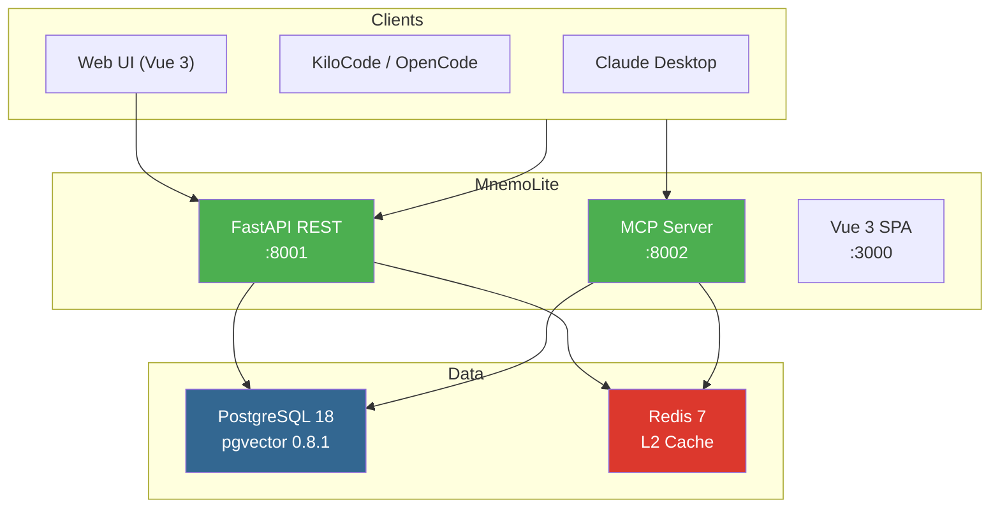

### Services

| Service | Port | Protocol | Rôle |
|---------|------|----------|------|
| Vue 3 SPA | 3000 | HTTP | Interface utilisateur |
| FastAPI REST | 8001 | HTTP | API backend |
| MCP Server | 8002 | Streamable HTTP | Outils LLM |
| PostgreSQL | 5432 | TCP | Données + Vecteurs |
| Redis | 6379 | TCP | Cache L2 |
| OpenObserve | 5080 | HTTP | Observabilité |

---

## Stack Technique

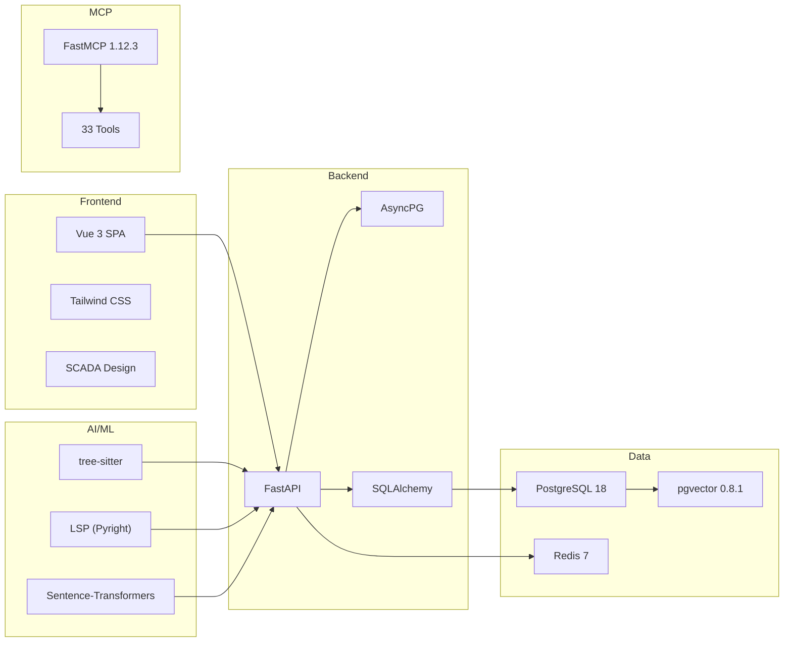

| Composant | Technology | Version |
|-----------|------------|---------|
| Database | PostgreSQL | 18+ |
| Vector | pgvector | 0.8.1 |
| API | FastAPI | latest |
| ORM | SQLAlchemy | async |
| Cache | Redis | 7 |
| MCP | FastMCP | 1.12.3 |
| Frontend | Vue 3 | 3.x |
| Indexing | tree-sitter | 15+ langs |
| Embeddings | nomic-embed-text | v1.5 |
| Code Embeddings | jina-embeddings | v2-base-code |

---

## Flux de Données

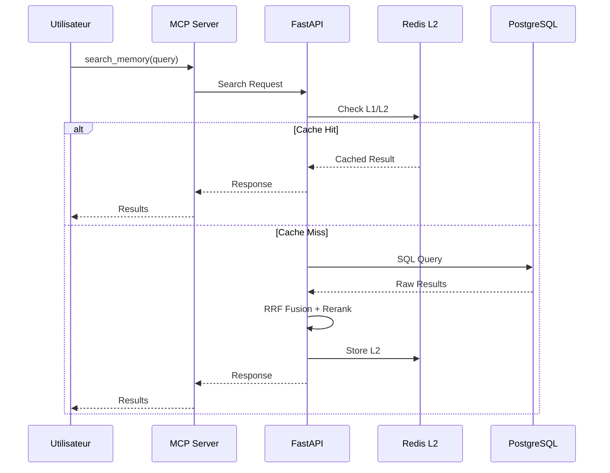

---

## Pipeline d'Indexation

Le pipeline d'indexation transforme le code source en chunks sémantiques avec embeddings.

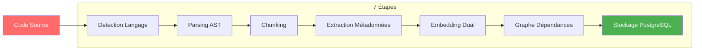

### Détail des Étapes

| Étape | Description | Outil |
|-------|-------------|-------|
| 1. Detection | Identifier langage (Python, JS, TS, etc.) | Extension fichier |
| 2. Parsing | Analyser AST | tree-sitter |
| 3. Chunking | Découper en fonctions/classes | AST traversal |
| 4. Métadonnées | Extraire types, signatures | LSP (Pyright) |
| 5. Embedding TEXT | Vectoriser nom + documentation | nomic-embed-text |
| 6. Embedding CODE | Vectoriser code source | jina-embeddings-v2 |
| 7. Graphe | Construire relations | Recursive CTE |

### Langages Supportés

```
Python, JavaScript, TypeScript, JSX, TSX, Go, Rust, Java,
C, C++, C#, Ruby, PHP, Swift, Kotlin, Scala, HTML, CSS,
SQL, Markdown, YAML, JSON, TOML
```

---

## Recherche Hybride

MnemoLite combine trois stratégies de recherche pour des résultats optimaux.

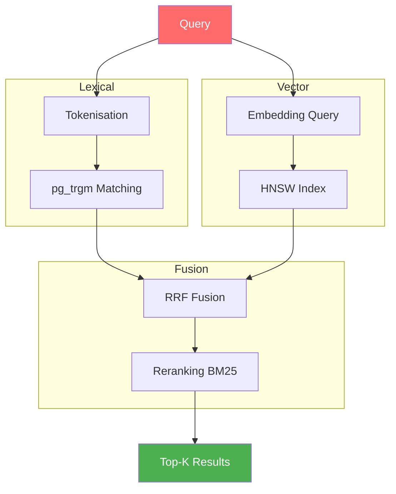

### Paramètres RRF

| Paramètre | Valeur | Effet |
|-----------|--------|-------|
| k adaptatif | 20/60/80 | Code→précision, NL→recall |
| Lexical weight | 0.4 (défaut) | Importance search lexical |
| Vector weight | 0.6 (défaut) | Importance search vectoriel |

### Exemple SQL

```sql
SELECT * FROM memories
WHERE deleted_at IS NULL
ORDER BY 
  -- Lexical: pg_trgm similarity
  0.4 * GREATEST(
    similarity(title, $1),
    similarity(content, $1)
  ) +
  -- Vector: pgvector cosine distance
  0.6 * (1 - embedding <=> $1::halfvec)
LIMIT 10;
```

---

## Mémoire Sémantique

### Types de Mémoires

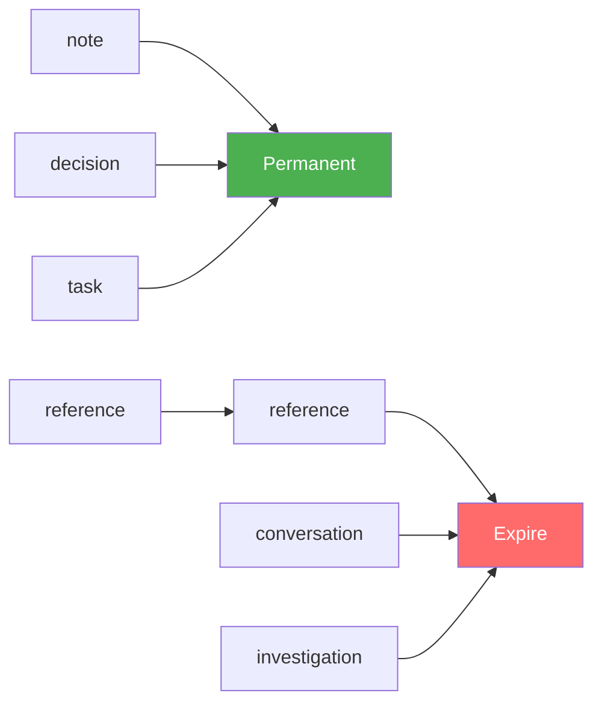

| Type | Description | Duration |
|------|-------------|----------|
| `note` | Observations générales | 30 jours |
| `decision` | Décisions d'architecture | Permanent |
| `task` | TODO items | Jusqu'à complétion |
| `reference` | Liens documentation | 90 jours |
| `conversation` | Contexte dialogue | 14 jours |
| `investigation` | Résultats debug | 45 jours |

### Décay Configuration

Chaque tag peut avoir une configuration de decay:

| Config | Type | Description |
|--------|------|-------------|
| `decay_rate` | float | Décroissance exponentielle (0.0 = permanent) |
| `priority_boost` | float | Boost de score (+important, -dépriorisé) |
| `auto_consolidate_threshold` | int | Seuil pour consolidation auto |

### Cycle de Vie

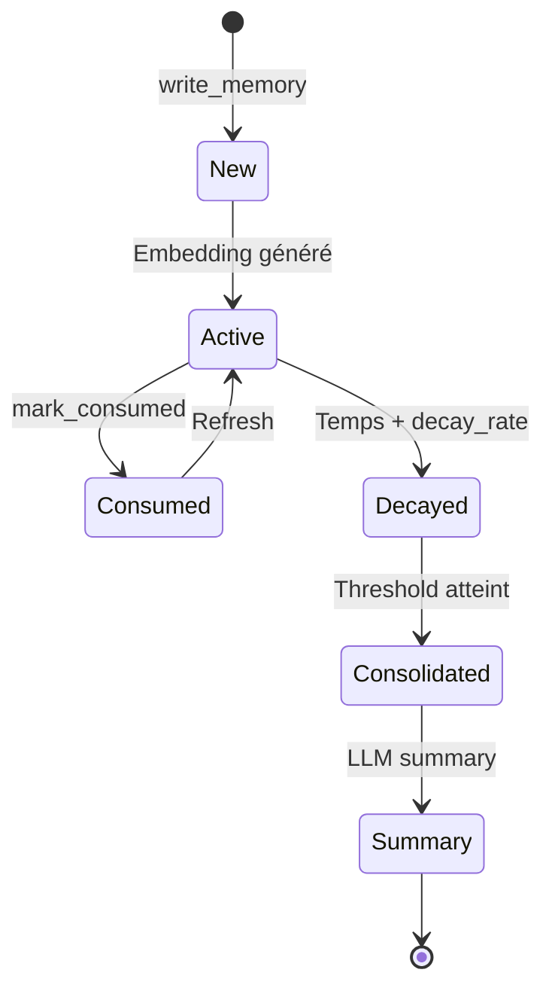

### Consolidation

Quand `sys:history` > 20, les 10 plus anciennes mémoires sont consolidées:

1. Rechercher les 10 plus anciennes `sys:history`
2. Générer summary via LLM
3. Créer nouvelle mémoire `sys:history:summary`
4. Soft-delete des sources

---

## Graphe de Code

Le graphe de code représente les dépendances entre fonctions, classes, et modules.

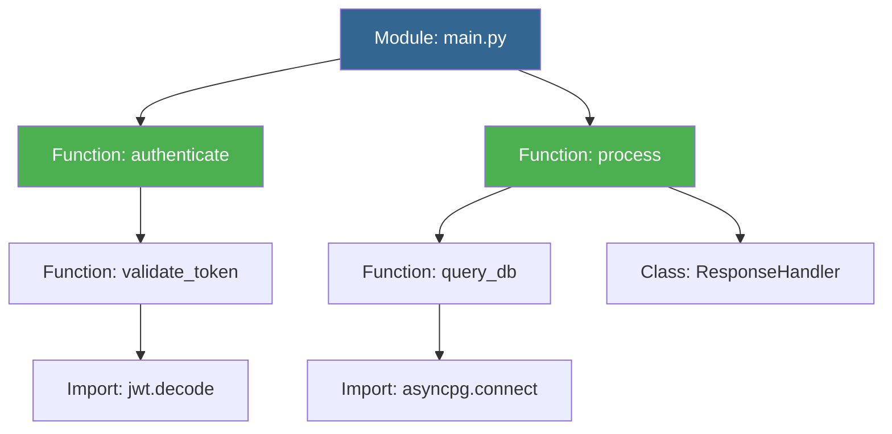

### Types de Nœuds

| Type | Description |
|------|-------------|
| `function` | Fonction ou méthode |
| `class` | Classe ou interface |
| `module` | Fichier/module Python |
| `import` | Import externe |

### Types d'Arêtes

| Type | Description |
|------|-------------|
| `calls` | Fonction appelle une autre |
| `imports` | Module importe un autre |
| `inherits` | Classe hérite d'une autre |
| `contains` | Module contient une fonction |

### Traversal

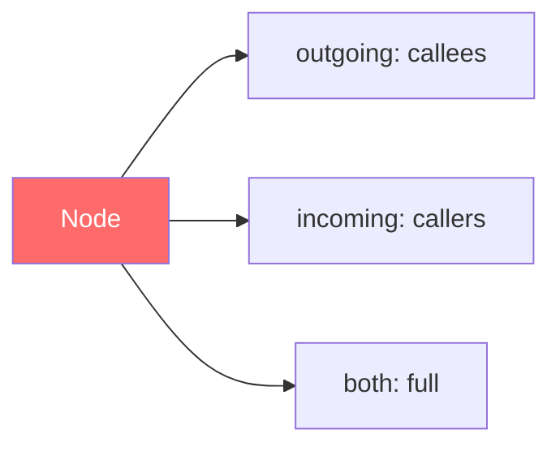

### Path Finding (BFS)

Trouve le chemin le plus court entre deux nœuds:

```python
find_path(source_id, target_id, max_depth=5)
# → ["node1", "node2", "node3"]
```

---

## Cache Triple-Layer

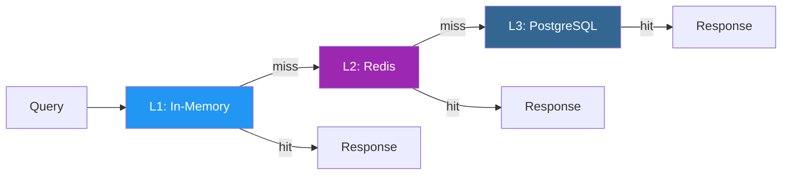

| Layer | Technologie | Latence | Scope |
|-------|-------------|---------|-------|
| L1 | In-Memory (dict) | ~1ms | Per-process |
| L2 | Redis | ~10ms | Distributed |
| L3 | PostgreSQL | ~50ms | Persistent |

### Cache Keys

```
memory:{id}           → Memory full content
search:{hash}         → Search results
graph:{repo}:{id}     → Graph data
index:{repo}:{file}   → Indexing status
```

---

## Schéma Base de Données

### memories

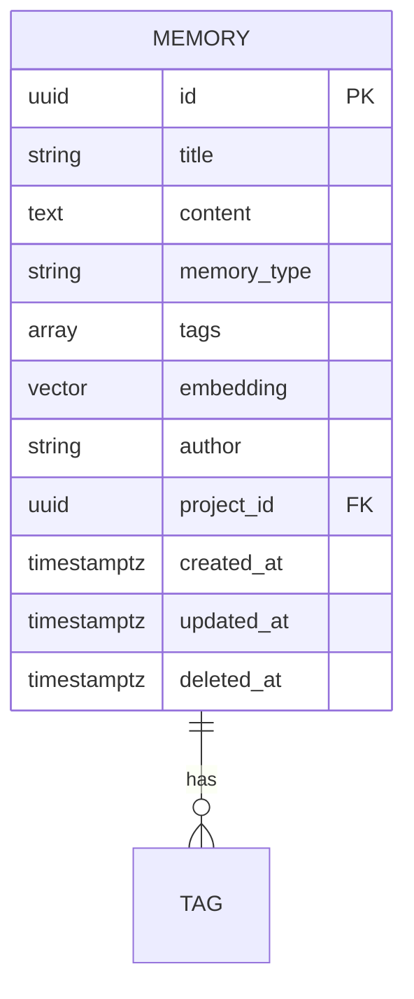

### code_chunks

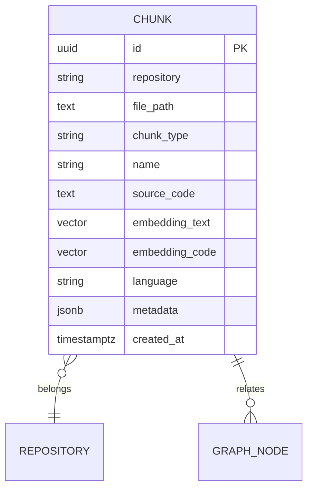

### graph_nodes

| Champ | Type | Description |
|-------|------|-------------|
| id | UUID | Primary key |
| repository | VARCHAR | Repository name |
| node_type | VARCHAR | function, class, module |
| name | VARCHAR | Node name |
| file_path | TEXT | File location |
| metadata | JSONB | Extra data |

### graph_edges

| Champ | Type | Description |
|-------|------|-------------|
| id | UUID | Primary key |
| source_id | UUID | Source node FK |
| target_id | UUID | Target node FK |
| edge_type | VARCHAR | calls, imports, inherits |

---

## Protocole MCP

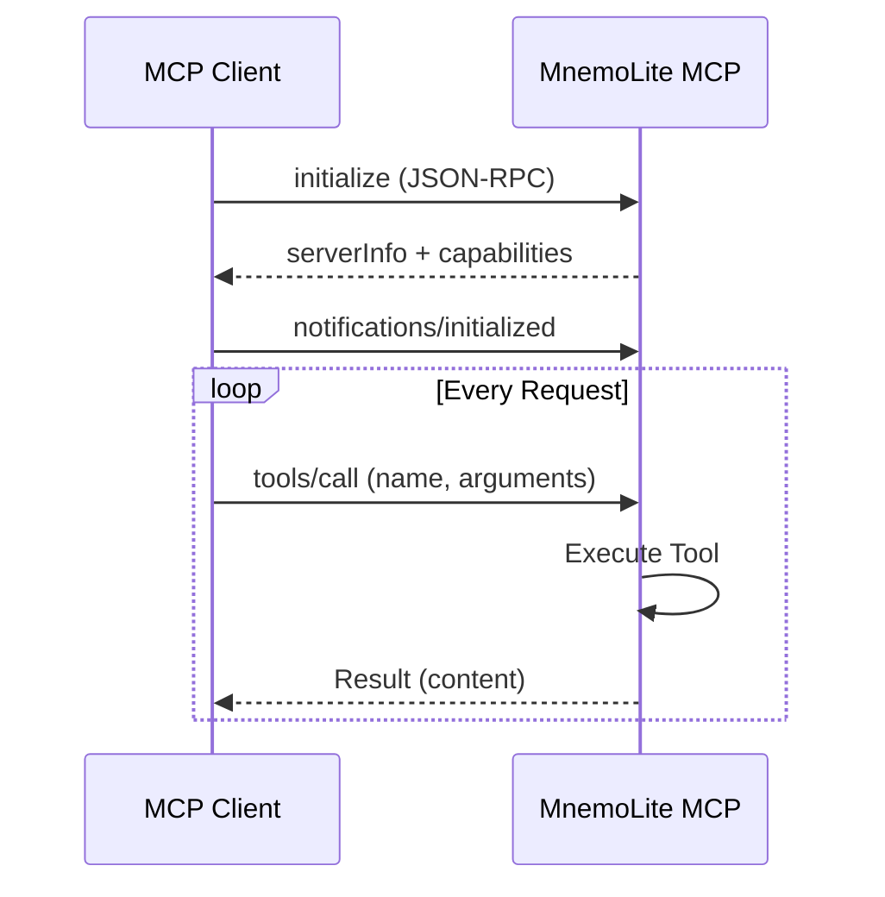

### 33 Outils MCP

| Catégorie | Nombre | Outils |
|----------|--------|--------|
| **Memory** | 9 | write, read, update, delete, search, snapshot, mark_consumed, consolidate, configure_decay |
| **Indexing** | 7 | index_project, index_incremental, index_markdown, reindex_file, get_status, get_errors, retry |
| **Code Search** | 1 | search_code |
| **Analytics** | 4 | get_indexing_stats, get_memory_health, get_cache_stats, clear_cache |
| **Graph** | 4 | get_graph_stats, traverse_graph, find_path, get_module_data |
| **Project** | 2 | switch_project, ping |

### Configuration Client

**KiloCode / OpenCode:**
```json
{
  "mcpServers": {
    "mnemolite": {
      "url": "http://localhost:8002/mcp"
    }
  }
}
```

---

## Déploiement

### Docker Compose

```yaml
services:
  api:
    image: mnemolite/api
    ports: ["8001:8001"]

  mcp:
    image: mnemolite/mcp
    ports: ["8002:8002"]

  postgres:
    image: postgres:18
    environment:
      POSTGRES_DB: mnemolite
      POSTGRES_EXTENSIONS: vector pg_trgm pg_partman

  redis:
    image: redis:7-alpine

  frontend:
    image: mnemolite/frontend
    ports: ["3000:3000"]
```

### Variables d'Environnement

| Variable | Défaut | Description |
|----------|--------|-------------|
| DATABASE_URL | postgresql://... | PostgreSQL connection |
| REDIS_URL | redis://localhost:6379 | Redis connection |
| MCP_PORT | 8002 | MCP server port |
| API_PORT | 8001 | API server port |
| EMBEDDING_MODEL | nomic-ai/nomic-embed-text-v1.5 | TEXT embedding model |
| CODE_EMBEDDING_MODEL | jinaai/jina-embeddings-v2-base-code | CODE embedding model |
| EMBEDDING_DIMENSION | 768 | Embedding dimension |

---

## Performance

| Métrique | Valeur |
|----------|--------|
| Latence search (cached) | <10ms |
| Latence search (uncached) | ~100ms |
| Vitesse indexation | ~5s/fichier |
| Graphe traversal (3 hops) | ~0.15ms |
| Cache hit rate | 80%+ |
| Mémoire embedding | ~1.6GB |

---

## License

MIT
