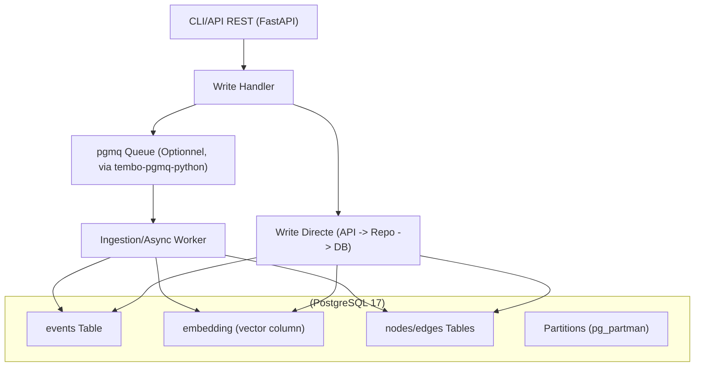
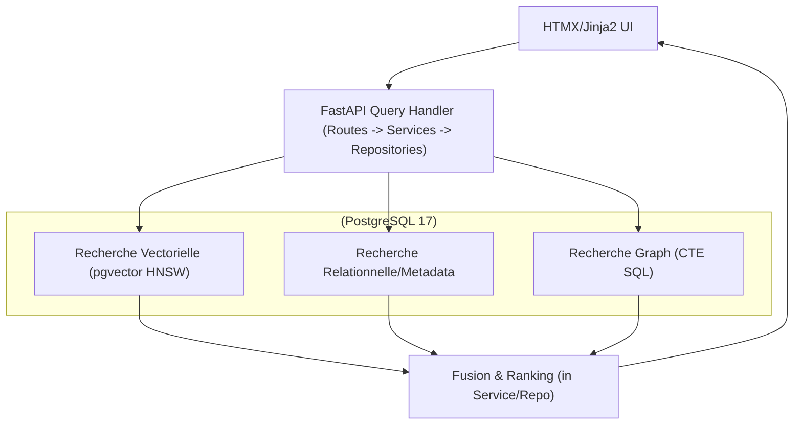
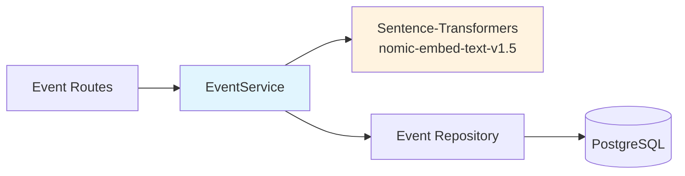
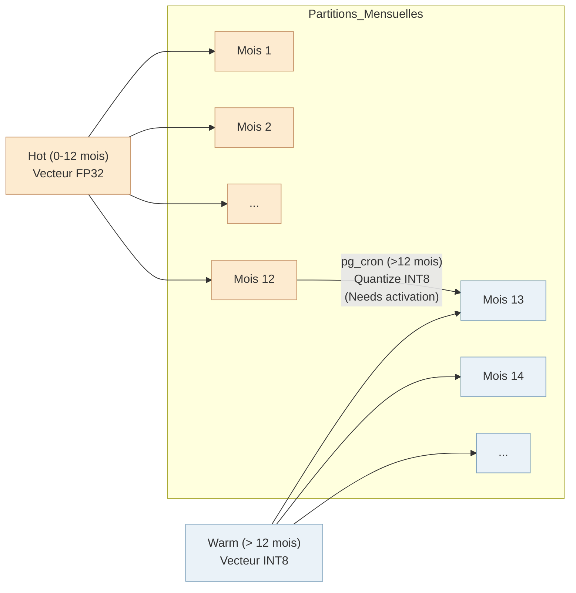

# MnemoLite – Document d'Architecture (ARCH) détaillé

**Version**: 1.2.0 (Aligné PFD 1.2.2 / PRD 1.0.2)
**Date**: 2025-10-12

## 1. Vue d'ensemble
MnemoLite adopte une architecture **CQRS cognitive et modulaire**, optimisée pour un déploiement local. Elle repose **exclusivement sur PostgreSQL 17** avec ses extensions pour gérer les aspects relationnels, vectoriels (`pgvector`), le partitionnement temporel (`pg_partman`), les tâches asynchrones (`pgmq` optionnel via lib Python) et le graphe relationnel (tables + CTE).
L'interface utilisateur Web utilise **FastAPI + HTMX** pour une expérience réactive sans SPA complexe.

---

## 2. Architecture logique détaillée

### Command Side (Écriture)

*Note: L'utilisation de `pgmq` et d'un worker est optionnelle pour un découplage asynchrone, l'écriture peut être directe depuis l'API via les repositories.* 

### Query Side (Lecture)

*Toutes les recherches (vectorielle, SQL, graphe) sont initiées par l'API et exécutées via les repositories directement dans PostgreSQL.*

### Couche Service et Auto-Embedding

**EventService** : Couche métier introduite pour orchestrer la création d'événements avec génération automatique d'embeddings.



**Fonctionnalités** :
- **Auto-génération d'embeddings** : Si aucun embedding n'est fourni dans la requête, EventService extrait automatiquement le texte depuis `content.text` (ou fields configurables) et génère un embedding 768-dim via Sentence-Transformers
- **Configuration flexible** :
  - `EMBEDDING_AUTO_GENERATE` : active/désactive la génération automatique (défaut: true)
  - `EMBEDDING_FAIL_STRATEGY` : `soft` (continue sans embedding) ou `hard` (échoue la création) (défaut: soft)
  - `EMBEDDING_SOURCE_FIELDS` : priorité des champs pour extraction de texte (défaut: `text,body,message,content,title`)
- **Fail-soft** : En cas d'échec de génération d'embedding, l'événement est créé sans embedding (si `fail_strategy=soft`)
- **Injection de dépendances** : EventService injecté via `Depends(get_event_service)` dans les routes

**Flux de création** :
```
POST /v1/events
  ↓
EventService.create_event()
  ↓ (si embedding absent)
EventService._extract_text_for_embedding()
  ↓
EmbeddingService.generate_embedding(text)
  ↓
EventRepository.add(event)
  ↓
PostgreSQL INSERT
```

---

## 3. Modèle de données PostgreSQL

### Table `events`
```sql
-- Aligned with docs/bdd_schema.md v1.2.x
CREATE TABLE IF NOT EXISTS events (
    id          UUID NOT NULL DEFAULT gen_random_uuid(),
    timestamp   TIMESTAMPTZ NOT NULL DEFAULT NOW(),
    content     JSONB NOT NULL,             -- Contenu flexible: { "type": "prompt", ... } ou { "type": "decision", ... }
    embedding   VECTOR(768),                -- Embedding (nomic-embed-text-v1.5)
    metadata    JSONB DEFAULT '{}'::jsonb,  -- Tags, source, IDs, types, etc.
    -- Clé primaire composite, incluant la clé de partitionnement
    PRIMARY KEY (id, timestamp)
)
PARTITION BY RANGE (timestamp);

COMMENT ON TABLE events IS 'Table principale stockant tous les evenements atomiques (partitionnee par mois sur timestamp).';
COMMENT ON COLUMN events.content IS 'Contenu detaille de l evenement au format JSONB.';
COMMENT ON COLUMN events.embedding IS 'Vecteur semantique du contenu (dimension 768 pour nomic-embed-text-v1.5).';
COMMENT ON COLUMN events.metadata IS 'Metadonnees additionnelles (tags, IDs, types) au format JSONB.';

-- Index B-tree sur timestamp (clé de partitionnement), hérité par les partitions
CREATE INDEX IF NOT EXISTS events_timestamp_idx ON events (timestamp);

-- Index GIN sur metadata pour recherches flexibles, hérité par les partitions
CREATE INDEX IF NOT EXISTS events_metadata_gin_idx ON events USING GIN (metadata jsonb_path_ops);

-- NOTE IMPORTANTE sur l'index vectoriel (HNSW/IVFFlat):
-- Il DOIT etre cree sur chaque partition individuelle, PAS sur la table mere.
-- Ceci est generalement gere via des hooks pg_partman ou des scripts de maintenance.
-- Exemple pour une partition 'events_pYYYY_MM':
-- CREATE INDEX CONCURRENTLY IF NOT EXISTS events_pYYYY_MM_embedding_hnsw_idx
-- ON events_pYYYY_MM USING hnsw (embedding vector_cosine_ops) WITH (m = 16, ef_construction = 64);
```
*Note: La gestion des index HNSW sur les partitions nécessite une attention particulière (ex: via les fonctions hook de `pg_partman`).* 

### Tables `nodes` et `edges` (pour le graphe)
```sql
-- Aligned with docs/bdd_schema.md v1.2.x
CREATE TABLE IF NOT EXISTS nodes (
    node_id         UUID PRIMARY KEY, -- Generalement un event.id, mais peut etre autre chose (concept genere)
    node_type       TEXT NOT NULL,    -- Ex: 'event', 'concept', 'entity', 'rule', 'document'
    label           TEXT,             -- Nom lisible pour affichage/requete
    properties      JSONB DEFAULT '{}'::jsonb, -- Attributs additionnels du nœud
    created_at      TIMESTAMPTZ DEFAULT NOW()
);
COMMENT ON TABLE nodes IS 'Noeuds du graphe conceptuel (evenements, concepts, entites).';

CREATE INDEX IF NOT EXISTS nodes_type_idx ON nodes(node_type);

CREATE TABLE IF NOT EXISTS edges (
    edge_id         UUID PRIMARY KEY DEFAULT gen_random_uuid(),
    source_node_id  UUID NOT NULL, -- Reference logique nodes.node_id
    target_node_id  UUID NOT NULL, -- Reference logique nodes.node_id
    relation_type   TEXT NOT NULL, -- Ex: 'causes', 'mentions', 'related_to', 'follows', 'uses_tool', 'part_of'
    properties      JSONB DEFAULT '{}'::jsonb, -- Poids, timestamp de la relation, etc.
    created_at      TIMESTAMPTZ DEFAULT NOW()
);
COMMENT ON TABLE edges IS 'Relations (aretes) entre les noeuds du graphe conceptuel.';
COMMENT ON COLUMN edges.source_node_id IS 'ID du noeud source (pas de FK physique).';
COMMENT ON COLUMN edges.target_node_id IS 'ID du noeud cible (pas de FK physique).';

CREATE INDEX IF NOT EXISTS edges_source_idx ON edges(source_node_id);
CREATE INDEX IF NOT EXISTS edges_target_idx ON edges(target_node_id);
CREATE INDEX IF NOT EXISTS edges_relation_type_idx ON edges(relation_type);
```
*Note: La création des nœuds et des arêtes est gérée par la logique applicative. Pas de contraintes FK physiques sur edges pour flexibilité; cohérence gérée par l'application ou des checks périodiques.*

### Autres tables (optionnelles)
*   `memory_types`, `event_types` : Pourraient être créées pour standardiser les types via clés étrangères si le besoin se confirme (actuellement géré via `metadata`).
*   Tables de configuration (si la configuration via `.env` n'est pas suffisante).

### Partitionnement Mensuel avec `pg_partman`
*   La table `events` est partitionnée par `RANGE` sur `timestamp`.
*   `pg_partman` est configuré (`db/init/02-partman-config.sql`) pour créer automatiquement les partitions mensuelles (ex: `events_p2025_05`).
*   Une politique de rétention (`retention` dans `part_config`) peut être définie pour supprimer/détacher automatiquement les vieilles partitions (alternative au TTL par colonne).

---

## 4. Index vectoriel (`pgvector`)
*   **Stockage :** Directement dans la colonne `embedding VECTOR(768)` de la table `events` (ou ses partitions).
*   **Index :** **HNSW** (`USING hnsw`) est recommandé pour l'équilibre vitesse/précision. `vector_cosine_ops` ou `vector_l2_ops` selon la métrique de distance utilisée par le modèle d'embedding.
*   **Gestion sur partitions :** L'index HNSW doit être créé sur **chaque partition**. L'utilisation des fonctions `run_maintenance_proc()` de `pg_partman` avec des scripts personnalisés ou des fonctions trigger est la méthode recommandée pour automatiser la création/maintenance des index sur les nouvelles partitions.
*   **Recherche :** Utilisation des opérateurs `<->` (distance L2), `<#>` (produit scalaire négatif), ou `<=>` (distance cosinus) dans les requêtes SQL via les méthodes du repository.

---

## 5. Graphe mnésique (Tables + CTE SQL)
*   **Modèle :** Graphe de propriétés stocké dans les tables `nodes` et `edges`.
*   **Création :** La logique applicative (potentiellement dans un service ou worker dédié) identifie les entités ou concepts dans les `events` et crée/lie les nœuds et arêtes correspondants.
*   **Interrogation :** Utilisation de **Common Table Expressions (CTE) récursives** en SQL pour explorer les relations sur une profondeur limitée (cible ≤ 3 sauts pour performance locale).
    ```sql
    -- Exemple : Trouver les événements causés par event_X (max 3 sauts)
    WITH RECURSIVE causal_chain AS (
        SELECT source_node_id, target_node_id, 1 AS depth
        FROM edges
        WHERE source_node_id = 'event_X_uuid' AND relation_type = 'causes'
        UNION ALL
        SELECT e.source_node_id, e.target_node_id, cc.depth + 1
        FROM edges e
        JOIN causal_chain cc ON e.source_node_id = cc.target_node_id
        WHERE cc.depth < 3 AND e.relation_type = 'causes'
    )
    SELECT target_node_id FROM causal_chain;
    ```
*   **Avantages :** Intégré à PostgreSQL, transactionnel, utilise SQL standard.
*   **Limitations :** Moins performant que les bases de données graphe dédiées pour des traversées très larges ou profondes, ou des algorithmes graphe complexes.

---

## 6. Cohérence & Cycle de vie des données (Local)

*   **Cohérence :** Assurée par les transactions PostgreSQL.
*   **Cycle de vie Hot/Warm simplifié :**
    *   **Partitionnement Mensuel :** Géré par `pg_partman`.
    *   **Hot (0-12 mois) :** Partitions récentes, vecteurs FP32.
    *   **Warm (> 12 mois) :** Vecteurs quantisés en **INT8** par un job `pg_cron` (à activer/configurer) pour économiser l'espace disque. Le job cible les partitions de plus de 12 mois.
    *   **Rétention :** Les vieilles partitions (> N mois/années, configurable dans `pg_partman`) peuvent être détachées ou supprimées pour gérer l'espace disque local.
    *   **Archivage Complexe Différé :** Pas d'étape Cold (JSON) ou Archive (S3) initialement.


*   **Auditabilité :** Via logs applicatifs et potentiellement triggers PG sur modifications.
*   **Monitoring Local :** Focus sur les logs PostgreSQL, `pg_stat_statements`, `pg_stat_activity`, et les outils système (`htop`, `iotop`). Option via endpoint `/metrics` Prometheus.

---

## 7. Déploiement (Docker Compose Local)
```yaml
# Extrait simplifié et aligné sur le docker-compose.yml réel
# Voir docs/docker_setup.md pour la version complète et commentée
version: '3.8'

services:
  db:
    build: ./db # Contient FROM pgvector/pgvector:pg17 et installe partman
    container_name: mnemo-postgres
    restart: unless-stopped
    environment:
      POSTGRES_USER: ${POSTGRES_USER:-mnemo}
      POSTGRES_PASSWORD: ${POSTGRES_PASSWORD:-mnemopass}
      POSTGRES_DB: ${POSTGRES_DB:-mnemolite}
    volumes:
      - postgres_data:/var/lib/postgresql/data
      - ./db/init:/docker-entrypoint-initdb.d:ro # Scripts init SQL
    ports:
      - "127.0.0.1:${POSTGRES_PORT:-5432}:5432"
    healthcheck: # ... défini dans le fichier réel
      # ...
    # ... autres configs (command, shm_size, networks, logging)

  api:
    build: .
    container_name: mnemo-api
    restart: unless-stopped
    ports:
      - "127.0.0.1:${API_PORT:-8001}:8000"
    environment:
      DATABASE_URL: "postgresql+asyncpg://${POSTGRES_USER:-mnemo}:${POSTGRES_PASSWORD:-mnemopass}@db:5432/${POSTGRES_DB:-mnemolite}"
      # ... autres env vars
    depends_on:
      db:
        condition: service_healthy
    volumes:
      - ./api:/app # Montage pour dev
      # ... autres volumes (certs, tests, scripts)
    # ... autres configs (networks, logging, healthcheck)

  worker:
    build: .
    container_name: mnemo-worker
    restart: unless-stopped
    environment:
      DATABASE_URL: "postgresql://${POSTGRES_USER:-mnemo}:${POSTGRES_PASSWORD:-mnemopass}@db:5432/${POSTGRES_DB:-mnemolite}"
      # ... autres env vars
    depends_on:
      db:
        condition: service_healthy
    volumes:
      - ./workers:/app
      # ... autres volumes (certs)
    # ... autres configs (networks, logging)

volumes:
  postgres_data:

networks:
  # ... (frontend, backend)

```
*Note : L'image Docker PostgreSQL (`db/Dockerfile`) doit inclure les extensions `pgvector` et `pg_partman`. `pgmq` est une dépendance Python (`tembo-pgmq-python`) utilisée par le worker, pas une extension PG à installer ici.*

---

## 8. Risques & Mitigations (Local)

| Risque                        | Impact   | Mitigation                            |
|-------------------------------|----------|----------------------------------------|
| Recall↓ après INT8 quant.     | Moyen    | Validation locale (cible ≥ 92%)        |
| Graphe CTE lent (> 3 sauts)   | Faible   | Confirmer besoin vs perf. locale      |
| **Sauvegarde locale échoue**  | **Élevé**| Script `pg_dump` robuste, tests réguliers |
| Performance locale dégrade    | Moyen    | Monitoring PG stats, optimisation conf |
| Gestion index sur partitions  | Moyen    | Automatisation via `pg_partman` hooks |
| Espace disque local insuffisant| Moyen    | Politique de rétention `pg_partman` agressive |
| `pg_cron` non activé/configuré | Moyen    | Ajouter procédure d'activation/test |

---

## 9. Performances attendues (Local)

*   **Recherche Vectorielle (Hot, k=10) :** ≤ 10 ms p95 (cible sur 10M vecteurs locaux).
*   **Recherche Vectorielle (Warm, k=10) :** ≤ 30 ms p95 (estimation après quantization).
*   **Requêtes Graphe (CTE ≤ 3 sauts) :** Variable, mais cible < 100ms sur données locales typiques.
*   **Ingestion :** Dépend si directe ou via worker/pgmq, mais plusieurs centaines d'événements/sec devraient être atteignables localement.
*   **Optimisations clés :** Tuning `postgresql.conf` pour la RAM locale, paramètres HNSW (`ef_search`), batching côté application si nécessaire.

---

## 10. Structure du projet (Alignée)
```
mnemo-lite/
├── api/                # Code FastAPI (inclut /templates pour HTMX et /services, /routes, /models)
│   ├── Dockerfile
│   ├── requirements.txt
│   ├── main.py
│   ├── dependencies.py
│   ├── db/             # Repositories SQLAlchemy Core
│   ├── interfaces/     # Interfaces (protocoles)
│   ├── models/
│   ├── routes/
│   ├── services/       # Services métier (event_service.py, embedding_service.py, etc.)
│   │   ├── event_service.py                        # Orchestration événements + auto-embedding
│   │   ├── sentence_transformer_embedding_service.py  # Embeddings locaux (nomic-embed-text-v1.5)
│   │   ├── embedding_service.py                    # Mock embeddings (dev/test)
│   │   ├── memory_search_service.py
│   │   └── ...
│   └── templates/      # Templates Jinja2/HTMX
├── db/                 # Configuration et initialisation PostgreSQL
│   ├── Dockerfile
│   └── init/           # Scripts SQL d'initialisation (01-extensions, 01-init, 02-partman-config)
├── workers/            # Workers asynchrones (ex: ingestion, PGMQ consumers)
│   ├── Dockerfile
│   ├── requirements.txt
│   ├── worker.py       # Potentiel point d'entrée
│   ├── tasks/          # Logique des tâches
│   └── config/         # Configuration spécifique worker (si besoin, sinon via env)
├── docs/               # Documentation (PFD, PRD, ARCH...)
├── scripts/            # Utilitaires (seed data, bench)
├── tests/              # Tests automatisés (pytest)
├── certs/              # Certificats (si HTTPS local)
├── .env.example
├── .gitignore
├── docker-compose.yml
├── Makefile
└── README.md
```
*Note: Le worker de synchronisation PG->Chroma (`sync.py`) n'est plus nécessaire.* 
*Note: Structure basée sur les listings et les conventions FastAPI/Docker. L'ancienne `ui/` est intégrée dans `api/templates/`. `api/db` contient les repositories.*

---

## 11. Intégration avec Expanse
*La bibliothèque client Python (`mnemo_client.py`) reste valide car elle interagit avec l'API FastAPI, qui abstrait la base de données.* 
*L'exemple d'intégration `.mdc` reste valide.* 

---

## 12. Résilience et reprise après incident (Local)
*   **Stratégie de Sauvegarde :** Focus sur **PostgreSQL**. Utilisation de `pg_dump` (logique) pour des sauvegardes régulières et/ou `pg_basebackup` + archivage WAL (physique) pour Point-in-Time Recovery. Stockage des sauvegardes sur un disque différent ou externe.
*   **Reprise :** Restauration standard PostgreSQL depuis les sauvegardes.
*   **Monitoring :** Alertes basées sur les logs ou des vérifications périodiques (espace disque, état des jobs `pg_cron`, erreurs PG).

---

## 13. Documentation associée
*Vérifier et mettre à jour les documents dans `docs/` (ex: `Specification_API.md`, `bdd_schema.md`) pour refléter l'architecture 100% PostgreSQL, PGMQ, etc.*

---

## 14. Évolutions futures
*Reste inchangé conceptuellement, mais l'implémentation se ferait dans l'écosystème PostgreSQL.* 

---

**Version**: 1.2.0
**Dernière mise à jour**: 2025-10-12
**Changements** : Ajout EventService + auto-embedding (nomic-embed-text-v1.5), fix health check DSN
**Auteur**: Giak

