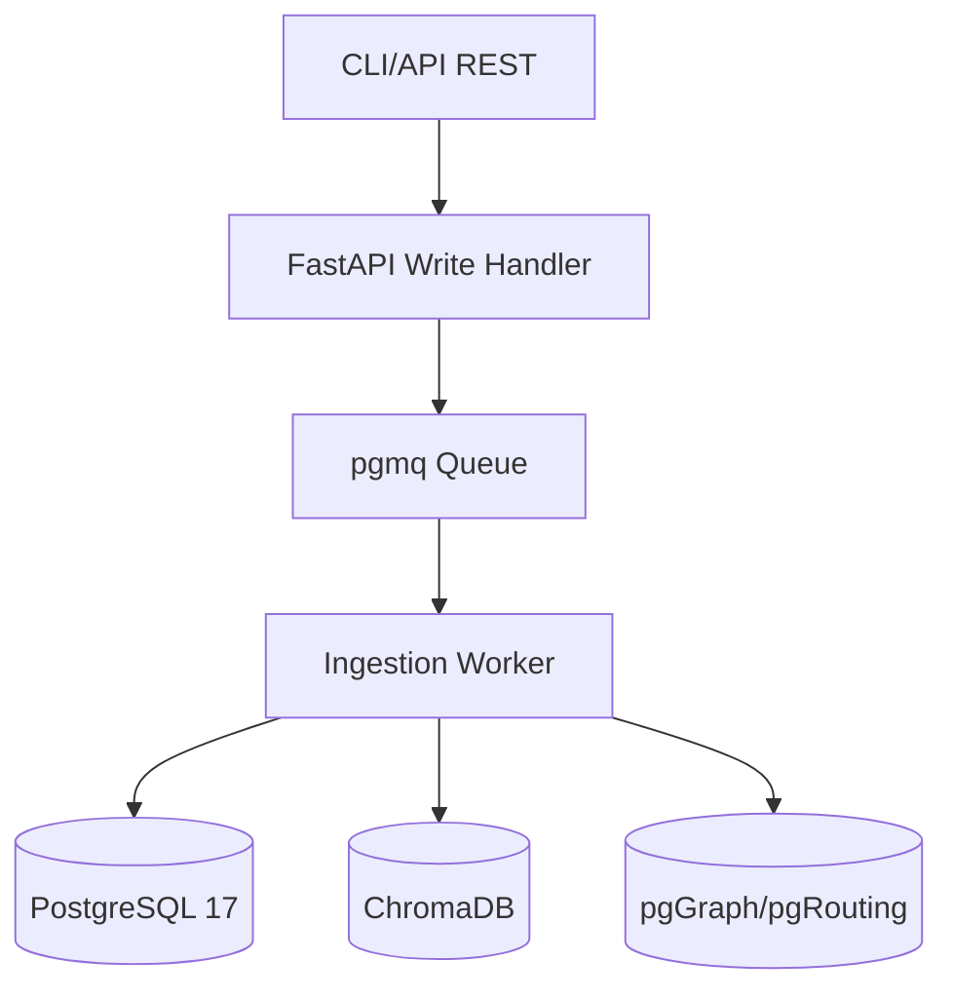
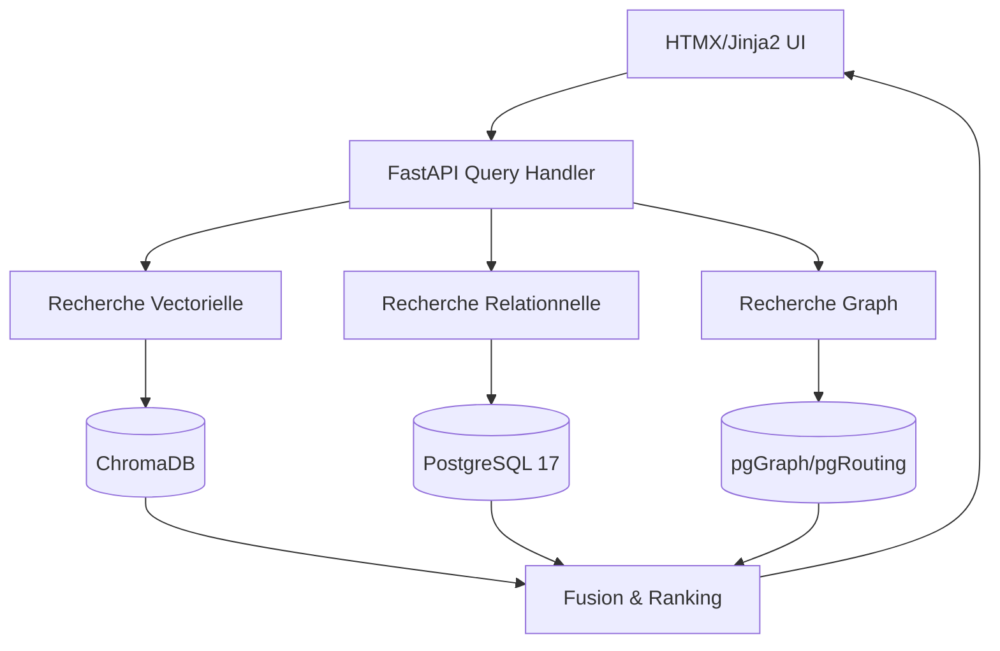
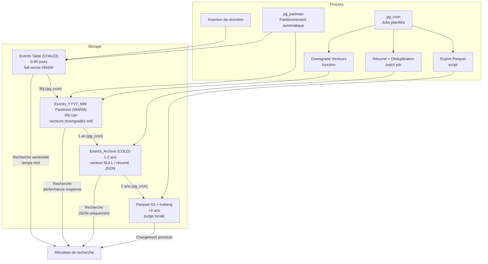

# MnemoLite – Document d'Architecture (ARCH) détaillé

**Version**: 1.0.0  
**Date**: 2025-04-24

## 1. Vue d'ensemble
MnemoLite adopte une architecture **CQRS cognitive et modulaire** divisée en deux parties : une **Command Side** pour l'ingestion des données et une **Query Side** pour leur interrogation. Elle combine :
- PostgreSQL 17 avec `pgvector`, `pgmq`, `pg_partman` et `pgGraph/pgRouting` pour les aspects relationnels, vectoriels, temporels et graphiques.
- ChromaDB pour l'indexation vectorielle à haute performance.
- FastAPI + HTMX pour une interface utilisateur sans SPA.

---

## 2. Architecture logique détaillée

### Command Side (Écriture)


### Query Side (Lecture)


---

## 3. Modèle SQL intégré

### Table `events`
```sql
CREATE TABLE events (
  id UUID PRIMARY KEY DEFAULT gen_random_uuid(),
  timestamp TIMESTAMPTZ NOT NULL,
  expiration TIMESTAMPTZ,
  memory_type TEXT REFERENCES memory_types(code),
  event_type TEXT REFERENCES event_types(code),
  role_id INTEGER REFERENCES roles(id),
  content JSONB NOT NULL,
  embedding VECTOR(1536),
  metadata JSONB DEFAULT '{}'
);
CREATE INDEX ON events(timestamp);
CREATE INDEX ON events USING hnsw(embedding);
```

### Table `roles`
```sql
CREATE TABLE roles (
  id SERIAL PRIMARY KEY,
  role_name TEXT UNIQUE NOT NULL
);
```

### Table `memory_types`
```sql
CREATE TABLE memory_types (
  code TEXT PRIMARY KEY,
  label TEXT NOT NULL,
  description TEXT
);
```

### Table `event_types`
```sql
CREATE TABLE event_types (
  code TEXT PRIMARY KEY,
  label TEXT NOT NULL,
  description TEXT
);
```

### Table `relations`
```sql
CREATE TABLE relations (
  id UUID PRIMARY KEY DEFAULT gen_random_uuid(),
  source_id UUID REFERENCES events(id),
  target_id UUID REFERENCES events(id),
  relation_type TEXT CHECK (relation_type IN ('causes', 'depends_on', 'relates_to')),
  created_at TIMESTAMPTZ DEFAULT NOW()
);
CREATE INDEX ON relations(source_id);
CREATE INDEX ON relations(target_id);
```

### Table `sequences` & `sequence_events`
```sql
CREATE TABLE sequences (
  id UUID PRIMARY KEY DEFAULT gen_random_uuid(),
  name TEXT NOT NULL,
  description TEXT,
  created_at TIMESTAMPTZ DEFAULT NOW()
);

CREATE TABLE sequence_events (
  sequence_id UUID REFERENCES sequences(id),
  event_id UUID REFERENCES events(id),
  position INTEGER NOT NULL,
  PRIMARY KEY (sequence_id, event_id)
);
```

### Table `events_archive`
```sql
CREATE TABLE events_archive (
  LIKE events INCLUDING ALL,
  archived_at TIMESTAMPTZ DEFAULT NOW()
);
```

### Vue matérialisée (optionnelle)
```sql
CREATE MATERIALIZED VIEW active_memories AS
SELECT * FROM events WHERE expiration IS NULL OR expiration > NOW();
```

### Partitionnement mensuel (optionnel)
```sql
-- via pg_partman ou manuellement
CREATE TABLE events_2024_04 PARTITION OF events
FOR VALUES FROM ('2024-04-01') TO ('2024-05-01');
```

### Index complémentaires recommandés
```sql
CREATE INDEX ON events ((metadata->>'rule_id'));
CREATE INDEX ON events ((metadata->>'session_id'));
CREATE INDEX ON events ((metadata->>'source_file'));
```

---

## 4. Index vectoriel (ChromaDB)
- Collection : `mnemo_embeddings`
- Index : HNSW, top_k paramétrable
- Clé : `id` UUID synchronisé avec PostgreSQL
- Métadonnées : JSON valide (schéma typé)
- Fallback : lecture depuis PostgreSQL si Chroma indisponible

---

## 5. Graphe mnésique (pgGraph/pgRouting + tables d'adjacence)

- Tables : `edge_relations(src_id, dst_id, type, props JSONB, created_at)` 
- Vues : `memory_graph_view AS SELECT...`
- Algorithmes : `pgRouting` pour chemin optimal, centralité, clustering
- Avantages : 0 dépendance externe, réutilise SQL, fenêtre analytique

---

## 6. Cohérence & robustesse

| Élément       | Mécanisme                                  |
|---------------|---------------------------------------------|
| UID partagé   | UUID PostgreSQL ↔ Chroma                   |
| TTL mémoire   | `expiration TIMESTAMPTZ` + archive         |
| Auditabilité  | Historique + projection + archivage        |
| Monitoring    | Prometheus + logs ingestion/indexation     |

### 6.1 Stratégie d'archive/TTL avec pg_partman + pg_cron

| Période mémoire | Stockage | Politique TTL | Action batch |
|----------------|----------|---------------|--------------|
| 0–90 j | events table (chaud) | aucune | full-vector HNSW |
| > 90 j ≤ 1 an | events_YYYY_MM partitions (warm) | vecteurs downgradés int8 | still searchable |
| > 1 an | events_archive (cold, SSD slow) | vecteur NULL / résumé JSON | résumé + dédup |
| > 2 ans | Parquet S3 + Iceberg | purge locale | chargement ponctuel |



---

## 7. Déploiement (Docker Compose)
```yaml
version: '3.8'
services:
  db:
    image: postgres:17
    ports:
      - "5432:5432"
  chroma:
    image: chromadb/chroma
    ports:
      - "8000:8000"
  app:
    build: ./backend
    ports:
      - "8001:8000"
    depends_on:
      - db
      - chroma
  worker:
    build: ./workers
    depends_on:
      - db
      - chroma
```

---

## 8. Risques & Mitigations

| Risque                        | Impact   | Mitigation                            |
|-------------------------------|----------|----------------------------------------|
| Incohérence multi-base        | Élevé    | Monitoring UID + réplication logique   |
| Dérive mémoire                | Moyen    | TTL + vue active + partition mensuelle |
| Requêtes graph trop lentes    | Faible   | Index graph + fenêtres analytiques SQL |

---

## 9. Performances attendues

### 9.1 Métriques de performances

| Métrique                           | Valeur cible        | Méthode de mesure    |
|-----------------------------------|---------------------|----------------------|
| Taux de récupération cohérente    | ≥ 99%               | Tests unitaires      |
| Latence de recherche (k=10)       | ≤ 10 ms P95         | bench_httpx          |
| Latence couche Hot (0-90j)        | ≤ 5 ms P95          | prometheus           |
| Latence couche Warm (90j-1an)     | ≤ 30 ms P95         | prometheus           |
| Latence couche Cold (1-2ans)      | ≤ 100 ms P95        | prometheus           |
| Throughput ingestion              | ≥ 500 events/sec    | bench_load           |
| Empreinte mémoire (1M vecteurs)   | < 2.5 GB            | htop + chroma stat   |
| Démarrage complet                 | < 3 min             | docker compose up    |

### 9.2 Optimisations clés

- Index HNSW paramétré (M=16, ef=128) pour équilibre précision/rapidité
- Verrouillage optimiste pour ingestion concurrente
- Batching automatique des opérations vectorielles
- Mise en cache sélective des embeddings fréquents
- Ranking multi-facteur pour les résultats (récence, pertinence, contexte)

---

## 10. Structure du projet

```
mnemo-lite/
├── api/                # Code FastAPI et endpoints
│   ├── routes/         # Définition des routes
│   ├── models/         # Modèles Pydantic
│   └── services/       # Logique métier
├── db/                 # Schémas et migrations
│   ├── migrations/     # Versions de schéma (Alembic)
│   ├── schema.sql      # Schéma principal
│   └── seeds/          # Données initiales
├── workers/            # Workers d'ingestion et maintenance
│   ├── ingestion.py    # Worker d'ingestion (pgmq)
│   ├── archive.py      # Worker d'archivage
│   └── sync.py         # Worker de synchronisation PG→Chroma
├── ui/                 # Interface utilisateur
│   ├── templates/      # Templates HTMX/Jinja2
│   ├── static/         # Assets statiques (CSS, JS minimal)
│   └── components/     # Composants réutilisables
├── docs/               # Documentation
├── scripts/            # Utilitaires et helpers
└── tests/              # Tests automatisés
```

---

## 11. Intégration avec Expanse

### 11.1 Bibliothèque d'intégration Python

```python
# mnemo_client.py - Intégration en < 20 lignes
import httpx
from typing import Dict, List, Optional

class MnemoClient:
    def __init__(self, base_url: str = "http://localhost:8001/v1"):
        self.base_url = base_url
        self.client = httpx.AsyncClient(timeout=30.0)
    
    async def store_memory(self, content: Dict, memory_type: str, 
                           metadata: Optional[Dict] = None) -> str:
        """Stocke un souvenir et retourne son UID"""
        response = await self.client.post(f"{self.base_url}/events", 
                                         json={"content": content, 
                                               "memory_type": memory_type,
                                               "metadata": metadata or {}})
        return response.json()["id"]
    
    async def recall(self, query: str, top_k: int = 5, 
                    filters: Optional[Dict] = None) -> List[Dict]:
        """Recherche des souvenirs similaires"""
        params = {"q": query, "top_k": top_k}
        if filters:
            params.update(filters)
        response = await self.client.get(f"{self.base_url}/search", params=params)
        return response.json()["data"]
```

### 11.2 Exemple d'intégration avec règles .mdc

```python
# Dans expanse/rules/memory_manager.py
from mnemo_client import MnemoClient

async def store_decision(rule_id: str, decision: str, context: Dict):
    """Stocke une décision prise par une règle dans MnemoLite"""
    client = MnemoClient()
    await client.store_memory(
        content={"decision": decision, "context": context},
        memory_type="episodic",
        metadata={"rule_id": rule_id, "decision_type": "agent_action"}
    )
```

---

## 12. Résilience et reprise après incident

### 12.1 Stratégies de sauvegarde

| Composant | Méthode | Fréquence | Rétention |
|-----------|---------|-----------|-----------|
| PostgreSQL | pg_dump + sauvegarde WAL | Quotidienne + WAL continu | 30 jours |
| ChromaDB | Export collections | Quotidienne | 7 jours |
| Configuration | Git + dépôt privé | À chaque changement | Illimité |

### 12.2 Mécanismes de reprise

- **Défaillance PostgreSQL** : Restauration depuis pg_dump + WAL jusqu'au dernier LSN
- **Défaillance ChromaDB** : Re-synchronisation complète depuis PostgreSQL
- **Incohérence détectée** : Job de réconciliation automatique (checksums UID + échantillonnage)
- **Corruption de données** : Régénération des vecteurs depuis contenu texte

### 12.3 Monitoring et alertes

- Métriques Prometheus exposées sur `/metrics`
- Alertes configurables sur:
  - Taux d'erreur synchronisation PG↔Chroma > 0.1%
  - Latence requêtes vectorielles > 50ms P95
  - Taux de croissance anormal > 200% quotidien
  - Incohérence détectée lors du job de réconciliation

---

## 13. Documentation associée

### 13.1 Documentation technique

| Document | Contenu | Public cible |
|----------|---------|--------------|
| `SCHEMA.md` | Documentation détaillée du schéma SQL | Développeurs |
| `API.md` | Spécification OpenAPI 3.1 des endpoints | Intégrateurs |
| `WORKERS.md` | Architecture et configuration des workers | DevOps |
| `UPGRADE.md` | Procédure de migration entre versions | Admin Système |

### 13.2 Documentation utilisateur

| Document | Contenu | Public cible |
|----------|---------|--------------|
| `USER.md` | Manuel d'utilisation de l'interface | Utilisateurs |
| `SEARCH.md` | Guide des requêtes et filtres avancés | Analystes |
| `PSI_GUIDE.md` | Guide des requêtes réflexives Ψ | Chercheurs IA |
| `INTEGRATION.md` | Guide d'intégration avec Expanse | Développeurs |

---

## 14. Évolutions futures
- Mémoire prospective avec planificateur
- Graphe sémantique auto-apprenant
- Visualisation mnésique interactive

---

**Version**: 1.0.0  
**Dernière mise à jour**: 2025-04-24  
**Auteur**: Giak

