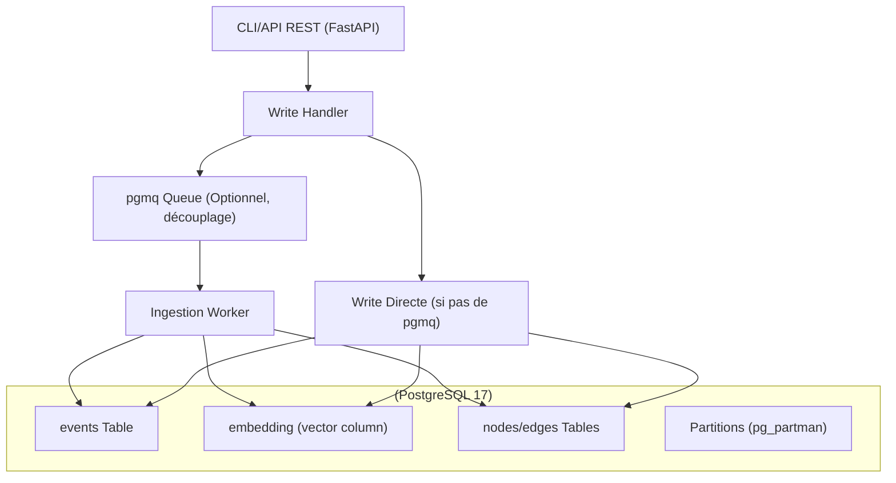
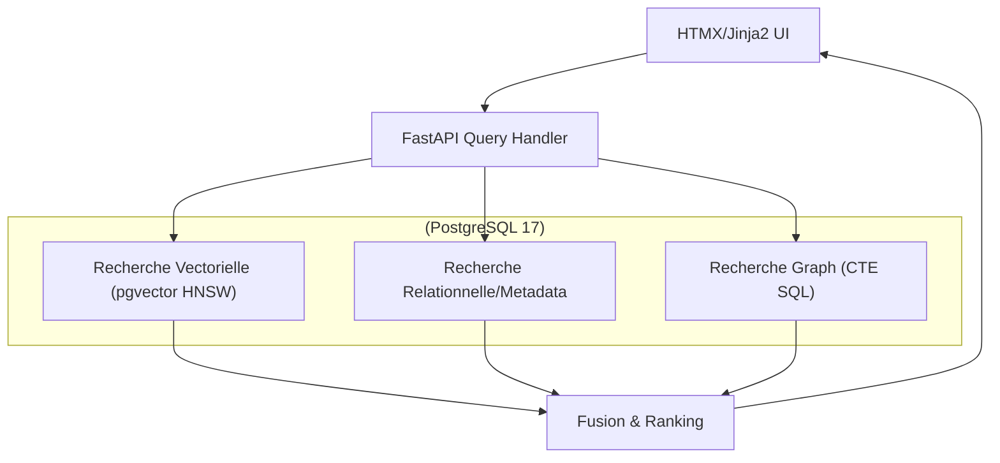
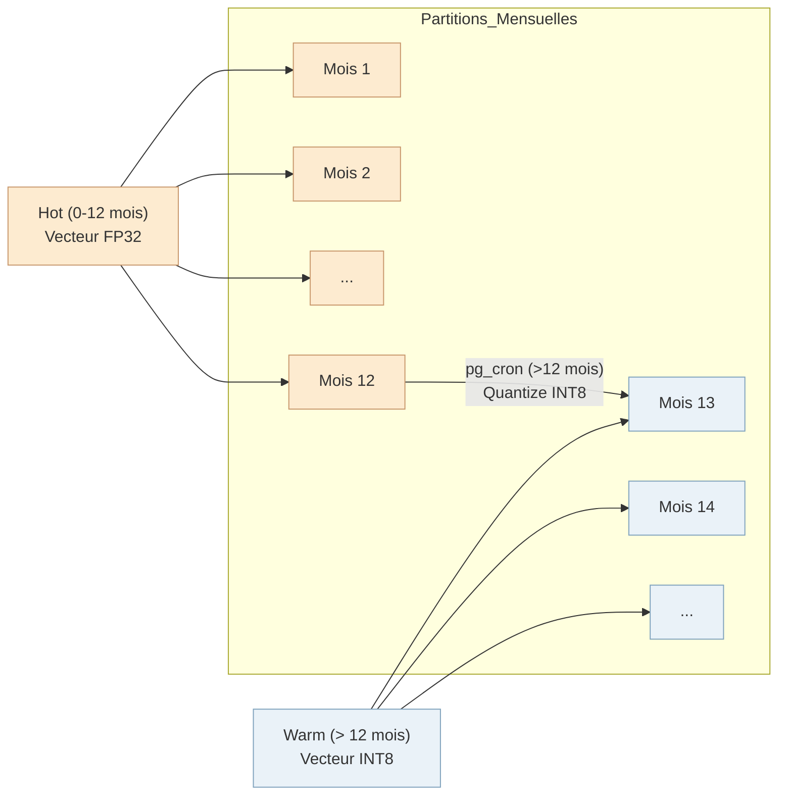

# MnemoLite – Document d'Architecture (ARCH) détaillé

**Version**: 1.1.0 (Aligné PFD 1.2.1 / PRD 1.0.1)
**Date**: 2025-04-26

## 1. Vue d'ensemble
MnemoLite adopte une architecture **CQRS cognitive et modulaire**, optimisée pour un déploiement local. Elle repose **exclusivement sur PostgreSQL 17** avec ses extensions pour gérer les aspects relationnels, vectoriels (`pgvector`), le partitionnement temporel (`pg_partman`), les tâches asynchrones (`pgmq` optionnel) et le graphe relationnel (tables + CTE).
L'interface utilisateur Web utilise **FastAPI + HTMX** pour une expérience réactive sans SPA complexe.

---

## 2. Architecture logique détaillée

### Command Side (Écriture)

*Note: L'utilisation de `pgmq` et d'un worker est optionnelle pour un déploiement local simple, l'écriture peut être directe.* 

### Query Side (Lecture)

*Toutes les recherches (vectorielle, SQL, graphe) sont effectuées directement dans PostgreSQL.* 

---

## 3. Modèle de données PostgreSQL

### Table `events`
```sql
CREATE TABLE events (
  id UUID PRIMARY KEY DEFAULT gen_random_uuid(),
  timestamp TIMESTAMPTZ NOT NULL DEFAULT NOW(),
  -- expiration TIMESTAMPTZ, -- Remplacé par partitionnement/TTL
  memory_type TEXT, -- Référence à une table `memory_types` si nécessaire
  event_type TEXT,  -- Référence à une table `event_types` si nécessaire
  -- role_id INTEGER, -- Simplifié, peut être dans metadata
  content JSONB NOT NULL, -- Contenu principal de l'événement
  embedding VECTOR(1536), -- Stockage direct du vecteur
  metadata JSONB DEFAULT '{}' -- Tags, sources, IDs externes, etc.
) PARTITION BY RANGE (timestamp);

-- Index principal pour recherche temporelle (automatique sur partition)
-- CREATE INDEX ON events(timestamp);

-- Index HNSW pour recherche vectorielle (sur chaque partition)
-- DO $$ BEGIN
--   EXECUTE format('CREATE INDEX ON %I USING hnsw (embedding vector_cosine_ops)', 'events_pYYYY_MM'); 
-- END $$;
-- (Nécessite gestion dynamique via pg_partman hooks ou manuelle)

-- Index sur metadonnées fréquentes
CREATE INDEX events_metadata_gin_idx ON events USING GIN (metadata jsonb_path_ops);
-- Ou index spécifiques si certains chemins sont très utilisés:
-- CREATE INDEX ON events ((metadata->>'rule_id'));
```
*Note: La gestion des index HNSW sur les partitions nécessite une attention particulière (ex: via les fonctions hook de `pg_partman`).* 

### Tables `nodes` et `edges` (pour le graphe)
```sql
CREATE TABLE nodes (
    node_id UUID PRIMARY KEY, -- Peut être event.id ou un ID dédié
    node_type TEXT NOT NULL, -- Ex: 'event', 'concept', 'entity'
    label TEXT,             -- Nom lisible
    properties JSONB DEFAULT '{}',
    created_at TIMESTAMPTZ DEFAULT NOW()
);
CREATE INDEX ON nodes(node_type);

CREATE TABLE edges (
    edge_id UUID PRIMARY KEY DEFAULT gen_random_uuid(),
    source_node_id UUID NOT NULL REFERENCES nodes(node_id) ON DELETE CASCADE,
    target_node_id UUID NOT NULL REFERENCES nodes(node_id) ON DELETE CASCADE,
    relation_type TEXT NOT NULL, -- Ex: 'causes', 'mentions', 'related_to'
    properties JSONB DEFAULT '{}',
    created_at TIMESTAMPTZ DEFAULT NOW()
);
CREATE INDEX ON edges(source_node_id);
CREATE INDEX ON edges(target_node_id);
CREATE INDEX ON edges(relation_type);
```
*Note: La création des nœuds et des arêtes est gérée par la logique applicative lors de l'ingestion des événements.* 

### Autres tables (optionnelles)
*   `memory_types`, `event_types` : Pour standardiser les types via clés étrangères.
*   Tables de configuration.

### Partitionnement Mensuel avec `pg_partman`
*   La table `events` est partitionnée par `RANGE` sur `timestamp`.
*   `pg_partman` est configuré pour créer automatiquement les partitions mensuelles (ex: `events_p2025_05`).
*   Une politique de rétention (`retention` dans `part_config`) peut être définie pour supprimer/détacher automatiquement les vieilles partitions (alternative au TTL par colonne).

---

## 4. Index vectoriel (`pgvector`)
*   **Stockage :** Directement dans la colonne `embedding VECTOR(1536)` de la table `events` (ou ses partitions).
*   **Index :** **HNSW** (`USING hnsw`) est recommandé pour l'équilibre vitesse/précision. `vector_cosine_ops` ou `vector_l2_ops` selon la métrique de distance utilisée par le modèle d'embedding.
*   **Gestion sur partitions :** L'index HNSW doit être créé sur chaque partition. L'utilisation des fonctions `run_maintenance_proc()` de `pg_partman` avec des scripts personnalisés est la méthode recommandée pour automatiser la création/maintenance des index sur les nouvelles partitions.
*   **Recherche :** Utilisation des opérateurs `<->` (distance L2), `<#>` (produit scalaire négatif), ou `<=>` (distance cosinus) dans les requêtes SQL.

---

## 5. Graphe mnésique (Tables + CTE SQL)
*   **Modèle :** Graphe de propriétés stocké dans les tables `nodes` et `edges`.
*   **Création :** La logique applicative identifie les entités ou concepts dans les `events` et crée/lie les nœuds et arêtes correspondants.
*   **Interrogation :** Utilisation de **Common Table Expressions (CTE) récursives** en SQL pour explorer les relations sur une profondeur limitée (cible ≤ 3 sauts pour performance locale).
    ```sql
    -- Exemple : Trouver les événements causés par event_X (max 3 sauts)
    WITH RECURSIVE causal_chain AS (
        SELECT source_node_id, target_node_id, 1 AS depth
        FROM edges
        WHERE source_node_id = 'event_X_uuid' AND relation_type = 'causes'
        UNION ALL
        SELECT e.source_node_id, e.target_node_id, cc.depth + 1
        FROM edges e
        JOIN causal_chain cc ON e.source_node_id = cc.target_node_id
        WHERE cc.depth < 3 AND e.relation_type = 'causes'
    )
    SELECT target_node_id FROM causal_chain;
    ```
*   **Avantages :** Intégré à PostgreSQL, transactionnel, utilise SQL standard.
*   **Limitations :** Moins performant que les bases de données graphe dédiées pour des traversées très larges ou profondes, ou des algorithmes graphe complexes.

---

## 6. Cohérence & Cycle de vie des données (Local)

*   **Cohérence :** Assurée par les transactions PostgreSQL.
*   **Cycle de vie Hot/Warm simplifié :**
    *   **Partitionnement Mensuel :** Géré par `pg_partman`.
    *   **Hot (0-12 mois) :** Partitions récentes, vecteurs FP32.
    *   **Warm (> 12 mois) :** Vecteurs quantisés en **INT8** par un job `pg_cron` pour économiser l'espace disque. Le job cible les partitions de plus de 12 mois.
    *   **Rétention :** Les vieilles partitions (> N mois/années, configurable dans `pg_partman`) peuvent être détachées ou supprimées pour gérer l'espace disque local.
    *   **Archivage Complexe Différé :** Pas d'étape Cold (JSON) ou Archive (S3) initialement.


*   **Auditabilité :** Via logs applicatifs et potentiellement triggers PG sur modifications.
*   **Monitoring Local :** Focus sur les logs PostgreSQL, `pg_stat_statements`, `pg_stat_activity`, et les outils système (`htop`, `iotop`).

---

## 7. Déploiement (Docker Compose Local)
```yaml
version: '3.8'
services:
  db:
    image: pgvector/pgvector:pg16 # Utiliser une image incluant pgvector
    # Ou image: postgres:17 + installation manuelle des extensions
    ports:
      - "5432:5432"
    environment:
      POSTGRES_DB: mnemo_db
      POSTGRES_USER: user
      POSTGRES_PASSWORD: password
      # Activer les extensions nécessaires au démarrage si possible
      # Ou utiliser un script d'initialisation
    volumes:
      - postgres_data:/var/lib/postgresql/data
      - ./db/init:/docker-entrypoint-initdb.d # Pour scripts SQL initiaux
    # Ajuster les ressources si nécessaire pour le local
    # mem_limit: 8g 
    # cpus: 4    
  app:
    build:
      context: .
      dockerfile: api/Dockerfile
    ports:
      - "8001:8000"
    environment:
      DATABASE_URL: postgresql://user:password@db:5432/mnemo_db
      # Autres variables d'environnement pour l'API
    depends_on:
      - db
  worker: # Optionnel, si pgmq est utilisé
    build:
      context: .
      dockerfile: workers/Dockerfile 
    environment:
      DATABASE_URL: postgresql://user:password@db:5432/mnemo_db
      # Autres variables d'environnement pour le worker
    depends_on:
      - db

volumes:
  postgres_data:
```
*Note : L'image Docker PostgreSQL doit inclure les extensions `pgvector`, `pg_partman`, `pgmq` ou celles-ci doivent être installées via un script d'initialisation.* 

---

## 8. Risques & Mitigations (Local)

| Risque                        | Impact   | Mitigation                            |
|-------------------------------|----------|----------------------------------------|
| Recall↓ après INT8 quant.     | Moyen    | Validation locale (cible ≥ 92%)        |
| Graphe CTE lent (> 3 sauts)   | Faible   | Confirmer besoin vs perf. locale      |
| **Sauvegarde locale échoue**  | **Élevé**| Script `pg_dump` robuste, tests réguliers |
| Performance locale dégrade    | Moyen    | Monitoring PG stats, optimisation conf |
| Gestion index sur partitions  | Moyen    | Automatisation via `pg_partman` hooks |
| Espace disque local insuffisant| Moyen    | Politique de rétention `pg_partman` agressive |

---

## 9. Performances attendues (Local)

*   **Recherche Vectorielle (Hot, k=10) :** ≤ 10 ms p95 (cible sur 10M vecteurs locaux).
*   **Recherche Vectorielle (Warm, k=10) :** ≤ 30 ms p95 (estimation après quantization).
*   **Requêtes Graphe (CTE ≤ 3 sauts) :** Variable, mais cible < 100ms sur données locales typiques.
*   **Ingestion :** Dépend si directe ou via worker/pgmq, mais plusieurs centaines d'événements/sec devraient être atteignables localement.
*   **Optimisations clés :** Tuning `postgresql.conf` pour la RAM locale, paramètres HNSW (`ef_search`), batching côté application si nécessaire.

---

## 10. Structure du projet (Simplifiée)
```
mnemo-lite/
├── api/                # Code FastAPI et endpoints
│   ├── routes/         # Définition des routes
│   ├── models/         # Modèles Pydantic
│   └── services/       # Logique métier (inclut recherche, graph)
├── db/                 # Schémas et config DB
│   ├── init/           # Scripts SQL d'initialisation (extensions, etc.)
│   ├── schema.sql      # Schéma principal (peut être généré)
│   └── partman_config/ # Configuration pg_partman
├── workers/            # Optionnel: Workers (pgmq, pg_cron jobs)
│   ├── ingestion.py    # Worker d'ingestion (si pgmq)
│   └── maintenance.py  # Scripts pour pg_cron (quantization, etc.)
├── ui/                 # Interface utilisateur HTMX/Jinja2
│   ├── templates/
│   └── static/
├── docs/               # Documentation (PFD, PRD, ARCH...)
├── scripts/            # Utilitaires (seed data, bench)
├── tests/              # Tests automatisés
├── Dockerfile.api
├── Dockerfile.worker   # Si applicable
├── docker-compose.yml
└── .env.example
```
*Note: Le worker de synchronisation PG->Chroma (`sync.py`) n'est plus nécessaire.* 

---

## 11. Intégration avec Expanse
*La bibliothèque client Python (`mnemo_client.py`) reste valide car elle interagit avec l'API FastAPI, qui abstrait la base de données.* 
*L'exemple d'intégration `.mdc` reste valide.* 

---

## 12. Résilience et reprise après incident (Local)
*   **Stratégie de Sauvegarde :** Focus sur **PostgreSQL**. Utilisation de `pg_dump` (logique) pour des sauvegardes régulières et/ou `pg_basebackup` + archivage WAL (physique) pour Point-in-Time Recovery. Stockage des sauvegardes sur un disque différent ou externe.
*   **Reprise :** Restauration standard PostgreSQL depuis les sauvegardes.
*   **Monitoring :** Alertes basées sur les logs ou des vérifications périodiques (espace disque, état des jobs `pg_cron`, erreurs PG).

---

## 13. Documentation associée
*Mettre à jour `SCHEMA.md`, `WORKERS.md` (si applicable), `API.md` pour refléter l'architecture 100% PostgreSQL.* 

---

## 14. Évolutions futures
*Reste inchangé conceptuellement, mais l'implémentation se ferait dans l'écosystème PostgreSQL.* 

---

**Version**: 1.1.0
**Dernière mise à jour**: 2025-04-26
**Auteur**: Giak

