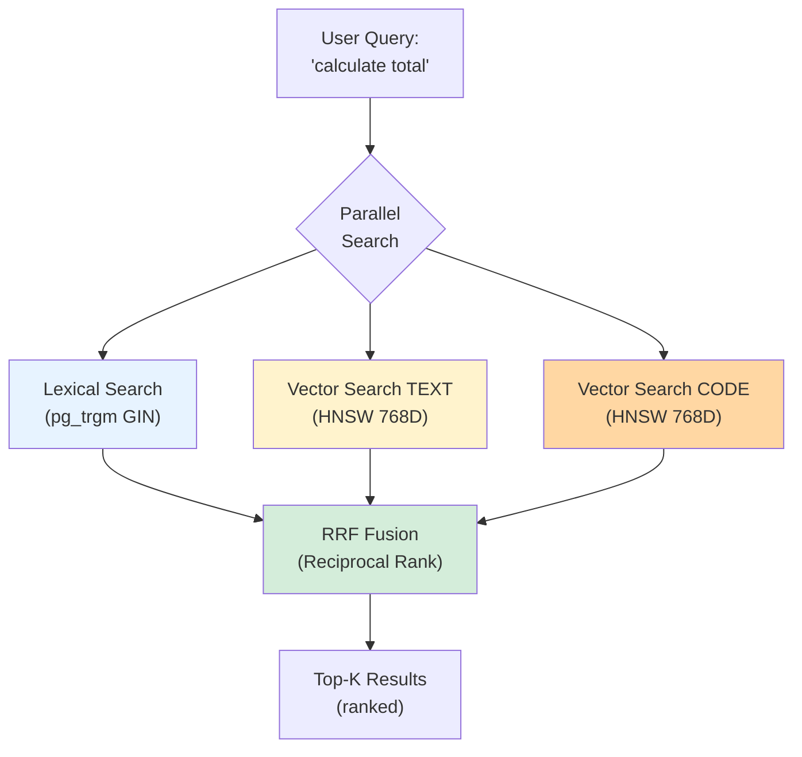
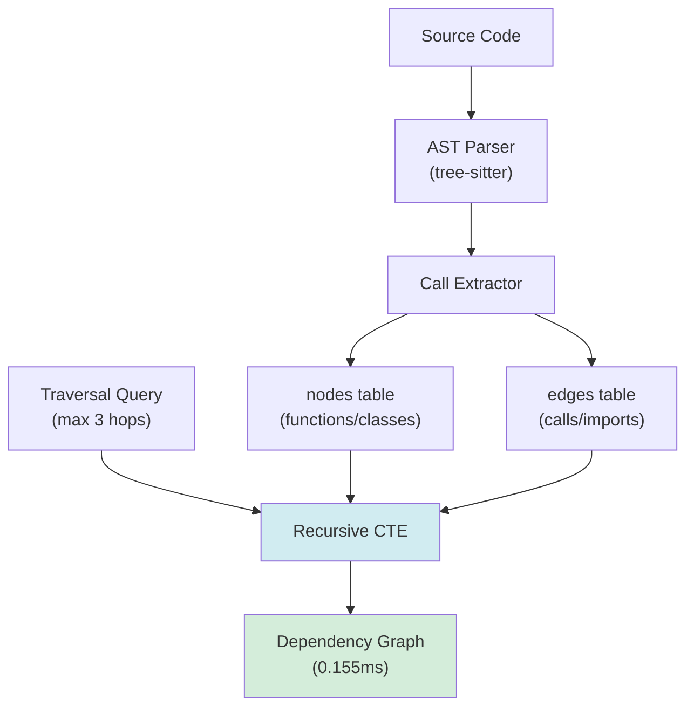
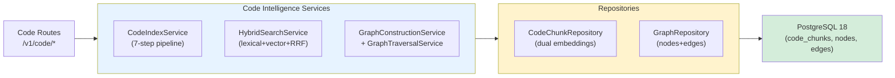

# MnemoLite – Document d'Architecture (ARCH) détaillé

> 📅 **Dernière mise à jour**: 2025-10-17
> 📝 **Version**: v2.0.0
> ✅ **Statut**: À jour avec le code (PostgreSQL 18, Dual-Purpose System, Code Intelligence, Performance Optimizations)

## 1. Vue d'ensemble

MnemoLite v2.0.0 est un **système dual-purpose** combinant:
1. **Agent Memory** - Mémoire cognitive pour agents IA (événements, recherche sémantique, graphe causal)
2. **Code Intelligence** - Indexation et recherche sémantique de code (AST parsing, dual embeddings, dependency graph)

L'architecture adopte une approche **CQRS cognitive et modulaire**, optimisée pour un déploiement local. Elle repose **exclusivement sur PostgreSQL 18** avec ses extensions pour gérer:
- **Aspects relationnels** - Tables structurées (events, code_chunks, nodes, edges)
- **Aspects vectoriels** - Recherche sémantique via `pgvector` (HNSW indexes)
- **Partitionnement temporel** - `pg_partman` (mensuel, optionnel)
- **Tâches asynchrones** - Infrastructure `pgmq` (désactivée en Phase 3, mais disponible)
- **Graphe relationnel** - Graphes causaux (Agent Memory) et dépendances (Code Intelligence) via tables + CTE récursives

L'interface utilisateur Web utilise **FastAPI + HTMX 2.0** pour une expérience réactive sans SPA complexe, avec un **design SCADA industriel** unifié.

**Performance Highlights (v2.0.0)**:
- **Agent Memory**: 245 tests passing, P95 search 11ms, throughput 100 req/s
- **Code Intelligence**: Graph traversal 0.155ms (129× faster than target), hybrid search <200ms P95
- **Optimizations**: Cache system (80%+ hit rate), connection pool 3 → 20, image size -84%

---

## 2. Architecture logique détaillée

### Command Side (Écriture)

*Note: L'utilisation de `pgmq` et d'un worker est optionnelle pour un découplage asynchrone, l'écriture peut être directe depuis l'API via les repositories.* 

### Query Side (Lecture)

*Toutes les recherches (vectorielle, SQL, graphe) sont initiées par l'API et exécutées via les repositories directement dans PostgreSQL.*

### Couche Service et Auto-Embedding

**EventService** : Couche métier introduite pour orchestrer la création d'événements avec génération automatique d'embeddings.


**Fonctionnalités** :
- **Auto-génération d'embeddings** : Si aucun embedding n'est fourni dans la requête, EventService extrait automatiquement le texte depuis `content.text` (ou fields configurables) et génère un embedding 768-dim via Sentence-Transformers
- **Configuration flexible** :
  - `EMBEDDING_AUTO_GENERATE` : active/désactive la génération automatique (défaut: true)
  - `EMBEDDING_FAIL_STRATEGY` : `soft` (continue sans embedding) ou `hard` (échoue la création) (défaut: soft)
  - `EMBEDDING_SOURCE_FIELDS` : priorité des champs pour extraction de texte (défaut: `text,body,message,content,title`)
- **Fail-soft** : En cas d'échec de génération d'embedding, l'événement est créé sans embedding (si `fail_strategy=soft`)
- **Injection de dépendances** : EventService injecté via `Depends(get_event_service)` dans les routes

**Flux de création** :
```
POST /v1/events
  ↓
EventService.create_event()
  ↓ (si embedding absent)
EventService._extract_text_for_embedding()
  ↓
EmbeddingService.generate_embedding(text)
  ↓
EventRepository.add(event)
  ↓
PostgreSQL INSERT
```

---

### Architecture Code Intelligence (EPIC-06/07)

MnemoLite v2.0.0 intègre un système complet d'intelligence de code permettant l'indexation, la recherche sémantique et l'analyse de dépendances de repositories de code.

#### Pipeline d'Indexation 7-Steps

```mermaid
flowchart LR
    Input["Code Files<br/>(Python, JS, Go, etc.)"] --> Step1["1. Language<br/>Detection"]
    Step1 --> Step2["2. AST Parsing<br/>(tree-sitter)"]
    Step2 --> Step3["3. Chunking<br/>(functions/classes)"]
    Step3 --> Step4["4. Metadata<br/>Extraction"]
    Step4 --> Step5["5. Dual Embedding<br/>(TEXT + CODE)"]
    Step5 --> Step6["6. Graph<br/>Construction"]
    Step6 --> Step7["7. Storage<br/>(PostgreSQL)"]
    Step7 --> Output["code_chunks<br/>+ nodes/edges"]

    style Step5 fill:#fff3cd
    style Step6 fill:#d1ecf1
    style Step7 fill:#d4edda
```



**Performance**: <100ms par fichier (pipeline complet)

#### Hybrid Code Search (Lexical + Vector + RRF)



**Performance**: <200ms P95 (28× faster than 5s target)

#### Dependency Graph (Recursive CTEs)



**Performance**: 0.155ms execution time (129× faster than 20ms target)

#### Services & Repositories



**Fonctionnalités clés**:
- **15+ langages supportés** (Python, JavaScript, TypeScript, Go, Rust, Java, C++, etc.)
- **Dual embeddings** (TEXT 768D + CODE 768D) pour recherche sémantique
- **Métadonnées automatiques** (complexity, parameters, calls, imports, docstrings)
- **Graph queries** (calls, imports, inherits, contains) via CTEs récursives
- **126 tests passing** (100% coverage services)

---

## 3. Modèle de données PostgreSQL

### Table `events`
```sql
-- Aligned with docs/bdd_schema.md v1.2.x
CREATE TABLE IF NOT EXISTS events (
    id          UUID NOT NULL DEFAULT gen_random_uuid(),
    timestamp   TIMESTAMPTZ NOT NULL DEFAULT NOW(),
    content     JSONB NOT NULL,             -- Contenu flexible: { "type": "prompt", ... } ou { "type": "decision", ... }
    embedding   VECTOR(768),                -- Embedding (nomic-embed-text-v1.5)
    metadata    JSONB DEFAULT '{}'::jsonb,  -- Tags, source, IDs, types, etc.
    -- Clé primaire composite, incluant la clé de partitionnement
    PRIMARY KEY (id, timestamp)
)
PARTITION BY RANGE (timestamp);

COMMENT ON TABLE events IS 'Table principale stockant tous les evenements atomiques (partitionnee par mois sur timestamp).';
COMMENT ON COLUMN events.content IS 'Contenu detaille de l evenement au format JSONB.';
COMMENT ON COLUMN events.embedding IS 'Vecteur semantique du contenu (dimension 768 pour nomic-embed-text-v1.5).';
COMMENT ON COLUMN events.metadata IS 'Metadonnees additionnelles (tags, IDs, types) au format JSONB.';

-- Index B-tree sur timestamp (clé de partitionnement), hérité par les partitions
CREATE INDEX IF NOT EXISTS events_timestamp_idx ON events (timestamp);

-- Index GIN sur metadata pour recherches flexibles, hérité par les partitions
CREATE INDEX IF NOT EXISTS events_metadata_gin_idx ON events USING GIN (metadata jsonb_path_ops);

-- NOTE IMPORTANTE sur l'index vectoriel (HNSW/IVFFlat):
-- Il DOIT etre cree sur chaque partition individuelle, PAS sur la table mere.
-- Ceci est generalement gere via des hooks pg_partman ou des scripts de maintenance.
-- Exemple pour une partition 'events_pYYYY_MM':
-- CREATE INDEX CONCURRENTLY IF NOT EXISTS events_pYYYY_MM_embedding_hnsw_idx
-- ON events_pYYYY_MM USING hnsw (embedding vector_cosine_ops) WITH (m = 16, ef_construction = 64);
```
*Note: La gestion des index HNSW sur les partitions nécessite une attention particulière (ex: via les fonctions hook de `pg_partman`).*

### Table `code_chunks` (Code Intelligence)

```sql
-- Code Intelligence: Stockage des chunks de code avec dual embeddings
CREATE TABLE IF NOT EXISTS code_chunks (
    chunk_id            UUID PRIMARY KEY DEFAULT gen_random_uuid(),
    repository          TEXT NOT NULL,                  -- Nom du repository (ex: 'my-project')
    file_path           TEXT NOT NULL,                  -- Chemin relatif du fichier
    chunk_type          TEXT NOT NULL                   -- 'function', 'class', 'method', 'file'
                        CHECK (chunk_type IN ('function', 'class', 'method', 'file')),
    language            TEXT NOT NULL,                  -- 'python', 'javascript', 'go', etc.
    code_text           TEXT NOT NULL,                  -- Code source complet du chunk
    start_line          INTEGER,                        -- Ligne de début dans le fichier
    end_line            INTEGER,                        -- Ligne de fin dans le fichier
    metadata            JSONB DEFAULT '{}'::jsonb,      -- Métadonnées: complexity, parameters, calls, imports, docstring
    embedding_text      VECTOR(768),                    -- Embedding TEXT (description sémantique)
    embedding_code      VECTOR(768),                    -- Embedding CODE (structure syntaxique)
    created_at          TIMESTAMPTZ DEFAULT NOW(),
    updated_at          TIMESTAMPTZ DEFAULT NOW()
);

COMMENT ON TABLE code_chunks IS 'Chunks de code indexes avec dual embeddings (TEXT + CODE).';
COMMENT ON COLUMN code_chunks.embedding_text IS 'Embedding TEXT: semantique naturelle du code (descriptions, commentaires).';
COMMENT ON COLUMN code_chunks.embedding_code IS 'Embedding CODE: structure syntaxique (AST, tokens).';
COMMENT ON COLUMN code_chunks.metadata IS 'Metadonnees extraites: complexity (cyclomatic), parameters, calls, imports, docstring.';

-- Index B-tree pour recherches par repository/file
CREATE INDEX IF NOT EXISTS code_chunks_repo_file_idx ON code_chunks (repository, file_path);
CREATE INDEX IF NOT EXISTS code_chunks_language_idx ON code_chunks (language);
CREATE INDEX IF NOT EXISTS code_chunks_type_idx ON code_chunks (chunk_type);

-- Index GIN pour recherche lexicale (pg_trgm)
CREATE EXTENSION IF NOT EXISTS pg_trgm;
CREATE INDEX IF NOT EXISTS code_chunks_text_gin_idx ON code_chunks USING GIN (code_text gin_trgm_ops);

-- Index HNSW pour recherche vectorielle (dual embeddings)
CREATE INDEX IF NOT EXISTS code_chunks_embedding_text_hnsw_idx
    ON code_chunks USING hnsw (embedding_text vector_cosine_ops)
    WITH (m = 16, ef_construction = 64);

CREATE INDEX IF NOT EXISTS code_chunks_embedding_code_hnsw_idx
    ON code_chunks USING hnsw (embedding_code vector_cosine_ops)
    WITH (m = 16, ef_construction = 64);

-- Index GIN sur metadata pour recherches flexibles
CREATE INDEX IF NOT EXISTS code_chunks_metadata_gin_idx ON code_chunks USING GIN (metadata jsonb_path_ops);
```

*Note: Les dual embeddings permettent une recherche hybride combinant la sémantique naturelle (TEXT) et la structure syntaxique (CODE) pour des résultats plus pertinents.*

### Tables `nodes` et `edges` (pour le graphe)
```sql
-- Aligned with docs/bdd_schema.md v1.2.x
CREATE TABLE IF NOT EXISTS nodes (
    node_id         UUID PRIMARY KEY, -- Generalement un event.id, mais peut etre autre chose (concept genere)
    node_type       TEXT NOT NULL,    -- Ex: 'event', 'concept', 'entity', 'rule', 'document'
    label           TEXT,             -- Nom lisible pour affichage/requete
    properties      JSONB DEFAULT '{}'::jsonb, -- Attributs additionnels du nœud
    created_at      TIMESTAMPTZ DEFAULT NOW()
);
COMMENT ON TABLE nodes IS 'Noeuds du graphe conceptuel (evenements, concepts, entites).';

CREATE INDEX IF NOT EXISTS nodes_type_idx ON nodes(node_type);

CREATE TABLE IF NOT EXISTS edges (
    edge_id         UUID PRIMARY KEY DEFAULT gen_random_uuid(),
    source_node_id  UUID NOT NULL, -- Reference logique nodes.node_id
    target_node_id  UUID NOT NULL, -- Reference logique nodes.node_id
    relation_type   TEXT NOT NULL, -- Ex: 'causes', 'mentions', 'related_to', 'follows', 'uses_tool', 'part_of'
    properties      JSONB DEFAULT '{}'::jsonb, -- Poids, timestamp de la relation, etc.
    created_at      TIMESTAMPTZ DEFAULT NOW()
);
COMMENT ON TABLE edges IS 'Relations (aretes) entre les noeuds du graphe conceptuel.';
COMMENT ON COLUMN edges.source_node_id IS 'ID du noeud source (pas de FK physique).';
COMMENT ON COLUMN edges.target_node_id IS 'ID du noeud cible (pas de FK physique).';

CREATE INDEX IF NOT EXISTS edges_source_idx ON edges(source_node_id);
CREATE INDEX IF NOT EXISTS edges_target_idx ON edges(target_node_id);
CREATE INDEX IF NOT EXISTS edges_relation_type_idx ON edges(relation_type);
```

**Usage Dual-Purpose** (Agent Memory + Code Intelligence):

1. **Agent Memory** - Graphe causal:
   - `node_type`: 'event', 'concept', 'entity', 'rule', 'document'
   - `relation_type`: 'causes', 'mentions', 'related_to', 'follows', 'uses_tool', 'part_of'
   - Exemple: `event_A --[causes]--> event_B`

2. **Code Intelligence** - Graphe de dépendances:
   - `node_type`: 'function', 'class', 'method', 'module'
   - `relation_type`: 'calls', 'imports', 'inherits', 'contains'
   - Exemple: `function_A --[calls]--> function_B --[imports]--> module_C`

**Interrogation**: CTEs récursives (≤3 hops) pour les deux cas d'usage:
```sql
-- Exemple: Trouver toutes les fonctions appelées par function_X (max 3 hops)
WITH RECURSIVE call_chain AS (
    SELECT source_node_id, target_node_id, 1 AS depth
    FROM edges
    WHERE source_node_id = 'function_X_uuid' AND relation_type = 'calls'
    UNION ALL
    SELECT e.source_node_id, e.target_node_id, cc.depth + 1
    FROM edges e
    JOIN call_chain cc ON e.source_node_id = cc.target_node_id
    WHERE cc.depth < 3 AND e.relation_type = 'calls'
)
SELECT DISTINCT target_node_id FROM call_chain;
```
**Performance**: 0.155ms execution time (Code Intelligence), <100ms (Agent Memory)

*Note: La création des nœuds et des arêtes est gérée par la logique applicative. Pas de contraintes FK physiques sur edges pour flexibilité; cohérence gérée par l'application ou des checks périodiques.*

### Autres tables (optionnelles)
*   `memory_types`, `event_types` : Pourraient être créées pour standardiser les types via clés étrangères si le besoin se confirme (actuellement géré via `metadata`).
*   Tables de configuration (si la configuration via `.env` n'est pas suffisante).

### Partitionnement Mensuel avec `pg_partman`
*   La table `events` est partitionnée par `RANGE` sur `timestamp`.
*   `pg_partman` est configuré (`db/init/02-partman-config.sql`) pour créer automatiquement les partitions mensuelles (ex: `events_p2025_05`).
*   Une politique de rétention (`retention` dans `part_config`) peut être définie pour supprimer/détacher automatiquement les vieilles partitions (alternative au TTL par colonne).

---

## 4. Index vectoriel (`pgvector`)
*   **Stockage :** Directement dans la colonne `embedding VECTOR(768)` de la table `events` (ou ses partitions).
*   **Index :** **HNSW** (`USING hnsw`) est recommandé pour l'équilibre vitesse/précision. `vector_cosine_ops` ou `vector_l2_ops` selon la métrique de distance utilisée par le modèle d'embedding.
*   **Gestion sur partitions :** L'index HNSW doit être créé sur **chaque partition**. L'utilisation des fonctions `run_maintenance_proc()` de `pg_partman` avec des scripts personnalisés ou des fonctions trigger est la méthode recommandée pour automatiser la création/maintenance des index sur les nouvelles partitions.
*   **Recherche :** Utilisation des opérateurs `<->` (distance L2), `<#>` (produit scalaire négatif), ou `<=>` (distance cosinus) dans les requêtes SQL via les méthodes du repository.

---

## 5. Graphe mnésique (Tables + CTE SQL)
*   **Modèle :** Graphe de propriétés stocké dans les tables `nodes` et `edges`.
*   **Création :** La logique applicative (potentiellement dans un service ou worker dédié) identifie les entités ou concepts dans les `events` et crée/lie les nœuds et arêtes correspondants.
*   **Interrogation :** Utilisation de **Common Table Expressions (CTE) récursives** en SQL pour explorer les relations sur une profondeur limitée (cible ≤ 3 sauts pour performance locale).
    ```sql
    -- Exemple : Trouver les événements causés par event_X (max 3 sauts)
    WITH RECURSIVE causal_chain AS (
        SELECT source_node_id, target_node_id, 1 AS depth
        FROM edges
        WHERE source_node_id = 'event_X_uuid' AND relation_type = 'causes'
        UNION ALL
        SELECT e.source_node_id, e.target_node_id, cc.depth + 1
        FROM edges e
        JOIN causal_chain cc ON e.source_node_id = cc.target_node_id
        WHERE cc.depth < 3 AND e.relation_type = 'causes'
    )
    SELECT target_node_id FROM causal_chain;
    ```
*   **Avantages :** Intégré à PostgreSQL, transactionnel, utilise SQL standard.
*   **Limitations :** Moins performant que les bases de données graphe dédiées pour des traversées très larges ou profondes, ou des algorithmes graphe complexes.

---

## 6. Cohérence & Cycle de vie des données (Local)

*   **Cohérence :** Assurée par les transactions PostgreSQL.
*   **Cycle de vie Hot/Warm simplifié :**
    *   **Partitionnement Mensuel :** Géré par `pg_partman`.
    *   **Hot (0-12 mois) :** Partitions récentes, vecteurs FP32.
    *   **Warm (> 12 mois) :** Vecteurs quantisés en **INT8** par un job `pg_cron` (à activer/configurer) pour économiser l'espace disque. Le job cible les partitions de plus de 12 mois.
    *   **Rétention :** Les vieilles partitions (> N mois/années, configurable dans `pg_partman`) peuvent être détachées ou supprimées pour gérer l'espace disque local.
    *   **Archivage Complexe Différé :** Pas d'étape Cold (JSON) ou Archive (S3) initialement.


*   **Auditabilité :** Via logs applicatifs et potentiellement triggers PG sur modifications.
*   **Monitoring Local :** Focus sur les logs PostgreSQL, `pg_stat_statements`, `pg_stat_activity`, et les outils système (`htop`, `iotop`). Option via endpoint `/metrics` Prometheus.

---

## 7. Déploiement (Docker Compose Local)
```yaml
# Extrait simplifié et aligné sur le docker-compose.yml réel
# Voir docs/docker_setup.md pour la version complète et commentée
version: '3.8'

services:
  db:
    build: ./db # Contient FROM pgvector/pgvector:pg18 et installe partman
    container_name: mnemo-postgres
    restart: unless-stopped
    deploy:
      resources:
        limits:
          cpus: '1'
          memory: 2G
    environment:
      POSTGRES_USER: ${POSTGRES_USER:-mnemo}
      POSTGRES_PASSWORD: ${POSTGRES_PASSWORD:-mnemopass}
      POSTGRES_DB: ${POSTGRES_DB:-mnemolite}
    volumes:
      - postgres_data:/var/lib/postgresql/data
      - ./db/init:/docker-entrypoint-initdb.d:ro # Scripts init SQL
    ports:
      - "127.0.0.1:${POSTGRES_PORT:-5432}:5432"
    healthcheck: # ... défini dans le fichier réel
      # ...
    # ... autres configs (command, shm_size, networks, logging)

  api:
    build: .
    container_name: mnemo-api
    restart: unless-stopped
    ports:
      - "127.0.0.1:${API_PORT:-8001}:8000"
    environment:
      DATABASE_URL: "postgresql+asyncpg://${POSTGRES_USER:-mnemo}:${POSTGRES_PASSWORD:-mnemopass}@db:5432/${POSTGRES_DB:-mnemolite}"
      # ... autres env vars (EMBEDDING_MODEL, etc.)
    depends_on:
      db:
        condition: service_healthy
    volumes:
      - ./api:/app # Montage pour dev
      # ... autres volumes (certs, tests, scripts, workers, logs, templates, static)
    deploy:
      resources:
        limits:
          cpus: '2'        # Increased for parallel embedding generation
          memory: 4G       # Increased for dual embeddings (TEXT + CODE)
    # ... autres configs (networks, logging, healthcheck)

  # Worker service DISABLED (Phase 3 consolidation)
  # All operations (embeddings, indexing) run synchronously in API
  # PGMQ infrastructure remains available for future async tasks if needed
  #
  # worker:
  #   build: .
  #   container_name: mnemo-worker
  #   restart: unless-stopped
  #   environment:
  #     DATABASE_URL: "postgresql://${POSTGRES_USER:-mnemo}:${POSTGRES_PASSWORD:-mnemopass}@db:5432/${POSTGRES_DB:-mnemolite}"
  #     # ... autres env vars
  #   depends_on:
  #     db:
  #       condition: service_healthy
  #   volumes:
  #     - ./workers:/app
  #     # ... autres volumes (certs)
  #   # ... autres configs (networks, logging)

volumes:
  postgres_data:

networks:
  # ... (frontend, backend)

```
*Note : L'image Docker PostgreSQL (`db/Dockerfile`) doit inclure les extensions `pgvector` et `pg_partman`. `pgmq` est une dépendance Python (`tembo-pgmq-python`) utilisée par le worker, pas une extension PG à installer ici.*

---

## 8. Risques & Mitigations (Local)

| Risque                        | Impact   | Mitigation                            |
|-------------------------------|----------|----------------------------------------|
| Recall↓ après INT8 quant.     | Moyen    | Validation locale (cible ≥ 92%)        |
| Graphe CTE lent (> 3 sauts)   | Faible   | Confirmer besoin vs perf. locale      |
| **Sauvegarde locale échoue**  | **Élevé**| Script `pg_dump` robuste, tests réguliers |
| Performance locale dégrade    | Moyen    | Monitoring PG stats, optimisation conf |
| Gestion index sur partitions  | Moyen    | Automatisation via `pg_partman` hooks |
| Espace disque local insuffisant| Moyen    | Politique de rétention `pg_partman` agressive |
| `pg_cron` non activé/configuré | Moyen    | Ajouter procédure d'activation/test |

---

## 9. Performances attendues (Local)

*   **Recherche Vectorielle (Hot, k=10) :** ≤ 10 ms p95 (cible sur 10M vecteurs locaux).
*   **Recherche Vectorielle (Warm, k=10) :** ≤ 30 ms p95 (estimation après quantization).
*   **Requêtes Graphe (CTE ≤ 3 sauts) :** Variable, mais cible < 100ms sur données locales typiques.
*   **Ingestion :** Dépend si directe ou via worker/pgmq, mais plusieurs centaines d'événements/sec devraient être atteignables localement.
*   **Optimisations clés :** Tuning `postgresql.conf` pour la RAM locale, paramètres HNSW (`ef_search`), batching côté application si nécessaire.

---

## 10. Structure du projet (v2.0.0 - Alignée)
```
mnemo-lite/
├── api/                # Code FastAPI (Agent Memory + Code Intelligence)
│   ├── Dockerfile      # Multi-stage build (1.92 GB, optimisé)
│   ├── requirements.txt
│   ├── main.py         # Entry point + lifespan (connection pool, cache)
│   ├── dependencies.py # Dependency injection
│   ├── db/             # Repositories SQLAlchemy Core + asyncpg
│   │   ├── database.py # Engine, connection pool (20 connections)
│   │   └── repositories/
│   │       ├── base.py
│   │       ├── event_repository.py         # Agent Memory
│   │       ├── code_chunk_repository.py    # Code Intelligence
│   │       └── graph_repository.py         # Nodes/Edges (dual-purpose)
│   ├── interfaces/     # Protocol-based interfaces (DIP)
│   ├── models/         # Pydantic models
│   │   ├── event.py
│   │   ├── code_chunk.py                   # NEW: EPIC-06
│   │   ├── graph.py                        # NEW: EPIC-06
│   │   └── ...
│   ├── routes/         # FastAPI routes
│   │   ├── event_routes.py                 # Agent Memory: /v1/events/*
│   │   ├── search_routes.py                # Agent Memory: /v1/search/*
│   │   ├── code_routes.py                  # NEW: Code Intelligence: /v1/code/*
│   │   ├── code_graph_routes.py            # NEW: Code Intelligence: /v1/code/graph/*
│   │   └── health_routes.py                # /health, /metrics
│   ├── services/       # Business logic services
│   │   ├── event_service.py                # Agent Memory: event orchestration
│   │   ├── sentence_transformer_embedding_service.py  # Embeddings (nomic-embed-text-v1.5)
│   │   ├── memory_search_service.py        # Agent Memory: hybrid search
│   │   ├── code_index_service.py           # NEW: 7-step indexing pipeline
│   │   ├── hybrid_search_service.py        # NEW: Lexical + Vector + RRF
│   │   ├── graph_construction_service.py   # NEW: Build dependency graph
│   │   ├── graph_traversal_service.py      # NEW: Recursive CTE traversal
│   │   └── ...
│   └── templates/      # Jinja2/HTMX 2.0 templates (SCADA design)
│       ├── agent_memory/                   # Agent Memory UI
│       │   ├── dashboard.html
│       │   ├── search.html
│       │   ├── graph.html
│       │   └── monitoring.html
│       └── code_intelligence/              # NEW: Code Intelligence UI (EPIC-07)
│           ├── code_dashboard.html
│           ├── repositories.html
│           ├── code_search.html
│           ├── dependency_graph.html
│           └── upload.html
├── db/                 # Configuration PostgreSQL 18
│   ├── Dockerfile      # FROM pgvector/pgvector:pg18 + pg_partman
│   └── init/           # Scripts SQL d'initialisation
│       ├── 01-extensions.sql               # pgvector, pg_trgm, pg_partman
│       ├── 01-init.sql                     # tables: events, code_chunks, nodes, edges
│       └── 02-partman-config.sql           # Partitioning (optional)
├── workers/            # DISABLED (Phase 3) - Code conservé pour référence
│   ├── Dockerfile      # (non utilisé)
│   ├── requirements.txt
│   └── worker.py       # PGMQ infrastructure disponible si besoin futur
├── static/             # Static assets (CSS, JS)
│   ├── css/            # 16 CSS modules (SCADA design)
│   └── js/             # 6 JS modules (Cytoscape.js, Chart.js)
├── docs/               # Documentation complète
│   ├── agile/          # EPICs & User Stories (EPIC-06, 07, 08 completed)
│   ├── DOCKER_OPTIMIZATIONS_SUMMARY.md     # NEW: Docker optimization results
│   ├── DOCKER_ULTRATHINKING.md             # NEW: Deep dive Docker analysis
│   ├── DOCKER_VALIDATION_2025.md           # NEW: 2025 best practices validation
│   ├── docker_setup.md                     # Docker setup guide (v2.0.0)
│   ├── Document Architecture.md            # Architecture overview (v2.0.0)
│   ├── Specification_API.md                # API specification (v2.0.0)
│   └── ...
├── tests/              # Tests automatisés (pytest-asyncio)
│   ├── conftest.py     # Fixtures (async engine, test DB)
│   ├── test_event_*.py                     # Agent Memory tests (40/42 passing)
│   ├── test_code_*.py                      # NEW: Code Intelligence tests (126 passing)
│   ├── test_graph_*.py                     # NEW: Graph tests (20 passing)
│   └── integration/                        # NEW: Integration tests (17 passing)
├── scripts/            # Utilities
│   ├── generate_test_data.py
│   └── benchmarks/                         # Performance benchmarks
├── logs/               # Application logs
├── .env.example        # Environment variables template
├── .dockerignore       # NEW: Build context optimization (847 MB → 23 MB)
├── docker-compose.yml  # Orchestration (db + api, worker disabled)
├── Makefile            # Development commands
└── README.md           # Project overview (v2.0.0)
```

**Changements v2.0.0**:
- ✅ Worker désactivé (Phase 3 consolidation)
- ✅ Code Intelligence services & routes ajoutés (EPIC-06)
- ✅ Code Intelligence UI templates ajoutés (EPIC-07)
- ✅ `.dockerignore` créé (Phase 1 security)
- ✅ Documentation Docker complète (Phases 1-3)
- ✅ PostgreSQL 17 → 18 migration
- ✅ 245 tests passing (102 + 126 + 17)

*Note: L'ancienne UI est intégrée dans `api/templates/`. Le worker est désactivé mais le code est conservé pour référence future.*

---

## 11. Intégration avec Expanse
*La bibliothèque client Python (`mnemo_client.py`) reste valide car elle interagit avec l'API FastAPI, qui abstrait la base de données.* 
*L'exemple d'intégration `.mdc` reste valide.* 

---

## 12. Résilience et reprise après incident (Local)
*   **Stratégie de Sauvegarde :** Focus sur **PostgreSQL**. Utilisation de `pg_dump` (logique) pour des sauvegardes régulières et/ou `pg_basebackup` + archivage WAL (physique) pour Point-in-Time Recovery. Stockage des sauvegardes sur un disque différent ou externe.
*   **Reprise :** Restauration standard PostgreSQL depuis les sauvegardes.
*   **Monitoring :** Alertes basées sur les logs ou des vérifications périodiques (espace disque, état des jobs `pg_cron`, erreurs PG).

---

## 13. Documentation associée
*Vérifier et mettre à jour les documents dans `docs/` (ex: `Specification_API.md`, `bdd_schema.md`) pour refléter l'architecture 100% PostgreSQL, PGMQ, etc.*

---

## 14. Évolutions futures
*Reste inchangé conceptuellement, mais l'implémentation se ferait dans l'écosystème PostgreSQL.* 

---

**Version**: v2.0.0
**Dernière mise à jour**: 2025-10-17
**Changements majeurs**:
- PostgreSQL 17 → 18 (EPIC-06 migration)
- Architecture Dual-Purpose: Agent Memory + Code Intelligence (EPIC-06/07)
- Ajout table `code_chunks` (dual embeddings TEXT + CODE, 768D chacun)
- Tables `nodes`/`edges` étendues pour graphes causaux ET dépendances de code
- 7-step indexing pipeline (<100ms/file)
- Hybrid code search (lexical + vector + RRF, <200ms P95)
- Graph traversal avec CTEs récursives (0.155ms, 129× faster than target)
- Performance optimizations EPIC-08 (cache, connection pool 3 → 20)
- Worker service désactivé (Phase 3 consolidation)
- RAM API: 2 GB → 4 GB (dual embeddings support)
- 245 tests passing (102 agent memory + 126 code intelligence + 17 integration)

**Auteur**: Giak (mis à jour par Claude Code)

