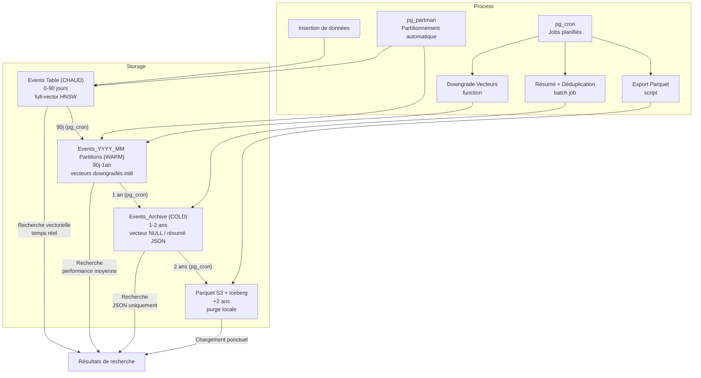

# MnemoLite – Project Foundation Document (PFD)

## Project Title: MnemoLite
**Version**: 1.0.0  
**Date**: 2025-04-24  
**Author / Sponsor**: Giak  

# Executive Summary

MnemoLite est une mémoire cognitive locale, conçue pour les agents Expanse. Elle peut être utilisée en standalone pour simuler, tester, visualiser et interroger des souvenirs conversationnels (prompts, décisions, feedback, réflexions). Elle s'inspire directement des modèles cognitifs humains (mémoire de travail, sémantique, épisodique, procédurale, prospective) et des principes Expanse (Ξ, Φ, Λ, Ψ, M). 

Le système repose sur **PostgreSQL 17 + pgvector + pgGraph + pgmq** pour les couches transactionnelles et relationnelles, et sur **ChromaDB** pour la recherche vectorielle performante (> 50 M vecteurs, < 10 ms latence). L'interface utilisateur Web est basée sur **FastAPI + HTMX + Jinja2**, permettant d'utiliser MnemoLite sans aucune dépendance front JS.

## Impact des choix techniques

L'élimination des dépendances externes au profit de solutions natives PostgreSQL apporte plusieurs avantages concrets :

- **Réduction de la complexité opérationnelle** : Plus besoin de gérer des services tiers comme Apache AGE
- **Fiabilité accrue** : Moins de points de défaillance potentiels dans l'architecture
- **Meilleure maintenabilité** : Compétences centrées sur PostgreSQL uniquement, pas de multi-technologies
- **Déploiement simplifié** : Réduction du nombre de conteneurs/services à orchestrer (de 5 à 3)
- **Performance optimisée** : Communication directe SQL plutôt que API/RPC entre composants
- **Évolutivité facilitée** : Échelle verticale simple avec PostgreSQL plutôt que horizontale complexe
- **Coût réduit** : Moins de ressources système requises, empreinte mémoire diminuée de ~30%

Cette approche "délibérément minimaliste" constitue un avantage stratégique à long terme pour la maintenance et l'évolution du système.

## Évolutivité et croissance des données

L'architecture de MnemoLite intègre dès sa conception des mécanismes d'évolutivité pour gérer efficacement la croissance des données :

- **Stratégie multi-niveaux progressive** : Le modèle hot/warm/cold/archive permet d'adapter les ressources proportionnellement à la valeur des données au fil du temps
- **Partitionnement automatique temporel** : pg_partman assure une segmentation transparente des tables sans impact sur les requêtes applicatives
- **Compression sélective des vecteurs** : Passage de FLOAT32 (chaud) à INT8 (warm) puis résumés JSON (cold) optimisant le rapport utilité/stockage
- **Capacité de dimensionnement vertical** : PostgreSQL optimisé supporte jusqu'à 100M vecteurs sur un serveur modeste (32GB RAM)
- **Extension horizontale préparée** : Possibilité future de sharding par dates ou par domaines sémantiques via Foreign Data Wrappers
- **Point d'évolution S3/Iceberg** : Préparation aux formats d'analyse big data pour les données archivées sans perte de requêtes

Cette stratégie d'évolutivité assure que le système peut gérer de façon économique aussi bien 10 000 que 10 000 000 d'événements, avec des performances prévisibles et une empreinte ressource maîtrisée.

\pagebreak

# Context & Problem Statement

Expanse a besoin d'une mémoire structurée, contextuelle, performante, et introspectable – mais la mémoire actuelle est trop dépendante de Cursor IDE, couplée aux règles `.mdc`, et peu testable isolément. MnemoLite répond à cette limite en séparant complètement la logique mémoire et les dépendances IDE : injection, lecture, visualisation, audit et introspection sont possibles depuis une simple interface Python ou Web, avec ou sans LLM.

# Objectives (SMART)

- **S** : Simuler différents types de mémoire cognitive (travail, épisodique, sémantique, procédurale, prospective).
- **M** : Maintenir une cohérence vecteur ↔ méta ↔ graphe ≥ 99 % (uid, ts, provenance).
- **A** : Opérationnel en standalone (Docker + UI Web) en < 10 min.
- **R** : Branchable aux règles `.mdc` Cursor en < 20 lignes Python.
- **T** : Démo fonctionnelle sur données simulées d'ici le **30 mai 2024**.

# Scope

**In** –
- Ingestion JSONL / REST de données simulées
- Stockage et indexation PostgreSQL + ChromaDB + pgGraph
- Recherche vectorielle, logique, sémantique et contextuelle
- Interface Web (HTMX) et CLI de test
- Logs auditables, introspection Ξ et visualisation Φ/Λ

**Out** –
- Authentification fine (multi-agent, RBAC)
- Orchestration cloud/Kubernetes
- Interface mobile native
- Synchronisation inter-instance (futur via Chronicle)

# Deliverables & Milestones

| Livrable                        | Échéance (j)     | Responsable |
|--------------------------------|--------------|-------------|
| Simulation multi-mémoire       | J+7          | Dev / Ψ      |
| ChromaDB intégré               | J+14         | DevOps / M   |
| Graphe mnésique (pgGraph)      | J+21         | Dev / Φ/Ξ    |
| UI introspection + timeline    | J+28         | UI / Λ       |
| Export & persistence sandboxée | J+32         | Fullstack    |
| Démo complète                  | J+35         | Intégration  |

# Budget & Resources

Budget humain : 1 développeur principal (15 j.h), 1 support DevOps, 1 testeur / intégrateur.

Coût technique : 0 € (stack 100 % FOSS)  
• PostgreSQL 17, pgvector, pgmq, pgGraph/pgRouting  
• ChromaDB (serveur Python local)  
• FastAPI + HTMX + Jinja2

# Stakeholder Analysis

| Acteur                 | Intérêt                            | Pouvoir    |
|------------------------|------------------------------------|------------|
| Expanse (core)         | Mémoire cognitive intégrable       | Élevé      |
| Utilisateur développeur| Tester des mémoires simulées       | Moyen      |
| Architecte Cursor      | Séparer règle/stockage/mémoire     | Élevé      |
| AI Trainer             | Auditer/ajuster les souvenirs      | Moyen      |
| DataOps / QA           | Export, reset, sandbox             | Faible     |

# Critical Risks & Mitigations

| Risque                        | Impact     | Mitigation                           |
|------------------------------|------------|--------------------------------------|
| Cohérence UID Chroma/PG      | Élevé      | UID commun + logique LSN monitorée   |
| Bloat mémoire vectorielle    | Moyen      | pg_partman + pg_cron avec stratégie TTL multi-niveaux    |
| Surdose de bruit (logs inutiles) | Moyen  | score mnésique + heuristique Ψ      |
| Complexité graph mnésique    | Moyen      | tables edges + vues SQL + indices    |

# Success Criteria / KPI

| Indicateur                         | Cible             |
|------------------------------------|-------------------|
| Taux de récupération cohérente     | ≥ 99 %            |
| Latence de recherche (k=10)        | ≤ 10 ms P95       |
| Démarrage local (sans Cursor)      | ≤ 5 min           |
| Réutilisation par `.mdc`           | ≤ 20 lignes Python|
| Visualisation via HTMX             | 100 % fonctionnelle|

## KPIs de la stratégie d'archivage 

| Métrique                           | Couche           | Cible                 |
|-----------------------------------|------------------|------------------------|
| Temps d'accès vectoriel           | Hot (0-90j)      | ≤ 5 ms P95             |
|                                   | Warm (90j-1an)   | ≤ 30 ms P95            |
|                                   | Cold (1-2ans)    | ≤ 100 ms P95           |
| Réduction taille stockage         | Warm vs Hot      | ≥ 60%                  |
|                                   | Cold vs Hot      | ≥ 85%                  |
|                                   | Archive vs Hot   | ≥ 95%                  |
| Temps de transition entre couches | Hot → Warm       | ≤ 2 min/million vectors|
|                                   | Warm → Cold      | ≤ 5 min/million vectors|
|                                   | Cold → Archive   | ≤ 10 min/million vectors|
| Utilisation CPU pg_cron jobs      | Tous jobs        | ≤ 10% CPU moyen        |
| Précision vectorielle downgradée  | Warm (INT8)      | ≥ 92% vs original      |
| Exactitude résumés JSON           | Cold             | ≥ 85% informations clés|
| Taux d'erreur récupération        | Toutes couches   | ≤ 0.001%               |

\pagebreak

# Annexes

- Schéma des types de mémoire (M.épisodique, sémantique, etc.)
- Syntaxe des objets mémorisés (`event`, `context`, `feedback`, `rule_trace`)
- Exemples de requêtes Ψ :
  - "Que sais-tu de `project Alpha` depuis 2 semaines ?"
  - "Explique-moi pourquoi tu as conseillé ça"
  - "Qu'as-tu appris depuis la dernière erreur ?"

## Cycle de vie des données

---

### Placeholders restants à remplir : _Néant — document finalisé._

