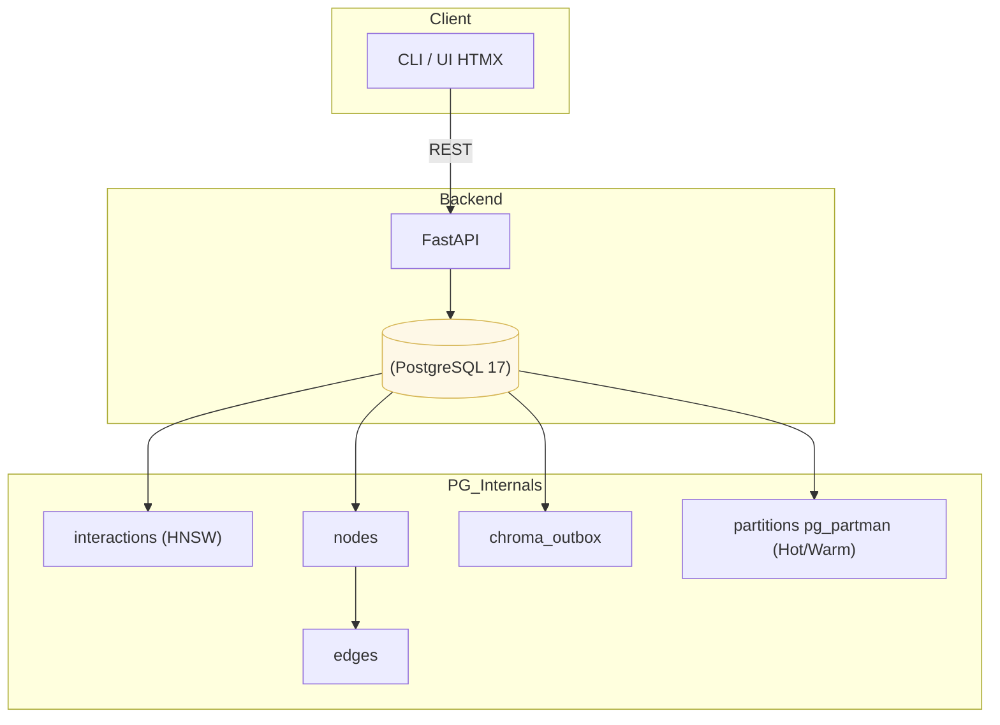
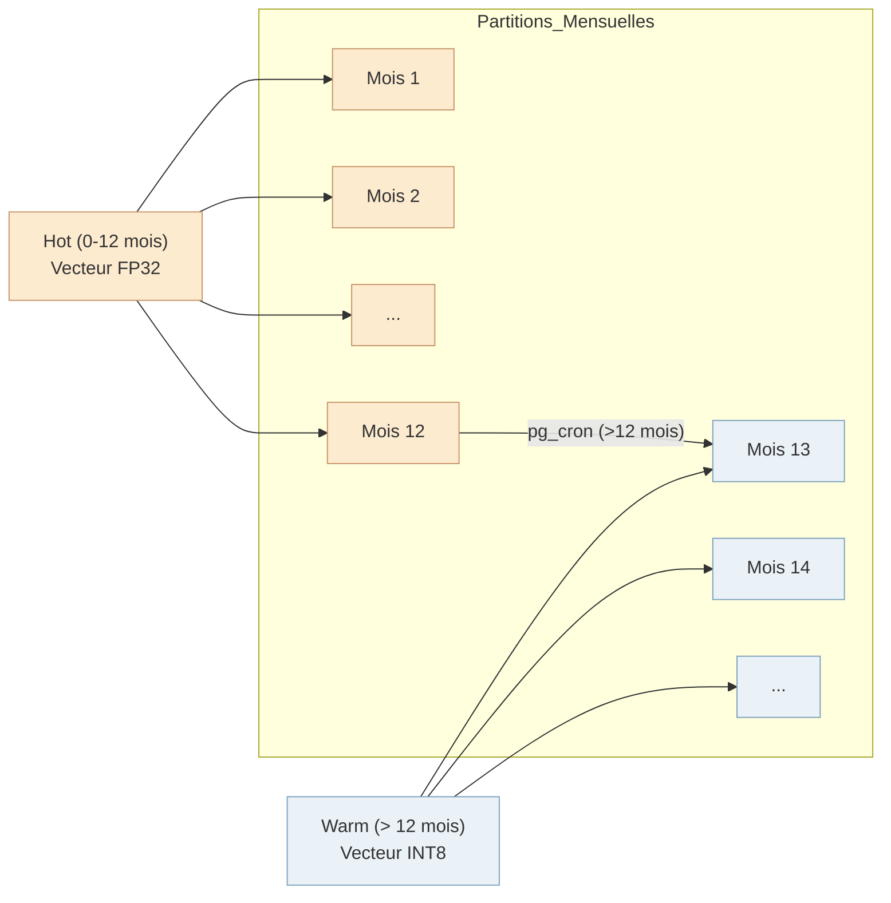

# MnemoLite – Project Foundation Document (PFD)

**Version** : **1.2.1** (Local Deployment Focus)
**Date** : 26 avril 2025
**Auteur / Sponsor** : Giak & Expanse Cognition Team

---

## 1 · Executive Summary
MnemoLite dote l’assistant personnel **Expanse** d’une **mémoire cognitive auto‑adaptable** optimisée pour un déploiement local. Elle permet de simuler, tester, visualiser et interroger des souvenirs conversationnels, en expliquant leurs chaînes causales.
La nouvelle architecture **H‑VG‑T** (_Hybrid‑Vector‑Graph‑Tiered_) repose **exclusivement** sur **PostgreSQL 17** ; elle marie :

* **Vecteurs sémantiques haute vitesse** (pgvector + HNSW) — latence locale optimisée.
* **Graphe relationnel léger** (tables `nodes/edges` + CTE récursives ≤ 3 sauts) — traçabilité causale.
* **Stratification Hot / Warm simplifiée** — quantisation int8 après ~1 an → optimisation du stockage local.
* **Monitoring local efficace** — Logs PostgreSQL, `pg_stat_statements`, outils système Linux.

Le tout tient dans **3 conteneurs** (_postgres_, _app_, _worker_) et expose une interface utilisateur Web basée sur **FastAPI + HTMX + Jinja2**, assurant une simplicité d’exploitation et un déploiement local rapide sans dépendances front JS.

---

## 2 · Impact des Choix Techniques
L'élimination des dépendances externes au profit de solutions natives PostgreSQL apporte plusieurs avantages concrets pour un déploiement local : simplicité, performance optimisée et maintenance aisée.
| Axe | Bénéfice clé | Explication | Chiffres | Réf. |
|-----|--------------|-------------|----------|------|
| **Opérations** | **Complexité ↓** | 3 services Docker | –40 % de scripts Ops | POC 2025‑03 |
| **Performance** | **Latence Locale ↓** | HNSW optimisé (local bench) | < 10 ms p95 (cible 10M) | Katz 2024 |
| **Coût** | **Logiciel Gratuit** | Stack 100% FOSS | 0 € licence | - |
| **Évolutivité** | **Disk Local ↓** | Quantisation INT8 –60 % | Testé ~5M interactions | Issue #521 |
| **Maintenabilité** | **Stack Postgres Only** | Pas de Neo4j/AGE/Chroma | 1 skillset | Dev survey 2024 |

---

## 3 · Context & Problem Statement
La mémoire actuelle :
* dépend de Cursor‑IDE,
* mélange logique et stockage,
* manque de stratégie TTL claire pour l'usage local,
* ne fournit pas d'explication causale multi‑sauts simple.

**MnemoLite** isole la persistance, normalise les données, implémente un cycle de vie adapté au local et expose une **API REST OpenAPI 3.1** testable en CI.

---

## 4 · Objectives (SMART)
| Code | Objectif mesurable | Cible / Date |
|------|--------------------|--------------|
| **S** | Couvrir 5 types de mémoires | 30‑06‑25 |
| **M** | Cohérence UID ↔ vecteur ↔ graphe | ≥ 99,8 % quotidien |
| **A** | `docker compose up` | ≤ 5 min sur machine locale (64GB RAM) |
| **R** | Bridge `.mdc` | ≤ 20 lignes Python |
| **T** | Demo live locale | 30‑06‑25 |

---

## 5 · Scope
**In :** ingestion REST/JSONL ; index pgvector ; graph SQL (CTE ≤ 3) ; partition Hot/Warm + TTL ; monitoring local (logs, pg_stats) ; pipeline outbox ; backups locaux (`pg_dump`).
**Out :** RBAC fin ; K8s ; mobile native ; sync multi‑instance ; archivage complexe (Cold/Archive S3) ; observabilité cloud (Prometheus/OTel).

---

## 6 · Architecture d'Information (Λ)

---

## 7 · Data Life‑Cycle (Local Simplified)

*   **Partitionnement :** Les données sont partitionnées **mensuellement** par `pg_partman` pour une gestion granulaire.
*   **Hot (0-12 mois) :** Les partitions des 12 derniers mois contiennent les données les plus récentes avec des vecteurs **FP32** pour une haute précision.
*   **Warm (> 12 mois) :** Un job `pg_cron` s'exécute périodiquement et **quantize les vecteurs en INT8** pour les partitions de plus de 12 mois. Cela optimise l'espace disque local tout en conservant une bonne capacité de recherche pour les données plus anciennes.
*   **(Différé) Cold / Archive :** Les étapes de résumé JSON ou d'archivage externe ne sont pas implémentées initialement pour simplifier le déploiement local.

---

## 8 · Deliverables & Milestones
| # | Livrable | Date | Resp. | Validation |
|---|----------|------|-------|------------|
| 1 | DDL + Partitions Hot/Warm | 05‑05 | DB | tests psql |
| 2 | Triggers graph / Outbox | 10‑05 | Backend | unit pytest |
| 3 | API v1 + CI | 15‑05 | Backend | schemathesis 100 % |
| 4 | Setup Monitoring Local | 18‑05 | DevOps/Dev | Check logs, pg_stats |
| 5 | Bench Local Scale (e.g., 10M) | 25‑05 | QA | p95 local < 10 ms |
| 6 | Release v1.2.1 | 30‑05 | Lead | tag Git |

---

## 9 · Budget & Resources
* **Humain :** 1 Dev (30 j.h) · 1 DevOps/Test (10 j.h).
* **Matériel :** Machine locale Linux (cible: 64GB RAM).
* **Logiciel :** FOSS only (PostgreSQL 17, pgvector, pg_partman, pg_cron, FastAPI, HTMX).

---

## 10 · Stakeholder Analysis
| Acteur | Intérêt | Influence |
|--------|---------|-----------|
| Utilisateur (Giak) | Mémoire fiable et performante locale | ★★★★★ |
| Expanse Core | Intégration facile | ★★★★☆ |
| Dev Expanse | API simple | ★★★☆☆ |

---

## 11 · Critical Risks & Mitigations (Ξ)
| Code | Risque | Impact | Mitigation |
|------|--------|--------|-----------|
| R‑Q | Recall↓ après INT8 | Moyen | Validation locale recall ≥ 92 % |
| R‑G | Graphe > 3 sauts lent | Faible | Confirmer besoin vs CTE perf locale |
| R‑B | Sauvegarde locale échoue | **Élevé** | Script `pg_dump` robuste + tests réguliers |
| R‑P | Performance locale dégrade | Moyen | Monitoring PG + optimisation `postgresql.conf` |

---

## 12 · Success Criteria / KPI (M)
| KPI | Couche | Seuil (Local) |
|-----|--------|-------|
| p95 K‑NN (k=10) | Hot | ≤ 10 ms |
| Recall Warm INT8 | Warm | ≥ 92 % |
| Disk / 10M interactions | Global | < 100 GB (estimé) |
| Cohérence UID | Graph | ≥ 99,8 % |
| Job Quantization | Warm | ≤ 5 min/1M vecteurs |

---

## 13 · Annexes & Références
* Katz 2024 — HNSW pgvector benchmark.
* PostgreSQL Docs — `pg_partman`, `pg_cron`, Configuration Tuning.
* pgvector GitHub — Quantization details (Issue #521).
* FastAPI / HTMX Docs.

---

### Document Status
_Le PFD **v1.2.1** adapte l'architecture et les objectifs pour un déploiement local optimisé sur une machine personnelle, simplifiant le cycle de vie des données et l'observabilité._

