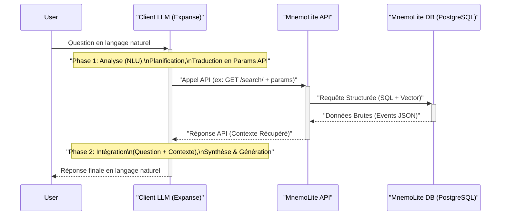

# MnemoLite – Spécification API

> 📅 **Dernière mise à jour**: 2025-10-17
> 📝 **Version**: v2.0.0
> ✅ **Statut**: À jour avec le code (Agent Memory + Code Intelligence endpoints)

> **Objectif (Ω)** : Définir un contrat clair, versionné, testable et documenté pour intégrer MnemoLite à Expanse et à tout client externe, basé sur REST/JSON et OpenAPI 3.1.

---

## 1. Alternatives considérées (Φ)
| Approche | Description | Avantages | Inconvénients |
|----------|-------------|-----------|---------------|
| **A. REST + JSON (OpenAPI 3.1)** | Endpoints CRUD + recherche, spec auto-générée | Simple, écosystème large, outils (FastAPI) | Verbeux, overfetching potentiel |
| **B. REST + JSON (JSON:API 1.1)** | Conventions fortes (include, sparse fields) | Normalise pagination & liens, moins de bikeshedding | Learning curve, moins d'outils Python |
| **C. gRPC + Protobuf** | Services typés, streaming bi-directionnel | Performances, contrats stricts, code-gen multilang | Plus complexe, firewall/unary http2, UI à fournir |
| **D. GraphQL** | Schéma unique typé, requêtes flexibles | Sous-sélection fine, introspection native | N+1 backend, cache plus dur, complexité DDOS |

> **Décision (Δ)** : **A. REST + JSON + OpenAPI 3.1** pour V1.

---

## 2. Design principes (Ξ)
1. **Stateless** : chaque requête contient tout contexte.
2. **Versionné** : Prefix `/v1/...`.
3. **Codes HTTP Prédictibles** : 200 (OK), 201 (Created), 204 (No Content - DELETE), 400 (Bad Request), 404 (Not Found), 422 (Unprocessable Entity - Validation), 500 (Internal Server Error).
4. **Enveloppe Réponse Consistente** : `{ "data": ..., "meta": ... }` pour les collections/résultats de recherche.
5. **Observabilité** : trace-id via middleware (si ajouté), endpoint `/v1/metrics` Prometheus.

---

## 3. Endpoints principaux (Λ)

### Agent Memory Endpoints
| Méthode | Route                        | Fonction                                      | Auth       |
|---------|------------------------------|-----------------------------------------------|------------|
| POST    | `/v1/events`                 | Ingestion d'un événement                      | none (dev) |
| GET     | `/v1/events/{id}`            | Récupérer par UID                             | none       |
| PATCH   | `/v1/events/{id}/metadata`   | MàJ (fusion) métadonnées d'un événement       | none       |
| DELETE  | `/v1/events/{id}`            | Suppression d'un événement                    | none       |
| GET     | `/v1/search/`                | Recherche hybride (vecteur + filtres)         | none       |
| GET     | `/v1/events/cache/stats`     | Statistiques cache (EPIC-08)                  | none       |

### Code Intelligence Endpoints (NEW in v2.0.0)
| Méthode | Route                        | Fonction                                      | Auth       |
|---------|------------------------------|-----------------------------------------------|------------|
| POST    | `/v1/code/index`             | Indexer un repository (7-step pipeline)       | none (dev) |
| POST    | `/v1/code/search/hybrid`     | Recherche hybride (lexical + vector + RRF)    | none       |
| POST    | `/v1/code/search/lexical`    | Recherche lexicale (pg_trgm)                  | none       |
| POST    | `/v1/code/search/vector`     | Recherche vectorielle (dual embeddings)       | none       |
| GET     | `/v1/code/metadata/{chunk_id}`| Récupérer métadonnées d'un chunk             | none       |
| POST    | `/v1/code/graph/build`       | Construire graphe de dépendances              | none       |
| POST    | `/v1/code/graph/traverse`    | Traverser graphe (recursive CTE, ≤3 hops)     | none       |
| POST    | `/v1/code/graph/path`        | Trouver chemin entre 2 nœuds                  | none       |
| GET     | `/v1/code/graph/stats`       | Statistiques graphe (nodes, edges, depth)     | none       |
| GET     | `/v1/code/stats`             | Statistiques repository (files, functions)    | none       |
| DELETE  | `/v1/code/chunks/{chunk_id}` | Supprimer un chunk de code                    | none       |
| GET     | `/v1/code/repositories`      | Lister les repositories indexés              | none       |

### System Endpoints
| Méthode | Route                        | Fonction                                      | Auth       |
|---------|------------------------------|-----------------------------------------------|------------|
| GET     | `/v1/health`                 | Liveness / readiness                          | none       |
| GET     | `/v1/metrics`                | Métriques Prometheus                          | none       |

---

## 4. Spécification OpenAPI
```yaml
openapi: 3.1.0
info:
  title: MnemoLite API
  version: "2.0.0" # Agent Memory + Code Intelligence (EPIC-06/07/08)
servers:
  - url: http://localhost:8001/v1 # URL locale par défaut
paths:
  /events:
    post:
      summary: Ingestion d'un événement
      operationId: ingest_event_v1_events_post
      requestBody:
        required: true
        content:
          application/json:
            schema:
              $ref: '#/components/schemas/NewEvent'
      responses:
        '201':
          description: Événement créé
          content:
            application/json:
              schema:
                $ref: '#/components/schemas/Event'
        '422':
          description: Erreur de validation
          content:
            application/json:
              schema:
                $ref: '#/components/schemas/HTTPValidationError' # Typique de FastAPI
        '500':
          description: Erreur interne du serveur
          content:
            application/json:
              schema:
                $ref: '#/components/schemas/ErrorResponse' # Ou juste {"detail": "..."}
  /events/{id}:
    get:
      summary: Détail d'un événement
      operationId: get_event_v1_events__id__get
      parameters:
        - name: id
          in: path
          required: true
          schema:
            type: string
            format: uuid
      responses:
        '200':
          description: OK
          content:
            application/json:
              schema:
                $ref: '#/components/schemas/Event'
        '404':
          description: Événement non trouvé
          content:
            application/json:
              schema:
                $ref: '#/components/schemas/ErrorResponse'
        '422':
          description: Erreur de validation (ID invalide)
          content:
            application/json:
              schema:
                $ref: '#/components/schemas/HTTPValidationError'
    delete:
      summary: Supprimer un événement
      operationId: delete_event_v1_events__id__delete
      parameters:
        - name: id
          in: path
          required: true
          schema:
            type: string
            format: uuid
      responses:
        '204':
          description: Événement supprimé avec succès (pas de contenu)
        '404':
          description: Événement non trouvé
          content:
            application/json:
              schema:
                $ref: '#/components/schemas/ErrorResponse'
        '422':
          description: Erreur de validation (ID invalide)
          content:
            application/json:
              schema:
                $ref: '#/components/schemas/HTTPValidationError'
        '500':
          description: Erreur interne du serveur
          content:
            application/json:
              schema:
                $ref: '#/components/schemas/ErrorResponse'
  /events/{id}/metadata:
    patch:
      summary: Mettre à jour les métadonnées d'un événement
      operationId: update_event_metadata_v1_events__id__metadata_patch
      parameters:
        - name: id
          in: path
          required: true
          schema:
            type: string
            format: uuid
      requestBody:
        required: true
        content:
          application/json:
            schema:
              type: object
              description: "Objet JSON contenant les métadonnées à fusionner avec celles existantes."
              example: { "tag": "corrected", "reviewed": true }
      responses:
        '200':
          description: Métadonnées mises à jour
          content:
            application/json:
              schema:
                $ref: '#/components/schemas/Event'
        '404':
          description: Événement non trouvé
          content:
            application/json:
              schema:
                $ref: '#/components/schemas/ErrorResponse'
        '422':
          description: Erreur de validation (ID ou corps de requête invalide)
          content:
            application/json:
              schema:
                $ref: '#/components/schemas/HTTPValidationError'
        '500':
          description: Erreur interne du serveur
          content:
            application/json:
              schema:
                $ref: '#/components/schemas/ErrorResponse'
  /search/:
    get:
      summary: Recherche hybride (vecteur + filtres + temps)
      description: >
        Effectue une recherche multi-critères en combinant similarité vectorielle,
        filtres sur les métadonnées et filtres temporels.
      operationId: search_events_v1_search_get
      parameters:
        - in: query
          name: vector_query
          description: "Requête textuelle (sera convertie en embedding par le service) OU vecteur d'embedding (liste de floats) fourni comme une chaîne JSON (ex: '[0.1,0.2,...]')."
          schema:
            type: string
          example: "trouver des logs importants"
        - in: query
          name: filter_metadata
          description: "Filtre JSON stringifié sur les métadonnées (ex: {\"key\": \"value\"})."
          schema:
            type: string
          example: '{\"event_type\": \"decision\", \"rule_id\": \"M-UpdateLogic\"}'
        - in: query
          name: ts_start
          description: "Timestamp de début pour le filtre temporel (format ISO 8601)."
          schema:
            type: string
            format: date-time
        - in: query
          name: ts_end
          description: "Timestamp de fin pour le filtre temporel (format ISO 8601)."
          schema:
            type: string
            format: date-time
        - in: query
          name: distance_threshold
          description: |
            Seuil de distance L2 pour la similarité vectorielle (range: 0-2, plus bas = plus similaire).
            Valeurs recommandées: 0.8 (strict), 1.0 (balanced), 1.2 (relaxed), None/2.0 (top-K).
            Si un threshold strict retourne 0 résultats en recherche vectorielle pure, fallback automatique en mode top-K.
          schema:
            type: number
            format: float
            default: 1.0
            minimum: 0.0
            maximum: 2.0
        - in: query
          name: limit
          description: "Nombre maximum de résultats finaux à retourner."
          schema:
            type: integer
            default: 10
            minimum: 1
            maximum: 100
        - in: query
          name: offset
          description: "Offset pour la pagination standard."
          schema:
            type: integer
            default: 0
            minimum: 0
      responses:
        '200':
          description: Résultats classés
          content:
            application/json:
              schema:
                $ref: '#/components/schemas/SearchResults'
        '422':
          description: Erreur de validation des paramètres
          content:
            application/json:
              schema:
                $ref: '#/components/schemas/HTTPValidationError'
        '500':
          description: Erreur interne du serveur
          content:
            application/json:
              schema:
                $ref: '#/components/schemas/ErrorResponse'
  /health:
    get:
      summary: Vérification de santé du service
      operationId: health_check_v1_health_get
      responses:
        '200':
          description: Service opérationnel
          content:
            application/json:
              schema:
                type: object
                properties:
                  status: { type: string, enum: ["healthy", "degraded"] }
                  timestamp: { type: string, format: date-time }
                  duration_ms: { type: number, format: float }
                  services:
                    type: object
                    properties:
                      postgres:
                        type: object
                        properties:
                          status: { type: string, enum: ["ok", "error"] }
                          version: { type: string, nullable: true }
                          message: { type: string, nullable: true }
        '503':
          description: Service non disponible (ex: DB inaccessible)
          content:
            application/json:
              schema:
                type: object
                properties:
                  status: { type: string, enum: ["degraded"] }
                  timestamp: { type: string, format: date-time }
                  duration_ms: { type: number, format: float }
                  services:
                    type: object
                    properties:
                      postgres:
                        type: object
                        properties:
                          status: { type: string, enum: ["error"] }
                          message: { type: string, nullable: true }
  /metrics:
    get:
      summary: Métriques Prometheus
      operationId: get_metrics_v1_metrics_get
      responses:
        '200':
          description: Métriques au format texte Prometheus
          content:
            text/plain; version=0.0.4; charset=utf-8:
              schema:
                type: string
                example: |
                  # HELP python_gc_objects_collected_total Objects collected during gc
                  # TYPE python_gc_objects_collected_total counter
                  python_gc_objects_collected_total{generation="0"} 1.0
                  ...

  # ============================================
  # Code Intelligence Endpoints (NEW in v2.0.0)
  # ============================================
  /code/index:
    post:
      summary: Index code repository (7-step pipeline)
      description: >
        Indexes a code repository using the 7-step pipeline:
        1. Language detection, 2. AST parsing (tree-sitter), 3. Chunking,
        4. Metadata extraction, 5. Dual embedding (TEXT + CODE),
        6. Graph construction, 7. Storage.
      operationId: index_code_v1_code_index_post
      requestBody:
        required: true
        content:
          application/json:
            schema:
              type: object
              required: [repository, files]
              properties:
                repository: {type: string, example: "my-project"}
                files:
                  type: array
                  items:
                    type: object
                    required: [path, content]
                    properties:
                      path: {type: string, example: "src/main.py"}
                      content: {type: string, example: "def calculate_total(items):\\n    return sum(items)"}
      responses:
        '201':
          description: Code indexed successfully
          content:
            application/json:
              schema:
                type: object
                properties:
                  indexed_chunks: {type: integer}
                  repository: {type: string}

  /code/search/hybrid:
    post:
      summary: Hybrid code search (lexical + vector + RRF fusion)
      description: Combines lexical (pg_trgm), vector TEXT, vector CODE searches with RRF fusion
      operationId: search_hybrid_v1_code_search_hybrid_post
      requestBody:
        required: true
        content:
          application/json:
            schema:
              type: object
              required: [query]
              properties:
                query: {type: string, example: "calculate total items"}
                limit: {type: integer, default: 10, minimum: 1, maximum: 100}
                repository: {type: string, nullable: true}
                language: {type: string, nullable: true, example: "python"}
      responses:
        '200':
          description: Search results with RRF-fused ranking
          content:
            application/json:
              schema:
                type: array
                items:
                  $ref: '#/components/schemas/CodeChunk'

  /code/graph/build:
    post:
      summary: Build dependency graph from code chunks
      description: Constructs nodes and edges representing function/class calls, imports, inheritance
      operationId: build_graph_v1_code_graph_build_post
      requestBody:
        required: true
        content:
          application/json:
            schema:
              type: object
              required: [repository]
              properties:
                repository: {type: string, example: "my-project"}
      responses:
        '201':
          description: Graph constructed
          content:
            application/json:
              schema:
                type: object
                properties:
                  nodes_created: {type: integer}
                  edges_created: {type: integer}

  /code/graph/traverse:
    post:
      summary: Traverse dependency graph (recursive CTE, ≤3 hops)
      description: Finds all nodes reachable from start node within max_depth hops
      operationId: traverse_graph_v1_code_graph_traverse_post
      requestBody:
        required: true
        content:
          application/json:
            schema:
              type: object
              required: [start_node_id]
              properties:
                start_node_id: {type: string, format: uuid}
                direction: {type: string, enum: [outbound, inbound, both], default: outbound}
                relation_type: {type: string, nullable: true, example: "calls"}
                max_depth: {type: integer, default: 3, minimum: 1, maximum: 3}
      responses:
        '200':
          description: Traversal results
          content:
            application/json:
              schema:
                type: array
                items:
                  $ref: '#/components/schemas/GraphNode'

  /code/graph/stats:
    get:
      summary: Get graph statistics
      description: Returns node count, edge count, max depth, etc.
      operationId: get_graph_stats_v1_code_graph_stats_get
      parameters:
        - name: repository
          in: query
          schema:
            type: string
      responses:
        '200':
          description: Graph statistics
          content:
            application/json:
              schema:
                type: object
                properties:
                  total_nodes: {type: integer}
                  total_edges: {type: integer}
                  max_depth: {type: integer}
                  node_types: {type: object}

components:
  schemas:
    NewEvent:
      type: object
      required: [content]
      properties:
        content:
          type: object
          description: |
            Contenu flexible de l'événement.
            **Auto-embedding** : Si le champ `embedding` n'est pas fourni et que `content` contient
            un champ texte (priorité : `text`, `body`, `message`, `content`, `title`), un embedding
            768-dim sera généré automatiquement via Sentence-Transformers (nomic-embed-text-v1.5).
          example: { "type": "prompt", "role": "user", "text": "Explique X." }
        metadata:
          type: object
          description: "Métadonnées associées (tags, IDs externes...)."
          default: {}
          example: { "event_type": "user_interaction", "session_id": "xyz" }
        embedding:
          type: array
          items:
            type: number
            format: float
          nullable: true
          description: |
            Vecteur sémantique (768 dimensions pour nomic-embed-text-v1.5).
            **Optionnel** : Si omis, sera généré automatiquement depuis `content.text` (ou autre champ texte configuré).
            Fournir ce champ bypass l'auto-génération.
          example: [0.1, 0.2, ..., 0.9]
        timestamp:
          type: string
          format: date-time
          nullable: true
          description: "Timestamp spécifique (si différent de NOW() au moment de l'ingestion)."
    Event:
      type: object
      properties:
        id: { type: string, format: uuid }
        timestamp: { type: string, format: date-time }
        content: { $ref: '#/components/schemas/NewEvent/properties/content' }
        metadata: { type: object }
        embedding:
          type: array
          items:
            type: number
            format: float
          nullable: true
          description: "Vecteur sémantique de l'événement."
        similarity_score: { type: number, nullable: true, description: "Score de similarité (si recherche vectorielle effectuée, plus bas = plus similaire)" }
    SearchResults:
      type: object
      properties:
        data:
          type: array
          items:
            $ref: '#/components/schemas/Event'
        meta:
          type: object
          properties:
            total_hits: { type: integer, nullable: true, description: "Nombre total de résultats correspondants avant pagination." }
            limit: { type: integer }
            offset: { type: integer }
    ErrorResponse:
      type: object
      properties:
        detail:
          type: string
          example: "Event not found"
    HTTPValidationError: # Standard FastAPI
      type: object
      properties:
        detail:
          type: array
          items:
            type: object
            properties:
              loc: { type: array, items: { type: string } }
              msg: { type: string }
              type: { type: string }

    # ============================================
    # Code Intelligence Schemas (NEW in v2.0.0)
    # ============================================
    CodeChunk:
      type: object
      properties:
        chunk_id: {type: string, format: uuid}
        repository: {type: string}
        file_path: {type: string}
        chunk_type: {type: string, enum: [function, class, method, file]}
        language: {type: string, example: "python"}
        code_text: {type: string}
        start_line: {type: integer, nullable: true}
        end_line: {type: integer, nullable: true}
        metadata:
          type: object
          properties:
            complexity: {type: integer, nullable: true, description: "Cyclomatic complexity"}
            parameters: {type: array, items: {type: string}, nullable: true}
            calls: {type: array, items: {type: string}, nullable: true, description: "Functions called"}
            imports: {type: array, items: {type: string}, nullable: true}
            docstring: {type: string, nullable: true}
        embedding_text: {type: array, items: {type: number}, nullable: true, description: "TEXT embedding (768D)"}
        embedding_code: {type: array, items: {type: number}, nullable: true, description: "CODE embedding (768D)"}
        similarity_score: {type: number, nullable: true, description: "RRF fusion score"}
        created_at: {type: string, format: date-time}

    GraphNode:
      type: object
      properties:
        node_id: {type: string, format: uuid}
        node_type: {type: string, example: "function"}
        label: {type: string, example: "calculate_total"}
        properties: {type: object, nullable: true}
        depth: {type: integer, nullable: true, description: "Depth in traversal"}
        created_at: {type: string, format: date-time}

    GraphEdge:
      type: object
      properties:
        edge_id: {type: string, format: uuid}
        source_node_id: {type: string, format: uuid}
        target_node_id: {type: string, format: uuid}
        relation_type: {type: string, example: "calls"}
        properties: {type: object, nullable: true}
        created_at: {type: string, format: date-time}

    RepositoryStats:
      type: object
      properties:
        repository: {type: string}
        total_files: {type: integer}
        total_chunks: {type: integer}
        languages: {type: object, description: "Language counts"}
        chunk_types: {type: object, description: "Chunk type counts"}
```

---

## 5. Flux de Transformation des Requêtes (Logique Client)

L'API MnemoLite expose des endpoints structurés. La transformation d'une question utilisateur en langage naturel vers un appel API paramétré, puis la transformation de la réponse API en réponse utilisateur compréhensible, relève de la responsabilité du **client** (ex: l'agent Expanse via son LLM).



Le processus typique, souvent assimilable à un pattern RAG (Retrieval-Augmented Generation), implique les étapes suivantes côté client :

1.  **Analyse & Planification (LLM Phase 1) :**
    *   Le client (LLM) reçoit la requête utilisateur (ex: « Pourquoi ai-je priorisé A sur B la semaine dernière, malgré le feedback négatif sur A ? »).
    *   Le LLM analyse l'intention (recherche d'explication) et planifie les informations nécessaires depuis MnemoLite (événements de décision sur A, feedback sur A, événements sur B...).

2.  **Génération des Paramètres API (LLM Phase 1) :**
    *   Le LLM traduit le plan en un ou plusieurs appels API structurés (principalement `GET /search/`) avec les paramètres adéquats (filtres `metadata`, `vector_query`, `ts_start`/`end`, etc.).
    *   *(Voir tableau section 4.1 pour exemples de mapping)*

3.  **Récupération du Contexte (Appel API) :**
    *   Le client effectue le(s) appel(s) HTTP vers l'API MnemoLite.
    *   MnemoLite retourne les données brutes pertinentes (événements JSON) issues de PostgreSQL. C'est le **contexte récupéré**.

4.  **Synthèse & Génération (LLM Phase 2) :**
    *   Le client (LLM) reçoit le contexte récupéré (données JSON).
    *   **Crucial :** Le LLM intègre maintenant :
        *   La **question originale** de l'utilisateur.
        *   Le **contexte récupéré** de MnemoLite.
    *   Le LLM raisonne sur l'ensemble pour construire une réponse cohérente, synthétiser les informations, identifier les causalités et formuler une explication en langage naturel.

5.  **Présentation de la Réponse :**
    *   Le client présente la réponse finale générée par le LLM à l'utilisateur.

En résumé, MnemoLite agit comme une **base de connaissances contextuelle et factuelle rapide**, fournissant les éléments bruts via son API. Le **LLM client** est responsable à la fois de **traduire** la question utilisateur en requête API et d'**interpréter/synthétiser** les résultats de l'API en une réponse finale pertinente.

---

## 6. Gestion des erreurs (Exemple)
```
---

**Version**: v2.0.0
**Dernière mise à jour**: 2025-10-17
**Changements majeurs**:
- Ajout de 12 endpoints Code Intelligence (`/v1/code/*`)
- Ajout endpoint cache stats (`/v1/events/cache/stats`)
- Ajout schemas OpenAPI: `CodeChunk`, `GraphNode`, `GraphEdge`, `RepositoryStats`
- Dual embeddings (TEXT + CODE, 768D chacun) documentés
- 7-step indexing pipeline spécifié
- Hybrid search (lexical + vector + RRF) documenté
- Graph traversal (recursive CTE, ≤3 hops) spécifié
- Tous les endpoints supportent Agent Memory + Code Intelligence

**Auteur**: Giak (mis à jour par Claude Code)
