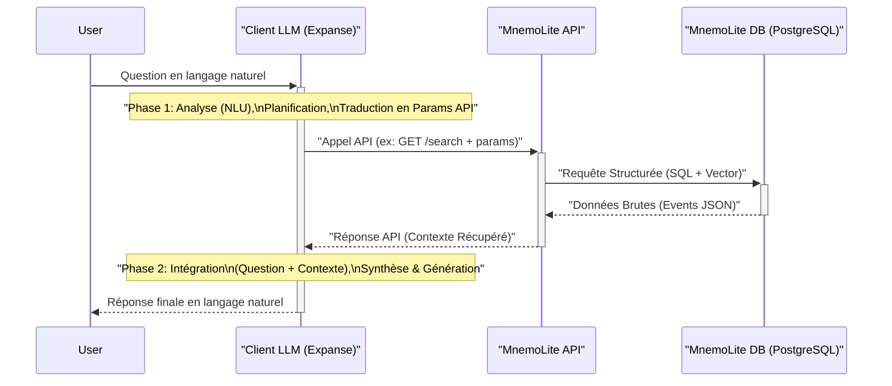

# MnemoLite – Spécification API (v1.0 - Détaillée)

> **Objectif (Ω)** : Définir un contrat clair, versionné, testable et documenté pour intégrer MnemoLite à Expanse et à tout client externe, basé sur REST/JSON et OpenAPI 3.1.

---

## 1. Alternatives considérées (Φ)
| Approche | Description | Avantages | Inconvénients |
|----------|-------------|-----------|---------------|
| **A. REST + JSON (OpenAPI 3.1)** | Endpoints CRUD + recherche, spec auto-générée | Simple, écosystème large, outils (FastAPI) | Verbeux, overfetching potentiel |
| **B. REST + JSON (JSON:API 1.1)** | Conventions fortes (include, sparse fields) | Normalise pagination & liens, moins de bikeshedding | Learning curve, moins d'outils Python |
| **C. gRPC + Protobuf** | Services typés, streaming bi-directionnel | Performances, contrats stricts, code-gen multilang | Plus complexe, firewall/unary http2, UI à fournir |
| **D. GraphQL** | Schéma unique typé, requêtes flexibles | Sous-sélection fine, introspection native | N+1 backend, cache plus dur, complexité DDOS |

> **Décision (Δ)** : **A. REST + JSON + OpenAPI 3.1** pour V1.

---

## 2. Design principes (Ξ)
1. **Stateless** : chaque requête contient tout contexte.
2. **Versionné** : Prefix `/v1/...`, entêtes `X-API-Version`.
3. **Codes HTTP Prédictibles** : 200 (OK), 201 (Created), 400 (Bad Request), 404 (Not Found), 422 (Unprocessable Entity - Validation), 500 (Internal Server Error).
4. **Enveloppe Réponse Consistente** : `{ "data": ..., "meta": ... }` pour les collections/résultats de recherche.
5. **Observabilité** : trace-id dans header `X-Trace-Id`, endpoint `/metrics` Prometheus.

---

## 3. Endpoints principaux (Λ)
| Méthode | Route               | Fonction                                      | Auth       |
|---------|---------------------|-----------------------------------------------|------------|
| POST    | `/v1/events`        | Ingestion d'un événement                      | none (dev) |
| GET     | `/v1/events/{id}`   | Récupérer par UID                             | none       |
| GET     | `/v1/search`        | Recherche vectorielle + filtres               | none       |
| POST    | `/v1/psi/query`     | Question réflexive (Ψ)                         | none       |
| GET     | `/v1/stats`         | KPIs système (M)                              | none       |
| GET     | `/v1/healthz`       | Liveness / readiness                          | none       |

---

## 4. Spécification OpenAPI
```yaml
openapi: 3.1.0
info:
  title: MnemoLite API
  version: "1.0.0" # Version mise à jour
servers:
  - url: http://localhost:8001/v1 # URL locale par défaut
paths:
  /events:
    post:
      summary: Ingestion d'un événement
      operationId: ingest_event_v1_events_post
      requestBody:
        required: true
        content:
          application/json:
            schema:
              $ref: '#/components/schemas/NewEvent'
      responses:
        '201':
          description: Événement créé
          content:
            application/json:
              schema:
                $ref: '#/components/schemas/Event'
        '422':
          description: Erreur de validation
          content:
            application/json:
              schema:
                $ref: '#/components/schemas/HTTPValidationError' # Typique de FastAPI
  /events/{id}:
    get:
      summary: Détail d'un événement
      operationId: get_event_v1_events__id__get
      parameters:
        - name: id
          in: path
          required: true
          schema:
            type: string
            format: uuid
      responses:
        '200':
          description: OK
          content:
            application/json:
              schema:
                $ref: '#/components/schemas/Event'
        '404':
          description: Événement non trouvé
          content:
            application/json:
              schema:
                $ref: '#/components/schemas/ErrorResponse'
        '422':
          description: Erreur de validation (ID invalide)
          content:
            application/json:
              schema:
                $ref: '#/components/schemas/HTTPValidationError'
  /search:
    get:
      summary: Recherche hybride (vecteur + filtres + temps)
      description: >
        Effectue une recherche multi-critères en combinant similarité vectorielle,
        filtres sur les métadonnées et filtres temporels.
      operationId: search_events_v1_search_get
      parameters:
        - in: query
          name: vector_query
          description: "Vecteur de requête (liste de floats) encodé en Base64. Utilisé pour la recherche de similarité."
          schema:
            type: string
            format: base64 # Indique le format attendu
          example: 'WzAuMSwgMC4yLCAwLjNd' # base64 de [0.1, 0.2, 0.3]
        - in: query
          name: top_k
          description: "Nombre de voisins les plus proches à considérer initialement pour la recherche vectorielle (avant filtrage)."
          schema:
            type: integer
            default: 10
            minimum: 1
            maximum: 50 # Correspond à la validation dans la route
        - in: query
          name: filter_metadata # Filtre sur le champ metadata JSONB
          description: "Filtre JSON stringifié sur les métadonnées (ex: {\"key\": \"value\"})."
          schema:
            type: string # Représente un objet JSON stringifié
          example: '{\"event_type\": \"decision\", \"rule_id\": \"M-UpdateLogic\"}'
        - in: query
          name: ts_start
          description: "Timestamp de début pour le filtre temporel (format ISO 8601)."
          schema:
            type: string
            format: date-time
        - in: query
          name: ts_end
          description: "Timestamp de fin pour le filtre temporel (format ISO 8601)."
          schema:
            type: string
            format: date-time
        - in: query
          name: limit
          description: "Nombre maximum de résultats finaux à retourner."
          schema:
            type: integer
            default: 50 # Mis à jour
            minimum: 1
            maximum: 100
        - in: query
          name: offset
          description: "Offset pour la pagination standard."
          schema:
            type: integer
            default: 0
            minimum: 0
      responses:
        '200':
          description: Résultats classés
          content:
            application/json:
              schema:
                $ref: '#/components/schemas/SearchResults'
        '422':
          description: Erreur de validation des paramètres
          content:
            application/json:
              schema:
                $ref: '#/components/schemas/HTTPValidationError'

  /psi/query:
    post:
      summary: Requête réflexive (Ψ)
      operationId: query_psi_v1_psi_query_post
      requestBody:
        required: true
        content:
          application/json:
            schema:
              $ref: '#/components/schemas/PsiQueryRequest'
      responses:
        '200':
          description: Réponse raisonnée
          content:
            application/json:
              schema:
                $ref: '#/components/schemas/PsiQueryResponse'
        '400':
          description: Type de requête Ψ non supporté ou invalide
          content:
            application/json:
              schema:
                $ref: '#/components/schemas/ErrorResponse'
        '422':
          description: Erreur de validation de la requête
          content:
            application/json:
              schema:
                $ref: '#/components/schemas/HTTPValidationError'

  /stats: # Endpoint ajouté pour KPIs (M)
    get:
      summary: Statistiques système
      operationId: get_stats_v1_stats_get
      responses:
        '200':
          description: KPIs MnemoLite
          content:
            application/json:
              schema:
                type: object
                properties:
                  event_count_total: { type: integer }
                  event_count_last_hour: { type: integer }
                  index_size_bytes: { type: integer }
                  avg_query_latency_ms: { type: number }

  /healthz: # Endpoint ajouté pour Kube/Docker
    get:
      summary: Health Check
      operationId: health_check_v1_healthz_get
      responses:
        '200':
          description: Service opérationnel
          content:
            application/json:
              schema:
                type: object
                properties: { status: { type: string, example: "OK" } }
        '503':
          description: Service non disponible (ex: DB inaccessible)
          content:
            application/json:
              schema:
                type: object
                properties: { status: { type: string, example: "Unavailable" } }

components:
  schemas:
    NewEvent:
      type: object
      required: [content] # Timestamp est maintenant géré par défaut par la DB
      properties:
        content:
          type: object
          description: "Contenu flexible de l'événement."
          example: { "type": "prompt", "role": "user", "text": "Explique X." }
        metadata:
          type: object
          description: "Métadonnées associées (tags, IDs externes...)."
          example: { "event_type": "user_interaction", "session_id": "xyz", "source": "cli" }
        # Champs optionnels qui pourraient être dans metadata ou ici :
        # memory_type: { type: string }
        # event_type: { type: string }
        # timestamp: { type: string, format: date-time } # Peut être fourni par client si != NOW()
        # expiration: { type: string, format: date-time } # Si TTL géré au niveau event
    Event:
      type: object
      properties:
        id: { type: string, format: uuid }
        timestamp: { type: string, format: date-time }
        content: { $ref: '#/components/schemas/NewEvent/properties/content' }
        metadata: { $ref: '#/components/schemas/NewEvent/properties/metadata' }
        similarity_score: { type: number, nullable: true, description: "Score de similarité (si recherche vectorielle effectuée, plus bas = plus similaire)" }
    SearchResults:
      type: object
      properties:
        data:
          type: array
          items:
            $ref: '#/components/schemas/Event'
        meta:
          type: object
          properties:
            query_time_ms: { type: number }
            total_hits: { type: integer, nullable: true, description: "Nombre total de résultats correspondants (peut être omis ou approximatif)." } # Nombre total estimé (si dispo)
            limit: { type: integer }
            offset: { type: integer, nullable: true } # Ajouté offset
    PsiQueryRequest:
      type: object
      required: [query_type, params]
      properties:
        query_type:
          type: string
          description: "Type de question réflexive."
          enum: ["causality_chain", "summarize_topic", "explain_decision"]
        params:
          type: object
          description: "Paramètres spécifiques au type de requête."
          example: { "target_event_id": "uuid-de-la-decision", "depth": 3 }
    
    PsiQueryResponse:
      type: object
      properties:
        query_type: { type: string }
        response:
          type: object
          description: "Réponse structurée dépendante du type de requête."
          properties:
            explanation: { type: string }
            evidence_events: { type: array, items: { $ref: '#/components/schemas/Event' } }
            confidence_score: { type: number, nullable: true }
    
    ErrorResponse:
      type: object
      properties:
        error:
          type: object
          properties:
            code: { type: string }
            message: { type: string }
            details: { type: object, nullable: true }
            
    HTTPValidationError: # Standard FastAPI
      type: object
      properties:
        detail:
          type: array
          items:
            type: object
            properties:
              loc: { type: array, items: { type: string } }
              msg: { type: string }
              type: { type: string }
```

---

## 4.1 Exemples d'utilisation (Mapping des Besoins)

Cette section illustre comment les endpoints API, notamment `/search`, répondent aux cas d'usage typiques définis dans le PRD.

| Texte Utilisateur (Exemple)                                                        | Besoin Fonctionnel                      | Endpoint API Principal | Paramètres Clés (Exemples)                                                                                                                               | Notes                                                                   |
| :--------------------------------------------------------------------------------- | :-------------------------------------- | :------------------- | :------------------------------------------------------------------------------------------------------------------------------------------------------- | :---------------------------------------------------------------------- |
| « Montre-moi toutes les décisions autour de `M-UpdateLogic` la semaine dernière » | **1. Événements Chronologiques + Filtre** | `GET /search`        | `filter_metadata={'event_type': 'decision', 'rule_id': 'M-UpdateLogic'}` <br/> `ts_start=<semaine_dernière_debut>` <br/> `ts_end=<semaine_dernière_fin>`   | Utilise le filtre `metadata` (index GIN) et le filtre temporel.         |
| « Trouve la discussion la plus proche de ce nouveau ticket Jira »                  | **2. Similarité / Hybrid Search**       | `GET /search`        | `vector_query=<embedding_ticket_jira>` <br/> `top_k=5` <br/> `filter_metadata={'project': 'XYZ'}` *(optionnel)*                                          | Utilise `vector_query` (index HNSW) et potentiellement des filtres `metadata`. |
| « Tasks > P1 non résolues où le feedback=negative »                                | **3. Métadonnées (Agrégats, Conditions)** | `GET /search`        | `filter_metadata={'event_type': 'task', 'priority': 'P1', 'status': {'$ne': 'resolved'}, 'feedback': 'negative'}` *(Syntaxe filtre exacte TBD)* | Utilise fortement `filter_metadata` (index GIN). La syntaxe exacte pour les opérateurs (`$ne`) dans le JSON stringifié est à définir. |

*Note : Le format exact des paramètres `vector_query` et `filter_metadata` (comment encoder le vecteur et le JSON dans une URL) devra être précisé lors de l'implémentation.* 

---

## 5. Flux de Transformation des Requêtes (Logique Client)

L'API MnemoLite expose des endpoints structurés. La transformation d'une question utilisateur en langage naturel vers un appel API paramétré, puis la transformation de la réponse API en réponse utilisateur compréhensible, relève de la responsabilité du **client** (ex: l'agent Expanse via son LLM).



Le processus typique, souvent assimilable à un pattern RAG (Retrieval-Augmented Generation), implique les étapes suivantes côté client :

1.  **Analyse & Planification (LLM Phase 1) :**
    *   Le client (LLM) reçoit la requête utilisateur (ex: « Pourquoi ai-je priorisé A sur B la semaine dernière, malgré le feedback négatif sur A ? »).
    *   Le LLM analyse l'intention (recherche d'explication) et planifie les informations nécessaires depuis MnemoLite (événements de décision sur A, feedback sur A, événements sur B...).

2.  **Génération des Paramètres API (LLM Phase 1) :**
    *   Le LLM traduit le plan en un ou plusieurs appels API structurés (principalement `GET /search`) avec les paramètres adéquats (filtres `metadata`, `vector_query`, `ts_start`/`end`, etc.).
    *   *(Voir tableau section 4.1 pour exemples de mapping)*

3.  **Récupération du Contexte (Appel API) :**
    *   Le client effectue le(s) appel(s) HTTP vers l'API MnemoLite.
    *   MnemoLite retourne les données brutes pertinentes (événements JSON) issues de PostgreSQL. C'est le **contexte récupéré**.

4.  **Synthèse & Génération (LLM Phase 2) :**
    *   Le client (LLM) reçoit le contexte récupéré (données JSON).
    *   **Crucial :** Le LLM intègre maintenant :
        *   La **question originale** de l'utilisateur.
        *   Le **contexte récupéré** de MnemoLite.
    *   Le LLM raisonne sur l'ensemble pour construire une réponse cohérente, synthétiser les informations, identifier les causalités et formuler une explication en langage naturel.

5.  **Présentation de la Réponse :**
    *   Le client présente la réponse finale générée par le LLM à l'utilisateur.

En résumé, MnemoLite agit comme une **base de connaissances contextuelle et factuelle rapide**, fournissant les éléments bruts via son API. Le **LLM client** est responsable à la fois de **traduire** la question utilisateur en requête API et d'**interpréter/synthétiser** les résultats de l'API en une réponse finale pertinente.

---

## 6. Gestion des erreurs (Exemple)
```