# BRAINSTORM: Document Lifecycle Management for AI-Assisted Deep Thinking

**Date**: 2025-01-20
**Context**: Prolifération de fichiers lors de deep challenges → besoin de structure claire
**Goal**: Créer une méthode "screaming architecture" pour la gestion documentaire

---

## 🎯 PROBLEM STATEMENT

**Observation actuelle** (serena-evolution/02_RESEARCH/):
- 7 fichiers markdown (~3500+ lignes total)
- Mix de: recherche initiale, deep challenges, synthesis, validation reports
- **AUCUNE distinction claire** entre:
  - Temporaire (thinking, scratch)
  - Actif (work in progress)
  - Final (décisions prises)
  - Obsolète (superseded)
  - Archivé (historical reference)

**Conséquences**:
- ❌ Confusion: quel fichier est la source de vérité?
- ❌ Duplication: plusieurs versions de la même information
- ❌ Maintenance: impossible de savoir quoi update vs quoi archiver
- ❌ Cognitive load: 3500 lignes à scanner pour comprendre le status

---

## 💡 CORE INSIGHTS

### Insight #1: Documents have LIFECYCLE stages

```
SCRATCH → DRAFT → ACTIVE → FINALIZED → SUPERSEDED → ARCHIVED
```

Comme du code:
- Development → Staging → Production → Deprecated → Archive

### Insight #2: Different documents serve different PURPOSES

| Purpose | Lifecycle | Examples |
|---------|-----------|----------|
| **Thinking** | Temporary (delete after) | Brainstorm notes, mind maps |
| **Research** | Short-term (days-weeks) | Deep challenges, analysis |
| **Decision** | Permanent (living doc) | ADRs, architectural decisions |
| **Reference** | Archival (read-only) | Historical research, old versions |
| **Control** | Living (always updated) | Mission control, dashboards |

### Insight #3: SCREAMING NAMING is critical

Un fichier doit **crier** son status dès le nom:

```
BAD:  adr_validation_report.md  (quel status? quelle date?)
GOOD: RESEARCH_2025-01-19_adr_validation.md (type + date)
ARCHIVED: ARCHIVE_2025-01-19_deep_challenge.md (clairement obsolète)
```

### Insight #4: Single Source of Truth (SSOT) principle

- **UNE SEULE** source de vérité par sujet
- Tous les autres documents sont soit:
  - En route vers SSOT (drafts, research)
  - Dérivés de SSOT (archives, copies)
  - Challenges de SSOT (explicit contradiction marker)

### Insight #5: Temporal markers are essential

Fichiers sans date = confusion temporelle

```
DEEP_CHALLENGE_SYNTHESIS.md  → Quelle version? Quand?
RESEARCH_2025-01-19_cache_alternatives.md  → Contexte temporel clair
```

---

## 🏗️ PROPOSED METHOD: "SCREAMING DOCUMENT ARCHITECTURE"

### 1. NAMING CONVENTION

**Format**: `{TYPE}_{DATE}_{TOPIC}.md` ou `{TYPE}_{TOPIC}.md` (si permanent)

**Types (SCREAMING prefixes)**:

| Prefix | Purpose | Lifecycle | When to use |
|--------|---------|-----------|-------------|
| `TEMP_` | Temporary scratch | Delete after session | Quick notes, thinking out loud |
| `DRAFT_` | Work in progress | Days to weeks | Structured thinking, not ready |
| `RESEARCH_` | Deep analysis | Weeks to months | Exploration, alternatives, benchmarks |
| `DECISION_` | Final decision | Permanent (living) | Architectural decisions, commitments |
| `ARCHIVE_` | Historical record | Permanent (read-only) | Superseded research, old versions |
| `CONTROL_` | Dashboard/index | Permanent (always updated) | Mission control, indexes |

**Date format**: `YYYY-MM-DD` (ISO 8601, sortable)

**Examples**:
```
TEMP_2025-01-20_cache_brainstorm.md  → Delete tonight
DRAFT_2025-01-19_lsp_integration_plan.md  → WIP, refining
RESEARCH_2025-01-19_cache_technologies_comparison.md  → Deep dive
DECISION_ADR-001_cache_strategy.md  → Permanent (no date, living doc)
ARCHIVE_2025-01-19_deep_challenge_synthesis.md  → Historical
CONTROL_MISSION_CONTROL.md  → Dashboard (no date, always current)
```

### 2. DIRECTORY STRUCTURE

```
serena-evolution/
├── 00_CONTROL/
│   ├── CONTROL_MISSION_CONTROL.md  (single dashboard)
│   ├── CONTROL_DOCUMENT_INDEX.md  (all docs with status)
│   └── README.md  (navigation guide)
│
├── 01_DECISIONS/  (PERMANENT - Source of Truth)
│   ├── DECISION_ADR-001_cache_strategy.md
│   ├── DECISION_ADR-002_lsp_analysis.md
│   ├── DECISION_ADR-003_breaking_changes.md
│   └── DECISION_ADR-004_xxx.md
│
├── 02_RESEARCH/  (ACTIVE - Work in Progress)
│   ├── RESEARCH_2025-01-19_cache_alternatives.md
│   ├── RESEARCH_2025-01-20_performance_benchmarks.md
│   └── README.md  (index with lifecycle status)
│
├── 03_EPICS/  (PERMANENT - Project tracking)
│   ├── EPIC-10_PERFORMANCE_CACHING.md
│   ├── EPIC-11_SYMBOL_ENHANCEMENT.md
│   └── ...
│
├── 88_ARCHIVE/  (READ-ONLY - Historical)
│   ├── 2025-01-19_deep_challenge/
│   │   ├── ARCHIVE_ADR-001_DEEP_CHALLENGE.md
│   │   ├── ARCHIVE_ADR-002_DEEP_CHALLENGE.md
│   │   ├── ARCHIVE_ADR-003_DEEP_CHALLENGE.md
│   │   └── ARCHIVE_SYNTHESIS.md
│   ├── 2025-01-15_apex_consolidation/
│   │   └── ARCHIVE_apex_consolidation_2024.md
│   └── README.md  (archive index)
│
└── 99_TEMP/  (VOLATILE - Can delete anytime)
    ├── TEMP_2025-01-20_brainstorm.md
    ├── TEMP_2025-01-20_notes.md
    └── .gitignore  (ignore all TEMP_ files)
```

**Rationale**:
- `00_` = Control (most important, top of directory)
- `01-09` = Core permanent content
- `88_` = Archive (near end, clearly separate)
- `99_` = Temporary (very end, disposable)

### 3. MANDATORY FRONTMATTER

Every non-TEMP file MUST have YAML frontmatter:

```yaml
---
type: DECISION | RESEARCH | ARCHIVE
status: active | superseded | obsolete | archived
created: 2025-01-19
updated: 2025-01-20
lifecycle: permanent | temporary | archived
supersedes:
  - RESEARCH_2025-01-15_cache_analysis.md
  - DECISION_ADR-001_v1.md
superseded_by: null | DECISION_ADR-001_v2.md
related:
  - DECISION_ADR-002_lsp_analysis.md
  - RESEARCH_2025-01-18_lsp_benchmarks.md
contributors: [Claude, Human]
---
```

**Rationale**: Metadata enables:
- Automated index generation
- Lifecycle tracking
- Dependency management
- Audit trail

### 4. WORKFLOW: From Thinking to Decision

```mermaid
graph TD
    A[💭 Idea/Question] --> B[Create TEMP_xxx.md]
    B --> C{Worth<br/>pursuing?}
    C -->|No| D[🗑️ Delete TEMP_]
    C -->|Yes| E[Promote to DRAFT_]

    E --> F[Structure thinking]
    F --> G[Create RESEARCH_date_topic.md]
    G --> H[Deep analysis]

    H --> I{Decision<br/>ready?}
    I -->|No| H
    I -->|Yes| J[Update DECISION_ADR-xxx.md]

    J --> K[Update CONTROL_MISSION_CONTROL.md]
    K --> L[Archive RESEARCH_<br/>to 88_ARCHIVE/date_topic/]
    L --> M[✅ Complete]

    style D fill:#ff6b6b
    style M fill:#51cf66
```



**Steps explained**:

1. **TEMP phase** (minutes to hours):
   - File: `99_TEMP/TEMP_2025-01-20_cache_thinking.md`
   - Quick notes, stream of consciousness
   - No structure required
   - **Decision**: Delete or promote?

2. **DRAFT phase** (hours to days):
   - File: `02_RESEARCH/DRAFT_2025-01-20_cache_plan.md`
   - Add structure, outline
   - Still exploratory
   - **Decision**: Worth deep dive?

3. **RESEARCH phase** (days to weeks):
   - File: `02_RESEARCH/RESEARCH_2025-01-20_cache_alternatives.md`
   - Deep analysis, benchmarks, comparisons
   - Multiple alternatives explored
   - **Decision**: Ready to commit?

4. **DECISION phase** (permanent):
   - File: `01_DECISIONS/DECISION_ADR-001_cache_strategy.md`
   - Update existing ADR with findings
   - Single source of truth
   - **Action**: Archive research

5. **ARCHIVE phase** (historical):
   - Directory: `88_ARCHIVE/2025-01-20_cache_research/`
   - Move all RESEARCH files with ARCHIVE_ prefix
   - Add summary README
   - Read-only from now on

### 5. LIFECYCLE MANAGEMENT RULES

**Rule 1: Time-based cleanup**
- `TEMP_*` files: Delete after 7 days if not promoted
- `DRAFT_*` files: Archive after 30 days if not promoted
- `RESEARCH_*` files: Archive after decision is made

**Rule 2: Single Source of Truth**
- For each topic, only ONE DECISION file exists
- All RESEARCH files must reference which DECISION they feed into
- If RESEARCH contradicts DECISION → mark with `status: challenge`

**Rule 3: Archive trigger**
- When RESEARCH → DECISION: Archive all related RESEARCH
- When DECISION superseded: Move old DECISION to ARCHIVE
- When EPIC complete: Move to ARCHIVE with completion report

**Rule 4: Mandatory updates**
- Update CONTROL_MISSION_CONTROL.md on every DECISION change
- Update CONTROL_DOCUMENT_INDEX.md on every file creation/archive
- Update related documents' frontmatter when superseding

### 6. TOOLS & AUTOMATION

**Script: `archive_research.sh`**
```bash
#!/bin/bash
# Archive completed research

TOPIC=$1
DATE=$(date +%Y-%m-%d)
ARCHIVE_DIR="88_ARCHIVE/${DATE}_${TOPIC}"

mkdir -p "$ARCHIVE_DIR"

# Move and rename RESEARCH files
for file in 02_RESEARCH/RESEARCH_*${TOPIC}*.md; do
  basename=$(basename "$file")
  new_name="ARCHIVE_${basename#RESEARCH_}"
  mv "$file" "$ARCHIVE_DIR/$new_name"
done

# Create archive index
cat > "$ARCHIVE_DIR/README.md" <<EOF
# Archive: $TOPIC
Archived: $DATE
Source: Research files from 02_RESEARCH/
Status: Integrated into DECISION files

## Files
$(ls -1 "$ARCHIVE_DIR"/*.md | sed 's/.*\//- /')
EOF

echo "✅ Archived $TOPIC to $ARCHIVE_DIR"
```

**Script: `promote_temp.sh`**
```bash
#!/bin/bash
# Promote TEMP to DRAFT/RESEARCH

TEMP_FILE=$1
TYPE=${2:-DRAFT}  # DRAFT or RESEARCH
DATE=$(date +%Y-%m-%d)

basename=$(basename "$TEMP_FILE" .md)
topic=${basename#TEMP_*_}  # Remove TEMP_date_

if [ "$TYPE" = "DRAFT" ]; then
  new_file="02_RESEARCH/DRAFT_${DATE}_${topic}.md"
else
  new_file="02_RESEARCH/RESEARCH_${DATE}_${topic}.md"
fi

# Add frontmatter
cat > "$new_file" <<EOF
---
type: $TYPE
status: active
created: $DATE
updated: $DATE
lifecycle: temporary
supersedes: []
superseded_by: null
related: []
---

$(cat "$TEMP_FILE")
EOF

rm "$TEMP_FILE"
echo "✅ Promoted $TEMP_FILE → $new_file"
```

### 7. INDEX MAINTENANCE

**CONTROL_DOCUMENT_INDEX.md** (auto-generated):

```markdown
# Document Index

**Generated**: 2025-01-20 15:30
**Total documents**: 15

## 📊 By Status

| Status | Count | Location |
|--------|-------|----------|
| Active | 3 | 01_DECISIONS/ |
| Research | 2 | 02_RESEARCH/ |
| Archived | 7 | 88_ARCHIVE/ |
| Temporary | 3 | 99_TEMP/ |

## 🔄 Active Research

| File | Topic | Created | Status | Feeds into |
|------|-------|---------|--------|------------|
| RESEARCH_2025-01-19_cache_alternatives.md | Cache | 2025-01-19 | Active | DECISION_ADR-001 |
| RESEARCH_2025-01-20_lsp_benchmarks.md | LSP | 2025-01-20 | Active | DECISION_ADR-002 |

## ✅ Decisions (Source of Truth)

| File | Topic | Last Updated | Version |
|------|-------|--------------|---------|
| DECISION_ADR-001_cache_strategy.md | Cache | 2025-01-19 | v2.0 |
| DECISION_ADR-002_lsp_analysis.md | LSP | 2025-01-18 | v1.0 |
| DECISION_ADR-003_breaking_changes.md | Breaking | 2025-01-17 | v1.0 |

## 📦 Recent Archives

| Date | Topic | Files | Reason |
|------|-------|-------|--------|
| 2025-01-19 | Deep Challenge | 4 files | Integrated into ADRs |
| 2025-01-15 | APEX Consolidation | 1 file | Historical reference |
```

---

## 🎓 PRINCIPLES SUMMARY

### 1. **Screaming Architecture**
File name must scream: TYPE, DATE (if temporary), TOPIC

### 2. **Lifecycle Clarity**
Every file has clear lifecycle: TEMP → DRAFT → RESEARCH → DECISION → ARCHIVE

### 3. **Single Source of Truth**
One DECISION file per topic, all else feeds into it or archives

### 4. **Temporal Awareness**
Dates on all non-permanent files, updates in frontmatter

### 5. **Explicit Relationships**
Frontmatter declares: supersedes, superseded_by, related

### 6. **Archive on Decision**
When research → decision: archive research immediately

### 7. **Control Dashboard**
MISSION_CONTROL is always updated, always correct

---

## 📋 CHECKLIST: Creating a New Document

- [ ] Choose correct TYPE prefix (TEMP/DRAFT/RESEARCH/DECISION)
- [ ] Add DATE if temporary (YYYY-MM-DD)
- [ ] Use descriptive TOPIC name
- [ ] Add YAML frontmatter (except TEMP)
- [ ] Declare relationships (supersedes, related)
- [ ] Update CONTROL_MISSION_CONTROL.md if DECISION
- [ ] Update CONTROL_DOCUMENT_INDEX.md

## 📋 CHECKLIST: Making a Decision

- [ ] Move from RESEARCH to DECISION (update existing ADR)
- [ ] Update DECISION frontmatter (updated date, supersedes)
- [ ] Archive all related RESEARCH files to 88_ARCHIVE/
- [ ] Update CONTROL_MISSION_CONTROL.md
- [ ] Update CONTROL_DOCUMENT_INDEX.md
- [ ] Add summary to archive README

## 📋 CHECKLIST: Weekly Cleanup

- [ ] Review 99_TEMP/ → delete files >7 days old
- [ ] Review 02_RESEARCH/DRAFT_* → archive if >30 days
- [ ] Review 02_RESEARCH/RESEARCH_* → archive if decision made
- [ ] Regenerate CONTROL_DOCUMENT_INDEX.md
- [ ] Verify CONTROL_MISSION_CONTROL.md is current

---

## 🚀 NEXT STEPS

1. ✅ Create directory structure (00_CONTROL, 88_ARCHIVE, 99_TEMP)
2. ✅ Move existing files to correct locations with correct names
3. ✅ Add frontmatter to all non-TEMP files
4. ✅ Create CONTROL_DOCUMENT_INDEX.md
5. ✅ Update CONTROL_MISSION_CONTROL.md
6. ✅ Create archive scripts
7. ✅ Document as Claude Skill

---

## 💎 VALUE PROPOSITION

**Before**: 7 research files, ~3500 lines, unclear status
**After**: Clear lifecycle, screaming names, automated index

**Benefits**:
- ✅ Instant clarity: filename tells you everything
- ✅ No orphans: every doc has clear relationships
- ✅ Easy cleanup: TEMP can be deleted, ARCHIVE never touched
- ✅ Audit trail: frontmatter tracks full history
- ✅ Scalable: works for 10 or 1000 documents

**Cost**: ~5 minutes overhead per document (frontmatter + naming)
**ROI**: 10× faster navigation, zero confusion
