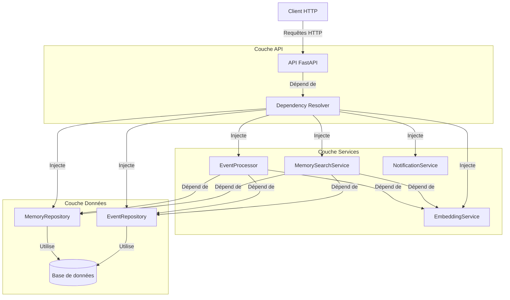
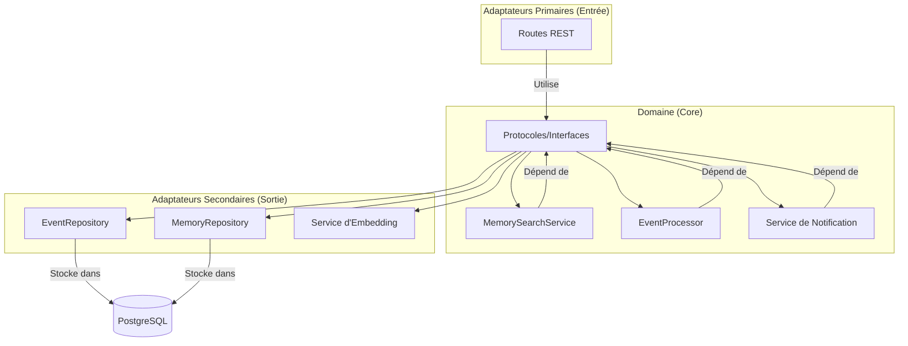
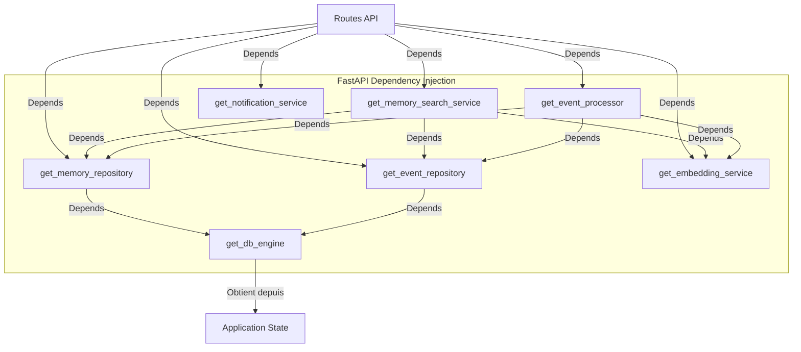
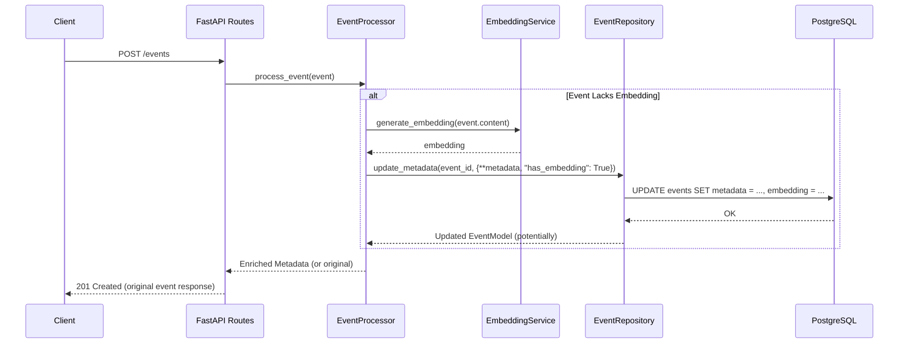
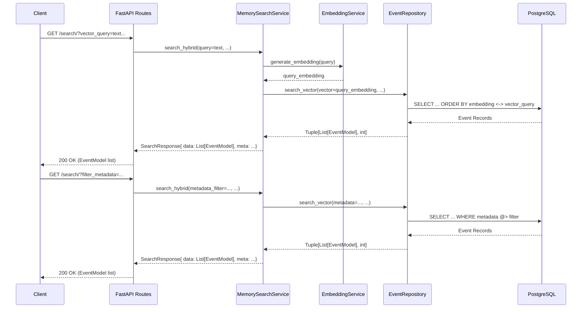
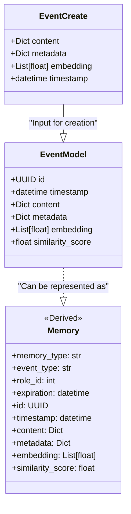
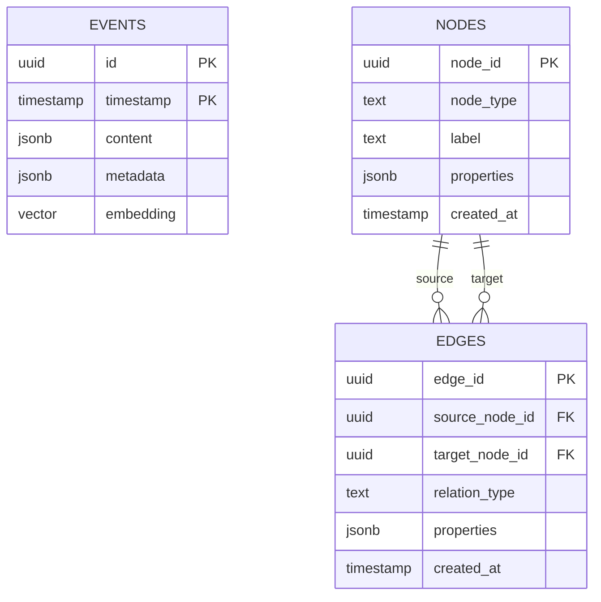

# Diagrammes d'Architecture MnemoLite

Ce document présente divers diagrammes pour visualiser l'architecture, les interactions et les flux de données du système MnemoLite.

## Architecture Globale

## Architecture Ports & Adapters (Hexagonale)

## Injection de Dépendances

## Flux de Traitement des Événements

## Flux de Recherche de Mémoires

## Relations Entre Modèles

## Protocoles et Implémentations

```mermaid
classDiagram
    class EventRepositoryProtocol {
        <<interface>>
        +add(event: EventCreate) EventModel
        +get_by_id(event_id: UUID) EventModel
        +update_metadata(event_id: UUID, metadata: Dict) EventModel
        +delete(event_id: UUID) bool
        +filter_by_metadata(metadata_filter: Dict, limit: int, offset: int) List[EventModel]
        +search_vector(vector, metadata, ts_start, ts_end, limit, offset, distance_threshold) Tuple[List[EventModel], int]
    }
    
    class MemoryRepositoryProtocol {
        <<interface>>
        +add(memory: MemoryCreate) Memory
        +get_by_id(memory_id: UUID) Memory
        +update(memory_id: UUID, memory_update: MemoryUpdate) Memory
        +delete(memory_id: UUID) bool
        +list_memories(limit, skip, memory_type, event_type, role_id, session_id, metadata_filter, ts_start, ts_end, offset) tuple[List[Memory], int]
        +search_by_embedding(embedding, limit, skip, ts_start, ts_end) tuple[List[Memory], int]
    }
    
    class EmbeddingServiceProtocol {
        <<interface>>
        +generate_embedding(text: str) List[float]
        +compute_similarity(item1: Union[str, List[float]], item2: Union[str, List[float]]) float
    }
    
    class MemorySearchServiceProtocol {
        <<interface>>
        +search_by_content(query: str, limit: int) List[Memory]
        +search_by_metadata(metadata_filter: Dict, limit: int, offset: int, ts_start: datetime, ts_end: datetime) List[Memory]
        +search_by_similarity(query: str, limit: int, offset: int, ts_start: datetime, ts_end: datetime) List[Memory]
        +search_hybrid(query, metadata_filter, ts_start, ts_end, limit, offset, distance_threshold) Tuple[List[EventModel], int]
    }
    
    class EventProcessorProtocol {
        <<interface>>
        +process_event(event: EventModel) Dict[str, Any]
        +generate_memory_from_event(event: EventModel) Optional[Memory]
    }
    
    class NotificationServiceProtocol {
        <<interface>>
        +send_notification(user_id: str, message: str, metadata: Optional[Dict[str, Any]]) bool
        +broadcast_notification(message: str, user_ids: Optional[List[str]]) Dict[str, bool]
    }
    
    EventRepositoryProtocol <|.. EventRepository: implements
    MemoryRepositoryProtocol <|.. MemoryRepository: implements
    EmbeddingServiceProtocol <|.. SimpleEmbeddingService: implements
    MemorySearchServiceProtocol <|.. MemorySearchService: implements
    EventProcessorProtocol <|.. EventProcessor: implements
    NotificationServiceProtocol <|.. NotificationService: implements
```

## Schéma de la Base de Données

