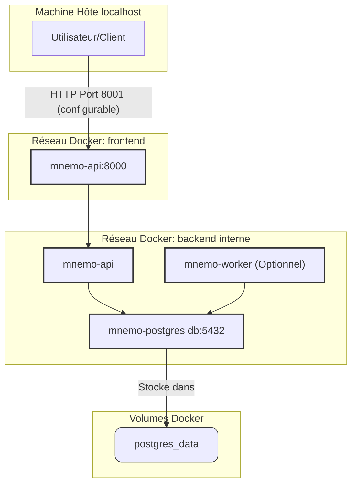

# MnemoLite - Configuration Docker (100% PostgreSQL)

**Version**: 1.3.0 (Aligné ARCH 1.1.0)
**Date**: 2025-04-26

## Vue d'ensemble

Ce document détaille la configuration Docker pour l'environnement de développement et de production de MnemoLite, désormais basé **exclusivement sur PostgreSQL**. Nous utilisons Docker Compose pour orchestrer les différents services nécessaires.

## Configuration optimisée (Version Actuelle)

Cette configuration reflète l'architecture 100% PostgreSQL locale.

### Diagramme d'Architecture Docker (Mermaid)



### Fichier `docker-compose.yml` (Exemple)

```yaml
version: '3.8'

x-logging: &default-logging
  driver: "json-file"
  options:
    max-size: "10m"
    max-file: "3"

services:
  db: # Renommé pour simplicité
    # Image recommandée incluant pgvector:
    image: pgvector/pgvector:pg16-alpine # Ou pg17 quand dispo/stable
    # Alternative: image: postgres:17-alpine
    # Si image postgres standard, installer les extensions via script init
    container_name: mnemo-postgres
    restart: unless-stopped
    deploy:
      resources:
        limits:
          # Ajuster selon votre machine locale (64GB RAM)
          cpus: '2' # Peut être plus généreux
          memory: 4G # Peut être plus généreux
        # reservations: 
        #   memory: 1G
    environment:
      POSTGRES_USER: ${POSTGRES_USER:-mnemo}
      POSTGRES_PASSWORD: ${POSTGRES_PASSWORD:-mnemopass}
      POSTGRES_DB: ${POSTGRES_DB:-mnemolite}
      POSTGRES_INITDB_ARGS: "--data-checksums"
      # Pour pg_cron (si non pré-configuré dans l'image)
      # PGUSER: ${POSTGRES_USER:-mnemo} 
      # CRON_DATABASE: ${POSTGRES_DB:-mnemolite}
    volumes:
      - postgres_data:/var/lib/postgresql/data
      # Monter un script qui crée les extensions: pgvector, pg_partman, pg_cron si nécessaire
      - ./db/init:/docker-entrypoint-initdb.d:ro 
      # Monter la configuration pg_partman et les scripts pg_cron si gérés par fichiers
      # - ./db/partman_config:/etc/pg_partman:ro 
      # - ./db/cron_jobs:/etc/pg_cron:ro
    ports:
      # Expose sur localhost uniquement
      - "127.0.0.1:${POSTGRES_PORT:-5432}:5432"
    healthcheck:
      test: ["CMD-SHELL", "pg_isready -U $${POSTGRES_USER:-mnemo} -d $${POSTGRES_DB:-mnemolite} -q"]
      interval: 5s
      timeout: 5s
      retries: 5
      start_period: 10s
    command: > # Exemple de commande pour charger les extensions nécessaires
      postgres
        # Les shared_preload_libraries doivent être chargées au démarrage
        # Cette partie dépend fortement de l'image utilisée et de la méthode d'installation
        # Exemple si extensions installées:
        # -c shared_preload_libraries='pg_cron,pg_partman_bgw' 
        # -c cron.database_name='${POSTGRES_DB:-mnemolite}' 
        # -c pg_partman_bgw.interval=3600 
        # -c pg_partman_bgw.role='${POSTGRES_USER:-mnemo}' 
        # Paramètres de performance (ajuster pour 64GB RAM)
        -c shared_buffers=16GB 
        -c effective_cache_size=48GB 
        -c maintenance_work_mem=2GB 
        -c work_mem=64MB 
        -c max_parallel_workers_per_gather=4 
        -c max_worker_processes=8 # Inclut autovacuum, logical replication, etc.
    shm_size: 1g # Augmenter si parallelisme important ou extensions gourmandes
    networks:
      backend:
        aliases:
          - db
    logging: *default-logging

  api:
    build:
      context: .
      dockerfile: api/Dockerfile
    container_name: mnemo-api
    restart: unless-stopped
    ports:
      # Expose sur localhost uniquement par défaut
      - "127.0.0.1:${API_PORT:-8001}:8000" # Port externe API
    environment:
      DATABASE_URL: "postgresql://${POSTGRES_USER:-mnemo}:${POSTGRES_PASSWORD:-mnemopass}@db:5432/${POSTGRES_DB:-mnemolite}"
      # Autres variables nécessaires (clés API externes, etc.)
      # OPENAI_API_KEY=${OPENAI_API_KEY} 
      ENVIRONMENT: ${ENVIRONMENT:-development}
    depends_on:
      db:
        condition: service_healthy
    volumes:
      - ./api:/app # Montage code local pour dev
      # - ./certs:/app/certs:ro # Si certificats nécessaires
    deploy:
      resources:
        limits:
          cpus: '1' # Peut être plus généreux
          memory: 1G # Peut être plus généreux
    networks:
      backend:
      frontend:
    logging: *default-logging
    # Healthcheck optionnel sur /v1/healthz peut être ajouté

  worker: # Optionnel
    build:
      context: .
      dockerfile: workers/Dockerfile
    container_name: mnemo-worker
    restart: unless-stopped
    environment:
      DATABASE_URL: "postgresql://${POSTGRES_USER:-mnemo}:${POSTGRES_PASSWORD:-mnemopass}@db:5432/${POSTGRES_DB:-mnemolite}"
      # Autres variables nécessaires
      # OPENAI_API_KEY=${OPENAI_API_KEY} 
      ENVIRONMENT: ${ENVIRONMENT:-development}
      PYTHONUNBUFFERED: "1"
    depends_on:
      db:
        condition: service_healthy
    volumes:
      - ./workers:/app # Montage code local pour dev
      # - ./certs:/app/certs:ro 
    deploy:
      resources:
        limits:
          cpus: '0.5'
          memory: 512M
    networks:
      backend:
    logging: *default-logging

networks:
  frontend: 
  backend:
    internal: true

volumes:
  postgres_data:
```

### Explication des optimisations et choix (Mis à jour)

*   **Stack Simplifiée** : Suppression de ChromaDB. PostgreSQL est maintenant la seule base de données. L'image `pgvector/pgvector` est recommandée pour inclure l'extension `pgvector` facilement.
*   **Gestion des Extensions PG** : L'installation et la configuration de `pgvector`, `pg_partman`, `pg_cron` doivent être gérées, soit via l'image Docker choisie, soit via des scripts SQL dans le volume `docker-entrypoint-initdb.d`, soit via des commandes exécutées après le démarrage. Le pré-chargement (`shared_preload_libraries`) est souvent nécessaire pour `pg_cron` et `pg_partman_bgw`.
*   **Ressources Locales** : Les limites de CPU/mémoire sont des exemples et **doivent être ajustées** pour tirer parti de votre machine locale (64GB RAM). Les paramètres PostgreSQL dans la section `command` sont des suggestions pour une machine avec beaucoup de RAM.
*   **Sécurité & Simplicité** : Exposition des ports sur `127.0.0.1`, réseau `backend` interne, alias réseau `db`. Utilisation d'utilisateurs non-root dans les Dockerfiles (supposé).
*   **Robustesse** : Healthcheck pour `postgres`. `depends_on` avec `condition: service_healthy`.
*   **Développement** : Montage des volumes locaux pour le code API/worker.

## Dockerfiles optimisés (Version Actuelle)

*Les Dockerfiles pour l'API (api/Dockerfile) et le Worker (workers/Dockerfile) montrés précédemment restent valides. Assurez-vous qu'ils n'incluent plus de dépendances liées à ChromaDB.* 

## Configuration .env (Mise à jour)

```dotenv
# PostgreSQL
POSTGRES_USER=mnemo
POSTGRES_PASSWORD=mnemopass
POSTGRES_DB=mnemolite
POSTGRES_PORT=5432 # Port interne PG, mapper différemment si besoin

# API
API_PORT=8001 # Port externe exposé pour l'API

# Clés API (Optionnel)
# OPENAI_API_KEY=votre_clé_openai

# Options Dev/Prod
# ENVIRONMENT=production
```
*Note : Suppression de `CHROMA_PORT`.* 

## Makefile amélioré (Mis à jour)

Le Makefile nécessite une petite adaptation pour la cible `health`.

```makefile
# ... (début du makefile identique) ...

health:
	@echo "API Health (Port ${API_PORT:-8001}):"
	@curl -s -o /dev/null -w '%{http_code}\n' http://localhost:${API_PORT:-8001}/v1/healthz
	@echo "PostgreSQL Health:"
	@$(DC) exec db pg_isready -U $${POSTGRES_USER:-mnemo} -d $${POSTGRES_DB:-mnemolite} -q && echo "OK" || echo "FAIL"

# ... (fin du makefile identique) ...
```
*Note : Suppression du healthcheck pour ChromaDB.* 

## Monitoring et dépannage (Mis à jour)

*Les sections sur les commandes utiles et les problèmes courants restent pertinentes, mais les erreurs spécifiques à ChromaDB ne s'appliquent plus. Les problèmes de connexion concerneront uniquement PostgreSQL.* 
*Ajouter la vérification de la bonne installation et configuration des extensions PostgreSQL (`pgvector`, `pg_partman`, `pg_cron`) comme source potentielle de problèmes.* 

---

**Version**: 1.3.0
**Dernière mise à jour**: 2025-04-26
**Auteur**: Giak (mis à jour par Kosmos) 