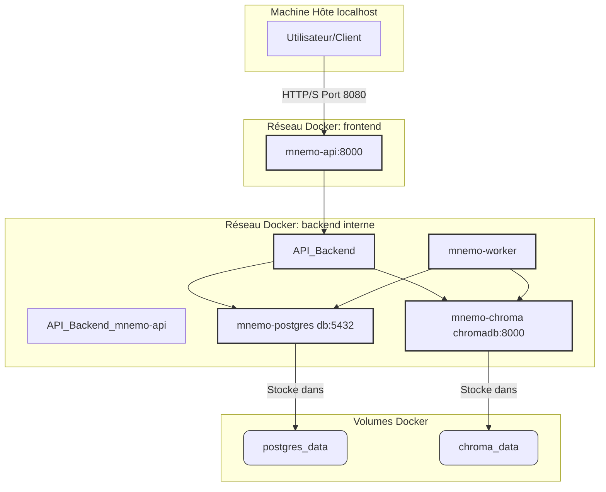

# MnemoLite - Configuration Docker

## Vue d'ensemble

Ce document détaille la configuration Docker pour l'environnement de développement et de production de MnemoLite. Nous utilisons Docker Compose pour orchestrer les différents services nécessaires au fonctionnement de l'application.

## Configuration optimisée (Version Actuelle)

Cette configuration a été mise à jour pour refléter l'état actuel du projet, suite aux harmonisations (PostgreSQL 17, Python 3.12) et optimisations.


### Diagramme d'Architecture Docker (Mermaid)



```yaml
version: '3.8'

x-logging: &default-logging
  driver: "json-file"
  options:
    max-size: "10m"
    max-file: "3"

services:
  postgres:
    image: postgres:17-alpine # Version harmonisée
    container_name: mnemo-postgres
    # user: postgres:postgres # Décommenter si besoin de spécifier l'utilisateur
    restart: unless-stopped
    deploy:
      resources:
        limits:
          cpus: '1' # Ajusté, 2 peuvent être excessifs pour démarrer
          memory: 1G # Ajusté, 2G peuvent être excessifs pour démarrer
        # reservations: # Optionnel
        #   memory: 512M
    environment:
      POSTGRES_USER: ${POSTGRES_USER:-mnemo}
      POSTGRES_PASSWORD: ${POSTGRES_PASSWORD:-mnemopass}
      POSTGRES_DB: ${POSTGRES_DB:-mnemolite}
      POSTGRES_INITDB_ARGS: "--data-checksums"
    volumes:
      - postgres_data:/var/lib/postgresql/data
      - ./db/init:/docker-entrypoint-initdb.d:ro
      - ./db/scripts:/scripts:ro
    ports:
      # Expose sur localhost uniquement par défaut pour la sécurité
      - "127.0.0.1:${POSTGRES_PORT:-5432}:5432"
    healthcheck:
      # Utilisation de $$ pour échapper les variables dans CMD-SHELL
      test: ["CMD-SHELL", "pg_isready -U $${POSTGRES_USER:-mnemo} -d $${POSTGRES_DB:-mnemolite}"]
      interval: 5s
      timeout: 5s
      retries: 5
      start_period: 10s
    command: >
      postgres
               # Extensions préchargées si nécessaire (décommenter)
               # -c shared_preload_libraries=pg_cron,pg_partman_bgw,pgmq
               # -c pg_partman_bgw.interval=3600
               # -c pg_partman_bgw.role=${POSTGRES_USER:-mnemo}
               # -c pg_cron.use_background_workers=on
               # Paramètres de performance (ajuster selon besoin)
               -c shared_buffers=256MB # Réduit pour config initiale
               -c work_mem=16MB
               -c effective_cache_size=512MB # Réduit pour config initiale
               -c maintenance_work_mem=64MB # Réduit pour config initiale
               -c max_parallel_workers_per_gather=2 # Réduit pour config initiale
    shm_size: 512m # Réduit pour config initiale
    networks:
      backend:
        aliases:
          - db # Alias simplifié
    logging: *default-logging

  chromadb:
    image: ghcr.io/chroma-core/chroma:latest
    container_name: mnemo-chroma # Nom harmonisé
    restart: unless-stopped
    deploy:
      resources:
        limits:
          cpus: '1'
          memory: 1G
    volumes:
      - chroma_data:/chroma/chroma
    ports:
      # Expose sur localhost uniquement par défaut
      - "127.0.0.1:${CHROMA_PORT:-8000}:8000"
    environment:
      - CHROMA_DB_IMPL=duckdb+parquet # Assurez-vous que c'est bien le backend voulu
      - PERSIST_DIRECTORY=/chroma/chroma # Variable d'env correcte pour Chroma
      # - ANONYMIZED_TELEMETRY=false # Optionnel: désactiver la télémétrie
    healthcheck:
      test: ["CMD", "curl", "-f", "http://localhost:8000/api/v1/heartbeat"]
      interval: 10s
      timeout: 5s
      retries: 3
      start_period: 15s # Augmenté légèrement
    networks:
      backend:
        aliases:
          - chromadb # Alias standard
    logging: *default-logging

  api:
    build:
      context: ./api # Contexte spécifique
      dockerfile: Dockerfile
      # args: # BuildKit args optionnels
      #   - BUILDKIT_INLINE_CACHE=1
    container_name: mnemo-api
    restart: unless-stopped
    ports:
      # Expose sur localhost uniquement par défaut
      - "127.0.0.1:${API_PORT:-8080}:8000" # Port externe harmonisé
    environment:
      # Utilisation des alias réseau pour la connexion
      - POSTGRES_HOST=db
      - POSTGRES_PORT=5432
      - POSTGRES_USER=${POSTGRES_USER:-mnemo}
      - POSTGRES_PASSWORD=${POSTGRES_PASSWORD:-mnemopass}
      - POSTGRES_DB=${POSTGRES_DB:-mnemolite}
      - CHROMA_HOST=chromadb
      - CHROMA_PORT=8000
      - API_KEY=${API_KEY:-default_api_key}
      - OPENAI_API_KEY=${OPENAI_API_KEY} # Nécessaire si utilisé
      - ENVIRONMENT=${ENVIRONMENT:-development}
      # - UVICORN_WORKERS=2 # Géré par le CMD maintenant si besoin
      # - UVICORN_LOOP=uvloop # Géré par le CMD maintenant si besoin
    depends_on:
      db: # Nom du service simplifié
        condition: service_healthy
      chromadb: # Nom du service standard
        condition: service_healthy
    volumes:
      - ./api:/app # Montage du code local pour dev
      - ./certs:/app/certs:ro # Montage des certificats en lecture seule
      # - api_cache:/app/cache # Volume de cache si nécessaire
    deploy:
      resources:
        limits:
          cpus: '0.5' # Ajusté
          memory: 512M
    networks:
      backend: # Réseau interne
      frontend: # Réseau externe (pour l'accès API)
    logging: *default-logging
    # Healthcheck interne (utilisé par depends_on)
    # Le healthcheck externe peut être fait via le port mappé

  worker:
    build:
      context: ./workers # Contexte spécifique
      dockerfile: Dockerfile
      # args: # BuildKit args optionnels
      #   - BUILDKIT_INLINE_CACHE=1
    container_name: mnemo-worker
    restart: unless-stopped
    environment:
      - POSTGRES_HOST=db
      - POSTGRES_PORT=5432
      - POSTGRES_USER=${POSTGRES_USER:-mnemo}
      - POSTGRES_PASSWORD=${POSTGRES_PASSWORD:-mnemopass}
      - POSTGRES_DB=${POSTGRES_DB:-mnemolite}
      - CHROMA_HOST=chromadb
      - CHROMA_PORT=8000
      - API_KEY=${API_KEY:-default_api_key}
      - OPENAI_API_KEY=${OPENAI_API_KEY} # Nécessaire si utilisé
      - ENVIRONMENT=${ENVIRONMENT:-development}
      - PYTHONUNBUFFERED=1 # Bonne pratique
    depends_on:
      db: # Nom du service simplifié
        condition: service_healthy
      chromadb: # Nom du service standard
        condition: service_healthy
    volumes:
      - ./workers:/app # Montage du code local pour dev
      - ./workers/logs:/app/logs # Volume pour les logs
      - ./certs:/app/certs:ro # Montage des certificats en lecture seule
      # - worker_data:/app/data # Volume de données si nécessaire
    deploy:
      resources:
        limits:
          cpus: '0.5' # Ajusté
          memory: 512M # Ajusté (peut nécessiter plus si gourmand)
    networks:
      backend: # Accès au backend uniquement
    logging: *default-logging
    # Pas de healthcheck complexe nécessaire par défaut pour un worker simple

networks:
  frontend: # Accessible de l'extérieur (sur localhost)
  backend: # Non accessible directement de l'extérieur
    internal: true # Renforce l'isolation

volumes:
  postgres_data:
  chroma_data:
  # api_cache: # Si utilisé
  # worker_data: # Si utilisé
```


### Explication des optimisations et choix

*   **Versionnage** : Utilisation de `postgres:17-alpine` et `python:3.12-slim`.
*   **Sécurité** : Exposition des ports uniquement sur `127.0.0.1` par défaut, réseau `backend` marqué comme `internal`. Utilisation d'utilisateurs non-root dans les Dockerfiles.
*   **Simplicité** : Suppression de Redis. Alias réseau simplifiés (`db`, `chromadb`). Ressources initiales réduites pour faciliter le démarrage sur des machines moins puissantes.
*   **Robustesse** : Healthchecks configurés pour `postgres` et `chromadb`. `depends_on` avec `condition: service_healthy` pour assurer l'ordre de démarrage.
*   **Développement** : Montage des répertoires locaux (`./api:/app`, `./workers:/app`) pour le développement live.

## Dockerfiles optimisés (Version Actuelle)

### Pour l'API (api/Dockerfile)

```dockerfile
# Multi-stage build
FROM python:3.12-slim as builder

# Set working directory
WORKDIR /build

# --- Ajout pour le miroir Debian ---
RUN sed -i 's|http://deb.debian.org/debian|http://ftp.fr.debian.org/debian|g' /etc/apt/sources.list.d/debian.sources

# Install build dependencies (si nécessaire pour certaines libs)
RUN apt-get update && apt-get install -y --no-install-recommends \
    build-essential gcc g++ python3-dev \
    && rm -rf /var/lib/apt/lists/*

# Copy requirements and build wheels
COPY requirements.txt .
RUN pip install --no-cache-dir --upgrade pip wheel setuptools && \
    pip wheel --no-cache-dir --wheel-dir=/app/wheels -r requirements.txt

# --- Runtime stage ---
FROM python:3.12-slim

# Set environment variables
ENV PYTHONUNBUFFERED=1 \
    PYTHONDONTWRITEBYTECODE=1 \
    PATH=/home/appuser/.local/bin:$PATH # Ajout du chemin local bin

WORKDIR /app

# --- Ajout pour le miroir Debian ---
RUN sed -i 's|http://deb.debian.org/debian|http://ftp.fr.debian.org/debian|g' /etc/apt/sources.list.d/debian.sources

# Install runtime dependencies (e.g., curl for healthcheck)
RUN apt-get update && apt-get install -y --no-install-recommends \
    curl \
    && rm -rf /var/lib/apt/lists/*

# Copy wheels from builder stage
COPY --from=builder /app/wheels /wheels

# Install dependencies from wheels
RUN pip install --no-cache-dir /wheels/*

# Copy application code (Couches optimisées si beaucoup de fichiers)
COPY ./api /app
# Si le code change moins souvent que les dépendances, copier plus tard

# Create non-root user and group
RUN groupadd -r appuser && useradd --no-log-init -r -g appuser -m -d /home/appuser appuser && \
    mkdir -p /app/logs /app/certs && \
    chown -R appuser:appuser /app /home/appuser

# Switch to non-root user
USER appuser
WORKDIR /home/appuser # Changer le WORKDIR pour l'utilisateur non-root

# Health check (si nécessaire dans le Dockerfile, sinon via docker-compose)
# HEALTHCHECK --interval=30s --timeout=10s --start-period=5s --retries=3 \
#     CMD curl -f http://localhost:8000/health || exit 1

# Run the API server (Ajuster les workers selon les besoins)
CMD ["uvicorn", "main:app", "--host", "0.0.0.0", "--port", "8000", "--workers", "1"]

```

### Pour les Workers (workers/Dockerfile)

```dockerfile
# Multi-stage build
FROM python:3.12-slim as builder

WORKDIR /build

# --- Ajout pour le miroir Debian ---
RUN sed -i 's|http://deb.debian.org/debian|http://ftp.fr.debian.org/debian|g' /etc/apt/sources.list.d/debian.sources

# Install build dependencies
RUN apt-get update && apt-get install -y --no-install-recommends \
    build-essential gcc g++ python3-dev \
    && rm -rf /var/lib/apt/lists/*

# Copy requirements and build wheels
COPY requirements.txt .
RUN pip install --no-cache-dir --upgrade pip wheel setuptools && \
    pip wheel --no-cache-dir --wheel-dir=/app/wheels -r requirements.txt

# --- Runtime stage ---
FROM python:3.12-slim

# Set environment variables
ENV PYTHONUNBUFFERED=1 \
    PYTHONDONTWRITEBYTECODE=1 \
    PATH=/home/appuser/.local/bin:$PATH # Ajout du chemin local bin

WORKDIR /app

# --- Ajout pour le miroir Debian ---
RUN sed -i 's|http://deb.debian.org/debian|http://ftp.fr.debian.org/debian|g' /etc/apt/sources.list.d/debian.sources

# Install runtime dependencies (si nécessaire)
# RUN apt-get update && apt-get install -y --no-install-recommends curl && rm -rf /var/lib/apt/lists/*

# Copy wheels from builder stage
COPY --from=builder /app/wheels /wheels

# Install dependencies from wheels
RUN pip install --no-cache-dir /wheels/*

# Copy application code
COPY ./workers /app

# Create non-root user and group
RUN groupadd -r appuser && useradd --no-log-init -r -g appuser -m -d /home/appuser appuser && \
    mkdir -p /app/logs /app/data /app/certs && \
    chown -R appuser:appuser /app /home/appuser

# Switch to non-root user
USER appuser
WORKDIR /home/appuser # Changer le WORKDIR

# Run worker script
CMD ["python", "/app/worker.py"] # Utiliser le chemin absolu copié
```
*Note :* L'utilisation de `COPY --from=builder /root/.local /root/.local` dans les exemples précédents a été remplacée par l'installation via wheels, ce qui est plus standard et robuste. L'étape d'installation des dépendances de build (`build-essential`, etc.) est conservée car certaines bibliothèques Python peuvent en avoir besoin même si des wheels sont disponibles.

## Configuration .env (Mise à jour)

```
# PostgreSQL
POSTGRES_USER=mnemo
POSTGRES_PASSWORD=mnemopass
POSTGRES_DB=mnemolite
POSTGRES_PORT=5432 # Optionnel, si différent de 5432

# API
API_PORT=8080 # Port externe pour l'API

# Chroma
CHROMA_PORT=8000 # Port externe pour ChromaDB

# Clés API (Optionnel, à remplir si nécessaire)
# OPENAI_API_KEY=votre_clé_openai
# API_KEY=votre_clé_api_interne

# Options de développement/production
# ENVIRONMENT=production # Mettre à production si nécessaire

# --- Variables liées aux ressources (Optionnel, géré dans docker-compose) ---
# PG_CPU_LIMIT=1
# PG_MEM_LIMIT=1G
# CHROMA_CPU_LIMIT=1
# CHROMA_MEM_LIMIT=1G
# API_CPU_LIMIT=0.5
# API_MEM_LIMIT=512M
# WORKER_CPU_LIMIT=0.5
# WORKER_MEM_LIMIT=512M
```

## Makefile amélioré (Peu de changements nécessaires)

Le Makefile fourni précédemment reste largement pertinent. Les cibles `up`, `down`, `build`, `logs`, `ps`, `shell-*`, `restart`, `clean`, `prune`, `status`, `health` fonctionnent toujours. La cible `setup` pourrait être ajustée si le nom/chemin du script SQL d'initialisation change.

```makefile
.PHONY: up down build logs ps shell-db shell-api shell-worker restart clean prune status health setup production test

# Variables from .env (si présent et nécessaire)
# include .env
# export

# Commandes Docker Compose de base
DC=docker compose

up:
	$(DC) up -d

down:
	$(DC) down --remove-orphans

build:
	DOCKER_BUILDKIT=1 $(DC) build

logs:
	$(DC) logs -f

ps:
	$(DC) ps

# Shells interactifs
shell-db:
	$(DC) exec db psql -U $${POSTGRES_USER:-mnemo} -d $${POSTGRES_DB:-mnemolite}

shell-api:
	$(DC) exec api bash

shell-worker:
	$(DC) exec worker bash

restart:
	$(DC) restart

# Nettoyage
clean:
	$(DC) down --volumes --remove-orphans

prune: clean
	docker system prune -af --volumes

# Monitoring et Status
status:
	@echo "===== Services Status ====="
	@$(DC) ps
	@echo "\\n===== Services Health ====="
	@$(DC) ps --filter "status=running" --format '{{.Names}}' | xargs -I{} docker inspect --format='{{ '{{' }} .Name {{ '}}' }} - {{ '{{' }}if .State.Health{{ '}}' }}{{ '{{' }}.State.Health.Status{{ '}}' }}{{ '{{' }}else{{ '}}' }}no healthcheck{{ '{{' }}end{{ '}}' }}' {} || true

health:
	@echo "API Health:"
	@curl -s -o /dev/null -w '%{http_code}\\n' http://localhost:$${API_PORT:-8080}/health
	@echo "ChromaDB Health:"
	@curl -s -o /dev/null -w '%{http_code}\\n' http://localhost:$${CHROMA_PORT:-8000}/api/v1/heartbeat
	@echo "PostgreSQL Health:"
	@$(DC) exec db pg_isready -U $${POSTGRES_USER:-mnemo} -d $${POSTGRES_DB:-mnemolite} && echo "OK" || echo "FAIL"

# Setup initial (si nécessaire)
setup: build up
	@echo "Waiting for services to start..."
	@sleep 15 # Attendre un peu plus pour être sûr que PG est prêt
	# Adapter le chemin et nom du script si nécessaire
	# $(DC) exec db psql -U $${POSTGRES_USER:-mnemo} -d $${POSTGRES_DB:-mnemolite} -f /docker-entrypoint-initdb.d/01-init.sql
	@echo "Setup checks complete (vérifier manuellement si le script init a bien tourné via les logs de 'db')."

# Lancer des tests (si configurés)
# test:
# 	$(DC) exec api pytest tests/

# Mode Production (si un fichier docker-compose.prod.yml existe)
# production:
# 	$(DC) -f docker-compose.yml -f docker-compose.prod.yml up -d --build
```
*Note sur le Makefile :* J'ai utilisé `$$` pour échapper les variables destinées à être interprétées *dans* le conteneur (comme pour `psql` ou `pg_isready`). La cible `setup` est commentée car l'initialisation se fait maintenant via le montage dans `/docker-entrypoint-initdb.d`. La cible `status` est améliorée pour mieux gérer les conteneurs sans healthcheck.

## Monitoring et dépannage (Enrichi)

### Commandes utiles (Rappel)
```bash
# Voir les ressources consommées
docker stats $(docker ps --format={{.Names}})

# Redémarrer un service
docker compose restart <service-name>

# Voir les logs d'un service (temps réel)
docker compose logs -f <service-name>

# Exécuter une commande dans un container
docker compose exec <service-name> <command>

# Inspecter la configuration/état
docker inspect <container-name>
```

### Problèmes courants et Solutions

1.  **Erreurs `apt-get update` pendant `docker compose build`**
    *   **Symptôme**: Échec de la résolution de `deb.debian.org`, erreurs de connexion, `Failed to fetch`, `Package ... has no installation candidate`.
    *   **Cause**: Problème réseau temporaire, problème de DNS Docker, ou problème avec le miroir Debian par défaut.
    *   **Solution Tentée**:
        1.  Relancer `docker compose build` après quelques minutes.
        2.  **Modifier les `Dockerfile`** pour utiliser un autre miroir (ex: `ftp.fr.debian.org`). Ajouter `RUN sed -i 's|http://deb.debian.org/debian|http://<miroir>/debian|g' /etc/apt/sources.list.d/debian.sources` avant `apt-get update`.
        3.  Vérifier/configurer les DNS de Docker (via les paramètres Docker Desktop ou `/etc/docker/daemon.json` sur Linux, ex: `{"dns": ["8.8.8.8", "1.1.1.1"]}`).

2.  **Erreur `Bind for 0.0.0.0:XXXX failed: port is already allocated` lors de `docker compose up`**
    *   **Symptôme**: Le service (souvent `chromadb` sur 8000 ou `api` sur 8080) ne démarre pas car le port hôte est déjà utilisé.
    *   **Cause**: Un ancien conteneur Docker (de ce projet ou un autre) utilise le port, ou un autre processus sur la machine hôte utilise le port.
    *   **Solution Tentée**:
        1.  Arrêter proprement l'environnement : `docker compose down --remove-orphans`.
        2.  Vérifier quel processus utilise le port sur l'hôte : `sudo netstat -tulnp | grep XXXX` ou `sudo lsof -i :XXXX`.
        3.  Si c'est un processus `docker-proxy` persistant ou un conteneur inconnu, forcer le nettoyage : `docker stop $(docker ps -aq)` suivi de `docker system prune -af --volumes`.
        4.  Si le port est utilisé par un service légitime non-Docker, changer le mappage de port dans `docker-compose.yml` (ex: `ports: - "127.0.0.1:8081:8000"`).

3.  **Échec de compilation de dépendances Python (ex: `psycopg2`)**
    *   **Symptôme**: Erreur pendant `pip install` ou `pip wheel` indiquant qu'un paquet C est manquant (ex: `pg_config executable not found`).
    *   **Cause**: Absence de wheel pré-compilée pour la version de Python/OS/architecture cible, nécessitant une compilation depuis les sources. Les dépendances de compilation C ne sont pas installées dans l'image Docker.
    *   **Solution Tentée**:
        1.  Ajouter les paquets de développement nécessaires dans l'étape `builder` du `Dockerfile` (ex: `apt-get install -y postgresql-client libpq-dev` pour `psycopg2`).
        2.  **Revenir à une version de Python** (ex: 3.12 au lieu de 3.13) pour laquelle des wheels pré-compilées existent.

4.  **PostgreSQL ne démarre pas ou `service_healthy` échoue**
    *   **Symptôme**: Le conteneur `db` redémarre en boucle ou les conteneurs dépendants (`api`, `worker`) échouent à démarrer.
    *   **Cause**: Problème de permissions sur le volume `postgres_data`, ressources insuffisantes (CPU/mémoire/shm), erreur dans les scripts d'initialisation (`/docker-entrypoint-initdb.d`), ou problème de configuration dans `command`.
    *   **Solution**:
        1.  Vérifier les logs du conteneur `db` : `docker compose logs db`.
        2.  S'assurer que les ressources allouées dans `deploy.resources` et `shm_size` sont suffisantes. Commencer avec des valeurs plus basses si nécessaire.
        3.  Vérifier les permissions du dossier `./db/init` sur l'hôte.
        4.  Tester la validité des scripts SQL dans `/docker-entrypoint-initdb.d` en se connectant manuellement après un premier démarrage échoué.
        5.  Vérifier la syntaxe de la section `command` et des paramètres PostgreSQL.

5.  **API ou Worker ne peut pas se connecter à la base de données/ChromaDB**
    *   **Symptôme**: Erreurs de connexion dans les logs de l'API ou du Worker.
    *   **Cause**: Mauvaises variables d'environnement (`POSTGRES_HOST`, `CHROMA_HOST`, etc.), problème réseau entre conteneurs, service dépendant non démarré ou échouant au healthcheck.
    *   **Solution**:
        1.  Vérifier les variables d'environnement passées aux services `api` et `worker` dans `docker-compose.yml`. Assurer la cohérence avec les noms de service et les alias réseau.
        2.  Vérifier que les services `db` et `chromadb` sont bien démarrés (`docker compose ps`) et passent leur healthcheck (`make status`).
        3.  S'assurer que tous les services concernés sont dans le même réseau `backend`.

---

**Version**: 1.2.0
**Dernière mise à jour**: 2025-04-25
**Auteur**: Giak (avec Kosmos) 