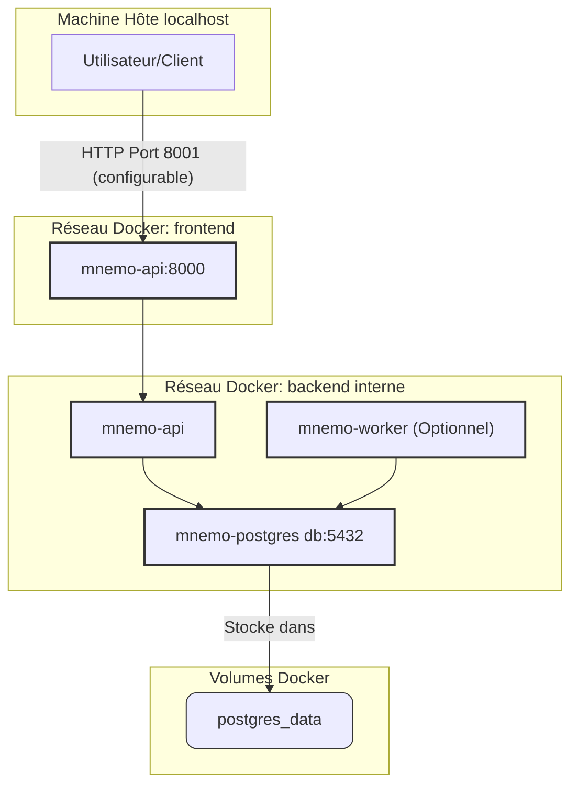

# MnemoLite - Configuration Docker (100% PostgreSQL)

**Version**: 1.3.1 (Aligné ARCH 1.1.1)
**Date**: 2025-04-27

## Vue d'ensemble

Ce document détaille la configuration Docker pour l'environnement de développement et de production de MnemoLite, désormais basé **exclusivement sur PostgreSQL**. Nous utilisons Docker Compose pour orchestrer les différents services nécessaires.

## Configuration optimisée (Version Actuelle)

Cette configuration reflète l'architecture 100% PostgreSQL locale.

### Diagramme d'Architecture Docker (Mermaid)



### Fichier `docker-compose.yml` (Exemple)

```yaml
# Extrait simplifié et aligné sur le docker-compose.yml réel
version: '3.8' # Top-level version

x-logging: &default-logging
  driver: "json-file"
  options:
    max-size: "10m"
    max-file: "3"

services:
  db:
    build:
      context: ./db
      dockerfile: Dockerfile # Contient FROM pgvector/pgvector:pg17 et installe partman
    container_name: mnemo-postgres
    restart: unless-stopped
    deploy: # Section deploy ajoutée
      resources:
        limits:
          cpus: '1'
          memory: 2G
    environment:
      POSTGRES_USER: ${POSTGRES_USER:-mnemo}
      POSTGRES_PASSWORD: ${POSTGRES_PASSWORD:-mnemopass}
      POSTGRES_DB: ${POSTGRES_DB:-mnemolite}
      POSTGRES_INITDB_ARGS: "--data-checksums" # Ajouté
    volumes:
      - postgres_data:/var/lib/postgresql/data
      - ./db/init:/docker-entrypoint-initdb.d:ro # Scripts init SQL
      - ./db/scripts:/app/scripts:ro # Volume ajouté
    ports:
      - "127.0.0.1:${POSTGRES_PORT:-5432}:5432"
    healthcheck:
      test: ["CMD-SHELL", "pg_isready -U $${POSTGRES_USER:-mnemo} -d $${POSTGRES_DB:-mnemolite} -q"]
      interval: 5s
      timeout: 5s
      retries: 5
      start_period: 10s
    command: > # Paramètres PG mis à jour
      postgres
        -c shared_buffers=1GB
        -c effective_cache_size=3GB
        -c maintenance_work_mem=256MB
        -c work_mem=32MB
        -c max_parallel_workers_per_gather=2
    shm_size: 1g
    networks:
      backend:
        aliases:
          - db
    logging: *default-logging

  api:
    build:
      context: .
      dockerfile: api/Dockerfile
    container_name: mnemo-api
    restart: unless-stopped
    ports:
      - "127.0.0.1:${API_PORT:-8001}:8000"
    environment:
      DATABASE_URL: "postgresql+asyncpg://${POSTGRES_USER:-mnemo}:${POSTGRES_PASSWORD:-mnemopass}@db:5432/${POSTGRES_DB:-mnemolite}"
      TEST_DATABASE_URL: "postgresql+asyncpg://${POSTGRES_USER:-mnemo}:${POSTGRES_PASSWORD:-mnemopass}@db:5432/mnemolite_test" # Décommenté
      EMBEDDING_MODEL: ${EMBEDDING_MODEL:-nomic-ai/nomic-embed-text-v1.5}
      EMBEDDING_DIMENSION: ${EMBEDDING_DIMENSION:-768}
      ENVIRONMENT: ${ENVIRONMENT:-development}
    depends_on:
      db:
        condition: service_healthy
    volumes:
      - ./api:/app
      - ./certs:/app/certs:ro
      - ./tests:/app/tests
      - ./scripts:/app/scripts
    deploy: # Section deploy ajoutée
      resources:
        limits:
          cpus: '1'
          memory: 2G
    networks:
      backend:
      frontend:
    logging: *default-logging
    healthcheck: # Healthcheck API mis à jour
      test: ["CMD", "curl", "--fail", "http://localhost:8000/v1/health"]
      interval: 30s
      timeout: 10s
      retries: 5
      start_period: 120s

  worker:
    build:
      context: .
      dockerfile: workers/Dockerfile
    container_name: mnemo-worker
    restart: unless-stopped
    environment:
      DATABASE_URL: "postgresql://${POSTGRES_USER:-mnemo}:${POSTGRES_PASSWORD:-mnemopass}@db:5432/${POSTGRES_DB:-mnemolite}"
      EMBEDDING_MODEL: ${EMBEDDING_MODEL:-nomic-ai/nomic-embed-text-v1.5}
      EMBEDDING_DIMENSION: ${EMBEDDING_DIMENSION:-768}
      ENVIRONMENT: ${ENVIRONMENT:-development}
      PYTHONUNBUFFERED: "1"
    depends_on:
      db:
        condition: service_healthy
    volumes:
      - ./workers:/app
      - ./certs:/app/certs:ro
    deploy: # Section deploy ajoutée
      resources:
        limits:
          cpus: '0.5'
          memory: 512M
    networks:
      backend:
    logging: *default-logging

volumes:
  postgres_data:

networks:
  frontend:
    driver: bridge
  backend:
    internal: true
    driver: bridge
```

### Explication des optimisations et choix (Mis à jour)

*   **Stack Simplifiée** : Suppression de ChromaDB. PostgreSQL est maintenant la seule base de données. L'image `pgvector/pgvector` est recommandée pour inclure l'extension `pgvector` facilement.
*   **Gestion des Extensions PG** : L'installation et la configuration de `pgvector` et `pg_partman` sont gérées via l'image de base (`pgvector/pgvector:pg17`) et le Dockerfile (`db/Dockerfile`). L'extension `pg_cron`, nécessaire pour la quantisation planifiée, n'est **pas installée ou activée par défaut** dans cette configuration ; son ajout et sa configuration (potentiellement via `shared_preload_libraries` dans `docker-compose.yml` et des scripts SQL) sont une étape ultérieure.
*   **Ressources Locales** : Les limites `deploy.resources.limits` (CPU/mémoire) sont présentes dans le `docker-compose.yml` et peuvent être ajustées. Les paramètres PostgreSQL dans la section `command` sont des suggestions pour une machine avec beaucoup de RAM.
*   **Sécurité & Simplicité** : Exposition des ports sur `127.0.0.1`, réseau `backend` interne, alias réseau `db`. Utilisation d'utilisateurs non-root dans les Dockerfiles (supposé).
*   **Robustesse** : Healthcheck pour `postgres`. `depends_on` avec `condition: service_healthy`.
*   **Développement** : Montage des volumes locaux pour le code API/worker.

## Dockerfiles optimisés (Version Actuelle)

*Les Dockerfiles pour l'API (`api/Dockerfile`), la base de données (`db/Dockerfile`) et le Worker (`workers/Dockerfile`) sont cruciaux. Assurez-vous qu'ils n'incluent plus de dépendances liées à ChromaDB (ce qui est le cas) et que `db/Dockerfile` gère bien `pg_partman`.* 

## Configuration .env (Mise à jour)

```dotenv
# PostgreSQL
POSTGRES_USER=mnemo
POSTGRES_PASSWORD=mnemopass
POSTGRES_DB=mnemolite
POSTGRES_PORT=5432 # Port interne PG, mapper différemment si besoin

# API
API_PORT=8001 # Port externe exposé pour l'API

# Embedding Model Configuration (Local)
EMBEDDING_MODEL=nomic-ai/nomic-embed-text-v1.5
EMBEDDING_DIMENSION=768

# Options Dev/Prod
# ENVIRONMENT=production
```
*Note : Suppression de `CHROMA_PORT`.* 

## Makefile amélioré (Mis à jour)

Le Makefile nécessite une petite adaptation pour la cible `health`.

```makefile
# ... (début du makefile identique) ...

health:
	@echo "API Health (Port ${API_PORT:-8001}):"
	@curl -s -o /dev/null -w '%{http_code}\n' http://localhost:${API_PORT:-8001}/v1/health # Corrigé healthz -> health
	@echo "PostgreSQL Health:"
	@$(DC) exec db pg_isready -U $${POSTGRES_USER:-mnemo} -d $${POSTGRES_DB:-mnemolite} -q && echo "OK" || echo "FAIL"

# ... (fin du makefile identique) ...
```
*Note : Suppression du healthcheck pour ChromaDB.* 

## Monitoring et dépannage (Mis à jour)

*Les sections sur les commandes utiles et les problèmes courants restent pertinentes, mais les erreurs spécifiques à ChromaDB ne s'appliquent plus. Les problèmes de connexion concerneront uniquement PostgreSQL.* 
*Ajouter la vérification de la bonne installation et configuration des extensions PostgreSQL (`pgvector`, `pg_partman`, `pg_cron`) comme source potentielle de problèmes.* 

---

**Version**: 1.3.0
**Dernière mise à jour**: 2025-04-26
**Auteur**: Giak (mis à jour par Kosmos) 