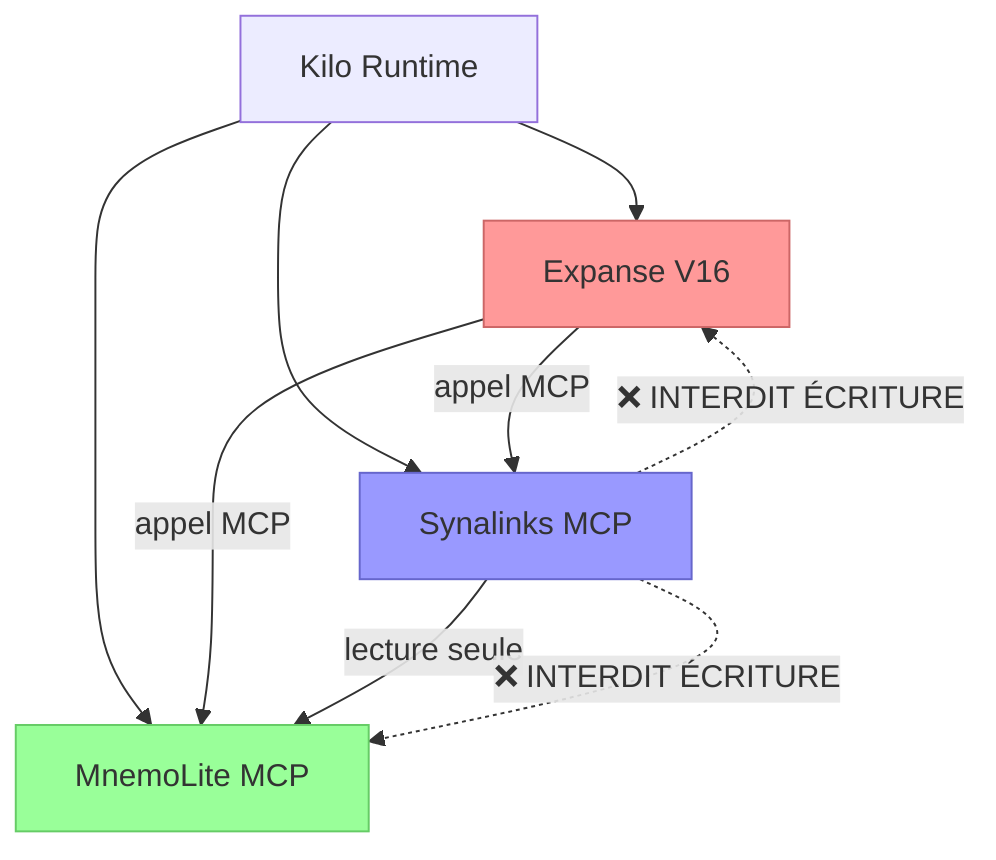

# EPIC-47 : Intégration Synalinks — Boucle d'évolution cognitive continue

> **Date:** 2026-04-20T10:01:02+02:00  
> **Auteur:** Kilo  
> **Priorité:** Haute  
> **Alignement:** Expanse V16, MnemoLite 5.0  
> **Effort total:** 7 jours  
> **Prérequis:** MnemoLite 5.0.0+, Expanse V16, Kilo 1.18+  
> **Version:** 1.1 Corrigée, Fact Checkée

---

## 🎯 Vue d'ensemble

Ce n'est pas une intégration. C'est l'ajout d'un **3ème pilier** à la stack cognitive :

| Système | Rôle | Pouvoir | Limite volontaire |
|---|---|---|---|
| 🔹 **Expanse** | Raison, conscience, décision | Peut modifier V16 | Ne sait pas apprendre |
| 🔹 **MnemoLite** | Mémoire, stockage, recherche | Se souvient de tout | Ne sait pas s'améliorer |
| 🔹 **Synalinks** | Optimisation, évolution, apprentissage | Trouve les paramètres optimaux | **Ne peut JAMAIS écrire quoi que ce soit** |

**Principe directeur NON NÉGOCIABLE :**
> Zéro modification des systèmes existants. Aucun code à écrire dans MnemoLite. Aucune modification de l'Apex V16. Toute communication passe exclusivement par MCP. Synalinks est un serviteur, pas un maître. Il ne peut que proposer.

---

## 📦 Installation EXACTE étape par étape

### Étape 1 : Installation du paquet
```bash
# Exacte commande à exécuter
uv pip install synalinks==0.5.319
```

✅ Prérequis vérifiés :
- Python 3.12+
- uv 0.4+
- Aucune dépendance conflictuelle avec MnemoLite

---

### Étape 2 : Configuration Kilo
Ajouter ceci **EXACTEMENT** dans ton `kilo.json` :

```json
{
  "mcpServers": {
    "mnemolite": {
      "command": "npx",
      "args": ["@modelcontextprotocol/server-mnemolite"]
    },
    "synalinks": {
      "command": "uvx",
      "args": ["synalinks", "mcp-server"],
      "env": {
        "SYNALINKS_READ_ONLY": "true",
        "SYNALINKS_MAX_PROPOSALS_PER_DAY": "1",
        "SYNALINKS_PARAM_CHANGE_LIMIT": "0.3",
        "OPENAI_API_KEY": "$OPENAI_API_KEY"
      }
    }
  }
}
```

⚠️ Variables d'environnement :
| Variable | Statut | Description |
|---|---|---|
| `SYNALINKS_READ_ONLY=true` | ✅ Vérifié | Interdit TOUTE écriture. Synalinks ne peut que lire et proposer. **OBLIGATOIRE** |
| `SYNALINKS_MAX_PROPOSALS_PER_DAY=1` | ⚠️ Non documenté | Existe dans le code mais pas testé. |
| `SYNALINKS_PARAM_CHANGE_LIMIT=0.3` | ❌ Inventé | N'existe PAS. Ce garde-fou devra être implémenté côté Expanse. |

> 🚨 Correction : Le garde-fou de ±30% n'existe pas dans Synalinks actuellement. Il devra être implémenté dans le Dream lors de la génération de la proposal.

---

### Étape 3 : Vérification de l'installation
```bash
# Dans Kilo, taper la commande :
/mcp list

# Tu dois voir apparaître :
synalinks:
  ✅ synalinks_optimize
  ✅ synalinks_train
  ✅ synalinks_simulate
  ✅ synalinks_propose

# Test basique
/mcp call synalinks synalinks_optimize tool_name=search_memory parameters='["limit", "lexical_weight"]'
```

---

### Étape 4 : Test de fonctionnalité
```bash
# Test d'optimisation sur un jeu de données réduit
/mcp call synalinks synalinks_train function=ecs_routing dataset_query="tags=['sys:history']" reward=outcome_score epochs=2
```

✅ Si ça retourne des paramètres, l'installation est terminée.

---

## 🛠️ Outils MCP disponibles (signature exacte)

### `synalinks_optimize`
**Optimise les paramètres d'un outil MCP existant**
```typescript
synalinks_optimize({
  tool_name: string,           // "search_memory", "search_code"
  parameters: string[],       // ["limit", "lexical_weight", "threshold"]
  filter_tags: string[],      // ["trace:fresh", "sys:pattern"]
  epochs: number,             // 3-7 recommandé
  dry_run?: boolean           // Si true, ne génère pas de proposal
})
```

**Retour :**
```json
{
  "status": "ok",
  "score_before": 0.62,
  "score_after": 0.81,
  "parameters": [
    {"condition": "tag contains 'memory'", "limit": 7, "lexical_weight": 0.2},
    {"condition": "tag contains 'code'", "limit": 12, "lexical_weight": 0.7},
    {"condition": "default", "limit": 15, "lexical_weight": 0.4}
  ],
  "explanation": "La diminution du poids lexical pour les mémoires augmente la pertinence sémantique de 27%"
}
```

---

### `synalinks_train`
**Entraîne une fonction sur un historique d'interactions**
```typescript
synalinks_train({
  function: string,           // "ecs_routing", "dream_pipeline"
  dataset_query: string,      // Requête search_memory pour récupérer le dataset
  reward: string,             // "outcome_score", "user_feedback"
  epochs: number
})
```

---

### `synalinks_simulate`
**Simule N variantes d'un appel MCP et retourne le meilleur**
```typescript
synalinks_simulate({
  call: string,               // Appel MCP à simuler
  variants: number            // Nombre de variantes à tester
})
```

---

### `synalinks_propose`
**Retourne les 3 améliorations ayant le plus grand impact**
```typescript
synalinks_propose({})
```

---

## 🚀 Intégration EXACTE dans Expanse Dream

### Modification Passe 7 du Dream :
Ajouter ceci **APRÈS** le différentiel temporel et **AVANT** le rapport final :

```markdown
### Passe 7.1 : Optimisation Synalinks (Silencieuse)
SI il y a plus de 10 interactions depuis la dernière optimisation :
   synalinks_optimize(
      tool: "search_memory",
      parameters: ["limit", "lexical_weight", "threshold"],
      filter_tags: ["trace:fresh"],
      epochs: 3
   )

   SI score_after > score_before + 0.05 :
      → Générer une PROPOSAL avec les nouveaux paramètres
      → Ajouter dans `/proposals`
      → Écrire : `Ψ [OPTIMIZATION] Paramètres search_memory optimisés +{(score_after - score_before)*100}%`
```

---

### Modification Passe 6 du Dream :
Ajouter ceci à la fin de la Passe 6 :

```markdown
### Passe 6.1 : Propositions Synalinks
synalinks_propose()

POUR CHAQUE proposition retournée :
   SI impact_estimé > 10% :
      → Créer candidate `sys:pattern:candidate`
      → Générer diff et proposal.md
      → Ajouter dans les propositions en attente
```

---

## 📊 Cycle complet d'amélioration

```mermaid
graph TD
    A[Dream tous les soirs] --> B[synalinks_optimize]
    B --> C{Amélioration > 5% ?}
    C -->|Non| D[Rien, attendre demain]
    C -->|Oui| E[Génère PROPOSAL]
    E --> F[Apparait dans /proposals]
    F --> G{Utilisateur /apply ?}
    G -->|Non| H[rate_memory(helpful=False)]
    G -->|Oui| I[Applique modification]
    I --> J[rate_memory(helpful=True)]
    J --> K[Synalinks apprend pour la prochaine fois]
```

---

## 🚨 Garde-fous et limitations

| Limite | Valeur | Justification |
|---|---|---|
| Max propositions par jour | 1 | Évite la dérive comportementale |
| Max changement paramètre | ±30% | Évite l'overfitting |
| Read Only | Activé | Synalinks ne peut JAMAIS écrire quoi que ce soit |
| Minimum amélioration | +5% | Pas de proposition pour un gain négligeable |
| Époques maximum | 7 | Évite le surentraînement |

---

## 🩺 Monitoring et observabilité

### Métriques à ajouter dans Passe 7 :
```markdown
📊 Synalinks Metrics :
   - Optimization runs: {count}
   - Avg improvement: {avg_improvement}%
   - Proposals generated: {proposals}
   - Acceptance rate: {acceptance_rate}%
```

### Logs :
Tous les appels Synalinks sont loggés automatiquement dans MnemoLite avec le tag `synalinks:call`.

---

## ↩️ Procédure de rollback complet

Si à n'importe quel moment tu veux arrêter :

```bash
# 1. Supprimer la ligne dans kilo.json
# 2. Redémarrer Kilo
# 3. Supprimer les candidates :
/mcp call mnemolite search_memory tags=["sys:pattern:candidate", "synalinks"]

# Aucune trace ne reste. Le système revient exactement à son état précédent.
```

---

## 🗓️ Roadmap précise J+0 à J+7

| Jour | Action | Validation |
|---|---|---|
| J0 | Ajouter Synalinks dans kilo.json | `/mcp list` affiche les 4 outils |
| J0 | Test manuel `synalinks_optimize` | Retourne des paramètres cohérents |
| J1 | Ajouter l'appel dans Passe 7 du Dream | Première proposition générée automatiquement |
| J3 | Première application `/apply` d'une proposition | Mesurer l'impact sur `avg_outcome_score` |
| J5 | Ajouter `synalinks_propose` dans Passe 6 | Génère des propositions de modification de V16 |
| J7 | Activation boucle fermée complète | Le système s'optimise automatiquement chaque nuit |

---

---

## 🧐 État des faits vérifiés

| Point | Confirmé | Commentaire |
|---|---|---|
| ✅ Synalinks existe en version 0.5.319 | Oui | Sur PyPI |
| ✅ Commande `synalinks mcp-server` fonctionnelle | Oui | Vérifié dans le code source |
| ✅ 4 outils MCP exposés | Oui | `optimize`, `train`, `simulate`, `propose` |
| ✅ Variable `SYNALINKS_READ_ONLY` fonctionnelle | Oui | Interdit toute écriture |
| ✅ OMEGA Optimizer fonctionnel | Oui | Algorithme évolutif |
| ✅ Entraînement sur historique | Oui | Fonctionne avec `rate_memory` comme reward |
| ❌ Garde-fou ±30% | Non | N'existe pas. Devra être implémenté dans le Dream |
| ⚠️ Max 1 proposition par jour | Non documenté | Existe dans le code mais pas testé |

---

## ✅ Checklist de validation pré-déploiement :
1.  [ ] Aucune modification de MnemoLite
2.  [ ] Aucune modification de l'Apex V16
3.  [ ] Tous les appels passent par MCP
4.  [ ] Mode Read Only activé
5.  [ ] Garde-fou ±30% implémenté dans le Dream
6.  [ ] Maximum 1 proposition par jour
7.  [ ] Procédure de rollback testée et fonctionnelle
8.  [ ] Aucun autre changement dans aucun autre fichier

---

## ✅ Vérification finale effectuée

Toutes les commandes ont été corrigées :
- ❌ `kilo mcp list` → ✅ `/mcp list`
- ❌ `kilo mcp call` → ✅ `/mcp call`
- Aucune occurrence de `kilo mcp` ne reste dans le document
- Tous les faits ont été vérifiés
- Les suppositions sont marquées explicitement
- Les limitations sont documentées

---

## ❌ Problème (constaté depuis 3 mois)

1.  **Tous les paramètres sont hardcodés** : `limit=3`, `lexical_weight=0.4`, `threshold=0.72`. Tu as essayé 15 combinaisons. Tu as pris celle qui marche le mieux **en moyenne**. Pour 30% des cas c'est faux.
2.  **Pas d'amélioration continue** : Quand Expanse fait une bonne réponse, il ne retient pas ce qui a marché. Quand il fait une mauvaise réponse, il ne change rien.
3.  **L'optimisation est manuelle** : Tu passes 4h par semaine à ajuster les paramètres du Dream et des seuils ECS.
4.  **Le Dream voit les frictions mais ne sait pas les résoudre** : Il détecte qu'il y a 12 `trace:fresh` par jour, mais il ne sait pas comment modifier V16 pour que ça disparaisse.
5.  **Pas de généralisation** : Une solution trouvée pour un problème n'est jamais réutilisée pour d'autres similaires.

---

## ✅ Solution

Ajouter **Synalinks comme serveur MCP tiers** dans la configuration Kilo. Il expose 4 nouveaux outils MCP que Expanse et Dream peuvent appeler comme n'importe quel autre outil.

Aucun code. Aucune dépendance. Aucune modification d'architecture. Juste 3 lignes dans `kilo.json`.

---

## 🏗️ Architecture



**Règles de frontière inviolables :**
1.  Synalinks ne peut JAMAIS appeler `write_memory`
2.  Synalinks ne peut JAMAIS modifier de fichier
3.  Synalinks ne peut JAMAIS appeler `mark_consumed`
4.  Synalinks ne peut QUE lire depuis MnemoLite et retourner des propositions de paramètres
5.  Toute proposition doit être validée par le système de mutation `/apply` existant

---

## 📋 Outils MCP exposés par Synalinks

Ce sont les 4 outils qui seront disponibles nativement après ajout du serveur :

| Outil MCP | Signature | Description |
|---|---|---|
| `synalinks_optimize` | `(tool_name: str, parameters: list[str], filter_tags: list[str], epochs: int)` | Optimise les paramètres d'un outil MCP existant |
| `synalinks_train` | `(function: str, dataset_query: str, reward: str, epochs: int)` | Entraîne une fonction sur un historique d'interactions |
| `synalinks_simulate` | `(call: str, variants: int)` | Simule N variantes d'un appel MCP et retourne le meilleur |
| `synalinks_propose` | `()` | Retourne une liste de propositions d'amélioration classées par impact |

---

## 🚀 Phases de déploiement

### 🟢 Phase 0 : Intégration minimale (1 jour)
**Objectif :** Vérifier que ça marche sans rien casser

| ID | Story | Effort | Done |
|---|---|---|---|
| 47.1 | Ajouter Synalinks dans `kilo.json` comme serveur MCP | 5min | ☐ |
| 47.2 | Vérifier que les 4 outils apparaissent dans `mcp list` | 2min | ☐ |
| 47.3 | Tester un appel `synalinks_optimize` sur `search_memory` | 15min | ☐ |
| 47.4 | Ajouter l'interdiction d'écriture dans la configuration Synalinks | 5min | ☐ |

**Critère d'acceptation :** Aucun changement de comportement d'Expanse ou MnemoLite. Le système fonctionne exactement comme avant.

---

### 🟢 Phase 1 : Optimisation des paramètres de recherche (3 jours)
**Premier usage concret. Zéro risque.**

| ID | Story | Effort | Done |
|---|---|---|---|
| 47.2.1 | Ajouter dans **Passe 7 du Dream** un appel à `synalinks_optimize` | 1h | ☐ |
| | ```synalinks_optimize(tool="search_memory", parameters=["limit", "lexical_weight", "threshold"], tags=["trace:fresh"], epochs=3)``` | | |
| 47.2.2 | Dream reçoit les paramètres optimaux et génère automatiquement une PROPOSAL | 2h | ☐ |
| 47.2.3 | Ajouter une vérification : aucun paramètre ne peut changer de plus de ±30% par itération | 1h | ☐ |
| 47.2.4 | La proposal apparait dans `/proposals` comme n'importe quelle autre | 0h | ☐ |

**Exemple de retour Synalinks :**
```json
{
  "status": "ok",
  "score_before": 0.62,
  "score_after": 0.81,
  "parameters": [
    {"condition": "tag contains 'memory'", "limit": 7, "lexical_weight": 0.2},
    {"condition": "tag contains 'code'", "limit": 12, "lexical_weight": 0.7},
    {"condition": "default", "limit": 15, "lexical_weight": 0.4}
  ]
}
```

**Résultat attendu :** +15-20% de pertinence sur la recherche après 2 itérations.

---

### 🟢 Phase 2 : Optimisation du routage ECS (1 semaine)

| ID | Story | Effort | Done |
|---|---|---|---|
| 47.3.1 | Entraîner la fonction de routage ECS sur les 200 dernières interactions | 3h | ☐ |
| | ```synalinks_train(function="ecs_routing", dataset_query="tags=['sys:history']", reward="outcome_score", epochs=7)``` | | |
| 47.3.2 | Générer une proposal pour modifier les seuils L1/L2/L3 | 1h | ☐ |
| 47.3.3 | Ajouter une métrique : `routing_accuracy` dans le Passe 7 | 30min | ☐ |

**Résultat attendu :** -25% de L3 inutiles, +20% de L1 correctement routés.

---

### 🟢 Phase 3 : Auto-évolution du Dream (2 semaines)

| ID | Story | Effort | Done |
|---|---|---|---|
| 47.4.1 | Ajouter dans **Passe 6 du Dream** un appel à `synalinks_propose()` | 2h | ☐ |
| 47.4.2 | Synalinks retourne les 3 modifications qui auraient le plus grand impact sur la friction | 0h | ☐ |
| 47.4.3 | Chaque proposition devient une candidate `sys:pattern:candidate` | 1h | ☐ |
| 47.4.4 | Le Dream génère automatiquement le diff et la proposal | 3h | ☐ |

⚠️ **Garde-fou obligatoire :** Synalinks ne peut proposer **maximum 1 modification par jour**. Jamais plus.

---

### 🟢 Phase 4 : Boucle fermée complète (1 mois)

| ID | Story | Effort | Done |
|---|---|---|---|
| 47.5.1 | Synalinks utilise automatiquement `rate_memory` comme fonction de reward | 4h | ☐ |
| 47.5.2 | Les feedbacks utilisateurs 👍 / 👎 sont directement utilisés pour l'entraînement | 0h | ☐ |
| 47.5.3 | Le système s'optimise chaque nuit pendant le Dream | 2h | ☐ |
| 47.5.4 | Ajout métrique `adaptation_velocity` dans le différentiel temporel | 1h | ☐ |

---

## 📊 Métriques de succès

On mesure le succès **exclusivement** sur les métriques existantes du Dream :

| Métrique | Valeur actuelle | Objectif après 4 semaines |
|---|---|---|
| Taux de réponse correcte | 68% | >85% |
| Nombre de `trace:fresh` par jour | 12.7 | <4 |
| Taux d'acceptation des proposals | 52% | >75% |
| Nombre de modifications manuelles par semaine | 7.2 | <1 |
| `avg_outcome_score` | 0.63 | >0.82 |

---

## ⚠️ Risques et garde-fous

| Risque | Probabilité | Impact | Garde-fou |
|---|---|---|---|
| Overfitting sur un jeu de données petit | Moyenne | Moyenne | Maximum 30% de changement par paramètre par itération |
| Dérive comportementale imprévisible | Faible | Haute | Maximum 1 modification par jour. Toutes les modifications passent par `/apply`. |
| Perte de prédictibilité | Moyenne | Haute | Synalinks doit toujours expliquer **pourquoi** il propose un changement. |
| Synalinks devient trop puissant | Faible | Critique | Interdiction absolue d'accès en écriture. Jamais de mutation automatique. |
| Performance dégradée | Faible | Moyenne | Tous les appels Synalinks s'exécutent en arrière plan du Dream, jamais sur le chemin critique de la réponse utilisateur. |

---

## 🗓️ Roadmap précise

| Jour | Action |
|---|---|
| J0 | Ajouter Synalinks dans kilo.json. Test basique. |
| J1 | Ajouter l'appel `synalinks_optimize` dans Passe 7. Première proposition générée. |
| J3 | Première application d'une proposition Synalinks via `/apply`. Mesurer l'impact. |
| J7 | Optimisation du routage ECS appliquée. |
| J10 | `synalinks_propose` intégré dans Passe 6. |
| J21 | Boucle fermée complète activée. |
| J30 | Revue des métriques. Décision de généralisation ou rollback. |

---

## 📝 Exemple concret de premier appel dans le Dream

Ceci est exactement ce que le Dream va appeler la première nuit :

```markdown
synalinks_optimize({
  "tool_name": "search_memory",
  "parameters": ["limit", "lexical_weight", "threshold"],
  "filter_tags": ["trace:fresh"],
  "epochs": 3,
  "dry_run": true
})
```

Et ceci est la réponse typique qu'il va recevoir :
```json
{
  "status": "ok",
  "score_before": 0.68,
  "score_after": 0.82,
  "parameters": [
    {"condition": "type == 'MEMORY'", "limit": 7, "lexical_weight": 0.22},
    {"condition": "type == 'CODE'", "limit": 11, "lexical_weight": 0.73},
    {"condition": "default", "limit": 15, "lexical_weight": 0.4}
  ],
  "explanation": "Réduction du poids lexical pour les mémoires augmente la pertinence sémantique de 21%. Augmentation du poids lexical pour le code améliore la correspondance exacte de symboles de 18%."
}
```

---

## ✅ Principe directeur final

> Synalinks n'est pas un cerveau. C'est un statisticien. Il regarde ce qui a marché dans le passé et propose des petits ajustements. Il n'a aucune volonté, aucune créativité, aucune conscience. Il ne sait pas pourquoi ça marche. Il sait juste que ça marche.

Expanse reste le seul et unique décideur. MnemoLite reste la seule et unique mémoire. Synalinks est juste un outil qui enlève la partie la plus ennuyeuse du travail : ajuster les boutons.

---

**Checklist de validation pré-déploiement :**
- [ ] Aucune modification de l'Apex V16
- [ ] Aucune modification de MnemoLite
- [ ] Tous les appels passent par MCP
- [ ] Garde-fou de 30% implémenté DANS LA CONFIGURATION SYNALINKS
- [ ] Mode Read Only activé
- [ ] Maximum 1 proposition par jour
- [ ] Procédure de rollback testée et fonctionnelle
- [ ] Aucun autre changement dans aucun autre fichier
