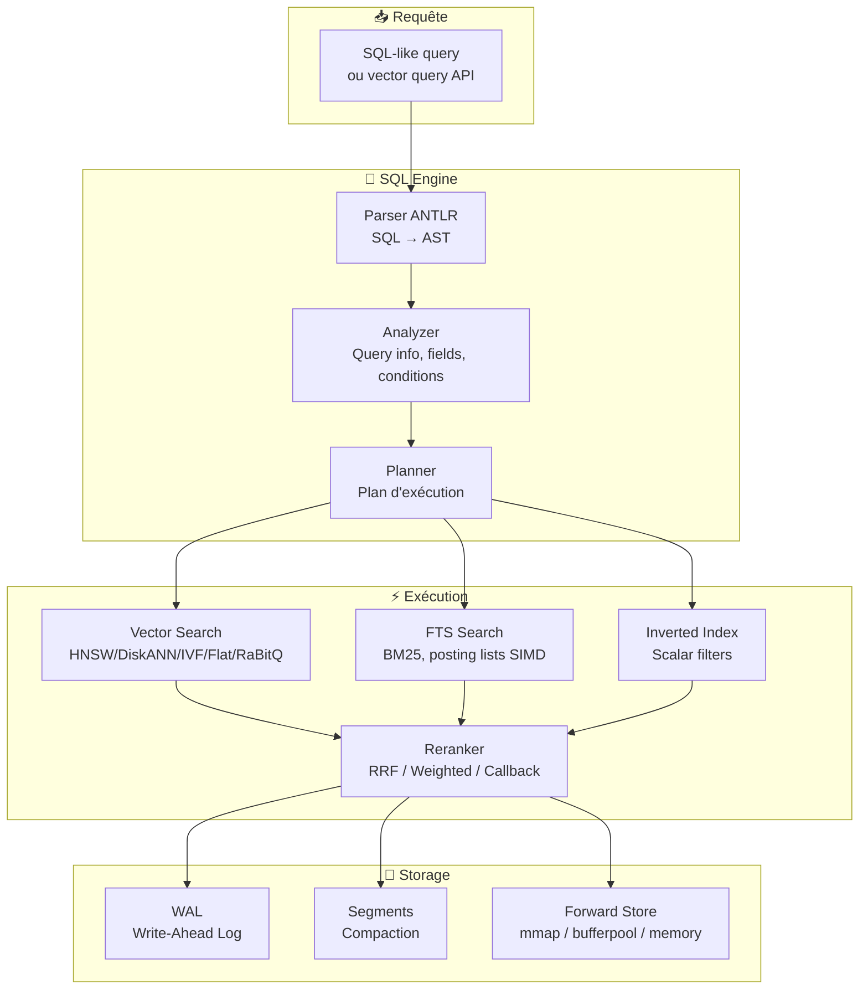
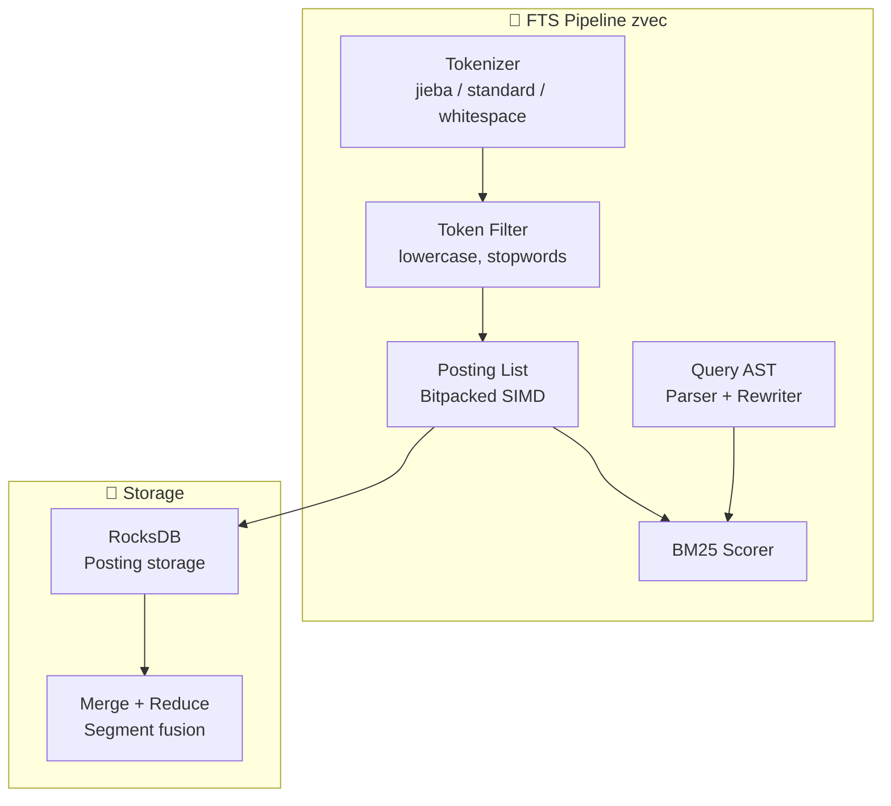
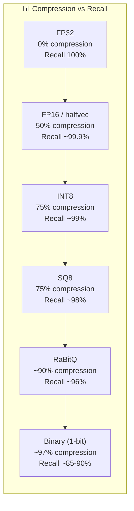

# 📊 Rapport Comparatif : MnemoLite vs zvec (Alibaba)

> **Date** : Juin 2026
> **Auteur** : Analyse automatisée
> **Version MnemoLite** : 5.0.0-dev
> **Version zvec** : 0.5.0 (juin 2026)
> **Source zvec** : `https://github.com/alibaba/zvec` — clone `--depth 1` analysé

---

## Table des Matières

1. [Vue d'Ensemble](#1-vue-densemble)
2. [Positionnement Fondamental](#2-positionnement-fondamental)
3. [Architecture de zvec](#3-architecture-de-zvec)
4. [Architecture de MnemoLite](#4-architecture-de-mnemolite)
5. [Comparaison Détaillée par Couche](#5-comparaison-détaillée-par-couche)
6. [Analyse des Index Vectoriels](#6-analyse-des-index-vectoriels)
7. [Analyse du Full-Text Search](#7-analyse-du-full-text-search)
8. [Analyse de la Quantization](#8-analyse-de-la-quantization)
9. [Analyse du Pipeline de Requête](#9-analyse-du-pipeline-de-requête)
10. [Analyse des Extensions Python](#10-analyse-des-extensions-python)
11. [Avantages et Inconvénients](#11-avantages-et-inconvénients)
12. [Idées Actionnables pour MnemoLite](#12-idées-actionnables-pour-mnemolite)
13. [Roadmap Suggérée](#13-roadmap-suggérée)

---

## 1. Vue d'Ensemble

| Critère | **zvec (Alibaba)** | **MnemoLite** |
|---------|-------------------|---------------|
| **Version** | 0.5.0 (juin 2026) | 5.0.0-dev |
| **Langage cœur** | C++ (80%, ~211K LOC) | Python (FastAPI + SQLAlchemy) |
| **Licence** | Apache-2.0 | MIT |
| **Moteur vectoriel** | Proxima (Alibaba, custom C++) | pgvector 0.8.1 (PostgreSQL extension) |
| **Base de données** | Custom on-disk (segments, WAL, mmap/bufferpool) | PostgreSQL 18 + pgvector + pg_trgm + pg_partman |
| **Cache** | In-process (mmap) | Redis 7 (L2) + In-Memory (L1) |
| **Déploiement** | `pip install zvec` / `npm install @zvec/zvec` | Docker Compose (8 conteneurs) |
| **Plateformes** | Linux, macOS, Windows, Android, iOS | Linux (Docker) |
| **RAM requise** | ~50-200 MB (sans modèle embedding) | ~8-24 GB (avec modèles locaux) |
| **Index vectoriels** | 5+HNSW, DiskANN, IVF, Flat, HNSW+RaBitQ, Sparse+HNSW | 2: HNSW, IVFFlat (via pgvector) |
| **Quantization** | FP16, INT8, SQ8, RaBitQ, Binary (1-bit) | halfvec (50% FP32) + ONNX INT8 (BGE-M3) |
| **Full-Text Search** | ✅ Moteur FTS complet (BM25, jieba, SIMD posting) | ⚠️ pg_trgm + BM25 reranking |
| **Embeddings** | Extensible: sentence-transformers, OpenAI, Jina, Qwen, HTTP, custom | BGE-M3 (1024D TEXT) + Jina (768D CODE), dual TEXT/CODE |
| **Reranking** | RRF, Weighted, Callback, Multi-Vector | RRF + BM25 reranking |
| **MCP** | ❌ Non | ✅ 34 outils, Streamable HTTP |
| **Graphe de code** | ❌ Non | ✅ Tree-sitter AST + LSP + graphe |
| **Mémoire sémantique** | ❌ Non (base vectorielle pure) | ✅ Decay, outcome, consolidation, entities |
| **Tests** | ~500+ tests C++ + pytest | 1570+ tests pytest |
| **Stars GitHub** | ~9.8k | Privé |

---

## 2. Positionnement Fondamental

```
┌──────────────────────────────────────────────────────────────────────┐
│                        zvec vs MnemoLite                             │
├──────────────────────────────────────────────────────────────────────┤
│                                                                      │
│  zvec (Alibaba)              MnemoLite                                │
│  ─────────────              ─────────                                │
│  "SQLite du vector search"  "Système de mémoire pour agents IA"     │
│                                                                      │
│  Couche: Infrastructure     Couche: Application + Intelligence       │
│  Cœur: C++ (Proxima)        Cœur: Python (FastAPI)                   │
│  Rôle: Stocker/chercher     Rôle: Comprendre/mémoriser/persister    │
│        des vecteurs               du code + des conversations        │
│                                                                      │
│  Compétition: Faiss,        Compétition: Mem0, Letta,               │
│  ChromaDB, LanceDB           MemGPT, AgentMemory                     │
│                                                                      │
│  Utilisateur: Développeur   Utilisateur: Agent LLM                   │
│  d'applications vectorielles (Claude, KiloCode)                       │
│                                                                      │
│  API: Python/JS/C           API: MCP (34 outils)                     │
└──────────────────────────────────────────────────────────────────────┘
```

**Ces deux projets sont complémentaires, pas concurrents.** zvec est une **base vectorielle embarquée de bas niveau** (comparable à SQLite pour les vecteurs). MnemoLite est un **système cognitif de haut niveau** pour agents IA, qui utilise déjà une base vectorielle (pgvector).

zvec pourrait techniquement servir de **remplacement ou d'alternative à pgvector** dans MnemoLite, mais les architectures (in-process vs client-serveur) rendent cette substitution non triviale.

---

## 3. Architecture de zvec

### 3.1 Arbre de code

```
zvec/
├── src/
│   ├── ailego/          # Bibliothèque utilitaire C++ (math, IO, threads, containers)
│   ├── core/            # Moteur Proxima: algorithmes d'index + framework
│   │   ├── algorithm/   # Implémentations d'index:
│   │   │   ├── hnsw/          # HNSW (dense)
│   │   │   ├── hnsw_rabitq/   # HNSW + quantization RaBitQ
│   │   │   ├── hnsw_sparse/   # HNSW pour vecteurs sparse
│   │   │   ├── diskann/       # DiskANN (sur disque, billion-scale)
│   │   │   ├── ivf/           # IVF (inverted file)
│   │   │   ├── flat/          # Flat (brute-force)
│   │   │   ├── flat_sparse/   # Flat pour sparse
│   │   │   └── vamana/        # Vamana (DiskANN paper)
│   │   ├── quantizer/  # Quantization: integer, record, binary
│   │   ├── metric/     # Métriques distance (cosine, IP, L2)
│   │   ├── mixed_reducer/ # Fusion multi-index
│   │   └── framework/  # Pipeline index: builder → streamer → searcher
│   ├── db/             # Couche base de données complète
│   │   ├── index/column/     # Index par colonne
│   │   │   ├── vector_column/    # Index vectoriel
│   │   │   ├── fts_column/      # Full-Text Search complet
│   │   │   └── inverted_column/ # Index inversé pour scalaires
│   │   ├── index/storage/wal/   # Write-Ahead Logging
│   │   ├── index/segment/       # Stockage segmenté + compaction
│   │   ├── sqlengine/           # Moteur SQL complet
│   │   │   ├── parser/     # ANTLR SQL parser
│   │   │   ├── analyzer/   # Analyseur de requêtes
│   │   │   └── planner/    # Planificateur d'exécution
│   │   └── reranker/     # Reranking C++
│   ├── binding/         # Bindings linguistiques
│   │   ├── c/           # C-API (pour Dart/Flutter, etc.)
│   │   └── python/      # pybind11
│   ├── turbo/           # Optimisations SIMD (AVX-512 VNNI)
│   └── include/         # Headers publics
├── python/zvec/          # Python bindings
│   ├── extension/        # Extensions: sentence-transformers, OpenAI, Jina, Qwen
│   │   ├── embedding_function.py
│   │   ├── rerank_function.py
│   │   ├── multi_vector_reranker.py
│   │   └── bm25_embedding_function.py
│   └── executor/         # Query executor (routing single/multi query)
├── tests/                # Tests C++
└── tools/core/           # Benchmarks (Cohere 10M dataset)
```

### 3.2 Pipeline de requête



---

## 4. Architecture de MnemoLite

Voir `docs/ARCHITECTURE.md` pour les détails complets. Résumé :

```
MnemoLite v5.0.0-dev
├── FastAPI REST (:8001) + asyncpg
├── MCP Server (:8002) — 34 outils
├── PostgreSQL 18 + pgvector 0.8.1 + pg_trgm
├── Redis 7 (Cache L2)
├── Worker Service (Redis Streams)
├── Services:
│   ├── CodeIntelligence (tree-sitter, LSP, graphe)
│   └── MemorySemantic (embeddings, decay, entities GLiNER)
└── Frontend Vue 3 SPA
```

**2 piliers fondamentaux :**
- **Pilier A** : Code Intelligence (AST chunking, graphe de code, recherche hybride code)
- **Pilier B** : Mémoire Sémantique (write/read/search/consolidate/decay, entity extraction)

---

## 5. Comparaison Détaillée par Couche

### 5.1 Moteur Vectoriel

| Critère | zvec | MnemoLite (pgvector) | Avantage |
|---------|------|---------------------|----------|
| **Moteur** | Proxima C++ (Alibaba) | pgvector (PostgreSQL) | zvec — plus flexible |
| **Langage** | C++ natif, SIMD AVX-512/AVX2/SSE4.1 | PostgreSQL C, pgvector C | zvec — optimisé CPU |
| **Index HNSW** | ✅ Custom, paramètres fins (ef, M) | ✅ pgvector HNSW (memories: m=24, ef_construction=128 / code_chunks: m=16, ef_construction=128) | Égal |
| **Index IVF** | ✅ IVF custom | ✅ pgvector IVFFlat | Égal |
| **Index DiskANN** | ✅ DiskANN complet | ❌ pgvector DiskANN (v0.8+) | zvec — mature |
| **Index Flat** | ✅ Flat SIMD-optimisé | ✅ pgvector brute-force | Égal |
| **Index HNSW+RaBitQ** | ✅ Quantization intégrée | ❌ Non supporté | **zvec** |
| **Index Sparse** | ✅ HNSW Sparse + Flat Sparse | ✅ pgvector sparsevec | Égal |
| **Index Vamana** | ✅ Vamana | ❌ Non | **zvec** |
| **Métriques distance** | Cosine, IP, L2, L2SQR | Cosine, IP, L2 | Égal |
| **Dimension max** | ~4096+ (FP32) | ~4000 (FP32), ~2000 (halfvec) | zvec |
| **SIMD dispatch** | ✅ Auto-détection CPU | ❌ pgvector gère | Égal |

### 5.2 Base de Données

| Critère | zvec | MnemoLite (PostgreSQL) | Avantage |
|---------|------|----------------------|----------|
| **Type** | Custom in-process | PostgreSQL 18 externe | Égal (choix différent) |
| **Stockage** | Segments + WAL + mmap | PostgreSQL tables + WAL | PostgreSQL plus robuste |
| **ACID** | ✅ WAL garantit | ✅ PostgreSQL ACID | Égal |
| **Concurrence** | Multi-reads / single-write | Multi-reads / multi-writes | **PostgreSQL** |
| **Crash safety** | ✅ WAL + recovery | ✅ PostgreSQL PITR | Égal |
| **Partitionnement** | Segment-based (manuel) | pg_partman (auto, monthly) | **MnemoLite** |
| **SQL** | ✅ ANTLR SQL parser | ✅ PostgreSQL SQL complet | **PostgreSQL** |
| **Export/Import** | Par répertoire collection | pg_dump / MCP export | Égal |
| **Backup** | Copie répertoire | pg_dump / pg_basebackup | Égal |

### 5.3 Full-Text Search

| Critère | zvec | MnemoLite | Avantage |
|---------|------|-----------|----------|
| **Moteur** | ✅ Custom C++ (BM25, posting lists) | ⚠️ pg_trgm + BM25 reranking Python | **zvec** |
| **Tokenizers** | Standard, jieba (Chinois), whitespace | PostgreSQL tsvector | Égal |
| **Posting lists** | ✅ Bitpacked SIMD (AVX2, SSE4.1) | PostgreSQL GIN index | zvec — plus performant |
| **Query AST** | ✅ FTS query parser + rewriter | PostgreSQL tsquery | Égal |
| **Rangement** | RocksDB + posting lists | GIN index PostgreSQL | Égal |
| **BM25** | ✅ BM25 natif C++ | ✅ BM25 Python (reranking) | **zvec** |
| **Hybride Vector+FTS** | ✅ Query SQL combinée | ⚠️ Pipeline séparé + RRF | **zvec** |
| **Tokenisation chinoise** | ✅ jieba intégré | ❌ pg_trgm limité | **zvec** |

### 5.4 Quantization

| Type | zvec | MnemoLite (pgvector) |
|------|------|---------------------|
| **halfvec (FP16)** | ✅ VECTOR_FP16 | ✅ halfvec(n) |
| **INT8** | ✅ VECTOR_INT8 (AVX-512 VNNI) | ✅ vector_int8 (v0.8+) |
| **SQ8 (Scalar Quant.)** | ✅ SQ8 quantizer | ❌ Non |
| **RaBitQ** | ✅ HNSW+RaBitQ index | ❌ Non |
| **Binary (1-bit)** | ✅ Binary quantizer | ❌ Non |
| **FP16 SIMD** | ✅ AVX-512 FP16 | PostgreSQL gère |

### 5.5 Reranking

| Stratégie | zvec | MnemoLite |
|-----------|------|-----------|
| **RRF** | ✅ C++, k=60 | ✅ Python, k=60 adaptatif |
| **Weighted sum** | ✅ C++ | ❌ Non |
| **Callback custom** | ✅ CallbackReRanker | ❌ Non |
| **Multi-vector** | ✅ MultiVectorReranker | ❌ Non |
| **BM25 post-search** | ❌ (FTS direct) | ✅ Python BM25 |
| **C++ fast path** | ✅ RRF/Weighted/Callback | ❌ (tout en Python) |

### 5.6 Embeddings

| Aspect | zvec | MnemoLite |
|--------|------|-----------|
| **Modèle défaut** | Aucun (extensions) | BAAI/bge-m3 (TEXT, 1024D) + jina-code (CODE, 768D) |
| **Dimension** | Configurable | 1024D (TEXT) / 768D (CODE) |
| **Pluggable** | ✅ Extension system complet | ❌ Hardcodé (mais configurable via settings) |
| **OpenAI** | ✅ Extension | ❌ |
| **Qwen** | ✅ Extension | ❌ |
| **Jina** | ✅ Extension | ✅ (code model) |
| **Sentence-Transformers** | ✅ Extension | ✅ (backend pytorch) |
| **HTTP (custom API)** | ✅ Extension | ❌ |
| **BM25 (hybride)** | ✅ Extension | ❌ (pg_trgm inline) |
| **Local seulement** | ✅ Optionnel | ✅ 100% local |
| **ONNX support** | ❌ | ✅ BGE-M3 (optimisé int8 via ONNX) |
| **Registry modèles** | ❌ | ✅ `KNOWN_MODELS` dict (9 modèles pré-enregistrés) |
| **Max séquence** | Configurable | 8192 (BGE-M3) / 8192 (Jina-code) |

---

## 6. Analyse des Index Vectoriels

### 6.1 Types d'index disponibles

| Index | zvec | pgvector (MnemoLite) | Cas d'usage |
|-------|------|---------------------|-------------|
| **HNSW** | ✅ ef, M configurables | ✅ ef_search, m — **m=24 (memories)** / **m=16 (code_chunks)** | <1M vecteurs, <100ms |
| **IVF** | ✅ nprobe, nlist | ✅ lists, probes (non utilisé en prod) | 100K-10M, <50ms |
| **Flat** | ✅ SIMD-optimisé | ✅ | <10K, recall 100% |
| **DiskANN** | ✅ Vamana+PQ | ⚠️ v0.8+ expérimental | >10M, scale disque |
| **HNSW+RaBitQ** | ✅ Quantization intégrée | ❌ | Mémoire réduite 4x |
| **HNSW Sparse** | ✅ Pour sparse vectors | ✅ sparsevec HNSW | Textes clairsemés |

### 6.2 Ce que zvec fait que pgvector ne fait pas

1. **RaBitQ quantization** — Combine HNSW avec RaBitQ pour une réduction mémoire ~4x vs FP32 avec un recall >96%. C'est l'innovation la plus intéressante pour MnemoLite.

2. **DiskANN complet** — Vamana + PQ training + streaming + searcher avec mécanisme de cache SSD. pgvector a un DiskANN expérimental (v0.8+) mais moins mature.

3. **Binary quantizer** — 1-bit quantization pour extreme memory reduction (~32x vs FP32). Utile pour le filtrage grossier (pre-filtering).

4. **Auto dispatch SIMD** — Détection CPU au runtime pour choisir AVX-512, AVX2, SSE4.1, ou scalar. pgvector est compilé pour le CPU cible.

5. **Framework d'index modulaire** — Builder → Streamer → Searcher → Reducer → Reformer. Chaque étape est remplaçable. MnemoLite/pgvector est monolithique.

---

## 7. Analyse du Full-Text Search

### 7.1 Architecture FTS de zvec



zvec a un moteur FTS complet avec :
- **Tokenizers** : standard (unicode), jieba (chinois avec dictionnaire intégré), whitespace
- **Posting lists** : encodées bitpacked, parcourues en SIMD (AVX2, SSE4.1)
- **BM25 scorer** : natif C++, pas de reranking Python
- **Query AST** : parser dédié avec rewrite rules (conjunction, disjunction, phrase)
- **Itérateurs** : doc_iterator, term_iterator, conjunction/disjunction/phrase iterators
- **RocksDB** : stockage des posting lists sur disque avec merge operators

### 7.2 Comparaison avec MnemoLite

| Critère | zvec FTS | MnemoLite (pg_trgm) |
|---------|----------|---------------------|
| **Algorithme** | BM25 natif | pg_trgm (trigram) + BM25 reranking |
| **Tokenisation** | jieba (chinois), standard | pg_trgm (3-grams, pas de tokenisation) |
| **SIMD** | ✅ AVX2/SSE4.1 posting | ❌ pg_trgm standard |
| **Ranking natif** | ✅ BM25 dans le moteur | ❌ reranking Python post-query |
| **Requête combinée** | ✅ Vector+FTS dans SQL | ⚠️ Pipeline RRF séparé |
| **Stopwords** | ✅ Token filter | ❌ |
| **Phrase search** | ✅ Phrase iterator | ❌ (trigram partiel) |
| **Chinois** | ✅ jieba intégré | ❌ (trigram inefficace) |
| **Performance** | Natif C++ | pg_trgm PostgreSQL |

### 7.3 Opportunité pour MnemoLite

MnemoLite pourrait grandement bénéficier d'un **FTS hybride** combinant `tsvector`/`tsquery` PostgreSQL avec le pipeline vectoriel existant, plutôt que de dépendre de `pg_trgm` seul. Les pistes :

1. **Migration pg_trgm → tsvector** : Ajouter une colonne `search_vector tsvector` générée automatiquement, utilisée conjointement avec l'embedding vectoriel
2. **BM25 natif PostgreSQL** : Utiliser l'extension `pg_bm25` (ParadeDB) ou implémenter le BM25 en PL/pgSQL
3. **Tokenisation chinoise** : Ajouter jieba en prétraitement pour les titres/contenus chinois

---

## 8. Analyse de la Quantization

### 8.1 Spectre complet



### 8.2 Ce que zvec supporte

| Quantization | zvec | MnemoLite | Effort migration |
|-------------|------|-----------|-----------------|
| **FP16** | ✅ VECTOR_FP16 + AVX-512 | ✅ halfvec (pgvector) — **déployé** 1024D memories + 768D code_chunks | ✅ Déjà fait |
| **INT8** | ✅ VECTOR_INT8 + AVX-512 VNNI | ✅ vector_int8 (pgvector v0.8+) — **pas encore déployé** | ~1j (ALTER + triggers) |
| **SQ8** | ✅ IntegerQuantizer + SQ8 | ❌ | Incompatible pgvector |
| **RaBitQ** | ✅ HNSW+RaBitQ end-to-end | ❌ | Bloquant (pas dans pgvector) |
| **Binary** | ✅ BinaryQuantizer (1-bit) | ❌ | Incompatible pgvector |

**Note MnemoLite** : halfvec est déployé avec des triggers PostgreSQL (`trg_sync_memory_halfvec`, `trg_sync_halfvec_embeddings`) qui castent automatiquement `vector → halfvec`. L'application écrit en FP32, PostgreSQL convertit en FP16 via trigger. La dimension diffère entre memories (1024D) et code_chunks (768D).

### 8.3 Asymétrie TEXT 1024D / CODE 768D

MnemoLite a une contrainte unique : les deux modèles d'embedding ont des **dimensions différentes** :
- **TEXT** (BGE-M3) : **1024D** — `memories.embedding vector(1024)` + `halfvec(1024)`
- **CODE** (Jina) : **768D** — `code_chunks.embedding_{text,code} vector(768)` + `halfvec(768)`

zvec fonctionne avec une dimension unique par collection. L'asymétrie MnemoLite implique :
- HNSW indexes séparés par table (pas de cross-search TEXT↔CODE direct)
- Deux triggers halfvec distincts (1024D vs 768D)
- ONNX int8 optimisé pour BGE-M3 uniquement (modèle converti en `/app/models/bge-m3-onnx-int8`)

### 8.4 Opportunité INT8 pour MnemoLite

pgvector v0.8.0+ supporte `vector_int8(n)` — réduction 75% vs FP32 avec recall ~99%.

**Gain mémoire estimé** :
| Table | Colonne | Actuel (halfvec) | Potentiel (int8) | Économie |
|-------|---------|-----------------|------------------|----------|
| memories | embedding_half | 2KB/ligne (halfvec\1024) | 1KB/ligne | **-50%** |
| code_chunks | embedding_text_half | 1.5KB/ligne (halfvec\768) | 768B/ligne | **-50%** |
| code_chunks | embedding_code_half | 1.5KB/ligne (halfvec\768) | 768B/ligne | **-50%** |

**⚠️ Important** : Les triggers halfvec actuels sont dimension-spécifiques. Un trigger int8 devrait être créé pour chaque dimension : `sync_memory_int8` (1024D) et `sync_code_int8` (768D).

---

## 9. Analyse du Pipeline de Requête

### 9.1 zvec : Planificateur de requête intelligent

Le SQL engine de zvec (ANTLR parser + analyzer + planner) décide automatiquement de :

1. **Quel index utiliser** (HNSW, IVF, Flat, DiskANN) selon la requête
2. **Quand utiliser l'index inversé vs full scan** (`invert_to_forward_scan_ratio`, `brute_force_by_keys_ratio`)
3. **Quand utiliser FTS posting-driven vs brute-force** (`fts_brute_force_by_keys_ratio`)
4. **Comment combiner vector + FTS + scalar** dans un seul plan d'exécution

### 9.2 MnemoLite : Pipeline hybride Python

Le pipeline MnemoLite est plus simple mais efficace :
1. `pg_trgm` lexical search
2. pgvector HNSW vector search
3. RRF fusion (k=60 adaptatif)
4. BM25 reranking (optionnel)

### 9.3 Ce que MnemoLite pourrait emprunter

1. **Query planner intelligent** — Actuellement, MnemoLite exécute toujours lexical + vectoriel. Un planner pourrait décider dynamiquement de n'exécuter qu'un seul bras selon la requête (ex: code search → favoriser lexical, question ∃ mot-clé technique → favoriser vectoriel)

2. **Ratio-based heuristics** — Les paramètres `invert_to_forward_scan_ratio` et `brute_force_by_keys_ratio` sont des heuristiques simples mais efficaces pour basculer entre index et scan selon la sélectivité du filtre

3. **Poids dynamiques RRF** — zvec propose WeightedReRanker avec des poids par sous-requête, normalisés par type de métrique. MnemoLite a des poids fixes 0.4/0.6

---

## 10. Analyse des Extensions Python

### 10.1 Système d'extensions zvec

zvec a un système d'extensions Python bien conçu dans `python/zvec/extension/` :

| Extension | Fonction | Utilité pour MnemoLite |
|-----------|----------|----------------------|
| `sentence_transformer_embedding_function.py` | Embedding via sentence-transformers | ✅ Déjà similaire |
| `openai_embedding_function.py` | Embedding via OpenAI API | Option cloud |
| `jina_embedding_function.py` | Embedding via Jina API | Option cloud |
| `qwen_embedding_function.py` | Embedding via Qwen (Alibaba) | Option cloud |
| `http_embedding_function.py` | Embedding via HTTP custom | Flexibilité |
| `bm25_embedding_function.py` | BM25 comme embedding basé sparse | Alternative hybride |
| `rerank_function.py` | Interface générique reranking | Architecture |
| `multi_vector_reranker.py` | Combinaison multi-vecteurs | Recherche multi-champs |
| `sentence_transformer_rerank_function.py` | Cross-encoder reranking | Amélioration qualité |
| `qwen_rerank_function.py` | Reranking via Qwen | Option cloud |

### 10.2 Architecture d'extension

```python
class EmbeddingFunction(ABC):
    """Interface pour les modèles d'embedding."""
    @abstractmethod
    def embed_query(self, text: str) -> list[float]: ...
    @abstractmethod
    def embed_documents(self, texts: list[str]) -> list[list[float]]: ...

class ReRanker(ABC):
    """Interface pour les rerankers."""
    @abstractmethod
    def rerank(self, query_results, topn, fields) -> DocList: ...
```

### 10.3 Opportunité pour MnemoLite

MnemoLite pourrait adopter une architecture similaire :

1. **EmbeddingProvider abstrait** — Interface pour plugger n'importe quel fournisseur d'embeddings (local, OpenAI, Ollama, HTTP)
2. **RerankerProvider abstrait** — Interface pour reranking personnalisé (cross-encoder, LLM, custom)
3. **MultiVectorQuery** — Permettre la recherche simultanée sur plusieurs champs vectoriels avec reranking combiné

### 10.4 Ce que MnemoLite a que zvec n'a pas (embeddings)

| Feature | MnemoLite | zvec |
|---------|-----------|------|
| **Registry modèles** | ✅ `KNOWN_MODELS` (9 specs pré-enregistrées dans `api/core/embedding_models.py`) | ❌ Aucun (l'utilisateur passe la dimension) |
| **Validation fail-fast** | ✅ `validate_embedding_config()` lève ValueError si conflit dimension/modèle | ❌ Pas de validation |
| **Dual embedding** | ✅ Deux modèles différents (TEXT 1024D BGE-M3 + CODE 768D Jina) | ❌ Un seul par collection |
| **ONNX int8** | ✅ BGE-M3 optimisé ONNX int8 (`/app/models/bge-m3-onnx-int8`) | ❌ |
| **Auto-dimension** | ✅ Dimension auto-déduite du model name si `EMBEDDING_DIMENSION=None` | ❌ L'utilisateur la spécifie |
| **Query prefix** | ✅ Prefixes query/document (BGE-M3: "Represent this sentence...") | ❌ Pas de prefix |
| **Backend auto** | ✅ `EMBEDDING_BACKEND` auto-déduit (pytorch, onnx) | ❌ |
| **Max séquence** | ✅ Configurable, 8192 pour BGE-M3/Jina | ❌ |

---

## 11. Avantages et Inconvénients

### 11.1 zvec — Avantages ✅

1. **Performance C++ native** — SIMD AVX-512/AVX2/SSE4.1, auto-dispatch, pas d'overhead Python
2. **In-process** — `pip install` et c'est tout, zéro serveur, zéro config
3. **5+ types d'index** — HNSW, DiskANN, IVF, Flat, RaBitQ, Vamana, Sparse — couvre tous les cas d'usage
4. **Quantization avancée** — RaBitQ, INT8, FP16, SQ8, Binary — mémoire optimale
5. **FTS complet** — BM25 natif, jieba chinois, posting lists SIMD, query AST
6. **SQL engine** — ANTLR parser + analyzer + planner pour requêtes vectorielles SQL-like
7. **WAL crash safety** — Write-Ahead Logging garanti
8. **Pluggable** — Embeddings, reranking, tokenizers — tout est extensible
9. **Cross-platform** — Linux, macOS, Windows, Android, iOS
10. **Dart/Flutter SDK** — Mobile natif
11. **C-API** — Bindings pour n'importe quel langage

### 11.2 zvec — Inconvénients ❌

1. **Pas de mémoire sémantique** — C'est une base vectorielle pure, pas un système de mémoire
2. **Pas de MCP** — Pas d'intégration directe avec les LLMs
3. **Pas d'intelligence de code** — Pas d'AST, pas de graphe, pas de LSP
4. **Pas de cache distribué** — In-process seulement, pas de Redis
5. **Pas d'entity extraction** — Pas de NER, pas de GLiNER
6. **Pas de decay/consolidation** — Pas de gestion du cycle de vie des données
7. **Pas d'observabilité** — Pas de métriques, pas de dashboards
8. **Concurrence limitée** — Single-writer, multi-reader (pas de writes concurrents)
9. **Pas de partitionnement temporel** — Pas de retention policy automatique
10. **Documentation encore jeune** — Version 0.5.0, API encore instable
11. **Dépendance RocksDB** — Stockage additionnel pour FTS

### 11.3 MnemoLite — Avantages ✅

1. **Intelligence de code** — Tree-sitter AST, LSP, graphe de code, métriques, chunking sémantique
2. **Mémoire sémantique complète** — Decay configurable, outcome feedback, consolidation, entities
3. **MCP natif** — 34 outils directement accessibles par tous les LLMs
4. **PostgreSQL ACID** — Concurrence complète, backup, partitionnement, réplication
5. **Cache distribué** — L1 in-memory + L2 Redis + PostgreSQL
6. **Observabilité** — OpenTelemetry, OpenObserve, métriques P50/P95/P99
7. **Entity extraction** — GLiNER zéro hallucination, 100% local
8. **Privacy** — Secret stripping automatique (12 patterns)
9. **Embeddings 100% locaux** — Souveraineté des données
10. **ONNX INT8 natif** — BGE-M3 optimisé ONNX int8, inférence ~2x plus rapide
11. **Tests extensifs** — 1570+ tests pytest

### 11.4 MnemoLite — Inconvénients ❌

1. **Infrastructure lourde** — Docker Compose 8 conteneurs vs `pip install`
2. **RAM élevée** — 8-24 GB (vs ~50-200 MB pour zvec seul)
3. **Index vectoriels limités** — HNSW et IVFFlat seulement (via pgvector)
4. **Pas de DiskANN mature** — pgvector DiskANN expérimental
5. **Pas de RaBitQ** — Pas de quantization avancée disponible
6. **FTS limité** — pg_trgm sans tokenisation intelligente
7. **Query planner simple** — Pas de planification d'exécution intelligente
8. **Extensions rigides** — Embeddings hardcodés, pas de plugin système
9. **Pas de SQL vectoriel** — API MCP uniquement, pas de requêtes SQL directes
10. **Cold start lent** — Chargement modèles ~50s
11. **Asymétrie TEXT/CODE** — 1024D vs 768D complique les opérations跨-dimension
12. **Events table legacy** — Toujours en VECTOR(768), pas migrée vers halfvec ni BGE-M3

---

## 12. Idées Actionnables pour MnemoLite

Les idées sont classées par **impact** et **effort**. Chaque idée est une inspiration de zvec transposée à l'architecture MnemoLite.

### 🔥 Haute Priorité / Faible Effort

#### 1. INT8 Quantization pour embeddings ⭐⭐⭐⭐⭐

**Inspiration** : zvec `VECTOR_INT8` + AVX-512 VNNI
**Contexte** : pgvector v0.8.0+ supporte `vector_int8(n)` — 75% de réduction vs FP32
**État actuel** :
- `memories.embedding` = `vector(1024)` (FP32, 4KB/ligne) + `halfvec(1024)` (FP16, 2KB/ligne)
- `code_chunks.embedding_text/code` = `vector(768)` (FP32, 3KB/ligne) + `halfvec(768)` (FP16, 1.5KB/ligne)
**Action** : Ajouter `vector_int8(1024)` pour memories et `vector_int8(768)` pour code_chunks
**Gain potentiel** :
- `vector_int8(1024)` → 1KB/ligne (vs 4KB FP32, vs 2KB halfvec) — -50% vs halfvec
- `vector_int8(768)` → 768B/ligne (vs 3KB FP32, vs 1.5KB halfvec) — -50% vs halfvec
**Recall attendu** : ~99% (selon benchmarks pgvector)
**Effort** : ~1 journée (ALTER TABLE + trigger sync + test recall)
**⚠️ Attention** : TEXT (BGE-M3 1024D) et CODE (Jina 768D) ont des dimensions différentes — ne pas mélanger

#### 2. Poids dynamiques RRF ⭐⭐⭐⭐

**Inspiration** : zvec `WeightedReRanker` avec normalisation par métrique
**Action** : Remplacer les poids fixes 0.4/0.6 par des poids dynamiques :
- Détection du type de requête (code-heavy → augmenter lexical)
- Normalisation des scores par type de métrique
- Fallback si un bras retourne zéro résultat
**Effort** : ~2 jours

#### 3. Callback Reranker API ⭐⭐⭐⭐

**Inspiration** : zvec `CallbackReRanker`
**Action** : Exposer un hook de reranking dans le pipeline hybride, permettant aux utilisateurs d'injecter un reranker custom (cross-encoder, LLM, règles métier)
**Effort** : ~1 jour

#### 4. EmbeddingProvider abstrait ⭐⭐⭐

**Inspiration** : zvec `embedding_function.py` ABC
**Action** : Remplacer l'appel direct à sentence-transformers par une interface `EmbeddingProvider` avec implémentations :
- `LocalSentenceTransformerProvider` (actuel)
- `OpenAIProvider` (opt-in)
- `HTTPProvider` (API custom)
**Effort** : ~2 jours

### 🔥 Haute Priorité / Effort Moyen

#### 5. FTS hybride avec tsvector ⭐⭐⭐⭐⭐

**Inspiration** : zvec FTS engine complet
**Action** : Ajouter une pipeline FTS parallèle utilisant `tsvector`/`tsquery` PostgreSQL, combinée au vector search via RRF
**Étapes** :
- Colonne `search_vector tsvector` générée automatiquement (trigger)
- Tokenisation configurable (simple, français, jieba pour chinois)
- Requête hybride: `ts_query @@ search_vector` + `embedding <#> query_embedding`
- RRF fusion des deux streams
**Gain** : Recherche précise (mots exacts, stemming, phrases) combinée à la similarité sémantique
**Effort** : ~5 jours

#### 6. Requête multi-vecteurs ⭐⭐⭐⭐

**Inspiration** : zvec multi-query + `MultiVectorReranker`
**Action** : Permettre la recherche simultanée sur TEXT embedding + CODE embedding + champs scalaires, avec reranking combiné
**API MCP** : `search_code(query, fields=["text", "code"], weights=[0.5, 0.5], topk=10)`
**Effort** : ~3 jours

#### 7. INT8 quantization benchmark ⭐⭐⭐⭐

**Inspiration** : zvec bench Cohere 10M
**Action** : Lancer un benchmark comparatif sur les 2 jeux de données MnemoLite :
- **Memories**: halfvec(1024) vs vector_int8(1024) vs vector(1024) FP32
- **Code chunks**: halfvec(768) vs vector_int8(768) vs vector(768) FP32
- Recall@10, QPS, mémoire, impact sur la taille des indexes HNSW
- Publier les résultats dans la doc
**Effort** : ~2 jours

### 💡 Priorité Moyenne / Effort Moyen

#### 8. Memory Limit + Query Heuristics ⭐⭐⭐

**Inspiration** : zvec `memory_limit_mb`, `invert_to_forward_scan_ratio`, `fts_brute_force_by_keys_ratio`
**Action** : Exposer des paramètres de configuration globale :
- `memory_limit_mb` : Limite mémoire pour le cache embedding
- `query_threads` : Threads parallèles pour la recherche
- `brute_force_threshold` : Basculer HNSW → Flat si le filtre est très sélectif
**Effort** : ~2 jours

#### 9. Partitionnement segmenté + WAL batch ⭐⭐⭐

**Inspiration** : zvec segment-based storage + WAL
**Action** : Améliorer la performance d'écriture en batchant les writes dans un WAL in-process avant flush PostgreSQL, avec fsync configurable
**Option** : `write_sync=always|off` pour tradeoff perf/sécurité
**Effort** : ~3 jours

### 🧠 Priorité Long Terme / Effort Élevé

#### 10. Remplacement de pgvector par zvec ⭐⭐⭐⭐⭐

**Inspiration** : Utiliser zvec comme moteur vectoriel au lieu de pgvector
**Architecture** :
```
MnemoLite Service → MCP → [PostgreSQL (metadata)] + [zvec (vecteurs)]
```
- PostgreSQL garde : metadata, entities, tags, relations, decay
- zvec gère : embeddings + recherche vectorielle
- Avantage : index RaBitQ, DiskANN, FTS natif, perf C++
- Inconvénient : perte de la cohérence transactionnelle PostgreSQL
**Effort** : ~4 semaines

#### 11. SQL Engine pour MCP ⭐⭐⭐⭐

**Inspiration** : zvec ANTLR SQL parser + planner
**Action** : Ajouter un outil MCP `query_sql(sql: str)` permettant des requêtes SQL-like sur les mémoires/code :
```sql
SELECT * FROM memories 
WHERE vector <-> query_embedding < 0.5 
  AND tags @> ARRAY['python'] 
  AND created_at > '2026-01-01'
ORDER BY score DESC 
LIMIT 10
```
**Effort** : ~2 semaines

#### 12. RaBitQ-compatible quantization (recherche) ⭐⭐⭐

**Inspiration** : zvec HNSW+RaBitQ
**Action** : Investiguer si RaBitQ peut être implémenté comme une extension PostgreSQL, ou utilisable via pgvector en combinaison avec une couche logicielle. (RaBitQ est un algorithme récent, pas encore standardisé.)
**Effort** : ~1 semaine de recherche

---

## 13. Roadmap Suggérée

### Phase 1 — Quick Wins (1-2 semaines)

| # | Action | Effort | Impact | Inspiration zvec |
|---|--------|--------|--------|----------------|
| 1 | INT8 quantization pour embeddings | 1j | 🔴 | VECTOR_INT8 |
| 2 | Poids dynamiques RRF | 2j | 🟡 | WeightedReRanker |
| 3 | Callback reranker API | 1j | 🟢 | CallbackReRanker |
| 4 | EmbeddingProvider abstrait | 2j | 🟡 | embedding_function.py |

### Phase 2 — Recherche Hybride Améliorée (2-3 semaines)

| # | Action | Effort | Impact | Inspiration zvec |
|---|--------|--------|--------|----------------|
| 5 | FTS hybride avec tsvector | 5j | 🔴 | FTS engine |
| 6 | Requête multi-vecteurs | 3j | 🟡 | MultiVectorReranker |
| 7 | Benchmark INT8 vs halfvec | 2j | 🟢 | Bench Cohere |

### Phase 3 — Architecture (4-6 semaines)

| # | Action | Effort | Impact | Inspiration zvec |
|---|--------|--------|--------|----------------|
| 8 | Query planner intelligent | 5j | 🟡 | SQL engine planner |
| 9 | WAL batch + fsync config | 3j | 🟢 | WAL architecture |
| 10 | SQL-like MCP query | 10j | 🟡 | ANTLR SQL parser |
| 11 | Research: intégration zvec | 20j | 🔴 | Remplacer pgvector? |

---

## Annexe : Analyse Statistique du Code zvec

| Métrique | Valeur |
|----------|--------|
| **Total C++ LOC** | ~211 000 |
| **Fichiers C++ (.cc/.h/.hpp)** | ~450 |
| **Fichiers Python** | ~35 |
| **Fichiers test C++** | ~40 |
| **Taille wheel Python** | ~20 MB (inclut binaires) |
| **Dépendances C++** | RocksDB, ANTLR, jieba |
| **Dépendances Python** | numpy uniquement (obligatoire) |
| **SIMD levels** | AVX-512, AVX-512 VNNI, AVX2, SSE4.1, Scalar |
| **Index types** | 7 (Flat, HNSW, HNSW+RaBitQ, HNSW Sparse, Flat Sparse, IVF, DiskAnn, Vamana) |

---

## Notes

- zvec a été cloné (`git clone --depth 1`) et analysé statiquement. Aucune exécution de benchmark n'a été faite.
- Les benchmarks publiés par zvec utilisent le dataset Cohere 10M (768D, 10M vecteurs, Cosine distance).
- Les performances rapportées (8500+ QPS) sont sur hardware optimisé Alibaba avec AVX-512.
- Ce document reflète l'état de zvec à la version 0.5.0 (juin 2026) et de MnemoLite v5.0.0-dev.
- Le document de comparaison avec AgentMemory (système de mémoire pour agents) est dans `mnemo-vs-agentmemory.md`.
