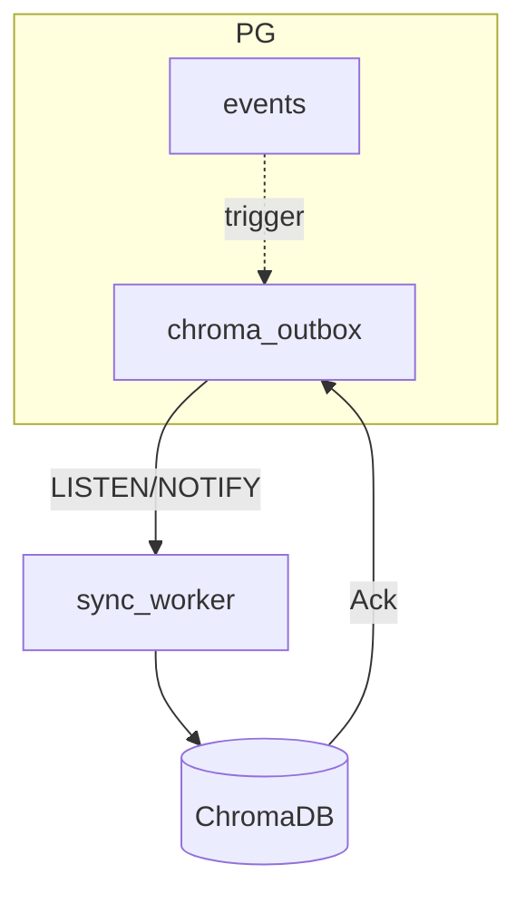

## Stratégie **simple, efficace et robuste** de synchronisation PostgreSQL ↔ Chroma  
*(objectif : zéro décrochage UID, surcharge minimale)*

---

### 1. Principe directeur : **PG = source de vérité**  
Chroma n’est qu’un **index dérivé**.  
➡ Tout évènement doit d’abord être **commit** dans PostgreSQL ; Chroma se met ensuite à jour **asynchrone** mais quasi-immédiatement.

---

### 2. Architecture retenue : **Transactional Outbox + Worker idempotent**



| Élément | Rôle | Simplicité | Robustesse |
|---------|------|-----------|------------|
| `chroma_outbox` | Table tampon dans le **même** schéma | 1 table ; pas de Kafka/Redis | Transactionnelle avec `events` |
| Trigger `AFTER INSERT/UPDATE/DELETE` | Insère ligne outbox + `embed_changed BOOL` | SQL pur | Jamais de message fantôme (même commit) |
| `LISTEN outbox_new` | Notifie dès qu’une ligne « pending » | Utilise PG natif | Év. perdu = worker redémarre, re-scan |
| `sync_worker` | Boucle : `SELECT … FOR UPDATE SKIP LOCKED`, `upsert` Chroma puis `DELETE` | 1 process Python | Idempotent (UID clé unique) |
| Job de **reconciliation** nightly (`cron`) | `SELECT unsynced` + diff Checksum | SQL + simple script | Rattrape toute dérive |

---

### 3. Flux détaillé

1. **INSERT** événement → trigger écrit dans `chroma_outbox` la **payload complète** (`id, embedding, op_type`).  
2. Même transaction commit ; `NOTIFY outbox_new`.  
3. **Worker** (async) reçoit la notif, `SELECT … FOR UPDATE SKIP LOCKED` – empêche double traitement.  
4. **Upsert** dans Chroma (`collection.upsert(...)`).  
5. **DELETE** de la ligne outbox (ou flag `processed_at`).  
6. Si Chroma indisponible ▶ **retry exponentiel** + `processed_at IS NULL` ⇒ visible par job de reconciliation.

---

### 4. Ergonomie de code (extraits)

```sql
-- outbox table
CREATE TABLE chroma_outbox (
  id UUID PRIMARY KEY,          -- même UID que events
  embedding VECTOR(1536),
  op_type TEXT CHECK (op_type IN ('upsert','delete')),
  retry_count INT DEFAULT 0,
  created_at TIMESTAMPTZ DEFAULT NOW()
);

-- trigger
CREATE OR REPLACE FUNCTION trg_events_to_outbox() RETURNS TRIGGER AS $$
BEGIN
  IF TG_OP = 'INSERT' OR TG_OP = 'UPDATE' THEN
    INSERT INTO chroma_outbox(id, embedding, op_type)
    VALUES (NEW.id, NEW.embedding, 'upsert')
    ON CONFLICT (id) DO UPDATE SET embedding = EXCLUDED.embedding, op_type = 'upsert';
  ELSIF TG_OP = 'DELETE' THEN
    INSERT INTO chroma_outbox(id, op_type) VALUES (OLD.id, 'delete');
  END IF;
  PERFORM pg_notify('outbox_new','');
  RETURN NULL;
END;
$$ LANGUAGE plpgsql;
```

```python
# worker.py  (FastAPI lifespan, or standalone)
async def sync_loop(pool):
    while True:
        async with pool.acquire() as conn:
            async with conn.transaction():
                row = await conn.fetchrow("""
                    DELETE FROM chroma_outbox
                    WHERE id IN (
                      SELECT id FROM chroma_outbox
                      FOR UPDATE SKIP LOCKED LIMIT 1
                    )
                    RETURNING id, embedding, op_type;
                """)
            if not row:
                await asyncio.sleep(0.2)
                continue
        try:
            if row['op_type']=='upsert':
                chroma.upsert(ids=[row['id']], embeddings=[row['embedding']])
            else:
                chroma.delete(ids=[row['id']])
        except Exception:
            # increment retry_count, re-insert
            await conn.execute("""
              UPDATE chroma_outbox SET retry_count = retry_count+1
              WHERE id = $1
            """, row['id'])
```

---

### 5. Pourquoi c’est **simple & efficace**

- **0 dépendance** externe (Kafka, Redis) : tout est dans PG.  
- **At-most-once** garanti ; **exactly-once** pratiqué grâce au `SKIP LOCKED` + delete.  
- Embedding gros ? ⇒ Trigger peut stocker **OID** d’un toast binaire si l’on veut réduire la taille.  
- **Scaling** : plusieurs workers → verrouillage SKIP LOCKED répartit naturellement la charge.  
- **Monitoring** : compteur `SELECT count(*) FROM chroma_outbox` exposé en Prometheus ; alerte si > N.

---

### 6. Sécurité contre la dérive

| Mécanisme | Périodicité | Action |
|-----------|-------------|--------|
| **Reconciliation** | 1×/jour | Diff `(SELECT id FROM events) EXCEPT (Chroma ids)` → bulk upsert/delete |
| **Checksum UID** | 1×/h rapide | `md5(array_agg(id)::text)` sur PG & Chroma  |
| **Alertes** | instantané | Gauge `outbox_pending > 500` ou `retry_count > 5` |

---

### 7. Extension future (si perf ↑)

1. **Switch vecteur 100 % pgvector** (supprime Chroma) — migration script prêt.  
2. **gRPC streaming** pour ingestion très haute fréquence (>10 k/s) — worker devient client gRPC pool.  
3. **Debezium + Kafka** si audit cross-service nécessaire — se branche sur la même outbox.

---

**En résumé**  
> - **Transactional Outbox PG** + **worker idempotent** suffit à garder Chroma en phase, avec < 300 lignes SQL/Python.  
> - Observabilité native (`outbox_pending`, `retry_count`) + job nightly => robustesse prouvable.  
> - Aucune infra supplémentaire ⇒ mise en place dès le Sprint 0.  

Prêt à détailler le trigger, le worker, ou les métriques si besoin !