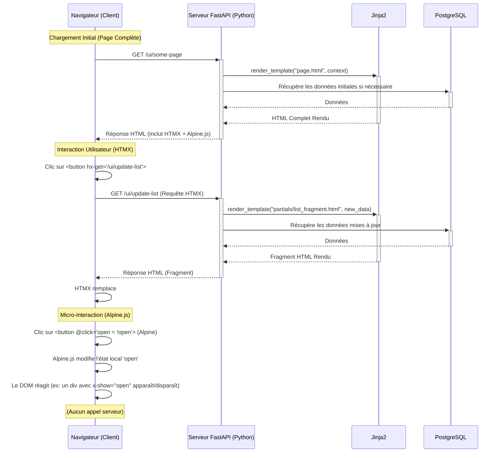

# MnemoLite - UI Architecture (HTMX + Alpine.js Sprinkles)

**Version**: 1.0.0
**Date**: 2025-05-04

## 1. Introduction & Objectifs

Ce document détaille l'architecture de l'interface utilisateur (UI) choisie pour MnemoLite, basée sur une approche hybride combinant **HTMX** pour les interactions serveur et **Alpine.js** (ou potentiellement Hyperscript) pour les améliorations client légères ("sprinkles").

**Objectifs clés :**
*   Fournir une interface réactive et fonctionnelle pour l'exploration et la gestion basique des souvenirs MnemoLite.
*   Rester aligné avec la philosophie "local-first" et la simplicité de la stack backend (FastAPI, PostgreSQL).
*   Minimiser la complexité du développement frontend (pas de build step JS lourd, pas de gestion d'état client complexe).
*   Faciliter la maintenance en gardant la majorité de la logique de rendu côté serveur (Python/Jinja2).

## 2. Rationale du Choix (vs Autres Approches)

L'approche "HTMX + Alpine.js Sprinkles" a été préférée aux alternatives (Pure HTMX, SPA dédiée) pour les raisons suivantes :

*   **Équilibre optimal :** Conserve la simplicité et l'intégration backend de l'approche "Pure HTMX" tout en palliant ses limitations UX grâce à Alpine.js pour les micro-interactions côté client.
*   **Complexité maîtrisée :** Évite la surcharge d'une SPA dédiée (build process, routing client, state management lourd) qui semble disproportionnée pour les besoins actuels de MnemoLite.
*   **Alignement Architectural :** S'intègre naturellement avec FastAPI et Jinja2, en tirant parti du rendu serveur pour la structure principale et les données.
*   **Performance :** Privilégie le rendu serveur initial rapide et les échanges légers (HTML partiel via HTMX, JS minimaliste via Alpine).

## 3. Concepts Fondamentaux

*   **FastAPI (Backend) :** Sert de serveur web, gère la logique métier, interagit avec la base de données et rend les templates HTML.
*   **Jinja2 (Templating) :** Moteur de template utilisé par FastAPI pour générer dynamiquement le HTML côté serveur. Permet la création de composants réutilisables (macros, includes).
*   **HTMX (Interactions Serveur) :** Bibliothèque JavaScript légère qui permet de déclencher des requêtes AJAX vers le serveur via des attributs HTML (`hx-get`, `hx-post`, `hx-trigger`, etc.) et de remplacer des parties du DOM avec le HTML retourné par le serveur. Gère le *gros* des interactions dynamiques liées aux données.
*   **Alpine.js (Micro-interactions Client) :** Framework JavaScript minimaliste utilisé pour ajouter du comportement *localement* aux éléments HTML. Idéal pour gérer des états d'UI simples (visibilité, classes actives, petits formulaires) sans nécessiter de communication serveur. S'active via des attributs `x-data`, `x-show`, `x-on`, etc.

## 4. Flux Technique Général

## 5. Stratégie de Composants (Jinja2)

L'UI sera décomposée en composants réutilisables côté serveur à l'aide des fonctionnalités de Jinja2 :

*   **`macros` :** Pour des éléments complexes avec des paramètres (ex: un champ de formulaire avec label, input, erreurs).
*   **`include` :** Pour insérer des fragments de template (ex: un header, un footer, une barre latérale).
*   **`extends` :** Pour définir une structure de page de base (`base.html`) et la spécialiser dans des templates enfants.

Cela favorise la maintenabilité et la cohérence visuelle.

## 6. Modèles d'Interaction (HTMX + Alpine.js)

| Interaction                  | Outil Principal | Explication                                                                                                | Alpine.js (Optionnel)                                       |
| :--------------------------- | :-------------- | :--------------------------------------------------------------------------------------------------------- | :---------------------------------------------------------- |
| **Navigation principale**    | Liens HTML `<a href="...">` | Chargement complet de nouvelles pages rendues par le serveur.                                        | -                                                           |
| **Soumission de formulaire** | HTMX (`hx-post`) | Envoie les données au serveur, remplace une partie du DOM (ou la page entière) avec la réponse serveur.        | Validation *côté client* avant envoi, gestion de l'état "loading". |
| **Filtrage / Tri de listes** | HTMX (`hx-get`)  | Envoie les paramètres de filtre/tri au serveur, remplace la liste affichée avec le fragment HTML mis à jour. | Gestion de l'état actif des boutons de filtre/tri (UI).       |
| **Pagination**               | HTMX (`hx-get`)  | Récupère et affiche la page suivante/précédente de données sous forme de fragment HTML.                      | Mise à jour de l'indicateur de page active.                 |
| **Afficher / Masquer détails** | Alpine.js (`x-show`, `@click`) | Gère l'état de visibilité localement sans appel serveur.                                          | Principalement géré par Alpine.                           |
| **Feedback instantané (UI)** | Alpine.js (`x-bind:class`) | Changer l'apparence d'éléments (ex: survol, sélection) sans appel serveur.                         | Principalement géré par Alpine.                           |
| **Mises à jour temps réel**  | HTMX (SSE/WebSockets Ext.) | Si nécessaire plus tard, utiliser les extensions HTMX pour écouter les événements serveur.           | Peut déclencher des logiques Alpine à la réception d'événements. |

## 7. Lignes Directrices : Quand utiliser quoi ?

*   **Utiliser HTMX pour :**
    *   Toute interaction nécessitant des **données à jour** du serveur.
    *   La **soumission** de formulaires.
    *   Le chargement de **contenu dynamique** (listes, détails).
    *   La navigation qui ne recharge **pas toute la page**.
*   **Utiliser Alpine.js pour :**
    *   Gérer des **états purement UI** qui n'ont pas besoin d'être persistés côté serveur (ex: état ouvert/fermé d'un dropdown, onglet actif).
    *   Fournir un **feedback visuel immédiat** avant ou après une action HTMX (ex: état "loading", highlight d'un élément ajouté).
    *   Améliorer l'ergonomie de **formulaires simples** (ex: afficher/masquer un champ conditionnel).
    *   Des manipulations DOM **légères et locales**.
*   **Éviter avec Alpine.js :**
    *   Récupérer ou envoyer des données au serveur (c'est le rôle de HTMX).
    *   Gérer des états complexes ou globaux (garder la logique côté serveur autant que possible).
    *   Dupliquer la logique métier déjà présente au backend.

## 8. Risques Potentiels et Défis

*   **Complexité Croissante :** Si les besoins UI deviennent très sophistiqués (visualisations de graphes très interactives, éditeurs complexes), cette approche pourrait montrer ses limites et nécessiter une refonte partielle ou l'intégration de bibliothèques JS plus lourdes pour des zones spécifiques.
*   **Gestion de l'État Côté Client :** Même avec Alpine.js, une discipline est nécessaire pour éviter de disperser trop d'état dans le HTML.
*   **Organisation du Code :** Maintenir la clarté entre les attributs HTMX et Alpine.js sur des éléments complexes.

## 9. Conclusion

L'architecture "HTMX + Alpine.js Sprinkles" représente un compromis pragmatique et puissant pour MnemoLite. Elle offre une base solide, performante et maintenable, alignée sur les contraintes et objectifs du projet, tout en permettant une expérience utilisateur agréable et réactive pour les cas d'usage principaux définis. 